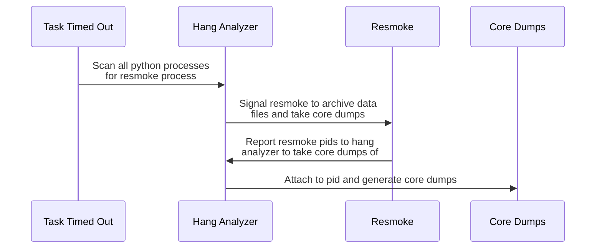
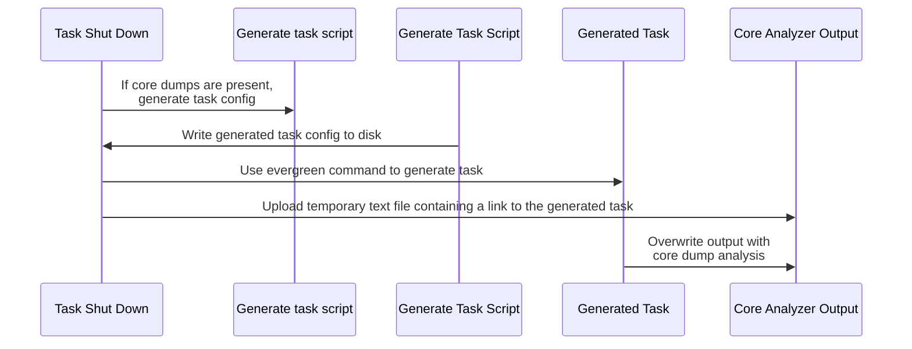

## Running the core analyzer

There are two main ways of running the core analyzer.

1. Running the core analyzer with local core dumps and binaries.
2. Running the core analyzer with core dumps and binaries from an evergreen task. Note that some analysis might fail if you are not on the same AMI (Amazon Machine Image) that the task was run on.

To run the core analyzer with local core dumps and binaries:

```
python3 buildscripts/resmoke.py core-analyzer
```

This will look for binaries in the build/install directory, and it will look for core dumps in the current directory. If your local environment is different you can include `--install-dir` and `--core-dir` in your invocation to specify other locations.

To run the core analyzer with core dumps and binaries from an evergreen task:

```
python3 buildscripts/resmoke.py core-analyzer --task-id={task_id}
```

This will download all of the core dumps and binaries from the task and put them into the configured `--working-dir`, this defaults to the `core-analyzer` directory.

All of the task analysis will be added to the `analysis` directory inside the configured `--working-dir`.

Note: Currently the core analyzer only runs on linux. Windows uses the legacy hang analyzer but will be switched over when we run into issues or have time to do the transition. We have not tackled the problem of getting core dumps on macOS so we have no core dump analysis on that operating system.

### Getting core dumps



When a task times out, it hits the [timeout](https://github.com/10gen/mongo/blob/a6e56a8e136fe554dc90565bf6acf5bf86f7a46e/etc/evergreen_yml_components/definitions.yml#L2694) section in the defined evergreen config.
In this timeout section, we run [this](https://github.com/10gen/mongo/blob/a6e56a8e136fe554dc90565bf6acf5bf86f7a46e/etc/evergreen_yml_components/definitions.yml#L2302) task which runs the hang-analyzer with the following invocation:

```
python3 buildscripts/resmoke.py hang-analyzer -o file -o stdout -m exact -p python
```

This tells the hang-analyzer to look for all of the python processes (we are specifically looking for resmoke) on the machine and to signal them.
When resmoke is [signaled](https://github.com/10gen/mongo/blob/08a99b15eea7ae0952b2098710d565dd7f709ff6/buildscripts/resmokelib/sighandler.py#L25), it again invokes the hang analyzer with the specific pids of it's child processes.
It will look similar to this most of the time:

```
python3 buildscripts/resmoke.py hang-analyzer -o file -o stdout -k -c -d pid1,pid2,pid3
```

The things to note here are the `-k` which kills the process and `-c` which takes core dumps.
The resulting core dumps are put into the current running directory.
When a task fails normally, core dumps may also be generated by the linux kernel and put into the working directory.

We use a non-standard way of uploading core dumps to evergreen due to [timeout issues](https://jira.mongodb.org/browse/SERVER-73171) we were facing when archiving and uploading them normally through evergreen commands.
After investigation of the above issue, we found that compressing and uploading core dumps was slow for a couple reasons:

1. Tarring all of the core dumps into one file takes up a lot of disk IO and disk IO was the bottleneck.
2. Gzip is single threaded.
3. Uploading a big file synchronously is not fast.

We made a [script](https://github.com/10gen/mongo/blob/master/buildscripts/fast_archive.py) that gzips all of the core dumps in parallel and uploads them to S3 individually asynchronously.
This solved all of the problems listed above.

### Generating the core analyzer task



In the [post task](https://github.com/10gen/mongo/blob/709e3f4efc04b42e5d29a8ad2417a01d3610fc3f/etc/evergreen_yml_components/definitions.yml#L2665) section, we [define](https://github.com/10gen/mongo/blob/709e3f4efc04b42e5d29a8ad2417a01d3610fc3f/etc/evergreen_yml_components/definitions.yml#L2184) the evergreen function used to generate the core analyzer task.
This [script](https://github.com/10gen/mongo/blob/709e3f4efc04b42e5d29a8ad2417a01d3610fc3f/buildscripts/resmokelib/hang_analyzer/gen_hang_analyzer_tasks.py) runs on every task (passing or failing) and is independent of anything else that happened prior in the task and does all of the checks to ensure it should run.
These checks include:

1. The task is being run on an operating system supported by the core analyzer.
2. The task has any core dumps uploaded and attached to it.
3. At least one of the binaries uploaded is from a binary we know how to process.

The output from this script is a json file in the format evergreen expects.
We then pass this json file into the `generate.tasks` evergreen command to generate the task.

After the task is generated, we have [another script](https://github.com/10gen/mongo/blob/709e3f4efc04b42e5d29a8ad2417a01d3610fc3f/etc/evergreen_yml_components/definitions.yml#L2213) that finds the task that was just generated and attaches it to the current task being ran.

The reason we upload a temporary file to the original task is to attach that s3 file link to the task.
Evergreen does not currently have a way to attach files to a task after it was ran so we need to upload something while the original task is in progress.
