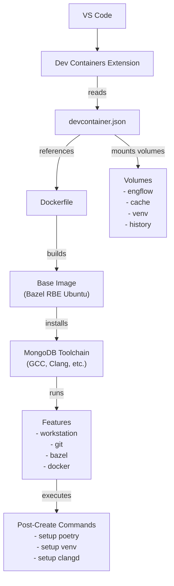

# Dev Container Architecture

This document provides a deep dive into how the MongoDB devcontainer is structured and how all the pieces work together.

## Table of Contents

- [Overview](#overview)
- [Directory Structure](#directory-structure)
- [Container Build Process](#container-build-process)
- [Volume Management](#volume-management)
- [Toolchain Installation](#toolchain-installation)
- [Features System](#features-system)
- [VS Code Integration](#vs-code-integration)
- [Post-Creation Scripts](#post-creation-scripts)
- [Environment Variables](#environment-variables)

## Overview

The MongoDB devcontainer is built on several key components:



## Directory Structure

```
.devcontainer/
├── devcontainer.json         # Main configuration file
├── Dockerfile                # Container image definition
├── toolchain_config.env      # Toolchain version and checksum
├── toolchain.py              # Toolchain management script
├── features/                 # Custom devcontainer features
│   └── workstation/
│       ├── devcontainer-feature.json
│       ├── install.sh
│       └── setup.sh
└── OWNERS.yml               # Code ownership info
```

## Container Build Process

### 1. Base Image Selection

The Dockerfile starts from MongoDB's Remote Build Execution (RBE) image:

```dockerfile
# The base image version is managed in .devcontainer/Dockerfile
# Check that file for the current version
ARG BASE_IMAGE=quay.io/mongodb/bazel-remote-execution:ubuntu24-<version>
FROM $BASE_IMAGE
```

This base image includes:

- Ubuntu 24.04 LTS
- Basic build tools
- Bazel dependencies
- System libraries needed for MongoDB

### 2. User Creation

A non-root user is created with the same username as your host user:

```dockerfile
ARG USERNAME=mongo-dev
ARG USER_UID=1000
ARG USER_GID=$USER_UID

RUN groupadd $USERNAME && useradd -s /bin/bash --gid $USER_GID -m $USERNAME
```

**Why?**

- Avoids permission issues with mounted volumes
- Matches your host user ID for file ownership
- Follows security best practices (don't run as root)

### 3. Sudo Access

The user gets passwordless sudo access for administrative tasks:

```dockerfile
RUN echo $USERNAME ALL=\(root\) NOPASSWD:ALL > /etc/sudoers.d/devcontaineruser
```

### 4. Persistent Bash History

Bash history is configured to persist across container restarts:

```dockerfile
RUN SNIPPET="export PROMPT_COMMAND='history -a' && export HISTFILE=/commandhistory/.bash_history" \
    && mkdir /commandhistory \
    && touch /commandhistory/.bash_history \
    && chown -R $USERNAME /commandhistory \
    && echo "$SNIPPET" >> "/home/$USERNAME/.bashrc"
```

The `/commandhistory` directory is mounted from a Docker volume.

### 5. Toolchain Installation

See [Toolchain Installation](#toolchain-installation) section below.

### 6. Bazel Telemetry

Build event keywords are added for analytics:

```dockerfile
RUN echo "common --bes_keywords=devcontainer:use=true" >> "$HOME/.bazelrc" && \
    echo "common --bes_keywords=devcontainer:image=$BASE_IMAGE" >> "$HOME/.bazelrc" && \
    echo "common --bes_keywords=devcontainer:username=$USERNAME" >> "$HOME/.bazelrc"
```

This helps MongoDB track devcontainer usage and identify issues.

## Volume Management

The devcontainer uses several Docker volumes for persistence:

### Volume Configuration

From `devcontainer.json`:

```json
"mounts": [
  {
    "source": "engflow_auth",
    "target": "/home/${localEnv:USER}/.config/engflow_auth",
    "type": "volume"
  },
  {
    "source": "${containerWorkspaceFolderBasename}-cache",
    "target": "/home/${localEnv:USER}/.cache",
    "type": "volume"
  },
  {
    "source": "mongo-bashhistory",
    "target": "/commandhistory",
    "type": "volume"
  }
]
```

### Volume Descriptions

| Volume                     | Purpose                            | Survives Container Rebuild? | Size Impact |
| -------------------------- | ---------------------------------- | --------------------------- | ----------- |
| `engflow_auth`             | EngFlow authentication credentials | ✅ Yes                      | Small       |
| `{workspace}-cache`        | Bazel cache, tool caches           | ✅ Yes                      | Large       |
| `mongo-bashhistory`        | Command history                    | ✅ Yes                      | Small       |
| `{workspace}-python3-venv` | Python virtual environment         | ✅ Yes                      | Medium      |

### Workspace Volume

The workspace itself is in a separate volume created by the clone command:

```bash
docker volume ls
# Shows: mongo-workspace (or your chosen name)
```

**Benefits of Named Volumes:**

- Fast I/O (no filesystem translation layer)
- Survives container deletion
- Can be backed up with `docker volume` commands
- No host filesystem dependencies

### Managing Volumes

```bash
# List all volumes
docker volume ls

# Inspect a volume
docker volume inspect engflow_auth
```

## Toolchain Installation

MongoDB requires specific compiler versions. The toolchain installation process ensures consistency.

### Toolchain Configuration

The `toolchain_config.env` file contains architecture-specific toolchain definitions for both ARM64 and AMD64:

```bash
# Generated by toolchain.py
# DO NOT EDIT MANUALLY - run: python3 toolchain.py generate

# ARM64 Toolchain
TOOLCHAIN_ARM64_URL="https://s3.amazonaws.com/boxes.10gen.com/build/toolchain/mongodbtoolchain-ubuntu2404-arm64-..."
TOOLCHAIN_ARM64_SHA256="<sha256 checksum>"
TOOLCHAIN_ARM64_KEY="build/toolchain/mongodbtoolchain-ubuntu2404-arm64-..."
TOOLCHAIN_ARM64_LAST_MODIFIED="2025-07-21T20:49:55+00:00"

# AMD64 Toolchain
TOOLCHAIN_AMD64_URL="https://s3.amazonaws.com/boxes.10gen.com/build/toolchain/mongodbtoolchain-ubuntu2404-..."
TOOLCHAIN_AMD64_SHA256="<sha256 checksum>"
TOOLCHAIN_AMD64_KEY="build/toolchain/mongodbtoolchain-ubuntu2404-..."
TOOLCHAIN_AMD64_LAST_MODIFIED="2025-07-21T19:57:00+00:00"
```

**Note**: This file is auto-generated. To update toolchain versions, run:

```bash
python3 .devcontainer/toolchain.py generate
```

### Installation Process

The Dockerfile automatically selects the correct toolchain based on the target platform:

```dockerfile
# Load configuration and select architecture-specific toolchain
ARG TARGETPLATFORM
COPY .devcontainer/toolchain_config.env /tmp/toolchain_config.env
RUN set -e; \
  . /tmp/toolchain_config.env; \
  # Select toolchain based on platform
  if [ "$TARGETPLATFORM" = "linux/arm64" ]; then \
    TOOLCHAIN_URL="$TOOLCHAIN_ARM64_URL"; \
    TOOLCHAIN_SHA256="$TOOLCHAIN_ARM64_SHA256"; \
    ARCH="arm64"; \
  elif [ "$TARGETPLATFORM" = "linux/amd64" ]; then \
    TOOLCHAIN_URL="$TOOLCHAIN_AMD64_URL"; \
    TOOLCHAIN_SHA256="$TOOLCHAIN_AMD64_SHA256"; \
    ARCH="amd64"; \
  else \
    echo "Unsupported platform: $TARGETPLATFORM"; \
    exit 1; \
  fi; \
  echo "Target platform: $TARGETPLATFORM"; \
  echo "Architecture: $ARCH"; \
  echo "Installing toolchain from: $TOOLCHAIN_URL"; \

  # Download
  curl -fSL "$TOOLCHAIN_URL" -o /tmp/toolchain.tar.gz; \

  # Verify checksum (security!)
  echo "$TOOLCHAIN_SHA256  /tmp/toolchain.tar.gz" | sha256sum -c -;

# Extract
RUN mkdir -p /opt/mongodbtoolchain/revisions && \
  tar -xzf /tmp/toolchain.tar.gz -C /opt/mongodbtoolchain/revisions; \
  rm /tmp/toolchain.tar.gz; \
  chown -R ${USERNAME} /opt/mongodbtoolchain;

# Run installation script
USER $USERNAME
RUN /opt/mongodbtoolchain/revisions/*/scripts/install.sh
```

**Multi-Architecture Support:**

- The `TARGETPLATFORM` build argument is automatically set by Docker based on your host architecture
- Supports both `linux/arm64` (Apple Silicon, ARM servers) and `linux/amd64` (Intel/AMD processors)
- Each architecture gets its own optimized toolchain binary
- Build fails safely if run on an unsupported platform

### Toolchain Contents

The MongoDB toolchain includes:

- **GCC**: Primary C/C++ compiler
- **Clang**: Alternative compiler and tools (clang-format, clang-tidy)
- **Python**: For build scripts
- **gdb**: GNU debugger with pretty printers
- **binutils**: Assembler, linker, and other tools

### Toolchain Updates

The toolchain is managed by the MongoDB team. When updates are available, you'll get them automatically when you:

- Pull the latest changes from the repository
- Rebuild your devcontainer

You don't need to manually update the toolchain.

## Features System

Dev Containers support modular "features" - reusable units of functionality.

### Feature Configuration

From `devcontainer.json`:

```json
"features": {
  "./features/workstation": {},                                   // Custom
  "ghcr.io/devcontainers/features/git:1": {},                     // Official
  "ghcr.io/devcontainers-community/features/bazel:1": {},         // Community
  "ghcr.io/devcontainers/features/docker-outside-of-docker:1": {},// Official
  "ghcr.io/devcontainers/features/common-utils:2": {              // Official
    "username": "${localEnv:USER}"
  }
}
```

### Custom Workstation Feature

The `features/workstation` feature is MongoDB-specific.

**Structure:**

```
features/workstation/
├── devcontainer-feature.json   # Metadata and configuration
├── install.sh                  # Runs during image build
└── setup.sh                    # Runs during container creation
```

**What it does:**

1. **Mounts Python venv volume** (from `devcontainer-feature.json`):

   ```json
   "mounts": [
     {
       "source": "${containerWorkspaceFolderBasename}-python3-venv",
       "target": "${containerWorkspaceFolder}/python3-venv",
       "type": "volume"
     }
   ]
   ```

2. **Runs setup script** that installs:
   - pipx (Python package installer)
   - poetry (dependency manager)
   - db-contrib-tool (MongoDB contribution tool)
   - clangd configuration
   - GDB pretty printers for Boost
   - Python virtual environment with all dependencies

### Official Features

- **git**: Latest Git with credential helper
- **bazel**: Bazelisk (Bazel version manager)
- **docker-outside-of-docker**: Access to host Docker daemon
- **common-utils**: zsh, Oh My Zsh, and other utilities

## VS Code Integration

### Settings

The `devcontainer.json` includes extensive VS Code settings:

#### C/C++ Configuration

```json
"clangd.checkUpdates": true,
"clangd.path": "${workspaceFolder}/buildscripts/clangd_vscode.sh",
"clang-format.executable": "${workspaceRoot}/bazel-out/.../clang-format",
```

**Why clangd?**

- Faster IntelliSense than Microsoft C++ extension
- Better standard library support
- Integrates with compile_commands.json

#### Python Configuration

```json
"python.defaultInterpreterPath": "python3-venv/bin/python",
"python.autoComplete.extraPaths": [
  "/opt/mongodbtoolchain/v5/share/gcc-*/python"
],
"mypy-type-checker.importStrategy": "fromEnvironment",
"editor.defaultFormatter": "charliermarsh.ruff"
```

Uses the virtual environment Python and Ruff for formatting.

#### JavaScript Configuration

```json
"prettier.prettierPath": "bazel-bin/node_modules/.aspect_rules_js/prettier@3.4.2/node_modules/prettier",
"eslint.validate": ["javascript"],
"editor.codeActionsOnSave": {
  "source.fixAll.eslint": "explicit"
}
```

Uses Bazel-managed Prettier and ESLint.

#### Format on Save

```json
"[c]": {
  "editor.defaultFormatter": "xaver.clang-format",
  "editor.formatOnSave": true
},
"[cpp]": {
  "editor.defaultFormatter": "xaver.clang-format",
  "editor.formatOnSave": true
},
"[python]": {
  "editor.formatOnSave": true,
  "editor.defaultFormatter": "charliermarsh.ruff"
},
"[javascript]": {
  "editor.defaultFormatter": "esbenp.prettier-vscode",
  "editor.formatOnSave": true
}
```

### Extensions

Recommended extensions are automatically installed:

- **llvm-vs-code-extensions.vscode-clangd**: C++ IntelliSense
- **dbaeumer.vscode-eslint**: JavaScript linting
- **ms-python.python**: Python support
- **charliermarsh.ruff**: Python formatting/linting
- **xaver.clang-format**: C++ formatting
- **bazelbuild.vscode-bazel**: Bazel support
- **redhat.vscode-yaml**: YAML support
- And more...

## Post-Creation Scripts

After the container starts, several commands run to finalize setup:

### From devcontainer.json

```json
"postCreateCommand": {
  "fixVolumePerms": "sudo chown -R $(whoami): ${containerEnv:HOME}/.config/engflow_auth && sudo chown -R $(whoami): ${containerEnv:HOME}/.cache",
  "venvActivation": "echo 'source ${containerWorkspaceFolder}/python3-venv/bin/activate && ${containerWorkspaceFolder}/buildscripts/poetry_sync.sh' >> ~/.bashrc && echo 'source ${containerWorkspaceFolder}/python3-venv/bin/activate && ${containerWorkspaceFolder}/buildscripts/poetry_sync.sh' >> ~/.zshrc;",
  "createDataDir": "sudo mkdir -p /data/db && sudo chown -R $(whoami): /data/db",
  "reportDockerServerPlatform": "echo \"\ncommon --bes_keywords=devcontainer:docker_server_platform=$(docker version --format '\"{{.Server.Platform.Name}}\"')\" >> ${containerEnv:HOME}/.bazelrc",
  "reportDockerServerVersion": "echo \"\ncommon --bes_keywords=devcontainer:docker_server_version=$(docker version --format '\"{{.Server.Version}}\"')\" >> ${containerEnv:HOME}/.bazelrc",
  "reportArch": "echo \"\ncommon --bes_keywords=devcontainer:arch=$(uname -i)\" >> ${containerEnv:HOME}/.bazelrc",
  "fetchTags": "if [ -f .git/shallow ]; then git fetch --unshallow --tags; else git fetch --tags; fi || true"
}
```

**What these commands do:**

- **fixVolumePerms**: Ensures proper ownership of mounted volumes
- **venvActivation**: Configures shell to automatically activate Python virtual environment
- **createDataDir**: Creates MongoDB data directory with proper permissions
- **reportDockerServerPlatform**: Adds Docker platform info to Bazel telemetry
- **reportDockerServerVersion**: Adds Docker version to Bazel telemetry
- **reportArch**: Adds system architecture to Bazel telemetry
- **fetchTags**: Fetches all git tags automatically

### From Workstation Feature

The workstation feature's `postCreateCommand`:

```bash
sudo chown -R $(whoami): ${containerWorkspaceFolder}/python3-venv && \
sudo chown $(whoami): ${containerWorkspaceFolder}/.. && \
bash /workspace-setup.sh
```

The `setup.sh` script then:

1. Sets up Bash profile
2. Installs pipx
3. Installs poetry via pipx
4. Installs db-contrib-tool
5. Builds clangd configuration
6. Sets up GDB pretty printers
7. Creates Python virtual environment
8. Runs `poetry install` to install all dependencies

## Environment Variables

### Set in devcontainer.json

```json
"containerEnv": {
  "HOME": "/home/${localEnv:USER}"
}
```

### Set in Shell

Added to `.bashrc` during setup:

```bash
export PYTHON_KEYRING_BACKEND=keyring.backends.null.Keyring
export PATH="$PATH:$HOME/.local/bin"
export HISTFILE=/commandhistory/.bash_history
export PROMPT_COMMAND='history -a'
```

### From Toolchain

When you activate the toolchain environment:

```bash
source /opt/mongodbtoolchain/revisions/*/activate
```

This sets:

- `CC`, `CXX`: Compiler paths
- `PATH`: Toolchain binaries
- `LD_LIBRARY_PATH`: Toolchain libraries
- Python paths for GDB pretty printers

## Lifecycle Summary

**Build Time (Dockerfile):**

1. Pull base image
2. Create user
3. Download and verify toolchain
4. Extract toolchain
5. Run toolchain install script
6. Add Bazel telemetry

**Container Creation (Features + postCreateCommand):**

1. Mount volumes
2. Install feature dependencies
3. Fix volume permissions
4. Setup Bash/Zsh
5. Install Python tools (pipx, poetry, db-contrib-tool)
6. Build clangd config
7. Setup GDB
8. Create Python venv
9. Install Poetry dependencies
10. Create MongoDB data directory
11. Fetch git tags
12. Report Docker info to Bazel

**Runtime:**

1. Shell automatically activates Python venv
2. Poetry keeps dependencies in sync
3. VS Code extensions provide IDE features
4. Bazel uses cached artifacts
5. Commands persist to history volume

## Customization Points

See [Advanced Usage](./advanced.md) for details on:

- Adding your own tools to the Dockerfile
- Creating custom features
- Overriding VS Code settings
- Using different toolchain versions
- Configuring EngFlow remote execution

---

**Next Steps:**

- [Troubleshooting Guide](./troubleshooting.md)
- [Advanced Usage](./advanced.md)
- [FAQ](./faq.md)
