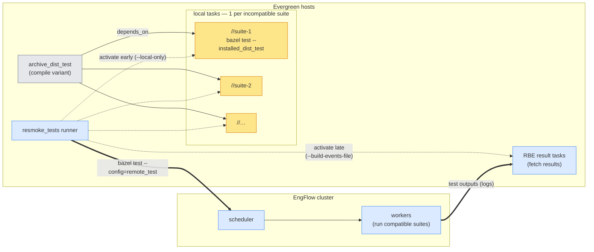
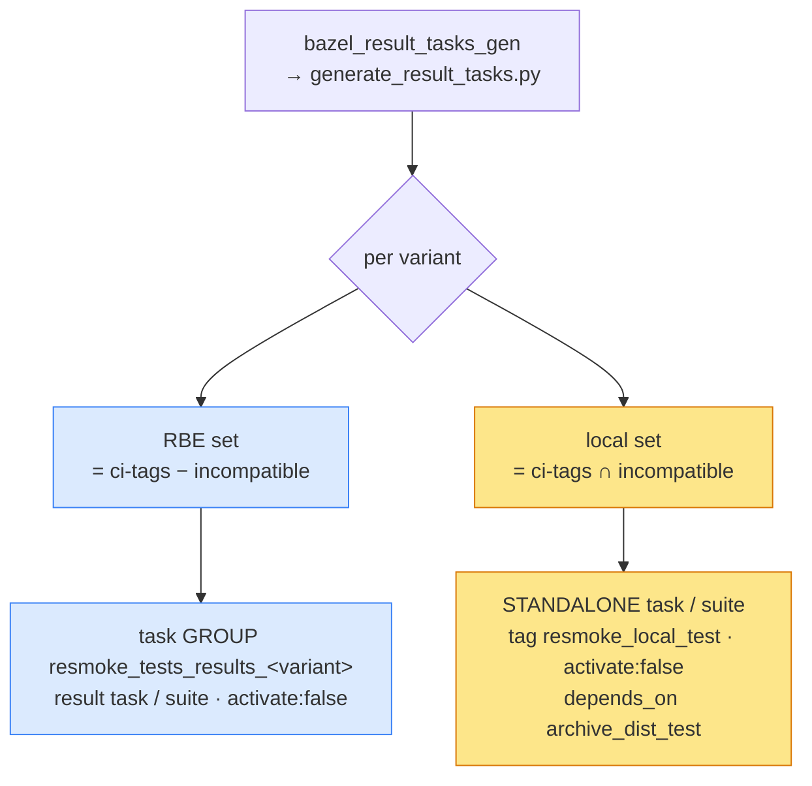
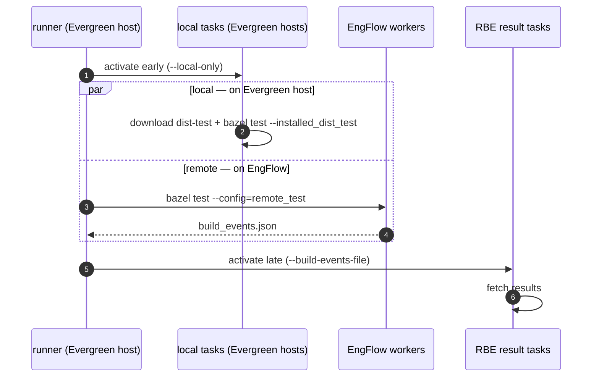

# Resmoke suite execution via Bazel

Each variant runs its suites two ways, chosen **per suite** by the
`incompatible_with_bazel_remote_test` tag:

- **RBE-compatible** → remotely on the **EngFlow cluster**
- **incompatible** → locally on the **Evergreen host**

The two sets are disjoint; their union is the variant's selected suites.

## Where suites run

Edges: **solid** = `depends_on` · **dotted** = activation by the runner · **thick** = `bazel test` /
results.

## Task generation

One `bazel_result_tasks_gen` runs
[generate_result_tasks.py](../../buildscripts/generate_result_tasks.py); per variant it emits both
sets.

## Execution

The runner starts the local tasks **early** so they run while the remote batch runs, then activates
the RBE result tasks **late** to fetch.

> Local tasks self-run, so they start early. RBE result tasks only fetch from the runner's
> `build_events.json`, so they must wait for it.
