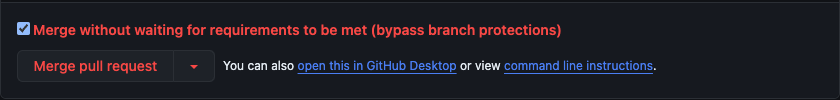

# Merging

### Standard Merge

If you have some changes locally that you want to merge into the mongodb repo, you must create a [pull request](https://docs.github.com/en/pull-requests/collaborating-with-pull-requests/proposing-changes-to-your-work-with-pull-requests/creating-a-pull-request?tool=webui#creating-the-pull-request). Once the pull request is created you must get approval from an [owner](owners_format.md) of the files changed. If the files changed have no owner then you must get approval from one other engineer. Once you have gotten approval you will see a green merge button which, when pressed, will merge your code.

### Override

If you have changes that fall into one of the following categories you can get an override to merge your PR.

1. [standard merge](#Standard-Merge) is currently broken and you are making a change to fix [standard merge](#Standard-Merge).
2. You are reverting a change that has caused a failure in mainline.
3. You are making a large scale change. For example, renaming a prolific typo in the codebase, applying formatting, applying a generated fix, etc...

To get an override you must get approval from any module owner or a member of [10gen/mongo-break-glass](https://mana.corp.mongodbgov.com/resources/664e9bed3d7d150379d3e0d0) (module owners should be members of 10gen/mongo-break-glass).

Once you have the approvals needed, the person providing the override must wait for a merge-queue patch to complete without failures and a base merged within 8 hours (should be verified by the overrider). The overrider will then click the checkbox and the red "Merge pull request" button.
This will skip the merge queue and force all merges in the queue to restart since the base was updated.

## Merging into an older branch (backports)

TODO: in the interim please see the wiki for details
