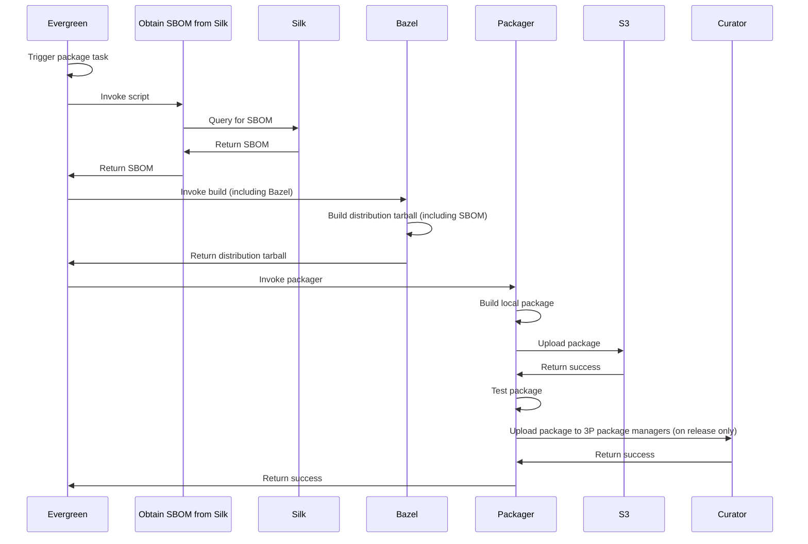

### How does the packaging system work?

```mermaid
sequenceDiagram
participant e as Evergreen
participant osfs as Obtain SBOM from Silk
participant silk as Silk
participant bazel as Bazel
participant p as Packager
participant s3 as S3
participant curator as Curator


e ->> e: Trigger package task
e ->> osfs: Invoke script
osfs ->> silk: Query for SBOM
silk ->> osfs: Return SBOM
osfs ->> e: Return SBOM
e ->> bazel: Invoke build (including Bazel)
bazel ->> bazel: Build distribution tarball (including SBOM)
bazel ->> e: Return distribution tarball
e ->> p: Invoke packager
p ->> p: Build local package
p ->> s3: Upload package
s3 ->> p: Return success
p ->> p: Test package
p ->> curator: Upload package to 3P package managers (on release only)
curator ->> p: Return success
p ->> e: Return success

```
