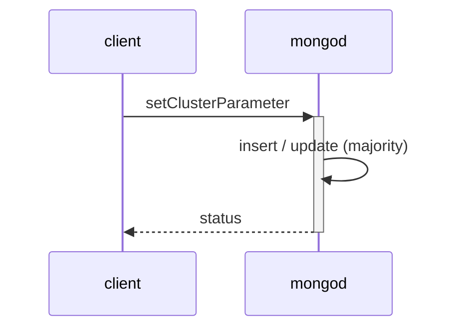
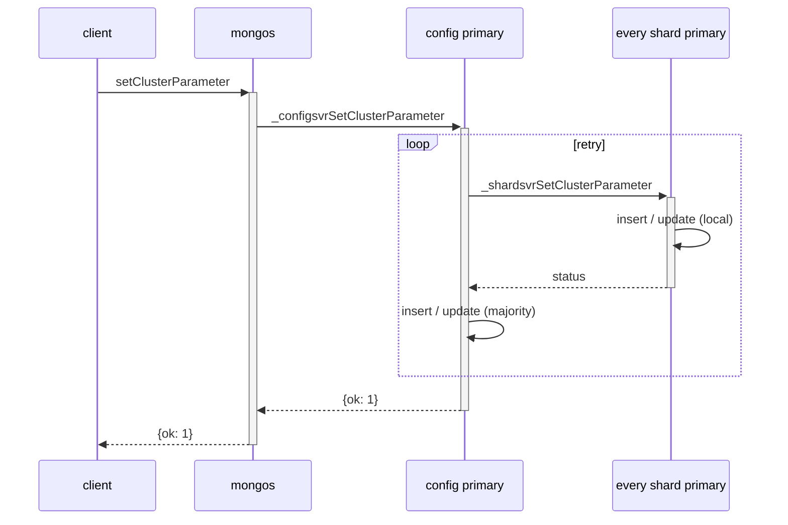
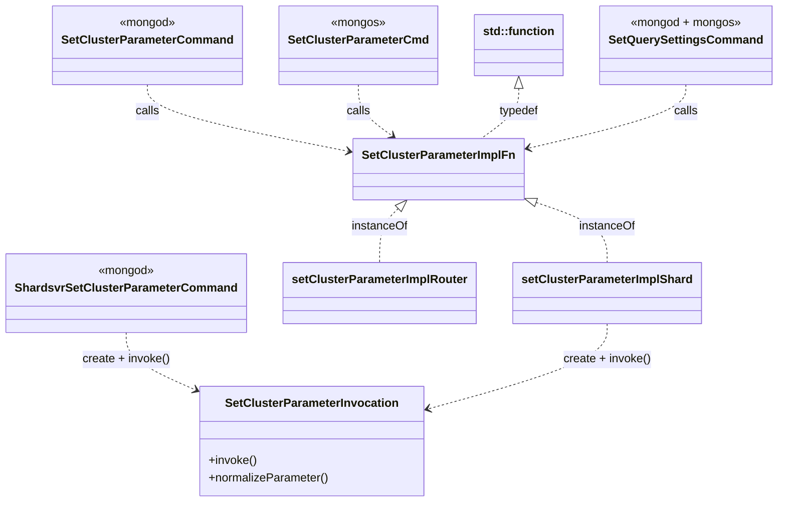
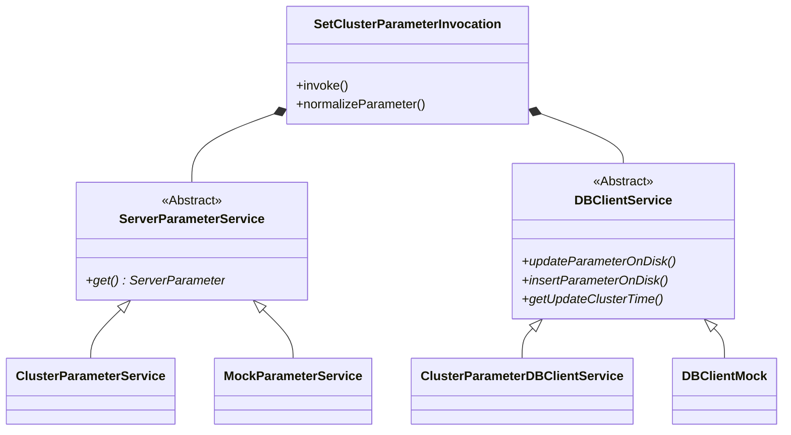
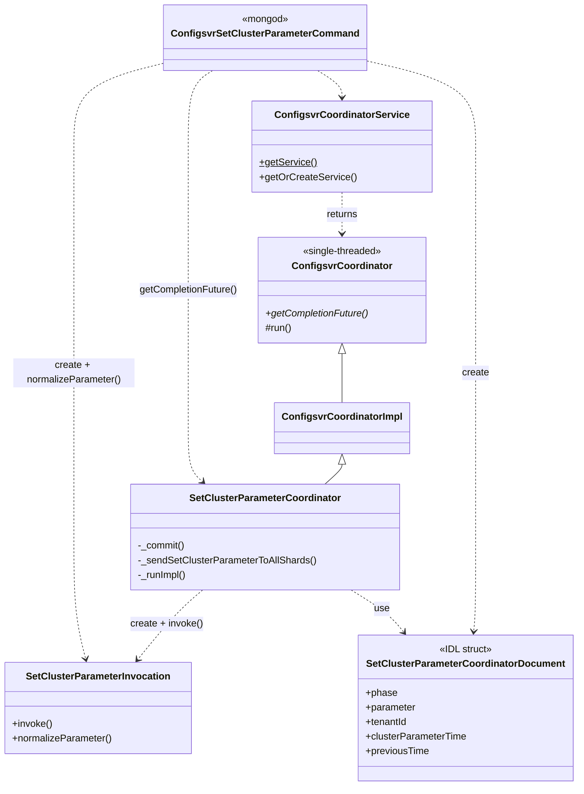

# Server Parameters

Mongo database and router servers (i.e., `mongod` and `mongos`) provide a number of configuration
options through server parameters. These parameters allow users to configure the behavior of the
server at startup or runtime. For instance, `logLevel` is a server parameter that configures the
logging verbosity.

## How to define new parameters

Parameters are defined by the elements of the `server_parameters` section of an IDL file. The IDL
machinery will parse these files and generate C++ code, and corresponding header files where
appropriate. The generated code will self-register server parameters with the runtime.

Consider `logLevel` parameter from [`parameters.idl`][parameters.idl] for example:

```yaml
...
server_parameters:
  ...
  logLevel:
    description: "Specifies the verbosity of logging"
    set_at: ["startup", "runtime"]
    cpp_class:
      name: LogLevelServerParameter
      override_set: true
  ...
```

This defines a server parameter called `logLevel`, which is settable at startup or at runtime, and
declares a C++ class for the parameter (i.e., `LogLevelServerParameter`). Refer to the
[Server Parameters Syntax](#server-parameters-syntax) documentation for the complete IDL syntax.

## How to change a defined parameter

Users can set or modify a server parameter at startup and/or runtime, depending on the value
specified for `set_at`. For instance, `logLevel` may be set at both startup and runtime, as
indicated by `set_at` (see the above code snippet).

At startup, server parameters may be set using the `--setParameter` command line option.
At runtime, the `setParameter` command may be used to modify server parameters.
See the [`setParameter` documentation][set-parameter] for details.

## How to get the value provided for a parameter

Server developers may retrieve the value of a server parameter by:

-   Accessing the C++ expression that corresponds to the parameter of interest. For example, reading
    from [`serverGlobalParams.quiet`][quiet-param] returns the current value for `quiet`.
-   Registering a callback to be notified about changes to the server parameter (e.g.,
    [`onUpdateFTDCFileSize`][ftdc-file-size-param] for `diagnosticDataCollectionFileSizeMB`).

Database users may use the [`getParameter`][get-parameter] command to query the current value for a
server parameter.

## Server Parameters Syntax

The following shows the IDL syntax for declaring server parameters. Field types are denoted in each
section. For details regarding `string or expression map`, see that section
[below](#string-or-expression-map).

```yaml
server_parameters:
    "nameOfParameter": # string
        set_at: # string or list of strings
        description: # string
        cpp_vartype: # string
        cpp_varname: # string
        cpp_class: # string (name field) or map
            name: # string
            data: # string
            override_ctor: # bool
            override_set: # bool
            override_validate: # bool
        redact: # bool
        test_only: # bool
        default: # string or expression map
        deprecated_name: # string or list of strings
        on_update: # string
        condition:
            expr: # C++ bool expression, evaluated at run time
            constexpr: # C++ bool expression, evaluated at compilation time
            preprocessor: # C preprocessor condition
            min_fcv: # string
            feature_flag: # string
        validator: # Map containing one or more of the below
            lt: # string or expression map
            gt: # string or expression map
            lte: # string or expression map
            gte: # string or expression map
            callback: # string
```

Each entry in the `server_parameters` map represents one server parameter. The name of the parameter
must be unique across the server instance. More information on the specific fields:

-   `set_at` (required): Must contain the value `startup`, `runtime`, [`startup`, `runtime`], or
    `cluster`. If `runtime` is specified along with `cpp_varname`, then `decltype(cpp_varname)` must
    refer to a thread-safe storage type, specifically: `AtomicWord<T>`, `AtomicDouble`, `std::atomic<T>`,
    or `boost::synchronized<T>`. Parameters declared as `cluster` can only be set at runtime and exhibit
    numerous differences. See [Cluster Server Parameters](cluster-server-parameters) below.

-   `description` (required): Free-form text field currently used only for commenting the generated C++
    code. Future uses may preserve this value for a possible `{listSetParameters:1}` command or other
    programmatic and potentially user-facing purposes.

-   `cpp_vartype`: Declares the full storage type. If `cpp_vartype` is not defined, it may be inferred
    from the C++ variable referenced by `cpp_varname`.

-   `cpp_varname`: Declares the underlying variable or C++ `struct` member to use when setting or reading the
    server parameter. If defined together with `cpp_vartype`, the storage will be declared as a global
    variable, and externed in the generated header file. If defined alone, a variable of this name will
    assume to have been declared and defined by the implementer, and its type will be automatically
    inferred at compile time. If `cpp_varname` is not defined, then `cpp_class` must be specified.

-   `cpp_class`: Declares a custom `ServerParameter` class in the generated header using the provided
    string, or the name field in the associated map. The declared class will require an implementation
    of `setFromString()`, and optionally `set()`, `append()`, and a constructor.
    See [Specialized Server Parameters](#specialized-server-parameters) below.

-   `default`: String or expression map representation of the initial value.

-   `redact`: Set to `true` to replace values of this setting with placeholders (e.g., for passwords).

-   `test_only`: Set to `true` to disable this set parameter if `enableTestCommands` is not specified.

-   `deprecated_name`: One or more names which can be used with the specified setting and underlying
    storage. Reading or writing a setting using this name will result in a warning in the server log.

-   `on_update`: C++ callback invoked after all validation rules have completed successfully and the
    new value has been stored. Prototype: `Status(const cpp_vartype&);`

-   `condition`: Up to five conditional rules for deciding whether or not to apply this server
    parameter. `preprocessor` will be evaluated first, followed by `constexpr`, then finally `expr`. If
    no provided setting evaluates to `false`, the server parameter will be registered. `feature_flag` and
    `min_fcv` are evaluated after the parameter is registered, and instead affect whether the parameter
    is enabled. `min_fcv` is a string of the form `X.Y`, representing the minimum FCV version for which
    this parameter should be enabled. `feature_flag` is the name of a feature flag variable upon which
    this server parameter depends -- if the feature flag is disabled, this parameter will be disabled.
    `feature_flag` should be removed when all other instances of that feature flag are deleted, which
    typically is done after the next LTS version of the server is branched. `min_fcv` should be removed
    after it is no longer possible to downgrade to a FCV lower than that version - this occurs when the
    next LTS version of the server is branched.

-   `validator`: Zero or many validation rules to impose on the setting. All specified rules must pass
    to consider the new setting valid. `lt`, `gt`, `lte`, `gte` fields provide for simple numeric limits
    or expression maps which evaluate to numeric values. For all other validation cases, specify
    callback as a C++ function or static method. Note that validation rules (including callback) may run
    in any order. To perform an action after all validation rules have completed, `on_update` should be
    preferred instead. Callback prototype: `Status(const cpp_vartype&, const boost::optional<TenantId>&);`

Any symbols such as global variables or callbacks used by a server parameter must be imported using
the usual IDL machinery via `globals.cpp_includes`. Similarly, all generated code will be nested
inside the namespace defined by `globals.cpp_namespace`. Consider the following for example:

```yaml
global:
  cpp_namespace: "mongo"
  cpp_includes:
    - "mongo/util/net/ssl_parameters.h"

server_parameters:
  opensslCipherConfig:
    ...
    validator:
      callback: "validateOpensslCipherConfig" # The callback is declared in "ssl_parameters.h"
```

### String or Expression Map

The default and implicit fields above, as well as the `gt`, `lt`, `gte`, and `lte` validators accept
either a simple scalar string which is treated as a literal value, or a YAML map containing an
attribute called `expr`, which must be a string containing an arbitrary C++ expression to be used
as-is. Optionally, an expression map may also include the `is_constexpr: false` attribute, which
will suspend enforcement of the value being a `constexpr`.

For example, consider:

```yaml
server_parameters:
  connPoolMaxInUseConnsPerHost:
    ...
    cpp_varname: maxInUseConnsPerHost
    default:
      expr: std::numeric_limits<int>::max()
    ...
```

Here, the server parameter's default value is the evaluation of the C++ expression
`std::numeric_limits<int>::max()`. Additionally, since default was not explicitly given the
`is_constexpr: false` attribute, it will be round-tripped through the following lambda to guarantee
that it does not rely on runtime information.

```cpp
[]{ constexpr auto value = <expr>; return value; }()
```

### Specialized Server Parameters

When `cpp_class` is specified on a server parameter, a child class of `ServerParameter` will be
created in the `gen.h` file named for either the string value of `cpp_class`, or if it is expressed
as a dictionary, then `cpp_class.name`. A `cpp_class` directive may also contain:

```yaml
server_parameters:
    someParameter:
        cpp_class:
            name: string # Name to assign to the class (e.g., SomeParameterImpl)
            data: string # cpp data type to add to the class as a property named "_data"
            override_ctor: bool # True to allow defining a custom constructor, default: false
            override_set: bool # True to allow defining a custom set() method, default: false
            override_validate: bool # True to allow defining a custom validate() method, default: false
```

`override_ctor`: If `false`, the inherited constructor from the `ServerParameter` base class will be
used. If `true`, then the implementer must provide a
`{name}::{name}(StringData serverParameterName, ServerParameterType type)` constructor. In addition
to any other work, this custom constructor must invoke its parent's constructor.

`override_set`: If `true`, the implementer must provide a `set` member function as:

```cpp
Status {name}::set(const BSONElement& val, const boost::optional<TenantId>& tenantId);
```

Otherwise the base class implementation `ServerParameter::set` is used. It
invokes `setFromString` using a string representation of `val`, if the `val` is
holding one of the supported types.

`override_validate`: If `true`, the implementer must provide a `validate` member function as:

```cpp
Status {name}::validate(const BSONElement& newValueElement, const boost::optional<TenantId>& tenantId);
```

Otherwise, the base class implementation `ServerParameter::validate` is used. This simply returns
`Status::OK()` without performing any kind of validation of the new BSON element.

If `param.redact` was specified as `true`, then a standard append method will be provided which
injects a placeholder value. If `param.redact` was not specified as `true`, then an implementation
must be provided with the following signature:

```cpp
Status {name}::append(OperationContext*, BSONObjBuilder*, StringData, const boost::optional<TenantId>& tenantId);
```

Lastly, a `setFromString` method must always be provided with the following signature:

```cpp
Status {name}::setFromString(StringData value, const boost::optional<TenantId>& tenantId);
```

The following table summarizes `ServerParameter` method override rules.

| `ServerParameter` method   | Override | Default Behavior                                                     |
| -------------------------- | -------- | -------------------------------------------------------------------- |
| constructor                | Optional | Instantiates only the name and type.                                 |
| `set()`                    | Optional | Calls `setFromString()` on a string representation of the new value. |
| `setFromString()`          | Required | None, won't compile without implementation.                          |
| `append() // redact=true`  | Optional | Replaces parameter value with '###'.                                 |
| `append() // redact=false` | Required | None, won't compile without implementation.                          |
| `validate()`               | Optional | Returns `Status::OK()` without any checks.                           |

Note that by default, server parameters are not tenant-aware and thus will always have `boost::none`
provided as `tenantId`, unless defined as cluster server parameters (discussed
[below](#cluster-server-parameters)).

Each server parameter encountered will produce a block of code to run at process startup similar to
the following:

```cpp
/**
 *  Iteration count to use when creating new users with
 *  SCRAM-SHA-1 credentials
 */
MONGO_COMPILER_VARIABLE_UNUSED auto* scp_unique_ident = [] {
    using T = decltype(saslGlobalParams.scramSHA1IterationCount);
    constexpr auto setAt = ServerParameterType::kStartupAndRuntime;
    auto ret = new IDLServerParameterWithStorage<T>(
            "scramIterationCount",
            saslGlobalParams.scramSHA1IterationCount, setAt);
    ret->addBound<predicate::GTE>(5000);
    return ret;
}();
```

Any additional validator and callback would be set on `ret` as determined by the server parameter
configuration block.

## Cluster Server Parameters

As indicated earlier, one of the options for the `set_at` field is `cluster`. If this value is
selected, then the generated server parameter will be known as a _cluster server parameter_. These
server parameters are set at runtime via the `setClusterParameter` command and are propagated to all
nodes in a sharded cluster or a replica set deployment. Cluster server parameters should be
preferred to implementing custom parameter propagation whenever possible.

`setClusterParameter` persists the new value of the indicated cluster server parameter onto a
majority of nodes on non-sharded replica sets. On sharded clusters, it majority-writes the new value
onto every shard and the config server. This ensures that every **mongod** in the cluster will be able
to recover the most recently written value for all cluster server parameters on restart.
Additionally, `setClusterParameter` blocks until the majority write succeeds in a replica set
deployment, which guarantees that the parameter value will not be rolled back after being set.
In a sharded cluster deployment, the new value has to be majority-committed on the config shard and
locally-committed on all other shards.

The cluster parameters are persisted in the `config.clusterParameters` collections and cached in
memory on every **mongod**. The cache updates are done by the `ClusterServerParameterOpObserver` class.
Every **mongos** also maintains an in-memory cache by polling the config server for updated cluster
server parameter values every `clusterServerParameterRefreshIntervalSecs` using the
`ClusterParameterRefresher` periodic job.

`getClusterParameter` returns the cached value of the requested cluster server parameter on the node
that it is run on. It can accept a single cluster server parameter name, a list of names, or `*` to
return all cluster server parameter values on the node.

Specifying `cpp_vartype` for cluster server parameters must result in the usage of an IDL-defined
type that has `ClusterServerParameter` listed as a chained structure. This chaining adds the
following members to the resulting type:

-   `_id` - cluster server parameters are uniquely identified by their names.
-   `clusterParameterTime` - `LogicalTime` at which the current value of the cluster server parameter
    was updated; used by runtime audit configuration, and to prevent concurrent and redundant cluster
    parameter updates.

It is highly recommended to specify validation rules or a callback function via the `param.validator`
field. These validators are called before the new value of the cluster server parameter is written
to disk during `setClusterParameter`.
See [server_parameter_with_storage_test.idl][cluster-server-param-with-storage-test] and
[server_parameter_with_storage_test_structs.idl][cluster-server-param-with-storage-test-structs] for
examples.

### Specialized Cluster Server Parameters

Cluster server parameters can also be specified as specialized server parameters. The table below
summarizes `ServerParameter` method override rules in this case.

| `ServerParameter` method    | Override   | Default Behavior                            |
| --------------------------- | ---------- | ------------------------------------------- |
| constructor                 | Optional   | Instantiates only the name and type.        |
| `set()`                     | Required   | None, won't compile without implementation. |
| `setFromString()`           | Prohibited | Returns `ErrorCodes::BadValue`.             |
| `append()`                  | Required   | None, won't compile without implementation. |
| `validate()`                | Optional   | Return `Status::OK()` without any checks.   |
| `reset()`                   | Required   | None, won't compile without implementation. |
| `getClusterParameterTime()` | Required   | Return `LogicalTime::kUninitialized`.       |

Specifying `override_ctor` to true is optional. An override constructor can be useful for allocating
additional resources at the time of parameter registration. Otherwise, the default likely suffices,
provided that memory for holding the current parameter value is allocated automatically.

It is highly recommended to specify `override_validate` to true and provide a custom implementation
of the `validate()` method. This ensures that cluster parameters do not get set to nonsensical
values.

The `set()` method must be implemented in order to update the cached parameter value in memory. It
will be called by the `ClusterServerParameterOpObserver` class after observing a change to the
cluster parameter document on disk.

The `append()` method must be implemented in order to serialize the parameter into BSON for the
`getClusterParameter` command.

The `setFromString()` method must not be provided as cluster server parameters are only set via BSON
during runtime.

The `getClusterParameterTime()` method must be implemented and should return the `LogicalTime`
corresponding to the current version of the cluster server parameter.

Tue `reset()` method must be implemented and should update the cluster server parameter back to its
default value.

All cluster server parameters are tenant-aware, meaning that on serverless clusters, each tenant has
an isolated set of parameters. The `setClusterParameter` and `getClusterParameter` commands will pass
the `tenantId` on the command request to the `ServerParameter`'s methods. On dedicated
(non-serverless) clusters, `boost::none` will be passed. IDL-defined cluster server parameters will
handle the passed-in `tenantId` automatically and store separate parameter values per-tenant.
Specialized server parameters will have to take care to correctly handle the passed-in `tenantId` and
to enforce tenant isolation.

Like normal server parameters, cluster server parameters can be defined to be dependent on a minimum
FCV version or a specific feature flag using the `condition.min_fcv` and `condition.feature_flag` syntax discussed
above. During FCV downgrade, the cluster parameter value stored on disk will be deleted if either:
(1) The downgraded FCV is lower than the cluster parameter's `min_fcv`, or (2) The cluster
parameter's `feature_flag` is disabled on the downgraded FCV. While a cluster server parameter is
disabled due to either of these conditions, `setClusterParameter` on it will always fail, and
`getClusterParameter` will fail on **mongod**, and return the default value on **mongos** -- this
difference in behavior is due to **mongos** being unaware of the current FCV.

See [server_parameter_specialized_test.idl][specialized-cluster-server-param-test-idl] and
[server_parameter_specialized_test.h][specialized-cluster-server-param-test-data] for examples.

### Implementation Details

The following sequence diagram summarizes `setClusterParameter` in a replica set deployment.



The following diagram summarizes `setClusterParameter` command implementation in a sharded cluster.
The current implementation uses two additional internal commands `_configsvrSetClusterParameter` and
`_shardsvrSetClusterParameter` to propagate new cluster parameter values from **mongos** to the
config server and from the config server to each shard respectively. The order of the updates (first
shard servers and then the config server) is intentional. See also
[configsvr_set_cluster_parameter_command.cpp](../src/mongo/db/s/config/configsvr_set_cluster_parameter_command.cpp)
and
[shardsvr_set_cluster_parameter_command.cpp](../src/mongo/db/s/shardsvr_set_cluster_parameter_command.cpp).



The following diagram illustrates the `setClusterParameter` command implementation.

The `SetClusterParameterCmd` class implements the `setClusterParameter` command on **mongos**. The
implementation details are delegated to the `setClusterParameterImplRouter` function.

The `SetClusterParameterCommand` class implements the `setClusterParameter` command on **mongod**.
The implementation details are delegated to the `setClusterParameterImplShard` function.

The `setQuerySettings` command implemented by the `SetQuerySettingsCommand` class relies internally
on the cluster parameter implementation. Since this class is present both on **mongos** and
**mongod**, the corresponding implementation function needs to be resolved, which is done at runtime
in
[set_cluster_parameter_command_impl.cpp](../src/mongo/db/commands/set_cluster_parameter_command_impl.cpp).



The following diagram illustrates implementation details of the `SetClusterParameterInvocation`
class defined in
[set_cluster_parameter_invocation.cpp](../src/mongo/db/commands/set_cluster_parameter_invocation.cpp).
This class uses inheritance + virtual methods to reduce the dependencies in unit tests in
[set_cluster_parameter_invocation_test.cpp](../src/mongo/db/commands/set_cluster_parameter_invocation_test.cpp).



The following diagram shows the relevant classes on a config server. The internal
`_configsvrSetClusterParameterCommand` is implemented in
[configsvr_set_cluster_parameter_command.cpp](../src/mongo/db/s/config/configsvr_set_cluster_parameter_command.cpp)
and it does not return anything (void). Updating the `config.clusterParameters` collection on the
config server and on shards is handled by the `SetClusterParameterCoordinator` class in
[set_cluster_parameter_coordinator.cpp](../src/mongo/db/s/config/set_cluster_parameter_coordinator.cpp).
The `SetClusterParameterCoordinator` is initialized with the
`SetClusterParameterCoordinatorDocument` structure defined in
[set_cluster_parameter_coordinator_document.idl](../src/mongo/db/s/config/set_cluster_parameter_coordinator_document.idl).
The fields `clusterParameterTime` and `previousTime` are used to prevent redundant updates and
concurrent updates respectively.



[parameters.idl]: ../src/mongo/db/commands/parameters.idl
[set-parameter]: https://docs.mongodb.com/manual/reference/parameters/#synopsis
[get-parameter]: https://docs.mongodb.com/manual/reference/command/getParameter/#getparameter
[quiet-param]: https://github.com/mongodb/mongo/search?q=serverGlobalParams+quiet+extension:idl&type=code
[ftdc-file-size-param]: ../src/mongo/db/ftdc/ftdc_server.idl
[cluster-server-param-with-storage-test]: ../src/mongo/idl/server_parameter_with_storage_test.idl
[cluster-server-param-with-storage-test-structs]: ../src/mongo/idl/server_parameter_with_storage_test_structs.idl
[specialized-cluster-server-param-test-idl]: ../src/mongo/idl/server_parameter_specialized_test.idl
[specialized-cluster-server-param-test-data]: ../src/mongo/idl/server_parameter_specialized_test.h
