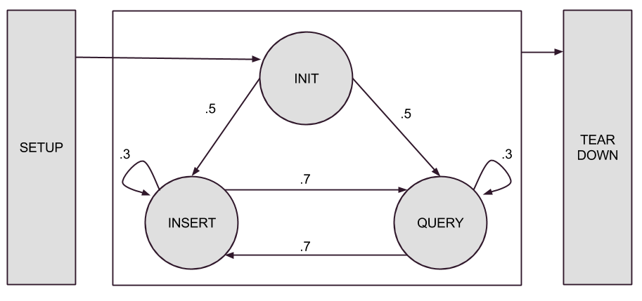
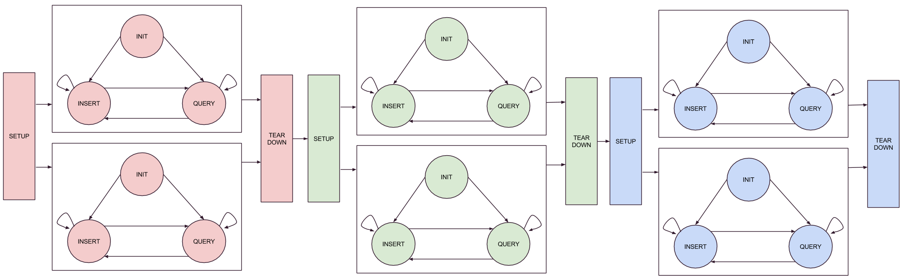
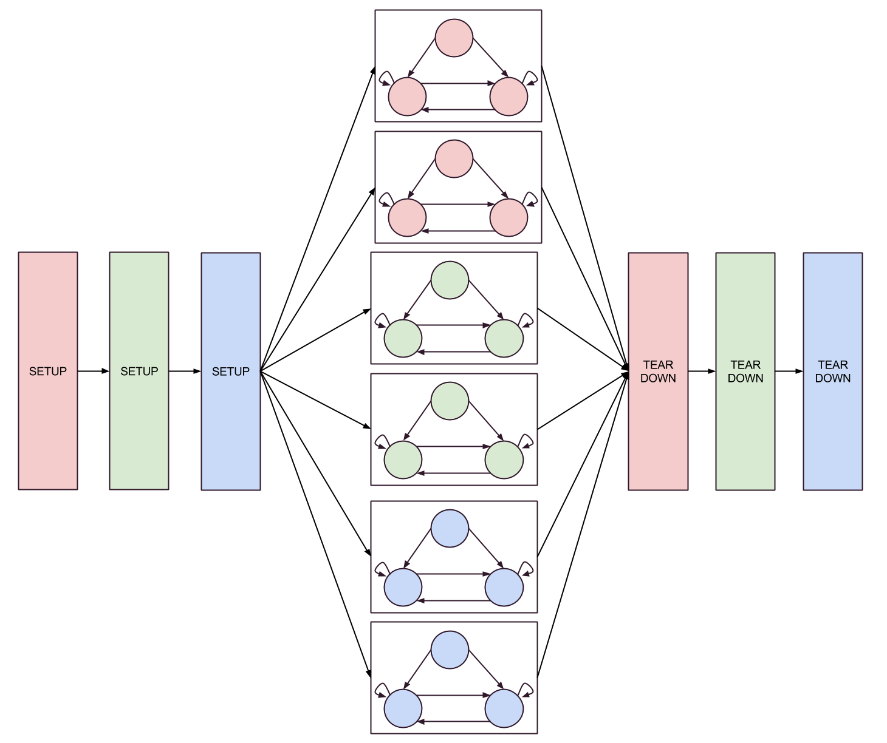
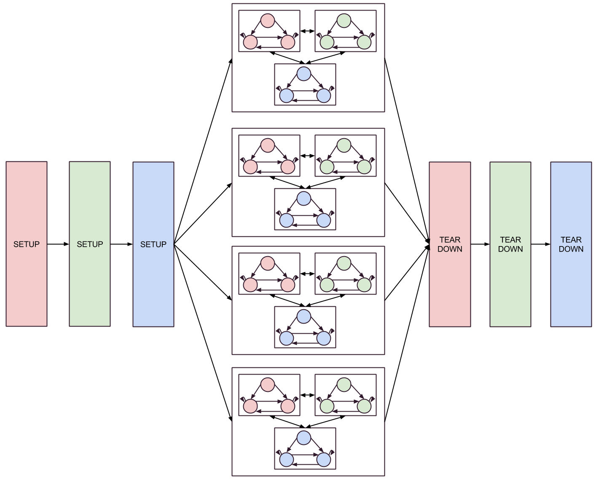

# FSM-based Concurrency Testing Framework


## Overview
The FSM tests are meant to exercise concurrency within MongoDB. The suite
consists of workloads, which define discrete units of work as states in a FSM,
and runners, which define which tests to run and how they should be run. Each
workload defines states, which are JS functions that perform some meaningful
series of tasks and assertions, and transitions, which define how to move
between those states. A single workload begins by executing its setup function,
which is called once during the runner's thread of execution. Next, the runner
generates the number of threads specified by the workload, and each spawned
thread executes the start state (typically named "init") defined by the
workload. From this point on, each worker thread executes its own independent
copy of the FSM, and will randomly move between states (after executing the
function) based on the probabilities defined in the workload's transition table.
Each worker thread continues doing so until the number of transitions it makes
has reached the number of iterations defined by the workload. Once all the
worker threads have finished, the runner executes the workload's teardown
function.



The runner provides three modes of execution for workloads: serial, parallel,
and composed. Serial mode runs the provided workloads one after the other,
waiting for all threads of a workload to complete before moving on to the next
workload. Parallel mode runs subsets of the provided workloads in separate
threads simultaneously. Composed mode runs subsets of the provided workloads in
the same threads simultaneously, with each thread moving between the states of
multiple workloads.

New methods were added to allow for finer-grained assertions under different
situations. For example, a test that inserts a document into a collection, and
wants to assert its existence will fail if another test removes that document.
One option would have been to disable all assertions when running a mixture of
different workloads together, but doing so would make the system incapable of
detecting anything other than server crashes. Another option would have been to
design the workloads to be conflict-free (e.g. writing to separate collections,
using commutative operators), but this would leave large gaps in the achievable
test coverage. Neither of those options were found to be very appealing.
Instead, we chose to introduce the concept of an "assertion level" that acts as
a precondition for when an assertion is evaluated. This allows us to still make
some assertions, even when running a mixture of different workloads together.
There are three assertion levels: `ALWAYS`, `OWN_COLL`, and `OWN_DB`. They can
be thought of as follows:

* `ALWAYS`: A statement that remains unequivocally true, regardless of what
  another workload might be doing to the collection I was given (hint: think
  defensively). Examples include "1 = 1" or inserting a document into a
  collection (disregarding any unique indices).

* `OWN_COLL`: A statement that is true only if I am the only workload operating
  on the collection I was given. Examples include counting the number of
  documents in a collection or updating a previously inserted document.

* `OWN_DB`: A statement that is true only if I am the only workload operating on
  the database I was given. Examples include renaming a collection or verifying
  that a collection is capped. The workload typically relies on the use of
  another collection aside from the one given.

## Creating your own workload

All workloads are stored in `jstests/concurrency/fsm_workloads` and as specific
examples you can refer to

1. `jstests/concurrency/fsm_example.js`
1. `jstests/concurrency/fsm_example_inheritance.js`

for writing new workloads. Every workload is loaded in as inline JavaScript
using the "load" function, which is a lot more like a `#include` than
`require.js`. This means that whatever variables are declared in the global
scope of the file will become part of the scope where load is called. The runner
will be looking for a variable called `$config` which will store the
configuration of your workload.

### The $config object

There should be exactly one `$config` per workload. For style consistency as
well as safety, be sure to wrap the value of `$config` in an anonymous function.
This will create a JS closure and a new scope:

```javascript
$config = (function() {
    /* ... */
    return {
        threadCount: "<number of threads>",
        iterations: "<number of steps>",
        startState: "<start state for this workload>",
        states: "<state functions>",
        transitions: "<transition probability map>",
        setup: "<function to initialize workload>",
        teardown: "<function to cleanup workload if necessary>",
        data: "<'this' property available to each state function>",
    };
)();
```

When finished executing, `$config` must return an object containing the properties
above (some of which are optional, see below).

### Defining states
It's best to also declare states within its own closure so as not to interfere
with the scope of $config. Each state takes two arguments, the db object and the
collection name. For later, note that this db and collection are the only one
that you can be guaranteed to "own" when asserting. Try to make each state a
discrete unit of work that can stand alone without the other states (in fact, an
FSM that requires another state to run before it will probably not work in
Composed mode). Additionally, try to define each function that makes up a state
with a name as opposed to anonymously - this makes easier to read backtraces
when things go wrong.

```javascript
$config = (function() {
    /* ... */
    var states = (function() {
        function getRand() {
            return Random.randInt(10);
        }
  
        function init(db, collName) {
            this.start = getRand() * this.tid;
        }
 
        function scanGT(db, collName) {
            db[collName].find({ _id: { $gt: this.start } }).itcount();
        }
 
        function scanLTE(db, collName) {
            db[collName].find({ _id: { $lte: this.start } }).itcount();
        }
 
 
        return {
            init: init,
            scanGT: scanGT,
            scanLTE: scanLTE
        };
    })();
     
    /* ... */
  
    return {
        /* ... */
        states: states,
        /* ... */
    };
})();
```

### Defining transitions

The transitions object defines the probabilities of moving from one state to a
different state. When a state's function is finished executing, the FSM randomly
chooses the next state using the probabilities provided in the transitions
object. The probabilities of the transitions object do not necessarily need to
sum to 1.0, since the mechanism for choosing the next state uses normalized
random values. Here it is not necessary to use a separate closure. In the
example below, we're denoting an equal probability of moving to either of the
scan states from the init state:

```javascript

$config = (function() {
    /* ... */
    var transitions = {
        init:    { scanGT: 0.5, scanLTE: 0.5 },
        scanGT:  { scanGT: 0.8, scanLTE: 0.2 },
        scanLTE: { scanGT: 0.2, scanLTE: 0.8 }
    };
    /* ... */
    return {
        /* ... */
        transitions: transitions,
        /* ... */
    };
})();
```

### Setup and teardown functions

The setup and teardown functions are special in that they'll only be executed in
one thread. See the Runners section for more information about when they're run
relative to other workloads in various modes. The setup and teardown functions
take three arguments: db, coll, and cluster. The setup function (and
corresponding teardown) should perform most of the initialization your workload
needs, for example setting parameters on the server, adding seed data, or
setting up indexes. Note that rather than executing adminCommands (and others)
against the provided `db` you should use the provided
`cluster.executeOnMongodNodes` and `cluster.executeOnMongosNodes` functionality.

```javascript
$config = (function() {
    /* ... */
    function setup(db, collName, cluster) {
        // Workloads should NOT drop the collection db[collName], as doing so
        // is handled by jstests/concurrency/fsm_libs/runner.js before 'setup' is called.
        for (var i = 0; i < 1000; ++i) {
            db[collName].insert({ _id: i });
        }
        cluster.executeOnMongodNodes(function(db) {
            db.adminCommand({ setParameter: 1, internalQueryExecYieldIterations: 5 });
        });
        cluster.executeOnMongosNodes(function(db) {
            printjson(db.serverCmdLineOpts());
        });
    }
  
    function teardown(db, collName, cluster) {
        cluster.executeOnMongodNodes(function(db) {
            db.adminCommand({ setParameter: 1, internalQueryExecYieldIterations: 128 });
        });
    }
    /* ... */
    return {
        /* ... */
        setup: setup,
        teardown: teardown,
        /* ... */
    };
})();
```

### The `data` object

The `data` object preserves information between different states of an FSM within
an individual thread. Within a single state, the data object becomes the 'this'
context in which the state executes. Additionally, a tid attribute is added to
data by the runner to allow each thread to access a unique ID. Data is usually
defined above states inside the config, but left below it in the returned
object. Data is also available as the 'this' context in setup and teardown
functions. Note that once the FSM begins, the context data that was passed to
the setup function is copied into each thread - meaning each thread has its own
copy of the data and modifications to data will not be passed back to the
teardown function outside of what was changed in setup. Additionally, in
composition, each workload has its own data, meaning you don't have to worry
about properties being overridden by workloads other than the current one.

```javascript
$config = (function() {
    var data = {
        start: 0
    };
    /* ... */
    return {
        /* ... */
        data: data,
        /* ... */
    };
})();
```

### Other properties of $config

#### `threadCount`

threadCount is the number of threads that will be used to run your workload in
Serial and Parallel modes. In both modes, the number of threads you provide will
execute the FSM simultaneously, cycling through different states of the
workload. Note that in serial mode, no other threads will be running outside of
those pertaining to this workload, and in parallel mode, other workloads will
also be given threads to execute their FSM. In some cases in parallel mode, this
number will be scaled down to make sure that all workloads can fit within the
number of threads available due to system or performance constraints.

#### `iterations`

This is just the number of states the FSM will go through before exiting. NOTE:
it is *not* the number of times each state will be executed.

#### `startState` (optional)

Default value is 'init'. If your workload does not have an init state than you
must specify in which state to begin.

### Workload helpers

`jstests/concurrency/fsm_workload_helpers` contains a few files that you can
include using 'load' at the top of a workload. These provide auxiliary
functionality that might be necessary for some workloads. The most important of
which is probably server_types.js

#### server_types.js

This helper file contains four functions: isMongos, isMongod, isMMAPv1, and
isWiredTiger. These can be used to restrict operations on different
functionality available in sharded environments, as well as based on storage
engine, and work as you would expect. One thing to note is that before calling
either isMMAPv1 or isWiredTiger, first verify isMongod. When special casing
functionality for sharded environments or storage engines, try to special case a
test for the exceptionality while still leaving in place assertions for either
case. 

#### indexed_noindex.js

This helper can be used along with inheritance, to create a workload that is
exactly the same as an existing workload, but with the index created during
setup removed. In order to use this replace the function you provide to the
extendWorkload function with indexedNoindex. Additionally, ensure that the
workload you are extending has a function in its data object called
"getIndexSpec" that returns the spec for the index to be removed.

```javascript

load('jstests/concurrency/fsm_libs/extend_workload.js'); // for extendWorkload
load('jstests/concurrency/fsm_workload_modifiers/indexed_noindex.js'); // for indexedNoindex
load('jstests/concurrency/fsm_workloads/workload_with_index.js'); //for $config
  
$config = extendWorkload($config, indexedNoIndex);
```

#### drop_utils.js

These helpers provide safe methods for dropping collections, databases, roles,
and users created during a workload's execution. The methods take a regular
expression that the collection, database, role, or user name must match for it
to be dropped. Prefixing the items in any of these categories you create with a
prefix defined by your workload name is a good idea since the workload file name
can be assumed unique and will allow you to only affect your workload in these
cases.


## Test runners

By default, all runners below are allowed to open a maximum of
`maxAllowedConnections` (= 100 by default) explicit connections. In replicated
and sharded environments, implicit connections are created to the original
mongod provided to the mongo shell executing the runner (one for each thread).
This behavior cannot be controlled, but it highlights the importance of always
using the db object provided in the FSM states rather than the global db which
will always correspond to the mongod the mongo shell initially connected to.

### Execution modes

#### Serial

Serial is the simplest of all three modes and basically works as explained
above. Setup is run single threaded, data is copied into multiple threads where
the states are executed, and once all the threads have finished a teardown
function is run and the runner moves onto the next workload. 



#### Parallel (Simultaneous)

In parallel or simultaneous mode (the naming convention has been slightly
inconsistent), the ordering becomes a little different. All workloads have their
setup functions run, then threads are spawned for each workload, and once they
all complete, all threads have their teardown function run.



#### Composed

Composed is the most complicated of runner modes. It is similar to parallel in
that all setups and teardowns are run in sequence, but the execution that goes
on between them is a little different. In composed mode, each thread spawned
after setup has a two step transition between states. The first step is to
decide whether or not to switch which FSM it is executing within. The
probability of switching is defined by the option composeProb. If no switching
between FSMs will be performed, then the next step is just to choose which state
to move to within the existing FSM using the workload's defined transition
probabilities. If switching between FSMs is the outcome of the first step, then
the second step becomes choosing a state from all the other workloads with equal
probability. For a walkthrough of this process, see the slides under "Other
Resources".




### Existing runners

The existing runners all use `jstests/concurrency/fsm_libs/runner.js` to
actually execute the workloads. Most information about arguments and available
runWorkloads methods can be found by inspecting the source. Below you can find
the existing runners explained. The first argument to the three runWorkloads
methods (each corresponding to a different run mode), is an array of workload
files to run. clusterOptions, the second argument to the runWorkloads functions,
is explained in the other components section below. Execution options for
runWorkloads functions, the third argument, can contain the following options
(some depend on the run mode):

* `numSubsets` - Not available in serial mode, determines how many subsets of
  workloads to execute in parallel or composed mode
* `subsetSize` - Not available in serial mode, determines how large each subset of
  workloads executed is
* `composeProb` - Only available in composed mode, determines the probability of
  leaving the current FSM to enter a new FSM in composed mode
* `iterations` - Only available in composed mode, determines how many transitions
  to perform between states in a single thread of composition.

#### fsm_all.js

Runs all workloads serially. For each workload, `$config.threadCount` threads
are spawned and each thread runs for exactly `$config.iterations` steps starting
at `$config.startState` and transitioning to other states based on the
transition probabilities defined in $config.transitions. 

#### fsm_all_composed.js

options: numSubsets, subsetSize, composeProb, iterations (=100 by default)

Runs numSubsets subsets (each subset has size subsetSize) of all workloads in
composition. During composition, the probability of transitioning from some
state in a workload to another state in the same workload is equal to
1-composeProb. Each thread spawned during composition goes for exactly
iterations steps. The same database and collection are used throughout a
composition of workloads. By default, each workload in each subset is run
between 2 and 3 times. The number of threads used during composition equals the
sum of the `$config.threadCount` values for each workload in each subset.

#### fsm_all_simultaneous.js 

options: numSubsets, subsetSize

Runs numSubsets subsets of size subsetSize of all workloads. The workloads in
each subset are started in parallel and each workload is run according to
settings in `$config`.

#### fsm_all_replication.js

Sets up a replica set (with 3 mongods by default) and runs workloads serially,
in parallel, or in composed mode. For example,

`runWorkloadsSerially([<workload1>, <workload2>, ...], { replication: true } )`

creates a replica set with 3 members and runs some workloads serially on the
primary.

#### fsm_all_sharded.js

Sets up a sharded cluster (with 2 shards and 1 mongos by default) and runs
workloads serially, in parallel, or in composed mode. For example,

`runWorkloadsInParallel([<workload1>, <workload2>, ...], { sharded: true } )`

creates a sharded cluster and runs workloads in parallel.

#### fsm_all_sharded_replication.js

Sets up a sharded cluster (with 2 shards, each having 3 replica set members, and
1 mongos by default) and runs workloads serially, in parallel, or in composed
mode.

### Excluding a workload

If any workloads fail because of known bugs in MongoDB, persistent MCI failures
or timeouts, the troublesome workload can be excluded from running by placing it
in the exclusion array in the corresponding runner. Please remember to place a
comment next to the excluded workload name identifying the reason a workload is
being excluded. For example,

`'agg_sort_external.js', // SERVER-16700 Deadlock on WiredTiger LSM`

Each file should also have two predefined sections - one for known bugs and one
for restrictions. The one above would be considered a known bug. However,
excluding a compact workload from sharded runners would be a restriction because
compact can only be run against individual mongods.

## Using assertions

Do NOT use built-in mongo shell asserts within any FSM-based workload. Instead
use any of the following assertion levels which are defined in terms of the DB
and collection passed to state functions within a workload.

#### `assertAlways`

Works just like a regular shell assert(), but is more clear about its
consideration for the other two assert modes

#### `assertWhenOwnColl`

Asserts when the current workload owns the collection. In this case, other
workloads could potentially modify other collections in the same database, or
access the database itself. Use this assertion when all you need is a guarantee
that no other FSM has been given access to the collection, but other FSMs may
have access to the same DB.

#### `assertWhenOwnDB`

Asserts when the current workload owns the database, including all the
collections in that database. Use this assertion when you need to guarantee
exclusive access for this workload to the provided database and all its included
collections.

## Other components of the FSM library

Most of these components live in jstests/concurrency/fsm_libs and provide the
functionality used by the runner.

### ThreadManager

Responsible for spawning and joining worker threads. Each spawned thread is
wrapped in a try/finally block to ensure that the database connection implicitly
created during the thread's execution is eventually closed explicitly. The
ThreadManager sets a random seed `([0, randInt(1e13))` which is the range of
`new Date().getTime())` before executing each workload.

### Worker Thread

Thread spawned by ThreadManager and used to run a Finite State Machine.

### Cluster

cluster.js is responsible for providing the cluster object that is passed to
setup and teardown functions, and the initial connection to a db to be used by
runner to pass to the workloads. For anything except for standalone, it makes
use of the shell's built-in cluster test helpers like `ShardingTest` and
`ReplSetTest`. clusterOptions are passed to cluster.js for initialization.
clusterOptions include:

* `replication`: boolean, whether or not to use replication in the cluster
* `sameCollection`: boolean, whether or not all workloads are passed the same
  collection
* `sameDB`: boolean, whether or not all workloads are passed the same DB
* `setupFunctions`: object, containing at most two functions under the keys
  'mongod' and 'mongos'. This allows you to run a function against all mongod or
  mongos nodes in the cluster as part of the cluster initialization. Each
  function takes a single argument, the db object against which configuration
  can be run (will be set for each mongod/mongos)
* `sharded`: boolean, whether or not to use sharding in the cluster

Note that sameCollection and sameDB can increase contention for a resource, but
will also decrease the strength of the assertions by ruling out the use of OwnDB
and OwnColl assertions.

### Miscellaneous Execution Notes

* A `CountDownLatch` (exposed through the v8-based mongo shell, as of MongoDB 3.0)
  is used as a synchronization primitive by the ThreadManager to wait until all
  spawned threads have finished being spawned before starting workload
  execution.
* If more than 20% of the threads fail while spawning, we abort the test.  If
  fewer than 20% of the threads fail while spawning we allow the non-failed
  threads to continue with the test.  The 20% threshold is somewhat arbitrary;
  the goal is to abort if "mostly all" of the threads failed but to tolerate "a
  few" threads failing.
