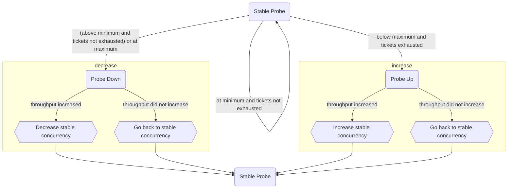

# Global Lock Admission Control

There are 2 separate ticketing mechanisms placed in front of the global lock acquisition. Both aim to limit the number of concurrent operations from overwhelming the system. Before an operation can acquire the global lock, it must acquire a ticket from one, or both, of the ticketing mechanisms. When both ticket mechanisms are necessary, the acquisition order is as follows:

1. [Flow Control][] - Required only for global lock requests in MODE_IX
2. [Execution Control] - Required for all global lock requests

[Execution Control]: #execution-control
[Flow Control]: ../repl/README.md#flow-control

# Execution Control

Execution control limits the number of concurrent storage engine transactions in a single mongod to
reduce contention on storage engine resources.

## Ticket Management

There are 2 separate pools of available tickets: one pool for global lock read requests
(MODE_S/MODE_IS), and one pool of tickets for global lock write requests (MODE_IX).

As of v7.0, the size of each ticket pool is managed dynamically by the server to maximize
throughput. Details of the algorithm can be found in [Throughput Probing](#throughput-probing) This
dynamic management can be disabled by specifying the size of each pool manually via server
parameters `storageEngineConcurrentReadTransactions` (read ticket pool) and
`storageEngineConcurrentWriteTransactions` (write ticket pool). #

Each pool of tickets is maintained in a
[TicketHolder](https://github.com/mongodb/mongo/blob/r6.3.0-rc0/src/mongo/util/concurrency/ticketholder.h#L52).
Tickets distributed from a given TicketHolder will always be returned to the same TicketHolder (a
write ticket will always be returned to the TicketHolder with the write ticket pool).

## Throughput Probing

Execution control limits concurrency with a throughput-probing algorithm, described below.

### Server Parameters

- `throughputProbingInitialConcurrency -> gInitialConcurrency`: initial number of concurrent read
  and write transactions
- `throughputProbingMinConcurrency -> gMinConcurrency`: minimum concurrent read and write
  transactions
- `throughputProbingMaxConcurrency -> gMaxConcurrency`: maximum concurrent read and write
  transactions
- `throughputProbingReadWriteRatio -> gReadWriteRatio`: ratio of read and write tickets where 0.5
  indicates 1:1 ratio
- `throughputProbingConcurrencyMovingAverageWeight -> gConcurrencyMovingAverageWeight`: weight of
  new concurrency measurement in the exponentially-decaying moving average
- `throughputProbingStepMultiple -> gStepMultiple`: step size for throughput probing

### Pseudocode

```
setConcurrency(concurrency)
    ticketsAllottedToReads := clamp((concurrency * gReadWriteRatio), gMinConcurrency, gMaxConcurrency)
    ticketsAllottedToWrites := clamp((concurrency * (1-gReadWriteRatio)), gMinConcurrency, gMaxConcurrency)

getCurrentConcurrency()
    return ticketsAllocatedToReads + ticketsAllocatedToWrites

exponentialMovingAverage(stableConcurrency, currentConcurrency)
    return (currentConcurrency * gConcurrencyMovingAverageWeight) + (stableConcurrency * (1 - gConcurrencyMovingAverageWeight))

run()
    currentThroughput := (# read tickets returned + # write tickets returned) / time elapsed

    Case of ProbingState
        kStable     probeStable(currentThroughput)
        kUp         probeUp(currentThroughput)
        KDown       probeDown(currentThroughput)

probeStable(currentThroughput)
    stableThroughput := currentThroughput
    currentConcurrency := getCurrentConcurrency()
    if (currentConcurrency < gMaxConcurrency && tickets exhausted)
        setConcurrency(stableConcurrency * (1 + gStepMultiple))
        ProbingState := kUp
    else if (currentConcurrency > gMinConcurrency)
        setConcurrency(stableConcurrency * (1 - gStepMultiple))
        ProbingState := kDown
    else (currentConcurrency == gMinConcurrency), no changes

probeUp(currentThroughput)
    if (currentThroughput > stableThroughput)
        stableConcurrency := exponentialMovingAverage(stableConcurrency, getCurrentConcurrency())
        stableThroughput := currentThroughput
    setConcurrency(stableConcurrency)
    ProbingState := kStable

probeDown(currentThroughput)
    if (currentThroughput > stableThroughput)
        stableConcurrency := exponentialMovingAverage(stableConcurrency, getCurrentConcurrency())
        stableThroughput := currentThroughput
    setConcurrency(stableConcurrency)
    ProbingState := kStable

```

### Diagram



## Admission Priority

As operations gets admitted through execution control and ingress admission, they get tickets from
those queues. Associated with every ticket is an admission priority for that admission. By default,
tickets have 'normal' priority. For ingress admission, operations created by a process-internal
client are exempted when performing the ingress admission check. For execution control, exemption
must be set explicitly.

In the Flow Control ticketing system, operations of 'immediate' priority bypass ticket acquisition
regardless of ticket availability. Tickets that are not 'immediate' priority must throttle when
there are no tickets available in both Flow Control and Execution Control.

Flow Control is only concerned whether an operation is 'immediate' priority.
The current version of Execution Control only takes into account if the priority is exempt or not,
as exempt priority is the only one beside normal priority.

**AdmissionContext::Priority**

- `kExempt` - Reserved for operations critical to availability (e.g replication workers), or
  observability (e.g. FTDC), and any operation releasing resources (e.g. committing or aborting
  prepared transactions).
- `kNormal` - An operation that should be throttled when the server is under load. If an operation
  is throttled, it will not affect availability or observability. Most operations, both user and
  internal, should use this priority unless they qualify as 'kExempt' priority.

[See AdmissionContext::Priority for more
details](https://github.com/mongodb/mongo/blob/r8.0.9/src/mongo/util/concurrency/admission_context.h#L49-L71).

### How to Exempt an Operation

Some operation may need to be exempt from execution control. In the cases where an operation must
be explicitly set as exempt, use the RAII type
[ScopedAdmissionPriority](https://github.com/mongodb/mongo/blob/r8.0.9/src/mongo/util/concurrency/admission_context.h#L136).

```
ScopedAdmissionPriority<ExecutionAdmissionContext> priority(opCtx, AdmissionContext::Priority::kExempt);
```

# Data-Node Ingress Admission Control

### Quick Overview

Ingress Admission Control is the mechanism placed at the data node ingress layer to help prevent
data-bearing nodes from becoming overloaded with operations. This is done through a ticketing system
that is intended to queue incoming operations based on a configurable overload prevention policy.
Simply put, the queue can admit incoming user operations up to the max number of tickets configured,
and any additional operations wait until a ticket is freed up. Ingress Admission Control is not
applied to all commands however. It's enforced to most user admitted operations, while high priority
and critical internal operations are typically exempt. While the number of tickets is defaulted to
[1,000,000][ingressACidl], it is configurable at startup and runtime.

## Code Structure and Components

Ingress admission control can be broken down into just a few parts:

- **IngressAdmissionsContext**: A decoration on the operation context, which inherits from
  `AdmissionContext`. This base class provides metadata and priority, which is used when determining
  if a command is subject to admission control.

- **ScopedAdmissionPriority**: An RAII-style class that sets the admission priority for an
  operation.

- **IngressAdmissionController**: A decoration on the service context that manages ticket pool size,
  and admission of operations. To be able to utilize these mechanisms, `IngressAdmissionController`
  owns a `TicketHolder`, which is capable of acquiring tickets for operations, and resizing the
  ticket pool.

## Admission Control Ticket Acquisition

The full scope of Admission Control happens inside of
[`ExecCommandDatabase::_initiateCommand()`][initiateCommand] within the ServiceEntryPoint.

To begin, the server parameter [`gIngressAdmissionControlEnabled`][admissionServerParam] is checked
to see if admission control is enabled. If true, we continue with admission control evaluation.

Next we check the main trigger for admission control evaluation,
`isSubjectToIngressAdmissionControl()`. Commands will initially be exempt from admission control as
the default `isSubjectToIngressAdmissionControl` is set to return false. However, each command
invocation can have a different override of `isSubjectToIngressAdmissionControl`, depending on if it
should be subject to admission control. Since each operation has their own implementation, there is
no one collective that determines if an operation needs to be evaluated, so this is left up to each
command's own implementation.

Each operation will attempt to acquire a ticket unless an operation is marked **exempt**, or if the
operation is already holding a ticket. Exempt tickets typically are held by high priority and
critical internal operations. Meanwhile, re-entrancy API's like `DBDirectClient`, where a parent
operation will call into a sub-operation, will cause us to re-enter from the admission layer. It's
important that a sub-operation never acquires a new ticket if the parent operation is already
holding one, otherwise we risk deadlocking the system. In both of these cases, we bypass admission
control and set the priority in the `ScopedAdmissionPriority` object to **Exempt**.

When an operation **is** subject to admission control, we attempt to acquire a ticket. If there are
available tickets, we return the ticket immediately and the operation can continue its execution. If
there are no available tickets, the operation will be blocked, and has to wait for one to become
available.

If we find and return a ticket, it will be used for the lifetime of the command, and will be
released when `ExecCommandDatabase` is finished [executing][ticketRelease] the command.

## How to apply Admission Control to your command

With your new command created, you have a few options for implementing Admission Control. If it is a
high priority command or internal command that is critical for system monitoring and health, you
likely want to exempt it from admission control. The virtual parent function will do this [by
default][subjectVirtualFalse]. It is important to scrutinize the list of exempted operations because
it is critical to the systems health that appropriate operations should queue when possible in the
instance of overload.

If you want to apply admission control, you will need to override
`isSubjectToIngressAdmissionControl` [and return true][subjectAdmissionExTrue]. **Most operations
are expected to fall under this category**.

To apply admission control selectively, override `isSubjectToIngressAdmissionControl` and implement
selective logic to determine [when it should be applied][subjectAdmissionFind].

[initiateCommand]: https://github.com/10gen/mongo/blob/a86c7f5de2a5de4d2f49e40e8970754ec6a5ba6c/src/mongo/db/service_entry_point_shard_role.cpp#L1588
[admissionServerParam]: https://github.com/10gen/mongo/blob/291b72ec4a8364208d7633d881cddc98787832b8/src/mongo/db/service_entry_point_shard_role.cpp#L1804
[admissionPriority]: https://github.com/10gen/mongo/blob/291b72ec4a8364208d7633d881cddc98787832b8/src/mongo/db/service_entry_point_shard_role.cpp#L1809
[tryAcquire]: https://github.com/10gen/mongo/blob/0ed24f52f011fc16cd968368ace216fe7e747723/src/mongo/util/concurrency/ticketholder.cpp#L130
[subjectAdmissionExTrue]: https://github.com/10gen/mongo/blob/0ed24f52f011fc16cd968368ace216fe7e747723/src/mongo/db/commands/query_cmd/bulk_write.cpp#L1311
[subjectAdmissionFind]: https://github.com/10gen/mongo/blob/0ed24f52f011fc16cd968368ace216fe7e747723/src/mongo/db/commands/query_cmd/find_cmd.cpp#L385
[subjectVirtualFalse]: https://github.com/10gen/mongo/blob/0ed24f52f011fc16cd968368ace216fe7e747723/src/mongo/db/commands.h#L956
[ticketRelease]: https://github.com/10gen/mongo/blob/0ed24f52f011fc16cd968368ace216fe7e747723/src/mongo/db/service_entry_point_shard_role.cpp#L519
[ingressACidl]: https://github.com/10gen/mongo/blob/cbb6b8543feeb6e110f646bbeb44d8779d838db1/src/mongo/db/admission/ingress_admission_control.idl#L43
