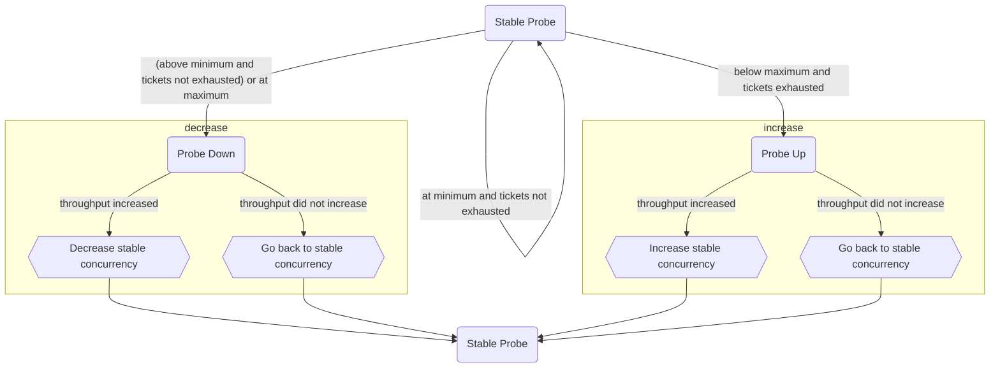

# Execution Control

Execution control limits the number of concurrent storage engine transactions in a single mongod to reduce contention on storage engine resources.

## Ticketing System

The ticketing system in execution control manages concurrency by controlling the number of concurrent storage engine transactions through a ticket-based mechanism. There are separate pools of available tickets for read operations (MODE_S/MODE_IS global lock requests) and write operations (MODE_IX global lock requests).

### Double Ticket Pool Architecture

Each operation type (read or write) can have two ticket pools:

- **Normal Priority Pool**: For standard operations.
- **Low Priority Pool**: For deprioritized operations (when prioritization is enabled).

The ticketing system supports two main concurrency adjustment algorithms:

1. **Fixed concurrent transactions**: A static algorithm where the number of concurrent transactions is controlled by server parameters and remains fixed unless manually adjusted.

2. **Throughput probing**: A dynamic algorithm that automatically adjusts the number of concurrent transactions to maximize system throughput (default as of v7.0).

### Prioritization

The ticketing system supports operation prioritization through two mechanisms:

- **Heuristic deprioritization**: Automatically deprioritizes long-running operations that have yielded frequently (exceeded the admission threshold).

- **Background tasks deprioritization**: Automatically assigns background operations (index builds, TTL deletions, range deletions) to the low-priority pool.

When prioritization is enabled, operations can be assigned to either the normal priority or low priority ticket pool. Deprioritized operations will acquire tickets from the low-priority pool, allowing higher-priority work to proceed with less contention.

#### Compatibility with Concurrency Adjustment Algorithms

The deprioritization features work with both concurrency adjustment algorithms, but they interact differently with each.

When using **fixed concurrent transactions**, all ticket pools (both normal and low priority) are manually configured via server parameters and remain fixed unless manually adjusted via the server parameters.

When using **throughput probing**, normal priority pools are dynamically tuned by the algorithm based on system throughput and ticket exhaustion patterns, while low priority pools remain fixed and controlled via server parameters.

You can transition between algorithms at runtime while deprioritization is enabled. When switching algorithms, the system preserves configured low-priority ticket values while normal priority tickets transition from fixed to dynamic (or vice versa) based on the selected algorithm, and deprioritization continues to function during and after the transition.

#### How to Exempt an Operation

Some operation may need to be exempt from execution control. In the cases where an operation must be exempted from execution control, an `ExecutionAdmissionContext` will need to be passed in with the `AdmissionContext::Priority::kExempt` value when acquiring the global lock.

```cpp
ScopedAdmissionPriority<ExecutionAdmissionContext> priority(opCtx, AdmissionContext::Priority::kExempt);
```

#### How to Lower the Priority of an Operation

For long-running or background operations that should be throttled more aggressively under load, you can set the priority to `kLow`. This is done similarly to exempting an operation:

```cpp
ScopedAdmissionPriority<ExecutionAdmissionContext> priority(opCtx, AdmissionContext::Priority::kLow);
```

### Fixed Concurrent Transactions

The `fixedConcurrentTransactions` algorithm provides a static concurrency model where the number of concurrent transactions is explicitly controlled through server parameters. Unlike throughput probing, this algorithm does not automatically adjust concurrency based on system throughput.

If you set `executionControlConcurrentReadTransactions` or `executionControlConcurrentWriteTransactions` at server startup, the algorithm will implicitly default to `fixedConcurrentTransactions`.

### Throughput Probing

Execution control limits concurrency with a throughput-probing algorithm, described below.

#### Pseudocode

```
setConcurrency(concurrency)
    ticketsAllottedToReads := clamp((concurrency * gReadWriteRatio), gMinConcurrency, gMaxConcurrency)
    ticketsAllottedToWrites := clamp((concurrency * (1-gReadWriteRatio)), gMinConcurrency, gMaxConcurrency)

getCurrentConcurrency()
    return ticketsAllocatedToReads + ticketsAllocatedToWrites

exponentialMovingAverage(stableConcurrency, currentConcurrency)
    return (currentConcurrency * gConcurrencyMovingAverageWeight) + (stableConcurrency * (1 - gConcurrencyMovingAverageWeight))

run()
    currentThroughput := (# read tickets returned + # write tickets returned) / time elapsed

    Case of ProbingState
        kStable     probeStable(currentThroughput)
        kUp         probeUp(currentThroughput)
        KDown       probeDown(currentThroughput)

probeStable(currentThroughput)
    stableThroughput := currentThroughput
    currentConcurrency := getCurrentConcurrency()
    if (currentConcurrency < gMaxConcurrency && tickets exhausted)
        setConcurrency(stableConcurrency * (1 + gStepMultiple))
        ProbingState := kUp
    else if (currentConcurrency > gMinConcurrency)
        setConcurrency(stableConcurrency * (1 - gStepMultiple))
        ProbingState := kDown
    else (currentConcurrency == gMinConcurrency), no changes

probeUp(currentThroughput)
    if (currentThroughput > stableThroughput)
        stableConcurrency := exponentialMovingAverage(stableConcurrency, getCurrentConcurrency())
        stableThroughput := currentThroughput
    setConcurrency(stableConcurrency)
    ProbingState := kStable

probeDown(currentThroughput)
    if (currentThroughput > stableThroughput)
        stableConcurrency := exponentialMovingAverage(stableConcurrency, getCurrentConcurrency())
        stableThroughput := currentThroughput
    setConcurrency(stableConcurrency)
    ProbingState := kStable

```

#### Diagram



### Execution Control Parameters

The following server parameters control the ticketing system:

#### Algorithm Selection

- `executionControlConcurrencyAdjustmentAlgorithm`: Selects the concurrency adjustment algorithm (default: `"throughputProbing"`).

#### Normal Priority Ticket Configuration

- `executionControlConcurrentReadTransactions`: Maximum concurrent read transactions in the normal priority pool. Requires fixed concurrent transactions algorithm.
- `executionControlConcurrentWriteTransactions`: Maximum concurrent write transactions in the normal priority pool. Requires fixed concurrent transactions algorithm.
- `executionControlReadMaxQueueDepth`: Maximum queue depth for operations waiting for normal priority read tickets.
- `executionControlWriteMaxQueueDepth`: Maximum queue depth for operations waiting for normal priority write tickets.

#### Low Priority Ticket Configuration

- `executionControlConcurrentReadLowPriorityTransactions`: Maximum concurrent read transactions in the low priority pool.
- `executionControlConcurrentWriteLowPriorityTransactions`: Maximum concurrent write transactions in the low priority pool.
- `executionControlReadLowPriorityMaxQueueDepth`: Maximum queue depth for operations waiting for low priority read tickets.
- `executionControlWriteLowPriorityMaxQueueDepth`: Maximum queue depth for operations waiting for low priority write tickets.

#### Prioritization Configuration

- `executionControlDeprioritizationGate`: Global toggle that must be enabled for any deprioritization features to work. When set to `false` (default), all deprioritization is disabled regardless of other settings. When set to `true`, deprioritization features can be independently enabled.
- `executionControlHeuristicDeprioritization`: Enables automatic deprioritization of long-running operations. Requires `executionControlDeprioritizationGate` to be `true`.
- `executionControlHeuristicNumAdmissionsDeprioritizeThreshold`: Number of admissions an operation must perform before being deprioritized.
- `executionControlBackgroundTasksDeprioritization`: Enables automatic deprioritization of background tasks. Requires `executionControlDeprioritizationGate` to be `true`.

#### Throughput Probing Configuration

- `throughputProbingInitialConcurrency`: Initial number of concurrent read and write transactions.
- `throughputProbingMinConcurrency`: Minimum concurrent read and write transactions.
- `throughputProbingMaxConcurrency`: Maximum concurrent read and write transactions.
- `throughputProbingReadWriteRatio`: Ratio of read and write tickets where 0.5 indicates 1:1 ratio.
- `throughputProbingConcurrencyMovingAverageWeight`: Weight of new concurrency measurement in the exponentially-decaying moving average.
- `throughputProbingStepMultiple`: Step size for throughput probing.
- `throughputProbingConcurrencyAdjustmentIntervalMillis`: Interval between concurrency adjustments.
