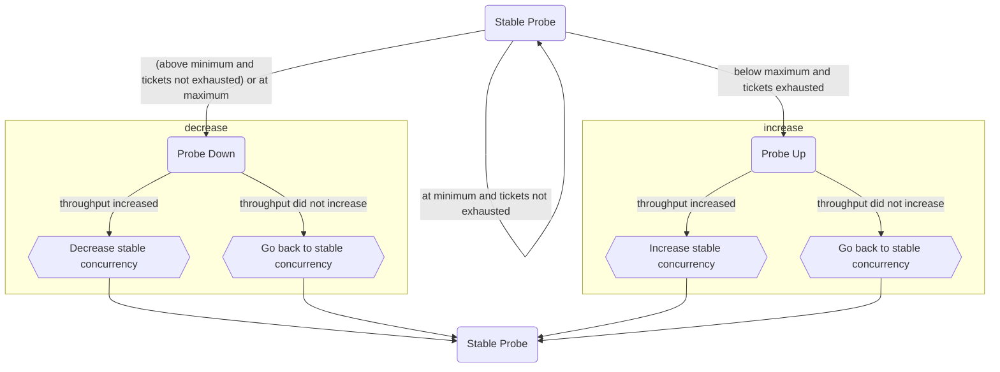

# Execution Control

Execution control limits the number of concurrent storage engine transactions in a single mongod to reduce contention on storage engine resources.

## Ticketing System

The ticketing system in execution control manages concurrency by controlling the number of concurrent storage engine transactions through a ticket-based mechanism. There are separate pools of available tickets for read operations (MODE_S/MODE_IS global lock requests) and write operations (MODE_IX global lock requests).

### Double Ticket Pool Architecture

Each operation type (read or write) can have two ticket pools:

- **Normal Priority Pool**: For standard operations.
- **Low Priority Pool**: For deprioritized operations (when prioritization is enabled).

The ticketing system supports two main concurrency adjustment algorithms:

1. **Fixed concurrent transactions**: A static algorithm where the number of concurrent transactions is controlled by server parameters and remains fixed unless manually adjusted.

2. **Throughput probing**: A dynamic algorithm that automatically adjusts the number of concurrent transactions to maximize system throughput (default as of v7.0).

### Prioritization

The ticketing system supports operation prioritization through two mechanisms:

- **Heuristic deprioritization**: Automatically deprioritizes long-running operations that have yielded frequently (exceeded the admission threshold). Operations with the `NonDeprioritizable` task type are immune to this mechanism.

- **Background tasks deprioritization**: Automatically assigns background operations (index builds, TTL deletions, range deletions) to the low-priority pool.

When prioritization is enabled, operations can be assigned to either the normal priority or low priority ticket pool. Deprioritized operations will acquire tickets from the low-priority pool, allowing higher-priority work to proceed with less contention.

#### Ticket Queue Ordering

Each ticket pool uses one of two semaphore implementations that differ in how waiting operations are dispatched when a ticket becomes available:

- [**Unordered (competing) semaphore**](../ticketing/unordered_ticket_semaphore.h) — Used by the normal-priority pools. There are no fairness guarantees: any waiting operation may claim a released ticket, including newly-arrived operations that have not yet queued. This gives maximum throughput with minimal overhead under normal conditions.

- [**Ordered semaphore**](../ticketing/ordered_ticket_semaphore.h) — Used by the low-priority pools. Waiting operations are dispatched in ascending order of their _admission count_ (the number of times the operation has acquired a ticket, i.e. the number of times it has yielded execution control). This implements a [Least Attained Service (LAS)](https://www.cs.cmu.edu/~harchol/Papers/Sigmetrics01.pdf) scheduling policy: the operation that has consumed the least service so far is served next. An operation with a lower admission count is considered to have run for a shorter total duration and is therefore served first. This ordering preference for short-running operations prevents a single long-running operation from monopolising the low-priority pool and ensures that brief, newly-deprioritised operations are not starved behind older, high-yield operations.

The queue type is an implementation detail of each pool and is not directly configurable. Choosing to enable or disable deprioritization (see `executionControlDeprioritizationGate` below) determines whether the low-priority pools — and therefore the ordered semaphore — are used at all.

### Task Types

The deprioritization mechanisms above are governed by task types, classified via
`ExecutionAdmissionContext::TaskType`. Task types control how the two deprioritization mechanisms
(heuristic and background) apply to an operation. They are set via RAII guards
(`ScopedTaskTypeNonDeprioritizable`, `ScopedTaskTypeBackground`) or directly via `setTaskType()`.

- `Default` - The standard task type. Subject to heuristic deprioritization when the operation
  exceeds the admission threshold due to frequent yielding.
- `NonDeprioritizable` - Making an operation immune to heuristic deprioritization. The operation
  still acquires a ticket and participates in execution control — it simply cannot be moved to the
  low-priority pool. Used for internal operations that must not be starved during system overload.
- `Background` - Always routed to the low-priority pool when background task deprioritization is enabled. Used for index builds, TTL deletions, and range deletions.

#### Compatibility with Concurrency Adjustment Algorithms

The deprioritization features work with both concurrency adjustment algorithms, but they interact differently with each.

When using **fixed concurrent transactions**, all ticket pools (both normal and low priority) are manually configured via server parameters and remain fixed unless manually adjusted via the server parameters.

When using **throughput probing**, normal priority pools are dynamically tuned by the algorithm based on system throughput and ticket exhaustion patterns, while low priority pools remain fixed and controlled via server parameters.

You can transition between algorithms at runtime while deprioritization is enabled. When switching algorithms, the system preserves configured low-priority ticket values while normal priority tickets transition from fixed to dynamic (or vice versa) based on the selected algorithm, and deprioritization continues to function during and after the transition.

#### How to Exempt an Operation

Some operation may need to be exempt from execution control. In the cases where an operation must be exempted from execution control, an `ExecutionAdmissionContext` will need to be passed in with the `AdmissionContext::Priority::kExempt` value when acquiring the global lock.

```cpp
ScopedAdmissionPriority<ExecutionAdmissionContext> priority(opCtx, AdmissionContext::Priority::kExempt);
```

#### How to Mark an Operation Non-Deprioritizable

Internal operations that must not be starved by heuristic deprioritization can be marked with the `NonDeprioritizable` task type. Unlike `kExempt`, the operation still acquires a ticket and waits if none are available — it is only protected from being moved to the low-priority pool.

```cpp
ScopedTaskTypeNonDeprioritizable guard(opCtx);
```

This should be used sparingly for operations where deprioritization would cause correctness or availability issues (e.g., replication-critical collection operations). Prefer `kExempt` priority for operations that must bypass ticket acquisition entirely.

#### How to Lower the Priority of an Operation

For long-running or background operations that should be throttled more aggressively under load, you can set the priority to `kLow`. This is done similarly to exempting an operation:

```cpp
ScopedAdmissionPriority<ExecutionAdmissionContext> priority(opCtx, AdmissionContext::Priority::kLow);
```

### Fixed Concurrent Transactions

The `fixedConcurrentTransactions` algorithm provides a static concurrency model where the number of concurrent transactions is explicitly controlled through server parameters. Unlike throughput probing, this algorithm does not automatically adjust concurrency based on system throughput.

If you set `executionControlConcurrentReadTransactions` or `executionControlConcurrentWriteTransactions` at server startup, the algorithm will implicitly default to `fixedConcurrentTransactions`.

### Throughput Probing

Execution control limits concurrency with a throughput-probing algorithm, described below.

#### Pseudocode

```
setConcurrency(concurrency)
    ticketsAllottedToReads := clamp((concurrency * gReadWriteRatio), gMinConcurrency, gMaxConcurrency)
    ticketsAllottedToWrites := clamp((concurrency * (1-gReadWriteRatio)), gMinConcurrency, gMaxConcurrency)

getCurrentConcurrency()
    return ticketsAllocatedToReads + ticketsAllocatedToWrites

exponentialMovingAverage(stableConcurrency, currentConcurrency)
    return (currentConcurrency * gConcurrencyMovingAverageWeight) + (stableConcurrency * (1 - gConcurrencyMovingAverageWeight))

run()
    currentThroughput := (# read tickets returned + # write tickets returned) / time elapsed

    Case of ProbingState
        kStable     probeStable(currentThroughput)
        kUp         probeUp(currentThroughput)
        KDown       probeDown(currentThroughput)

probeStable(currentThroughput)
    stableThroughput := currentThroughput
    currentConcurrency := getCurrentConcurrency()
    if (currentConcurrency < gMaxConcurrency && tickets exhausted)
        setConcurrency(stableConcurrency * (1 + gStepMultiple))
        ProbingState := kUp
    else if (currentConcurrency > gMinConcurrency)
        setConcurrency(stableConcurrency * (1 - gStepMultiple))
        ProbingState := kDown
    else (currentConcurrency == gMinConcurrency), no changes

probeUp(currentThroughput)
    if (currentThroughput > stableThroughput)
        stableConcurrency := exponentialMovingAverage(stableConcurrency, getCurrentConcurrency())
        stableThroughput := currentThroughput
    setConcurrency(stableConcurrency)
    ProbingState := kStable

probeDown(currentThroughput)
    if (currentThroughput > stableThroughput)
        stableConcurrency := exponentialMovingAverage(stableConcurrency, getCurrentConcurrency())
        stableThroughput := currentThroughput
    setConcurrency(stableConcurrency)
    ProbingState := kStable

```

#### Diagram



### Execution Control Parameters

The following server parameters control the ticketing system:

#### Algorithm Selection

- `executionControlConcurrencyAdjustmentAlgorithm`: Selects the concurrency adjustment algorithm (default: `"throughputProbing"`).

#### Normal Priority Ticket Configuration

- `executionControlConcurrentReadTransactions`: Maximum concurrent read transactions in the normal priority pool. Requires fixed concurrent transactions algorithm.
- `executionControlConcurrentWriteTransactions`: Maximum concurrent write transactions in the normal priority pool. Requires fixed concurrent transactions algorithm.
- `executionControlReadMaxQueueDepth`: Maximum queue depth for operations waiting for normal priority read tickets.
- `executionControlWriteMaxQueueDepth`: Maximum queue depth for operations waiting for normal priority write tickets.

#### Low Priority Ticket Configuration

- `executionControlConcurrentReadLowPriorityTransactions`: Maximum concurrent read transactions in the low priority pool.
- `executionControlConcurrentWriteLowPriorityTransactions`: Maximum concurrent write transactions in the low priority pool.
- `executionControlReadLowPriorityMaxQueueDepth`: Maximum queue depth for operations waiting for low priority read tickets.
- `executionControlWriteLowPriorityMaxQueueDepth`: Maximum queue depth for operations waiting for low priority write tickets.

#### Prioritization Configuration

- `executionControlDeprioritizationGate` (bool, default: `false`): Master switch for the entire deprioritization subsystem. When `false` (the default), the low-priority ticket pools are not used and all operations compete for tickets in the normal-priority pools via the unordered semaphore. When `true`, the ordered low-priority pools are activated and operations can be routed to them by heuristic or background-task deprioritization.

  **When to enable**: Consider setting this to `true` only when the server is under heavy sustained load **and** the workload is latency-sensitive for short-running operations (e.g. point lookups, inserts, small updates) that are mixed with long-running or background operations (e.g. large aggregations, index builds, TTL scans). In this scenario, the LAS-ordered low-priority pool causes long-running operations to yield to shorter ones, reducing tail latency for the short operations. In workloads that consist exclusively of uniform-length operations, or that are not meaningfully bounded by execution control concurrency, enabling this flag provides no benefit and adds unnecessary complexity.

- `executionControlHeuristicDeprioritization`: Enables automatic deprioritization of long-running operations. Requires `executionControlDeprioritizationGate` to be `true`.
- `executionControlHeuristicNumAdmissionsDeprioritizeThreshold`: Number of admissions an operation must perform before being deprioritized.
- `executionControlBackgroundTasksDeprioritization`: Controls deprioritization for background task operations (index builds, TTL deletions, range deletions). When `true` (default), background tasks always run at low priority. When `false`, background tasks run at normal priority and are immune to heuristic deprioritization.
- `executionControlApplicationDeprioritizationExemptions`: A document containing a list of application names exempted from deprioritization. Operations from clients whose application name or driver name starts with any of the exempted names will not be deprioritized. Format: `{appNames: ["App1", "App2"]}`.

#### Throughput Probing Configuration

- `throughputProbingInitialConcurrency`: Initial number of concurrent read and write transactions.
- `throughputProbingMinConcurrency`: Minimum concurrent read and write transactions.
- `throughputProbingMaxConcurrency`: Maximum concurrent read and write transactions.
- `throughputProbingReadWriteRatio`: Ratio of read and write tickets where 0.5 indicates 1:1 ratio.
- `throughputProbingConcurrencyMovingAverageWeight`: Weight of new concurrency measurement in the exponentially-decaying moving average.
- `throughputProbingStepMultiple`: Step size for throughput probing.
- `throughputProbingConcurrencyAdjustmentIntervalMillis`: Interval between concurrency adjustments.
