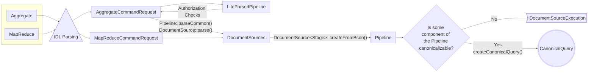

# Parsing

## Overview

The query system's parsing layer has two main components:

1. [Command Parsing and Validation](#command-parsing-and-validation) is responsible for parsing the arguments to each command, verifying the expected number of arguments, and checking their types.
1. [Query Language Parsing and Validation](#query-language-parsing-and-validation) is responsible for more query-specific parsing. This includes (but is not limited to) parsing query predicates and aggregation pipelines.

Overall, the parsing layer translates from a client-facing command (e.g. find or aggregate) to a parsed command object (e.g. `ParsedFindCommand` or `Pipeline`). These parsed command objects are then normalized to form the input of query planning: `CanonicalQuery`, [if possible](#parsing-aggregations).

> ### Aside: `CanonicalQuery`
>
> A [`CanonicalQuery`](https://github.com/mongodb/mongo/blob/5342b2bab6a7ff264f21a44cc8b8310d6fc7bc01/src/mongo/db/query/canonical_query.h#L72) is a container that represents a parsed and normalized query. This includes features such as the query's `filter`, `projection`, and `sort` elements. See [here](../../query/README_logical_models.md#canonicalquery) for more information regarding `CanonicalQuery` and its normalization.

## Command Parsing and Validation

The QO team maintains the following commands:

- Category 1: Basic Read Queries
  - `find`
  - `distinct`
  - `count`
- Category 2: Aggregations
  - `aggregate`
  - `mapReduce`
    - Note: `mapReduce` was deprecated in MongoDB v5.0 in favor of standard aggregation.
- Category 3: Write Queries
  - `insert`
  - `delete`
  - `update`
  - `findAndModify`

Each command starts in a class that inherits from the [`Command`](https://github.com/mongodb/mongo/blob/5342b2bab6a7ff264f21a44cc8b8310d6fc7bc01/src/mongo/db/commands.h#L436) abstract class. These commands all live in the [`src/mongo/db/commands/`](https://github.com/mongodb/mongo/tree/master/src/mongo/db/commands) directory. For example:

- `FindCmd` lives in [find_cmd.cpp](https://github.com/mongodb/mongo/blob/master/src/mongo/db/commands/query_cmd/find_cmd.cpp)
- `aggregate`'s command (`PipelineCommand`) lives in [`pipeline_command.cpp`](https://github.com/mongodb/mongo/blob/master/src/mongo/db/commands/query_cmd/pipeline_command.cpp).

First, we piece apart the command into its components. We don't yet try to understand the meaning of the more complex MQL arguments, such as find's `filter`, `projection`, and `sort` arguments, or the individual stages in `aggregate`'s `pipeline` argument.

> ### Aside: Command Parsing vs. Query Parsing
>
> The overall parsing layer reflects this hierarchy:
>
> 1. A valid bytestring may contain a possibly valid `BSON`, extracted using a **BSON parser**.
> 1. A valid `BSON` may contain a possibly valid **command**, extracted using a [**command parser**](#aside-the-interface-definition-language).
> 1. A valid command may contain a possibly valid **query**, extracted using an [**MQL parser**](#query-language-parsing-and-validation).
>
> At this point, we are considering the second layer, from `BSON` to `Command`.

For example, given this find query:

```
db.c.find({$or: [{a: {$lt: 2}}, {a: 6}]}).sort({a: 1}).limit(5);
```

we generate a C++ struct that stores `filter`, `sort`, and `limit` as member variables. Note that `filter` is left as a `BSONObj`; we don't yet "know" that it contains a `$or`. Rather than manually writing the conversion code, we use an **Interface Definition Language** (IDL) tool to generate the parser and output a corresponding C++ struct. In the `find` case, `find_command.idl` generates `find_command_gen.h` and `find_command_gen.cpp` and by extension, a `FindCommandRequestBase` struct.

> ### Aside: The Interface Definition Language
>
> Below is a simplified snippet of the relevant portion of `find_command.idl`. The full file can be viewed [here](https://github.com/mongodb/mongo/blob/master/src/mongo/db/query/find_command.idl).
>
> ```yaml
> commands:
>   find:
>     cpp_name: FindCommandRequestBase
>     command_name: find
>     description: "A struct representing the find command"
>     fields:
>       filter:
>         description: "The query predicate. If unspecified, then all documents in the collection
>         will match the predicate."
>         type: object
>         default: mongo::BSONObj()
>         stability: stable
>       sort:
>         description: "The sort specification for the ordering of the results."
>         type: object
>         default: mongo::BSONObj()
>         stability: stable
>       limit:
>         description: "The maximum number of documents to return."
>         type: safeInt64
>         optional: true
>         validator: { gte: 0 }
>         stability: stable
> ```
>
> This file (specified in a YAML format) is used to generate C++ code that will in turn create a `FindCommandRequestBase`. Our build system will run a python tool to parse this YAML and spit out C++ code which is then compiled and linked. This code is left in a file ending with '\_gen.h' or '\_gen.cpp' (here `find_command_gen.cpp`). The YAML includes specifications of each field, such as its type, whether it is optional, and any default values. The generated file will have getter and setter member functions and will return a `boost::optional` for optional fields. Now, we have a `FindCommandRequestBase` struct that neatly contains C++ members for each of the components of our query.

### Additional Setup Before MQL Processing

#### `ExpressionContext`

An [**`ExpressionContext`**](https://github.com/mongodb/mongo/blob/903127224b53dee29888d8e799e41cf747191fc0/src/mongo/db/pipeline/expression_context.h#L132) stores various pieces of state and settings that are pertinent throughout the lifespan of a query but are not necessarily relevant to other types of operations. This includes elements such as the collation, a time zone database, and other configuration flags (feature flags, query knobs, etc.). Each command initializes its own `ExpressionContext`; our `find` example does so [here](https://github.com/mongodb/mongo/blob/903127224b53dee29888d8e799e41cf747191fc0/src/mongo/db/commands/query_cmd/find_cmd.cpp#L191).

#### Non-IDL Command Validation

Occasionally, the IDL parsers will not be able to express certain command constraints. For example, the `findAndModify` command cannot specify `true` for both `remove` and `new`, but the [IDL parser](https://github.com/mongodb/mongo/blob/903127224b53dee29888d8e799e41cf747191fc0/src/mongo/db/query/write_ops/write_ops.idl#L533) alone cannot restrict the user from doing this. In these cases, we add a [`validate()`](https://github.com/mongodb/mongo/blob/903127224b53dee29888d8e799e41cf747191fc0/src/mongo/db/commands/query_cmd/find_and_modify.cpp#L133) function to perform these final checks.

## Query Language Parsing and Validation

### Parsing Read Queries: Find, Distinct, and Count

#### Parsing Find

As discussed above, the IDL handles creation of a `FindCommandRequest`. With this `FindCommandRequest` struct, we can now call [`parsed_find_command::parse()`](https://github.com/mongodb/mongo/blob/65b9efd4861b9f0d61f8b29843d29febcba91bcb/src/mongo/db/commands/query_cmd/find_cmd.cpp#L196), passing in the `ExpressionContext` and a new struct of type `ParsedFindCommandParams`, which contains the `FindCommandRequest` as a member. A few function calls later, we reach [`MatchExpressionParser::parse()`](https://github.com/mongodb/mongo/blob/0a68308f0d39a928ed551f285ba72ca560c38576/src/mongo/db/query/parsed_find_command.cpp#L186) which recursively parses the `BSONObj` `filter` component of our `FindCommandRequest` by using the `parse()` function for each type of `MatchExpression` node. This AST structure assembles the `filter` in an easily optimizable format, as each subclass `MatchExpression` node knows which rewrites are possible given their place in the AST. For more information on `MatchExpression`s, see [Logical Models](../../query/README_logical_models.md).

After parsing our `MatchExpression` into a tree of `MatchExpression`s , we pass the full `MatchExpression` AST to a `ParsedFindCommand`. Note that `ParsedFindCommand`s only primary components are the `filter`, `projection`, and `sort`; all other parameters (e.g. `limit`, `skip`, `batchSize`, etc.) are held as raw types in the `FindCommandRequest`.

Finally, we [create](https://github.com/mongodb/mongo/blob/903127224b53dee29888d8e799e41cf747191fc0/src/mongo/db/commands/query_cmd/find_cmd.cpp#L196) a `CanonicalQuery` by passing the `ParsedFindCommand` as an argument, thereby giving the `CanonicalQuery` the `filter`, `projection`, `sort`, and `FindCommandRequest`.

#### Parsing Distinct and Count

The process of parsing `distinct` and `count` queries is nearly identical to that of `find`.

Distinct queries are parsed by IDL into a `DistinctCommandRequest`, which is in turn converted into a `ParsedDistinctCommand` by [`parsed_distinct_command::parse()`](https://github.com/mongodb/mongo/blob/65b9efd4861b9f0d61f8b29843d29febcba91bcb/src/mongo/db/query/parsed_distinct_command.cpp#L132). If a `filter` exists on the command, it is parsed using `MatchExpressionParser::parse()` like `find`. We then create a `CanonicalQuery` by an equivalent process to find, and [add a `CanonicalDistinct`](https://github.com/mongodb/mongo/blob/903127224b53dee29888d8e799e41cf747191fc0/src/mongo/db/query/parsed_distinct_command.cpp#L277) property to the `CanonicalQuery` with the details of the `distinct` query, such as its distinct key.

Count queries are parsed using `ParsedFindCommand`'s [`parseFromCount()`](https://github.com/mongodb/mongo/blob/65b9efd4861b9f0d61f8b29843d29febcba91bcb/src/mongo/db/query/parsed_find_command.cpp#L346) function, which converts a `CountCommandRequest` into a `FindCommandRequest` and uses the same logic as `find` thereafter.


### Parsing Aggregations

After producing an `AggregateCommandRequest` via IDL, the request is [passed and parsed](https://github.com/mongodb/mongo/blob/65b9efd4861b9f0d61f8b29843d29febcba91bcb/src/mongo/db/pipeline/lite_parsed_pipeline.h#L70) into a `LiteParsedPipeline`.

> ### Aside: `LiteParsedPipeline`
>
> A `LiteParsedPipeline` is a simple model of an aggregation pipeline that is constructed through a [semi-parse](https://github.com/mongodb/mongo/blob/65b9efd4861b9f0d61f8b29843d29febcba91bcb/src/mongo/db/pipeline/lite_parsed_document_source.h#L145) that proceeds just enough to tease apart the stages that are involved. `LiteParsedPipeline`s do not verify that the input is well-formed; instead, they can be used to _inspect_ queries before building a full model of the user's pipeline.
>
> - For example, on systems running with authorization, the `$currentOp` aggregation stage requires that the user has access that includes the [`inprog`](https://www.mongodb.com/docs/manual/reference/privilege-actions/#mongodb-authaction-inprog) privilege action. That means that if our `LiteParsedPipeline` finds a `$currentOp` that does not satisfy the [necessary privileges](https://github.com/mongodb/mongo/blob/65b9efd4861b9f0d61f8b29843d29febcba91bcb/src/mongo/db/pipeline/document_source_current_op.h#L105), we can [return an error](https://github.com/mongodb/mongo/blob/65b9efd4861b9f0d61f8b29843d29febcba91bcb/src/mongo/db/auth/authorization_checks.cpp#L90) and avoid the more expensive `DocumentSource` parsing process.

After confirming that the `LiteParsedPipeline` satisfies all the necessary permissions, the full `AggregateCommandRequest` is passed to [`Pipeline::parseCommon()`](https://github.com/mongodb/mongo/blob/65b9efd4861b9f0d61f8b29843d29febcba91bcb/src/mongo/db/pipeline/pipeline.cpp#L213) as a vector of pipeline stages (represented as raw `BSONObj`s). Each pipeline stage is then re-parsed using [`DocumentSource::parse()`](https://github.com/mongodb/mongo/blob/65b9efd4861b9f0d61f8b29843d29febcba91bcb/src/mongo/db/pipeline/document_source.cpp#L101), which calls on the `DocumentSource<Stage>::createFromBson()` parser for each stage. Note that this procedure is inefficient, as it requires parsing the original `AggregateCommandRequest` twice, rather than [utilizing the `LiteParsedPipeline`](https://jira.mongodb.org/browse/SERVER-93372) when creating `DocumentSource`s.

> ### Aside: `DocumentSource`
>
> A `DocumentSource` represents one stage of an aggregation pipeline. Each `DocumentSource` lives in its own file with this form: [`src/mongo/db/pipeline/document_source_<stage>`](https://github.com/mongodb/mongo/tree/master/src/mongo/db/pipeline), with a [`REGISTER_DOCUMENT_SOURCE`](https://github.com/mongodb/mongo/blob/65b9efd4861b9f0d61f8b29843d29febcba91bcb/src/mongo/db/pipeline/document_source.h#L99) macro at the top. Each `DocumentSource` also features a `createFromBson()` function; this is the main parsing function for each `DocumentSource`. By registering each document source with its lite parsing and full parsing functions, we can recursively parse the entire pipeline, stage by stage.
>
> Not all `DocumentSource`s get parsed into their own stages. Major stages like `$match` do have a [`createFromBson()`](https://github.com/mongodb/mongo/blob/65b9efd4861b9f0d61f8b29843d29febcba91bcb/src/mongo/db/pipeline/document_source_match.cpp#L594) that returns a `DocumentSourceMatch`, but some stages are aliases for other `DocumentSource`s.
>
> - For example, [`DocumentSourceBucket::createFromBson()`](https://github.com/mongodb/mongo/blob/65b9efd4861b9f0d61f8b29843d29febcba91bcb/src/mongo/db/pipeline/document_source_bucket.cpp#L74) returns two `DocumentSource`s: a `$group` stage and a `$sort` stage by calling on `DocumentSourceGroup` and `DocumentSourceSort`'s respective `createFromBson()` functions.

The [result](https://github.com/mongodb/mongo/blob/65b9efd4861b9f0d61f8b29843d29febcba91bcb/src/mongo/db/pipeline/pipeline.cpp#L233) of this parsing is a [`Pipeline`](https://github.com/mongodb/mongo/blob/65b9efd4861b9f0d61f8b29843d29febcba91bcb/src/mongo/db/pipeline/pipeline.h#L110) object that contains a list of parsed `DocumentSource`s as a member. Our final goal, however, is to get a `CanonicalQuery`. This may or may not be possible depending on the type of aggregation. For example:

> ```
> // This query fully undergoes optimization as a CanonicalQuery.
> db.c.aggregate([{$match: {a: {$gte: 2, $lte: 10}}}, {$sort: {a: 1}}, {$limit: 5}])
> // This query is not canonicalizable.
> db.c.aggregate([{$addFields: {b: {$add: ["$a", 1]}}}])
> ```

If some component of the `Pipeline` can become a `CanonicalQuery` (i.e. it contains a filter, sort, projection, etc.), we will [create a `CanonicalQuery`](https://github.com/mongodb/mongo/blob/65b9efd4861b9f0d61f8b29843d29febcba91bcb/src/mongo/db/pipeline/pipeline_d.cpp#L1144) for this `Pipeline`, and proceed with optimization and execution as we would with a find command.

#### Parsing MapReduce

After parsing into a `MapReduceCommandRequest` via IDL, the `MapReduceCommandRequest` is [translated](https://github.com/mongodb/mongo/blob/65b9efd4861b9f0d61f8b29843d29febcba91bcb/src/mongo/db/commands/query_cmd/map_reduce_agg.cpp#L187) into an equivalent pipeline using the same `DocumentSource<Stage>` parsing functions as aggregation.



### Parsing Write Queries

Insert, Delete, Update, and FindAndModify are all parsed by IDL as described above and converted into a `BulkWriteCommandRequest`, `DeleteRequest`, `UpdateRequest`, `FindAndModifyCommandRequest`, respectively.

Inserts are internally [represented](https://github.com/mongodb/mongo/blob/65b9efd4861b9f0d61f8b29843d29febcba91bcb/src/mongo/db/commands/query_cmd/bulk_write.idl#L324) as a `BulkWriteCommandRequest` which contains an array of `BulkWriteInsertOp`s. No query optimization is needed for inserts beyond parsing, since insert is a write-only operation.

`DeleteRequest`s are passed into a `ParsedDelete` constructor and `UpdateRequest`s are passed to a `ParsedUpdate` constructor. Both of these constructors will in turn pass the request to [`parseWriteQueryToCQ()`](https://github.com/mongodb/mongo/blob/65b9efd4861b9f0d61f8b29843d29febcba91bcb/src/mongo/db/query/write_ops/parsed_writes_common.h#L84). This function parses the `filter` component of the write query as if it were a `FindCommandRequest`, and the result is a `CanonicalQuery`, just as it is with `find`.

`FindAndModifyCommandRequest`s can contain both find and update/delete syntax. For this reason, the query portion is entirely delegated to the `find` query parser. The update or delete portion is translated into a `ParsedUpdate` or `ParsedDelete`, each of which uses the corresponding codepath henceforth.


---

[Return to Cover Page](../../query/README_QO.md)
