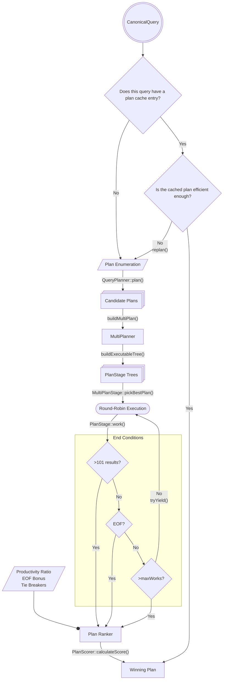

# Classic Runtime Planning

## Overview

The goal of the classic engine's runtime planner is to take a vector of `QuerySolution`s (returned from [plan enumeration](../../../query/plan_enumerator/README.md)) as input and determine which query plan will most efficiently return the correct result set.

The classic engine makes this determination using a process called **multiplanning**. This involves _partially_ executing all query plans and evaluating, based on [limited execution](#end-conditions), which is most productive.

By the nature of this strategy, we do not have a complete guarantee that the selected plan will be the most optimal. It is possible that by the nature of the data, a suboptimal plan appears optimal during the multiplanning trial period. Therefore, our goal is to pick a generally efficient plan, which is not necessarily the _most_ efficient plan.

The Query Optimization team is currently developing a cost-based plan ranker as an alternative to multiplanning. This initiative is documented [here](TODO: SERVER-100250).

> ### Aside: Classic Runtime Planner for SBE
>
> This document outlines the multiplanning process that uses "classic" query plans. MongoDB also supports a Slot-Based Execution (SBE) engine that converts the result of classic multiplanning into SBE plans. For more details on this process, refer to the [Classic Runtime Planner for SBE README](https://github.com/mongodb/mongo/blob/95d1830ce1acffd0108932d04538ed9dc995ade5/src/mongo/db/query/classic_runtime_planner_for_sbe/README.md).

## [`CachedPlanner`](https://github.com/mongodb/mongo/blob/12390d154c1d06b6082a03d2410ff2b3578a323e/src/mongo/db/query/classic_runtime_planner/planner_interface.h#L164)

If a query has been executed previously, its winning query plan might already be stored in the [plan cache](../../../query/plan_cache/README.md). If so, we can entirely bypass multiplanning by retrieving the winning query plan from the corresponding `PlanCacheEntry` via a `CachedPlanner`.

Note that if execution of a cached plan fails because the cached plan is less efficient that expected, we [`replan()`](https://github.com/mongodb/mongo/blob/0088f90ce188b8bc32575e7e4b75149ceab5da0e/src/mongo/db/exec/cached_plan.cpp#L213) by falling back to standard multiplanning. For more information on replanning, see [here](../../../query/plan_cache/README.md#aside-replanning)

## [`MultiPlanner`](https://github.com/mongodb/mongo/blob/12390d154c1d06b6082a03d2410ff2b3578a323e/src/mongo/db/query/classic_runtime_planner/planner_interface.h#L182)

If we have [more than one](#singlesolutionpassthroughplanner) `QuerySolution`, multiplanning begins in [`buildMultiPlan()`](https://github.com/mongodb/mongo/blob/12390d154c1d06b6082a03d2410ff2b3578a323e/src/mongo/db/query/get_executor.cpp#L586). This function initializes a `MultiPlanner` that manages the multiplanning process. For each `QuerySolution`, [`buildExecutableTree()`](https://github.com/mongodb/mongo/blob/12390d154c1d06b6082a03d2410ff2b3578a323e/src/mongo/db/query/classic_runtime_planner/multi_planner.cpp#L46) is called which constructs a tree of `PlanStage`s, where each stage corresponds to the tree in the `QuerySolution`. The `MultiPlanner` initiates planning within [`MultiPlanStage::pickBestPlan()`](https://github.com/mongodb/mongo/blob/6b012bcbe4610ef1e88f9f75d171faa017503713/src/mongo/db/exec/multi_plan.cpp#L246-L253).

During multiplanning, each `QuerySolution` is evaluated by running each candidate for a trial period in a round-robin fashion. This round-robin execution successively calls `PlanStage::work()` on each query, performing one unit of work for each.

> ### Aside: Works
>
> Each `PlanStage` defines its own [`doWork()`](https://github.com/mongodb/mongo/blob/12390d154c1d06b6082a03d2410ff2b3578a323e/src/mongo/db/exec/plan_stage.h#L383) method, which is called from [`PlanStage::work()`](https://github.com/mongodb/mongo/blob/12390d154c1d06b6082a03d2410ff2b3578a323e/src/mongo/db/exec/plan_stage.h#L207). The content of this function represents one unit of work for each stage. For example:
>
> - [`IndexScan::doWork()`](https://github.com/mongodb/mongo/blob/12390d154c1d06b6082a03d2410ff2b3578a323e/src/mongo/db/exec/index_scan.cpp#L147) retrieves the next `IndexKeyEntry` from the index, if one exists.
> - [`FetchStage::doWork()`](https://github.com/mongodb/mongo/blob/12390d154c1d06b6082a03d2410ff2b3578a323e/src/mongo/db/exec/fetch.cpp#L76) consumes one element of the input stream and returns the result. This means the `FetchStage` may need more than one work call to fetch an entire document.
>
> Some stages, like `GROUP` and `SORT`, require many successive calls to `work()` before generating a result.
> For more information on `work()` refer to `plan_stage.h`'s [header comment](https://github.com/mongodb/mongo/blob/12390d154c1d06b6082a03d2410ff2b3578a323e/src/mongo/db/exec/plan_stage.h#L61-L122).

`PlanStage::work()` returns a [`StageState`](https://github.com/mongodb/mongo/blob/4f39d22a701b931862b1f1d9ba97011bcacb9f98/src/mongo/db/exec/plan_stage.h#L151), which indicates that after this incremental unit of work, query execution is in one of these states:

1. `ADVANCED`: A query result was returned.
1. `IS_EOF`: Query execution is complete.
1. `NEED_TIME`: More works are needed to produce a query result.
1. `NEED_YIELD`: Query execution needs to [yield](#aside-yielding) to the storage engine.

> ### Aside: Rate Limiter
>
> The multi plan [rate limiter](https://github.com/mongodb/mongo/blob/349c84c0c1f79c717cbe66a580af68d3a218937c/src/mongo/db/exec/multi_plan_rate_limiter.h#L117-L180) manages access to a limited pool of concurrency, distributing it among plan cache keys. The rate limiter becomes active and enforces its limits only when the total number of concurrent candidate plans currently being trialed across all plan cache keys exceeds a predefined system-wide threshold (`internalQueryConcurrentMultiPlanningThreshold` query knob).

> When the rate limiter is active, for each plan cache key, the number of "tickets" it receives is dynamically calculated. These tickets represent its share of the total allowed concurrency. The formula is:

> $$ Number \ of \ Tickets = max( \frac{internalQueryMaxConcurrentMultiPlanJobsPerCacheKey}{Number \ of \ Candidate \ Plans \ for \ the \ Plan \ Cache \ Key}, 1) $$

> where `internalQueryMaxConcurrentMultiPlanJobsPerCacheKey` is a query knob.

> When a thread attempts to start multiplanning in `MultiPlanStage`, it asks for a ticket from its ticket holder. If it gets the ticket, the thread continues with multiplanning as usual, otherwise it leaves the multiplanning with the custom error code `RetryMultiPlanning`. The borrowed ticket is returned back to the ticket holder when the ticket is destroyed and notifies one thread that there is a ticket available.

> We avoid waking up all waiting threads when the plan cache entry is not yet active, as this would lead to replanning and potential blocking by the rate limiter. The assumption is that all multiplanning operations sharing the same plan cache key will have an identical number of candidate plans, ensuring that once a thread resumes, it will have sufficient tickets to proceed with multi-planning.

> In case of earlier return with `RetryMultiPlanning` error code this is handled in get_executor, in which case the query is sent to be replanned. Hopefully, a plan will already be in the cache by then, otherwise the thread will continue with multiplanning once a ticket is obtained. We don’t try to do replanning the second time to a loop of constant replanning if for some reasons a stable plan cache entry cannot be established.

> When an entry is added for a plan cache key all threads awaiting for this key are notified.

> If no tickets are available in the ticket holder the thread, after releasing all locks (yield), is blocked and waits for the tickets availability, once a ticket is available it resumes.If no tickets are available in the ticket holder, the thread releases all locks (yields), blocks, and waits for ticket availability. Once a ticket is available, it resumes.

> #### Cleaning ticket holder

> The number of unique query shapes could be quite large (according to this document Query Shape Cardinality Analysis it could be larger than 1mln query shapes) and we need to have a strategy to clean up the ticker holder table. We release a ticket holder every time when its plan cache entry is added or there are no active threads using this ticket holder.
> A ticket holder is released whenever its corresponding plan cache entry is added, or when no active threads are utilizing it.

> ### Aside: Yielding
>
> "Yielding" refers to releasing locks on storage resources during execution to prevent long-running queries from blocking other queries. By default, queries are intended to yield every 10ms.
>
> During multiplanning, [`tryYield()`](https://github.com/mongodb/mongo/blob/804e6f131091af60245b44ebada26cbdd2d34307/src/mongo/db/exec/multi_plan.cpp#L207) is called both between `work()` calls and when a `work()` returns `NEED_YIELD`, in order to ensure yielding is performed adequately. `tryYield()` takes a [`PlanYieldPolicy`](https://github.com/mongodb/mongo/blob/804e6f131091af60245b44ebada26cbdd2d34307/src/mongo/db/query/plan_yield_policy.h#L78), which is passed through `work()` to indicate to the executor whether to yield under the current configuration.

As the query plans execute, statistics are recorded on their performance. These statistics will eventually be used to [determine a winner](#plan-ranking).

### End Conditions

Multiplanning continues until at least one candidate plan does one of the following:

1. Returns one full default `batchsize` of results.
   - Currently, a default `batchsize` of results is 101 documents.
     - This value can be modified using the [`internalQueryPlanEvaluationMaxResults`](https://github.com/mongodb/mongo/blob/e60552830a722dc52422f39bf6be407933934392/src/mongo/db/query/query_knobs.idl#L156-L165) query knob.
1. Hits "EOF", meaning the `QuerySolution` has finished execution during the trial period and returned all its results.
1. Makes the maximum number of [`work()`](#aside-works) calls.
   - Currently, the maximum number of `work()` calls is [calculated](https://github.com/mongodb/mongo/blob/e60552830a722dc52422f39bf6be407933934392/src/mongo/db/exec/trial_period_utils.cpp#L44-L55) as `max(10K, 0.3 * collection_size)`.
     - These values can be modified using the [`internalQueryPlanEvaluationWorks`](https://github.com/mongodb/mongo/blob/e60552830a722dc52422f39bf6be407933934392/src/mongo/db/query/query_knobs.idl#L101-L112) and [`internalQueryPlanEvaluationCollFraction`](https://github.com/mongodb/mongo/blob/e60552830a722dc52422f39bf6be407933934392/src/mongo/db/query/query_knobs.idl#L129-L139) query knobs.

Consider this setup, where `a` and `b` are random integers evenly distributed between 0 and 100:

```
db.c.createIndex({a: 1});
db.c.createIndex({b: 1});
db.c.find({a: {$lt: 5}, b: {$lt: 50}})
```

In this case, we have two candidate `QuerySolution`s:

1. `IXSCAN[a < 5] --> FETCH[b < 50]`
   - Use index `{a: 1}` to find all documents where `a < 5` and fetch `b` and `_id`, where `b < 50`.
2. `IXSCAN[b < 50] --> FETCH[a < 5]`
   - Use index `{b: 1}` to find all documents where `b < 50` and fetch `a` and `_id`, where `a < 5`.

Because the predicate on `a` is significantly more selective than the predicate on `b`, it is likely that plan (1) will return all results during the trial period. In doing so, we hit the "EOF" end condition of multiplanning and plan (1) becomes the winning plan.

## Plan Ranking

After the trial period is complete, [`plan_ranker::pickBestPlan()`](https://github.com/mongodb/mongo/blob/12390d154c1d06b6082a03d2410ff2b3578a323e/src/mongo/db/query/plan_ranker_util.h#L210) assigns each `QuerySolution` a score based on its performance during the trial period. The [formula for the scores](https://github.com/mongodb/mongo/blob/23fcb16382bb8962d5648adfa7a7a2a828c555ec/src/mongo/db/query/plan_ranker.h#L160) is as follows:

```
score = 1
        + (advanced / works) // Productivity Ratio
        + eofBonus
        + tieBreakers
```

When all the scores are tabulated, the plan with the highest score is deemed as the winning plan and is executed in full.

### Productivity Ratio

The productivity ratio is defined as `advanced / works`. This value represents the efficiency of the query plan, or "results per unit of effort".

- `advanced`: The number of query results produced by the plan
- `works`: Units of effort performed by the plan

Consider an indexed sort versus a blocking sort. An indexed sort will have a higher productivity than a blocking sort, because the blocking sort will need to sort the entire collection, continuously calling `work()` and returning `NEED_TIME` until the collection is sorted and `ADVANCED` can be returned.

> ### Aside: Blocking Sort
>
> If an index cannot be used to obtain the sort order for a query, a "blocking sort" must be used. This operation implies that the executor must process all input documents to the sort before returning any results.

### EOF Bonus

During multiplanning, it is possible for a `QuerySolution` to produce its entire correct result if the result set's size is less than one `batchsize` and it hasn't exceeded the maximum number of `works`. In this case, the multiplanner returns `isEOF` for this `QuerySolution` and the completed plan is awarded an EOF bonus of 1.

Because the productivity ratio and tie-breakers will never surpass the EOF Bonus, it is guaranteed that a plan that finishes executing during multiplanning will be the winning plan, if one exists.

### Tie-Breakers

In the event of a tie between plans, there are a few metrics regarding the shape of the candidate `QuerySolution`s that can be used to determine which is marginally better.

[Some such metrics](https://github.com/mongodb/mongo/blob/95d1830ce1acffd0108932d04538ed9dc995ade5/src/mongo/db/query/plan_ranker.h#L120-L158) include:

- `noFetchBonus`: Bonus for covered plans (i.e. plans that do not have a `FETCH` stage)
- `noSortBonus`: Bonus for plans that do not have a [blocking `SORT`](#aside-blocking-sort) stage.
- `noIxisectBonus`: Bonus for plans that do not have an `AND_HASH` or `AND_SORTED` index intersection stage.
- `groupByDistinctBonus`: Bonus for using a `DISTINCT_SCAN` in an aggregation context, where the bonus is [proportional](https://github.com/mongodb/mongo/blob/340adb94bc0d348f42f7b427a06418dfd27f4bfc/src/mongo/db/query/plan_ranker.h#L156) to the productivity of the `DISTINCT_SCAN`.

Standard bonus is a value of [`epsilon`](https://github.com/mongodb/mongo/blob/340adb94bc0d348f42f7b427a06418dfd27f4bfc/src/mongo/db/query/plan_ranker.h#L115), unless noted otherwise.

Each `QuerySolution` that meets any of these specifications is awarded an additional point value to break the tie.

## The Runtime Planning Process



## Alternative Planners

Although `MultiPlanner` is our "standard" case, not all queries utilize a `MultiPlanner`. Under certain conditions, we may use a different planner that is a subclass of the abstract class [`ClassicPlannerInterface`](https://github.com/mongodb/mongo/blob/12390d154c1d06b6082a03d2410ff2b3578a323e/src/mongo/db/query/classic_runtime_planner/planner_interface.h#L59); [`CachedPlanner`](#plan-cache-consultation) is one such example. Each subclass of `ClassicPlannerInterface` overrides [`doPlan()`](https://github.com/mongodb/mongo/blob/6b012bcbe4610ef1e88f9f75d171faa017503713/src/mongo/db/query/classic_runtime_planner/planner_interface.h#L117). `MultiPlanner`'s override, for example, calls [`MultiPlanStage::pickBestPlan()`](https://github.com/mongodb/mongo/blob/6b012bcbe4610ef1e88f9f75d171faa017503713/src/mongo/db/query/classic_runtime_planner/multi_planner.cpp#L55).

Each subclass is detailed below:

### [`SingleSolutionPassthroughPlanner`](https://github.com/mongodb/mongo/blob/12390d154c1d06b6082a03d2410ff2b3578a323e/src/mongo/db/query/classic_runtime_planner/planner_interface.h#L146)

If only one `QuerySolution` exists for a query, no decision needs to be made about which plan to use. In this case, we initialize a `SingleSolutionPassthroughPlanner`, which [does no planning](https://github.com/mongodb/mongo/blob/6b012bcbe4610ef1e88f9f75d171faa017503713/src/mongo/db/query/classic_runtime_planner/single_solution_passthrough_planner.cpp#L44) and creates a classic plan executor for its plan immediately.

### [`IdHackPlanner`](https://github.com/mongodb/mongo/blob/12390d154c1d06b6082a03d2410ff2b3578a323e/src/mongo/db/query/classic_runtime_planner/planner_interface.h#L132)

An `IDHACK` query is a special query of the form `{_id: {$eq: <value>}}`. If a query meets this specification, we can bypass query planning and construct a "find-by-\_id" plan. This is a ["fast path" optimization](https://github.com/mongodb/mongo/blob/2ceaa45d0b28d1a057c7538327958bdd3c7222db/src/mongo/db/query/get_executor.cpp#L1170) and therefore does not consult the [plan cache](#cachedplanner). It is a guarantee that we will only use the default `_id` index to execute the query.

### [`SubPlanner`](https://github.com/mongodb/mongo/blob/12390d154c1d06b6082a03d2410ff2b3578a323e/src/mongo/db/query/classic_runtime_planner/planner_interface.h#L199)

Rooted `$or` queries are eligible for subplanning.

> **Rooted `$or`**: A query that contains an `$or` operator at its top level.

In these cases, a [`SubplanStage`](https://github.com/mongodb/mongo/blob/12390d154c1d06b6082a03d2410ff2b3578a323e/src/mongo/db/exec/subplan.h#L82) calls [`buildSubPlan()`](https://github.com/mongodb/mongo/blob/12390d154c1d06b6082a03d2410ff2b3578a323e/src/mongo/db/query/get_executor.cpp#L720), which constructs a special `PlanStage` tree. Here, each branch undergoes multiplanning separately. After a winner has been determined from each branch, the branches are ranked against each other, until a winning plan prevails for the entire rooted `$or`.

For example:

```
db.c.find({$or: [{a: 1, x: 1}, {b: 1, y: 2}]})
```

In this query, the two branches: `{a: 1, x: 1}` and `{b: 1, y: 2}` would be multiplanned separately. Once a winning plan exists for each branch, the plan with the better score becomes the plan for the whole query.

Note that subplanning's interaction with the [plan cache](../../../query/plan_cache/README.md#subplanning) is done on a _per-clause basis_. For details on this interaction, see [here](https://github.com/mongodb/mongo/blob/21e7b8cfb79f3a7baae651055d5e1b3549dbdfda/src/mongo/db/exec/subplan.h#L70-L80).

If, for any reason, subplanning fails on one of the children individually, [`choosePlanWholeQuery()`](https://github.com/mongodb/mongo/blob/12390d154c1d06b6082a03d2410ff2b3578a323e/src/mongo/db/exec/subplan.cpp#L115) is called which falls back to multiplanning on the query as a whole.

---

[Return to Cover Page](../../../query/README_QO.md)
