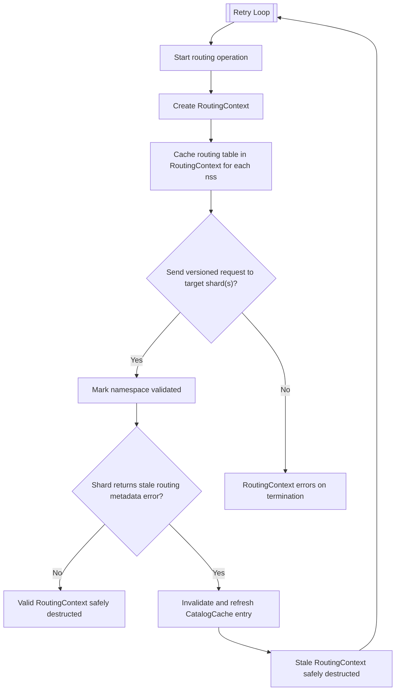

# Routing query operations with `RoutingContext`

This page provides an overview of the `RoutingContext` abstraction and API, its intended use case, and the constraints that it enforces on the caller to satisfy consistency guarantees.

## Overview

A **query routing operation** is a block where a router:

1. Retrieves a cached routing table for a `NamespaceString`,
1. Determines which shards to target based on the routing table,
1. Sends requests to the shards (e.g. to acquire cursors or perform writes) with the appropriate placement version attached.

During a single routing operation, it is crucial to consult only one version of the routing table. It is incorrect for the operation to look at different versions of the routing table across accesses. Rather than directly accessing the `CatalogCache` through the `Grid`, callers should use a `RoutingContext` utility function that handles the entire routing operation, including validation that all routing table accesses terminate by sending a request to an authoritative shard. The shard will ensure that the routing table used for targeting was not stale, accepting the request if the router's supplied placement version was up to date, or rejecting the request and sending a stale routing metadata error to the router.

## Invariants

The `RoutingContext` provides the following data consistency guarantees:

- All routing tables required by the routing operation are obtained during `RoutingContext` construction. These are immutable, and no new routing tables can be acquired later on in the routing operation.
- A routing operation can only access routing tables for the `nss`'s that were pre-declared at construction time.
- A `RoutingContext` can be safely terminated if one of the following are true:
  1.  All declared namespaces have had their routing tables validated by sending a versioned request to a shard.
  1.  The caller explicitly decides to [skip validation](https://github.com/mongodb/mongo/blob/e5c9c5f963e60334beed8162190364858130721b/src/mongo/s/routing_context.h#L110) if the routing tables are only acquired for performance optimization purposes, but are not involved in decisions affecting query correctness.
  1.  A stale routing metadata exception is thrown (e.g. if the collection generation has changed) and will be propagated up the stack.

Notably, it is considered a logic bug if the `RoutingContext` terminates at the router without dispatching a command to a shard unless explicitly allowed to. In test environments, the server will `tassert` if a namespace was acquired by the `RoutingContext` but never validated. In prod environments, an error message will be logged instead.

## API

Comprehensive information about the `RoutingContext` API can be found [here](https://github.com/mongodb/mongo/blob/e5c9c5f963e60334beed8162190364858130721b/src/mongo/s/routing_context.h#L48-L56). Callers wishing to perform a routing operation should use one of the `RoutingContext` utility functions instead of constructing a `RoutingContext` directly. These functions may be `void` or can return a value:

```
template <class Fn>
auto withValidatedRoutingContext(OperationContext* opCtx,
                                 const std::vector<NamespaceString>& nssList,
                                 Fn&& fn);

// Sample usage
withValidatedRoutingContext(opCtx, {"test.foo"}, [&](RoutingContext& routingContext) {
    cri = routingCtx.getCollectionRoutingInfo("test.foo");
    shards = getShardsToTargetForQuery(cri, query)
    dispatchVersionedRequestToShards(routingCtx, shards, req);
});
```

- Use this to handle the entire routing operation, from `RoutingContext` construction prior to running the callback function to validation at the end. This is the preferred usage for non-idempotent operations. A similar helper, `withValidatedRoutingContextForTxnCmd`, does the same but checks whether locks are allowed if we're running in a transaction. [Example](https://github.com/mongodb/mongo/blob/e5c9c5f963e60334beed8162190364858130721b/src/mongo/db/pipeline/sharded_agg_helpers.cpp#L664-L695)

```
template <class Fn>
auto runAndValidate(RoutingContext& routingCtx, Fn&& fn);

// Sample usage
auto targeter = CollectionRoutingInfoTargeter(opCtx, "test.foo");

runAndValidate(targeter.getRoutingCtx(), [&](RoutingContext& routingCtx) {
    cri = routingCtx.getCollectionRoutingInfo("test.foo");
    shards = getShardsToTargetForQuery(cri, query)
    dispatchVersionedRequestToShards(routingCtx, shards, req);
});
```

- Use this when you'd like to validate an existing `RoutingContext` (e.g. a `RoutingContext` instantiated through the `CollectionRoutingInfoTargeter`). This invokes a function callback on the passed in `RoutingContext` and calls `validateOnEnd()` if it successfully finishes to ensure that every declared namespace had its routing table validated by sending a versioned request to a shard. [Example](https://github.com/mongodb/mongo/blob/e5c9c5f963e60334beed8162190364858130721b/src/mongo/s/commands/query_cmd/cluster_distinct_cmd.cpp#L404-L525)

```
template <class F>
auto routeWithRoutingContext(OperationContext* opCtx, StringData comment, F&& callbackFn);

// Sample Usage
sharding::router::CollectionRouter router(serviceCtx, "test.foo");

router.routeWithRoutingContext(opCtx, "dispatch shard pipeline",
                               [&](OperationContext* opCtx, RoutingContext& routingCtx) {
    cri = routingCtx.getCollectionRoutingInfo("test.foo");
    shards = getShardsToTargetForQuery(cri, query)
    dispatchVersionedRequestToShards(routingCtx, shards, req);
});
```

- This handles constructing, executing, and retrying routing operations upon receiving stale routing metadata exceptions by advancing the placement version in the cache and retrying with a new `RoutingContext` with the latest routing tables. Internally, the `CollectionRouter::routeWithRoutingContext()` implicitly invokes `withValidatedRoutingContext`. This is the preferred option for dispatching read and idempotent operations (for more details on the `CollectionRouter`, refer to the architecture guide [here](README_router_role_api.md)). [Example](https://github.com/mongodb/mongo/blob/e5c9c5f963e60334beed8162190364858130721b/src/mongo/db/pipeline/sharded_agg_helpers.cpp#L1754-L1800).

## High-Level Diagram


