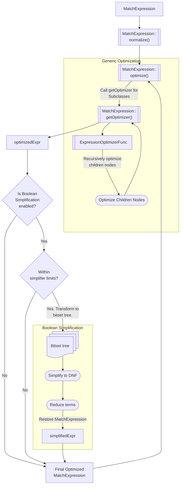

# Heuristic Rewrites

## Overview

A query is first parsed into a [logical model](../query/README_logical_models.md), representing the query's semantics in a structured format. This logical model is then normalized, transformed, and optimized, making it more amenable to efficient execution. These rewrites are based on predefined rules, or heuristics. We call them **heuristic rewrites** because we don't know for sure whether the rewritten result will be better than the original - we just have a best guess. Once the logical model is optimized, the query planner [generates](../query/plan_enumerator/README.md) multiple candidate physical representations and [selects](../exec/runtime_planners/classic_runtime_planner/README.md) the most efficient plan for execution.

This README will cover rewrites on the `MatchExpression` component of a find query or `$match` stage. It does not cover subsequent stages such as query compilation (stage builders). To learn more about rewrites on aggregate pipelines, refer to the [Pipeline Rewrites README](../pipeline/README.md).

## MatchExpression Optimization

The entrypoint to [`MatchExpression`](../query/README_logical_models.md#matchexpression) optimization is the [`MatchExpression::optimize()`](https://github.com/mongodb/mongo/blob/28df8e56046e44f5977671e85fef7bcd38ffbea1/src/mongo/db/matcher/expression.cpp#L138) function, which is called by [`MatchExpression::normalize()`](https://github.com/mongodb/mongo/blob/28df8e56046e44f5977671e85fef7bcd38ffbea1/src/mongo/db/matcher/expression.h#L619). This is called on the root of the `MatchExpression` tree and makes simplifying changes to the tree's structure without altering its semantics, returning one of the following:

1. The original, unmodified `MatchExpression`,
1. The original `MatchExpression` that has been mutated,
1. A new `MatchExpression`.

`MatchExpression` optimization is done during query [canonicalization](../query/README_logical_models.md#canonicalquery), and involves the following processes:

1. [**Expression-specific Optimizations**](#expression-specific-optimizations): Individual `MatchExpression` nodes (e.g. `LeafMatchExpression` and `ArrayMatchExpression`) have specific logic for optimizations to perform on themselves.
1. [**Boolean Simplification**](#boolean-simplification): Simplifies the logical structure of `MatchExpression`s containing Boolean operators like `$and`, `$or`, `$nor`, and `$not`.

> ### Aside: Disabling Optimizations
>
> You may want to disable `MatchExpression` optimization for testing purposes, say if you added a new rewrite and want to verify that it's semantically correct. You can compare the results with optimizations on against results from an unoptimized form of the query by toggling the `disableMatchExpressionOptimization` failpoint.
>
> In a mongo shell, run the following command:
>
> ```
> db.adminCommand({configureFailPoint: "disableMatchExpressionOptimization", mode: "alwaysOn"})
> ```

### Expression-specific Optimizations

Subclasses of `MatchExpression` that represent different types define specific optimization behavior by overriding the [`MatchExpression::getOptimizer()`](https://github.com/mongodb/mongo/blob/28df8e56046e44f5977671e85fef7bcd38ffbea1/src/mongo/db/matcher/expression.h#L619) function, which takes in an input `MatchExpression` and passes the same `MatchExpression` to the resulting `ExpressionOptimizerFunc`. If the subclass holds children `MatchExpression` objects, it is responsible for returning an `ExpressionOptimizerFunc` that recursively calls `MatchExpression::optimize()` on those children.

Generally, we optimize the logical representation through a bottom-up approach. This is more efficient: by handling subtrees first and potentially eliminating redundant child nodes, unnecessary work is avoided at the parent level. However, this isn't always enforced. It is permissible for an implementation to optimize itself first (e.g. pruning child expressions) before optimizing the children themselves.

**Example 1: `ListOfMatchExpression`**

Let's examine how a [`ListOfMatchExpression`](https://github.com/mongodb/mongo/blob/28df8e56046e44f5977671e85fef7bcd38ffbea1/src/mongo/db/matcher/expression_tree.h#L56), such as `$and` and `$or`, is rewritten. Consider the following query:

```
{
    // Root
    $and: [
        // Child 0
        {
            $or: [
                { "age": { $eq: 50 } },
                { "age": { $eq: 30 } }
            ]
        },
        // Child 1
        {
            $and: [
                { $alwaysTrue: 1 },
                {
                    $and: [
                        {"status": { $eq: "active" }},
                        {"name": { $eq: "John" }}
                    ]
                }
            ]
        }
    ]
}
```

The top-level `AndMatchExpression` has two children - an `OrMatchExpression` (Child 0) and an `AndMatchExpression` (Child 1).

For Child 0, the following rewrites are performed:

1. Since Child 0 is an OR with EQ conditions on the same path, it can be rewritten into an `InMatchExpression`.
2. Since the rewritten AND now only has one operand, we will simplify the expression to just the operand.

```
// Child 0 after rewrites
{ "age": { $in: [ 50, 30 ] } }
```

Child 1 is an `AndMatchExpression` with a trivially true predicate and a nested `AndMatchExpression`. The following rewrites are performed:

1. The associativity of AND means that AND absorbs the children of any ANDs among its children, so the nested predicate is lifted to the top-level.
1. All trivially true children are removed from the AND.

```
// Child 1 after rewrites
{
    $and: [
        { "status": { $eq: "active" } },
        { "name": { $eq: "John" } }
    ]
}
```

At the root, the AND in Child 1 can now be absorbed into the top-most AND. The final, rewritten query is now simplified and ready for further query planning:

```
{
    $and: [
        { "age": { $in: [ 50, 30 ] } }
        { "status": { $eq: "active" } },
        { "name": { $eq: "John" } }
    ]
}
```

**Example 2: `InMatchExpression`**

For an [`InMatchExpression`](https://github.com/mongodb/mongo/blob/28df8e56046e44f5977671e85fef7bcd38ffbea1/src/mongo/db/matcher/expression_leaf.h#L764), we perform the following optimizations:

1. An IN with exactly one regex becomes a `RegexMatchExpression`.
2. An IN of exactly one equality becomes an `EqualityMatchExpression`.
3. An empty IN becomes `$alwaysFalse`.

```
// 1
{ "field": { $in: [/^abc/] } } --> { "field": { $regex: "^abc" } }

// 2
{ "field": { $in: ["xyz"] } } --> { "field": "xyz" }

// 3
{ "field": { "$in": [] } } --> { $alwaysFalse: 1 }
```

**Example 3: `ExprMatchExpression`**

There are also instances where we perform rewrites to make an expression that otherwise can't take advantage of indexes indexable. For instance, `$expr` expressions are not themselves indexable, but may contain children expressions that could use indexes to produce a superset of the expected result, minimizing the number of documents that need to be filtered. We attempt to rewrite them as a conjunction of internal `MatchExpression`s so that the query planner can potentially generate an index scan.

We will rewrite the following `$expr`:

```
{
    $expr: {
        $and: [
            { $eq: ['$x', 1] },
            { $eq: ['$y', '$z'] }
        ]
    }
}
```

into

```
{
    $and: [
        { x: { $_internalExprEq: 1 } }
        {
            $expr: {
                $and: [
                    { $eq: ['$x', 1] },
                    { $eq: ['$y', '$z'] }
                ]
            }
        }
    ]
}
```

Notice that `{ $eq: ['$x', 1] }` is representable as a `MatchExpression`, whereas `{ $eq: ['$y', '$z'] }` compares multiple field path references, requiring their values from each input document. `MatchExpression`s don't allow for more than one local document field path, so this part cannot be extracted.

Unlike regular comparison operators, `$_internalExpr` operators have non-type bracketed semantics to match non-type bracketed comparison operators inside `$expr`. It will match either an identical set or superset of the documents matched by `$expr` due to semantic differences between the rewritten `MatchExpression` and the [`ExprMatchExpression`](https://github.com/mongodb/mongo/blob/28df8e56046e44f5977671e85fef7bcd38ffbea1/src/mongo/db/matcher/expression_expr.h#L67).

> ### Aside: Type Bracketing
>
> **Type bracketing** ensures that comparisons are performed between values of the same type, avoiding unexpected results. Given the query `{field: {$gt: 5}}`, type bracketing would ensure only numeric types are considered for comparison. For instance, documents with `{field: 10}` and `{field: 100.01}` would match. This is the default behavior for `MatchExpression`s.
>
> On the other hand, without type bracketing, we would consider all types in the comparison. For instance, strings are higher in the [`BSON` sort order](https://www.mongodb.com/docs/manual/reference/bson-type-comparison-order/) than numerics, so the document `{field: "string"}` would also match the query above. This is the default comparison mode for `$expr`.

For example, `$_internalExprEq` in `MatchExpression` reaches into arrays, whereas `$eq` in `ExprMatchExpression` does not. Thus, the original `$expr` is still included as a second level of filtering to ensure that the returned results match expected `$expr` semantics. For the full description of `InternalExprMatchExpression` semantics, refer to [`expression_internal_expr_comparison.h`](https://github.com/mongodb/mongo/blob/28df8e56046e44f5977671e85fef7bcd38ffbea1/src/mongo/db/matcher/expression_internal_expr_comparison.h#L71).

> ### Aside: Array Traversal Semantics
>
> **Array traversal** semantics define how arrays are traversed when walking through the `MatchExpression` tree. Different types of `MatchExpression`s can provide their array traversal requirements for leaf arrays (e.g. how we handle the path `a.b` when `b` is an array) and non-leaf arrays (e.g. how we handle the path `a.b` when `a` is an array).
>
> Generally, traversing arrays means that the elements of the array are considered along with the entire array object. When walking through the path `f` in the document `{f: [1, 2]}`, the path iterator would return 1, 2, and [1, 2].
>
> If the behavior is no array traversal, then only the entire array object (`[1, 2]`) will be returned. There is also a mode where only the array elements are returned, while the array itself is omitted. For the full definition of array traversal modes, refer to [`LeafArrayBehavior`](https://github.com/mongodb/mongo/blob/28df8e56046e44f5977671e85fef7bcd38ffbea1/src/mongo/db/matcher/path.h#L53) and [`NonLeafArrayBehavior`](https://github.com/mongodb/mongo/blob/28df8e56046e44f5977671e85fef7bcd38ffbea1/src/mongo/db/matcher/path.h#L77).
>
> For `MatchExpression`s, the default mode is to traverse arrays, while for `$expr`, the default mode is not to traverse arrays. For instance, `{$expr: {$eq: ["$f", [1, 2]]}}` will only match documents where the value at `f` is the entire array `[1, 2]`.

## Boolean Simplification

After calling `MatchExpression::getOptimizer()`, it may be that we still have a complex Boolean expression that could be further simplified. If the resulting `MatchExpression` falls within the limits set by the knobs in `ExpressionSimplifierSettings`, then it will undergo further simplifications in the Boolean expression simplifier with the goal of reducing computational overhead and enabling better plan generation.

> ### Aside: ExpressionSimplifierSettings
>
> There are some cases when we may want to skip Boolean simplification, such as when the query is deemed to complex to simplify effectively. Additionally, even if simplification is attempted, we might discard the result because it is more complex than the original query. Some knobs that affect this decision are:
>
> - **maximumNumberOfUniquePredicates** - if the number of unique predicates in an expression exceeds this number, the expression is considered too big to be simplified.
> - **maximumNumberOfMinterms** - maximum number of minterms allowed during boolean transformations.
> - **maxSizeFactor** - if the simplified expression is larger than the original expression's size \* `maxSizeFactor`, the simplified one will be rejected.
>
> For the full list of settings, refer to [expression_simplifier.h](https://github.com/mongodb/mongo/blob/28df8e56046e44f5977671e85fef7bcd38ffbea1/src/mongo/db/matcher/expression_simplifier.h#L38).

The entrypoint into Boolean simplification is the [`simplifyMatchExpression()`](https://github.com/mongodb/mongo/blob/28df8e56046e44f5977671e85fef7bcd38ffbea1/src/mongo/db/matcher/expression_simplifier.cpp#L229) function. Broadly, it is implemented in the following steps:

1. **Convert the `MatchExpression` to a bitset tree.**

> ### Aside: Bitset
>
> A **bitset** is a compact representation of a set, where each element is represented by a bit in a sequence of binary digits. It indicates whether an element is present (1) or absent (0) in a set. For instance,
>
> - 0001 represents a set containing the first element.
> - 1010 represents a set containing the second and fourth elements.
>
> Bitset operations tend to be faster and more straightforward than working with a complex AST structure.

- The query filter is transformed into a bitset tree where predicates are in leaf nodes stored as bitsets, while internal nodes represent the tree structure. An internal node may be a conjunction (AND) or disjunction (OR) of its children.
- MQL logical operators are represented like `BitsetTreeNode{ type: <conjunction or disjunction>, isNegated: <are children negated> }`. For specific representations of each [logical operator](https://www.mongodb.com/docs/manual/reference/operator/query-logical/), refer to [bitset_tree.h](https://github.com/mongodb/mongo/blob/28df8e56046e44f5977671e85fef7bcd38ffbea1/src/mongo/db/query/boolean_simplification/bitset_tree.h#L50).

2. **Simplify the bitset tree to DNF.**

> ### Aside: DNF (Disjunctive Normal Form)
>
> DNF (Disjunctive Normal Form) is a canonical normal form of a logical expression consisting of a disjunction of conjunctions, or an OR of ANDs.
>
> For instance, a query of the form A ∧ (B ∨ C) can be transfored into DNF by distributing A => (A ∧ B) ∨ (A ∧ C).
>
> The expression in DNF can also be thought of as a maxterm of minterms, where the **maxterm** is the top disjunction of an expression in DNF and the **minterm** is a conjunction of the expression.

- Once the bitset tree is in DNF, it can be further reduced to a minimal set of minterms, or sum of products.

3. **Apply the [Quine McCluskey](https://github.com/mongodb/mongo/blob/28df8e56046e44f5977671e85fef7bcd38ffbea1/src/mongo/db/query/boolean_simplification/quine_mccluskey.h) reduction operation of DNF terms**: (x ∧ y) ∨ (x ∧ ~y) = x
4. **Apply [Absorption's Law](https://github.com/mongodb/mongo/blob/28df8e56046e44f5977671e85fef7bcd38ffbea1/src/mongo/db/query/boolean_simplification/bitset_algebra.h#L117)**: x ∨ (x ∧ y) = x
5. **Use [Petrick's method](https://github.com/mongodb/mongo/blob/28df8e56046e44f5977671e85fef7bcd38ffbea1/src/mongo/db/query/boolean_simplification/petrick.h) for further simplification**: This is used to find the minimal "coverage", or the smallest set of minterms such that the predicates evaluate to true.
   - For example, given the input list of minterms `[[0, 1, 2], [2, 3], [0, 3]]`, we can derive two minimal coverages: `[0, 1]` and `[0, 2]`. The result is a vector of indices to the required minterms. We can "cover" the predicates 0, 1, 2, and 3 with either pairs of the original list of minterms.
6. **Restore the original MatchExpression**: Finally, we [restore](https://github.com/mongodb/mongo/blob/28df8e56046e44f5977671e85fef7bcd38ffbea1/src/mongo/db/matcher/expression_simplifier.cpp#L259) the `MatchExpression` tree from the bitset tree and a list of expressions representing bits in the bitset tree.

**Example**:

Input query after calling `MatchExpression::getOptimizer()`:

```
{
    $or: [
        {
            $and: [
                { "field0": "A" },
                { "field1": "B" }
            ]
        },
        {
            $and: [
                { "field0": "A" },
                { "field1": "B" },
                { "field3": "D" }
            ]
        },
        {
            $and: [
                { "field0": "A" },
                { "field2": "C" }
            ]
        },
        {
            $and: [
                { "field1": "B" },
                { "field2": "C" }
            ]
        }
    ]
}
```

First, we convert the equivalent `MatchExpression` to a bitset tree. Let's say this is the bit mapping:

- `field0 = A`: Bit 0
- `field1 = B`: Bit 1
- `field2 = C`: Bit 2
- `field3 = D`: Bit 4

```
BitsetTreeNode{
    type: OR,
    children: [
        BitsetTreeNode{
            type: AND,
            bitset: 0011 // Bit 0 (field0 = A) AND Bit 1 (field1 = B)
        },
        BitsetTreeNode{
            type: AND,
            bitset: 1011 // Bit 0 (field0 = A) AND Bit 1 (field1 = B) AND Bit 3 (field3 = D)
        },
        BitsetTreeNode{
            type: AND,
            bitset: 0101 // Bit 0 (field0 = A) AND Bit 2 (field2 = C)
        },
        BitsetTreeNode{
            type: AND,
            bitset: 0110 // Bit 1 (field1 = B) AND Bit 2 (field2 = C)
        }
    ]
}
```

Next, we simplify this bitset tree into DNF. This tree is already in DNF, so no further work simplifications are done here:

```
(0 AND 1) OR (0 AND 2 AND 3) OR (0 AND 2) OR (1 AND 2)
```

We then apply Absorption's Law. `(0 AND 2)` absorbs `(0 AND 2 AND 3)` because the latter is a subset of the former. The simplified query becomes:

```
(0 AND 1) OR (0 AND 2) OR (1 AND 2)
```

The last optimization we can make is to find the minimal coverage of minterms. The predicates mapped to the bits 0, 1, and 2 can still evaluate to true with either `[0, 1]` or `[1, 2]`. If we choose the former, we get:

```
(0 AND 1) OR (0 AND 2)
```

Finally, at the end of Boolean simplification, we restore the original `MatchExpression`, which rougly maps to the following MQL query:

```
{
    $or: [
        {
            $and: [
                { "field1": "A" },
                { "field2": "B" }
            ]
        },
        {
            $and: [
                { "field1": "A" },
                { "field3": "C" }
            ]
        }
    ]
}

```

For more information on the design of the Boolean simplifier, refer to the blog post: [Improving MongoDB Queries by Simplifying Boolean Expressions](https://www.mongodb.com/blog/post/improving-mongodb-queries-by-simplifying-boolean-expressions). Libraries can be found in the [`boolean_simplification`](https://github.com/mongodb/mongo/tree/28df8e56046e44f5977671e85fef7bcd38ffbea1/src/mongo/db/query/boolean_simplification) directory.



---

[Return to Cover Page](../query/README_QO.md)
