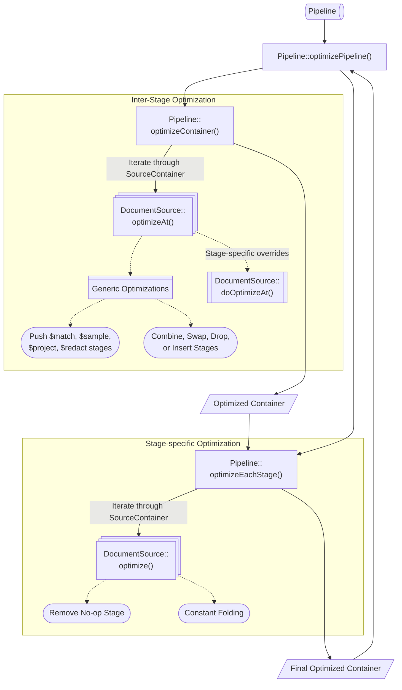

# Pipeline Rewrites

## Overview

After an aggregate command issued by a user is parsed into a `Pipeline`, it undergoes **heuristic rewrites** to transform the whole pipeline as well as individual stages within the pipeline into a more efficient form. The entrypoint to pipeline optimization is the [`Pipeline::optimizePipeline()`](https://github.com/mongodb/mongo/blob/65b9efd4861b9f0d61f8b29843d29febcba91bcb/src/mongo/db/pipeline/pipeline.cpp#L359) function, which is comprised of two primary steps:

1. [**Inter-stage Optimization**](#inter-stage-optimization): optimizes the entire `Pipeline` object, which is represented internally as a container of `DocumentSource`s. This modifies the container by combining, swapping, dropping, and/or inserting stages.
1. [**Stage-specific Optimization**](#stage-specific-optimization): optimizes each stage, or `DocumentSource` individually.

> ### Aside: Disabling Optimizations
>
> You may want to disable `Pipeline` optimization for testing purposes, say if you added a new rewrite and want to verify that it's semantically correct. You can compare the results with optimizations on against results from an unoptimized form of the query by toggling the `disablePipelineOptimization` failpoint, which prevents individual `DocumentSource`s from being optimized.
>
> In a mongo shell, run the following command:
>
> ```
> db.adminCommand({configureFailPoint: "disablePipelineOptimization", mode: "alwaysOn"})
> ```
>
> You should also add the `{$_internalInhibitOptimation: {}}` stage before each stage in the pipeline to ensure that stages don't participate in whole `Pipeline` optimization (i.e. stage pushdown or swapping).

## Inter-stage Optimization

First, we attempt to optimize the overall `Pipeline` by modifying stages in relation with each other. The entrypoint is [`Pipeline::optimizeContainer()`](https://github.com/mongodb/mongo/blob/65b9efd4861b9f0d61f8b29843d29febcba91bcb/src/mongo/db/pipeline/pipeline.cpp#L368), which subsequently iterates through the underlying `SourceContainer` and calls [`DocumentSource::optimizeAt()`](https://github.com/mongodb/mongo/blob/65b9efd4861b9f0d61f8b29843d29febcba91bcb/src/mongo/db/pipeline/document_source.cpp#L315) for each stage. This attempts to perform some generic optimizations such as pushing `$match`, `$sample`, `$project`, and `$redact` stages as early in the pipeline as possible.

Each stage can optionally override the [`DocumentSource::doOptimizeAt()`](https://github.com/mongodb/mongo/blob/65b9efd4861b9f0d61f8b29843d29febcba91bcb/src/mongo/db/pipeline/document_source.h#L493) function to implement stage-specific optimizations. This function takes in an iterator that points to the stage's location within the pipeline, as well as a container that refers to the entire pipeline. It returns an iterator over the same container pointing to the first location in the container where an optimization may be possible, or the end of the container. This allows us to perform optimizations that are made possible by earlier optimizations. For example, if a stage swap takes place, the returned iterator will point to the stage directly preceding the stage, since the stage at that position may be able to perform further optimizations with its new neighbor. This iterative approach ensures that we perform optimizations until we've exhausted all the possibile changes, i.e., when we've reached the end of the container.

These are the general classes of optimizations we attempt to make:

1. **Swapping stages**:
   `$match` pushdown is a prime example. Generally, we want to filter documents before passing them into a more computationally-heavy stage to minimize the amount of work that needs to be done. If the user writes a pipeline that specifies a `$match` after a stage like a `$sort`, we will push it down when possible in order to minimize the number of documents to sort. For example, if the user specified this pipeline:

```
{ $sort: { age : -1 } },
{ $match: { status: 'A' } }
```

the optimizer will rewrite it to:

```
{ $match: { status: 'A' } },
{ $sort: { age : -1 } }
```

2. **Coalescing stages**:
   When possible, the optimizer coalesces a pipeline stage into its predecessor. This tends to occur after any sequence reordering optimizations.

For example, when a `$sort` precedes a `$limit`, the optimizer can coalesce the `$limit` into the `$sort` if no intervening stages modify the number of documents (e.g. `$unwind` or `$group`). Given a pipeline with the follwing stages:

```
{ $sort : { age : -1 } },
{ $project : { age : 1, status : 1, name : 1 } },
{ $limit: 5 }
```

the optimizer will rewrite it to:

```
{
    "$sort" : {
       "sortKey" : {
          "age" : -1
       },
       "limit" : NumberLong(5)
    }
},
{ "$project" : {
         "age" : 1,
         "status" : 1,
         "name" : 1
  }
}
```

This allows the sort to only maintain the top N results as it progresses, where N is the specified limit, reducing the number of documents that need to be stored in memory.

Two consecutive stages that are the same can also be coalesced (it may also be helpful to consider one stage as dropped). For instance, if a `$limit` stage is immediately followed by another `$limit` stage, we can keep the `$limit` stage where the limit amount is the _smaller_ of the two initial limit amounts, and drop the other stage. Given the pipeline:

```
{ $limit: 100 },
{ $limit: 10 }
```

the optimizer will rewrite it to:

```
{ $limit: 10 }
```

3. **Inserting stages**:
   While this may seem counter-intuitive, it can be beneficial to insert stages into the pipeline in some instances to constrain the stream of documents that are passed to the next stage as well as leverage better index usage. For example, when a pipeline has a `$redact` stage immediately followed by a `$match` stage, it may be possible to add a portion of the `$match` stage before the `$redact` stage. Given the pipeline:

```
{ $redact: { $cond: { if: { $gte: [ "$sensitivity", 3 ] }, then: "$$PRUNE", else: "$$DESCEND" } } },
{ $match: { "status": "active", "sensitivity": { $lt: 5 } } }
```

the optimizer could interpret that the "status" field is independent of the `$redact` stage, while the "sensitivity" field is dependent. It can split the `$match` stage into an independent and dependent portion, pushing the former before the `$redact` stage and keeping the latter after it:

```
{ $match: { "status": "active" } },
{ $redact: { $cond: { if: { $gte: [ "$sensitivity", 3 ] }, then: "$$PRUNE", else: "$$DESCEND" } } },
{ $match:  "sensitivity": { $lt: 5 } }
```

Although the pipeline has more stages than it initially started with, it can be executed more optimally because it both (1) minimizes the documents going into the resource-intensive `$redact` stage, as well as (2) enables the pipeline to use an index on "status" for the first `$match` stage.

For an in-depth description of different pipeline optimizations, refer to the summary in our [docs](https://www.mongodb.com/docs/manual/core/aggregation-pipeline-optimization/#aggregation-pipeline-optimization).

### Dependency Tracking & Analysis

In order to determine whether a pipeline is valid, as well as whether stages can be pushed down before each other or if parts of a stage can be pruned, we use dependency tracking and analysis. This process identifies what fields or variables a stage depends on for execution. If a stage has dependencies on an earlier stage, it must remain sequentially after that stage throughout the rewrite process. On the other hand, if a stage is independent of a prior stage and it is performant to push it down, we know that it is safe to do so.

These are the major classes of dependencies:

- **Document field dependencies**: specific document fields required by a pipeline stage.
  - _Example_: `{$project: {name: 1}}` depends on the `name` field.
- **Computed fields**: fields generated by stages like `$addFields` or `$group`. These newly-added fields may be dependencies for subsequent stages.
  - _Example_: `{$addFields: {total: {$sum: ["price", "$tax"]}}}` computes `total`, which may be used as a dependency in later stages.
- **Renames**: mappings that change field names. Subsequent stages must account for these transformations to resolve the correct fields downstream.
  - _Example_: `{$project: {newField: "$oldField"}}` renames `oldField` to `newField`.
- **Variable references**: dependencies on scoped variables, such as user-defined variables or system variables (`$$CURRENT`, `$$ROOT`).
  - _Example_: In the following `$project` stage, `$$discount` is a variable reference defined and used within the `$let`:

```
{
   "$project": {
      "adjustedValue": {
         "$let": {
            "vars": { "discount": 0.1 },
            "in": { "$multiply": ["$price", { "$subtract": [1, "$$discount"] }] }
         }
      }
   }
}
```

- **Metadata**: additional information about a document that's not part of its core fields. This is often used in operations that rely on contextual information, such as text search scores, geographic proximity, or reserved fields.
  - _Example_: The stage `{$project: {score: {$meta: "textScore"}}}` has a dependency on the `textScore` metadata, which is not a document field.

For implementation details about dependency tracking and validation, refer to the [`expression_algo`](https://github.com/mongodb/mongo/blob/d4a04783e727db7d533785689a7c92437cd05fdf/src/mongo/db/matcher/expression_algo.h), [`semantic_analysis`](https://github.com/mongodb/mongo/blob/d4a04783e727db7d533785689a7c92437cd05fdf/src/mongo/db/pipeline/semantic_analysis.h), and [`dependencies`](https://github.com/mongodb/mongo/blob/d4a04783e727db7d533785689a7c92437cd05fdf/src/mongo/db/pipeline/dependencies.h) files.

## Stage-specific Optimization

Once we have the final order of the stages, we go through each stage and call [`DocumentSource::optimize()`](https://github.com/mongodb/mongo/blob/65b9efd4861b9f0d61f8b29843d29febcba91bcb/src/mongo/db/pipeline/document_source.h#L507) on each one (called from [`Pipeline::optimizeEachStage()`](https://github.com/mongodb/mongo/blob/65b9efd4861b9f0d61f8b29843d29febcba91bcb/src/mongo/db/pipeline/pipeline.cpp#L383)), either returning an optimized `DocumentSource` that's semantically equivalent or removing the stage if it's a no-op. For instance, a no-op stage like `{$match: {}}` would be removed.

The `MatchExpression` in a `$match` stage contains specific rewrite logic that is covered in greater detail [here](../matcher/README.md).

Additionally, a stage that contains an `Expression` with `ExpressionConstant` values may be eligible for constant folding. For example, the stage:

```
{ $project: { a: { $sum: [ 4, 5, 1 ] } } }
```

contains constants than can be folded into one:

```
{ $project: { a: { $literal: 10 } } }
```

> ### Aside: Constant Folding
>
> **Constant folding** is the process of evaluating expressions that contain or resolve to constants, replacing them with their computed result. By simplifying the expression during query planning, we reduce computational overhead during execution.

> ### Aside: Expression
>
> An **expression** is a component of a query that resolves to a value. It is stateless, meaning it returns a value without mutating any of the values used to build the expression.
>
> For example, the expression `{$add: [3, "$inventory.total"]}` consists of the `$add` operator and two input expressions: the constant `3` and the field path expression `"$inventory.total`. It returns the result of adding 3 to the value at path `inventory.total` of the input document.

These optimizations may seem obvious, but oftentimes, the aggregation pipelines are computer-generated, and the application won't/shouldn't care to do such analysis. Additionally, the original query may have been more complex, but after earlier heuristic rewrites, we may find that more values could be folded together than we initially anticipated.



---

[Return to Cover Page](../query/README_QO.md)
