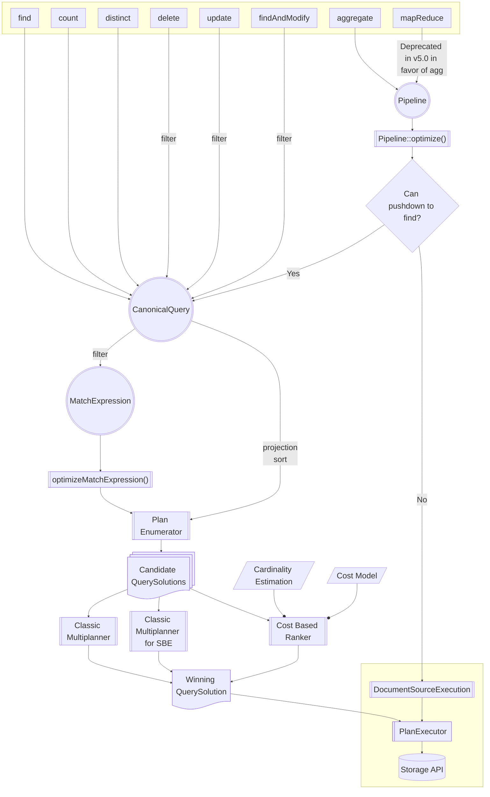

# Query Optimization Architecture Guide

This page provides an overview of the source code architecture for MongoDB's Query Optimization system. It is designed for engineers working on the core server, with introductory sections offering low-level details particularly useful for new members of the QO team.

## Table of Contents

1. [Parsing](../commands/query_cmd/README.md)
   - [Stable API](../STABLE_API_README.md)
1. [Logical Models](README_logical_models.md)
   - Heuristic Rewrites
     - [`MatchExpression` Rewrites](../matcher/README.md)
     - [Pipeline Rewrites](../pipeline/README.md)
   - [Views](../views/README.md)
1. Query Planning
   - [Plan Enumeration](plan_enumerator/README.md)
   - [Classic Runtime Planning](../exec/runtime_planners/classic_runtime_planner/README.md)
1. [Explain](README_explain.md)
1. [Plan Cache](plan_cache/README.md)
1. [Cluster Planning](../../s/query/planner/README.md)
1. Testing
   - [Golden Testing](../../../../docs/golden_data_test_framework.md)
   - [QueryTester](query_tester/README.md)
   - [Fuzzers](https://github.com/10gen/jstestfuzz/blob/master/HitchhikersGuide.md)

## High-Level Diagram

