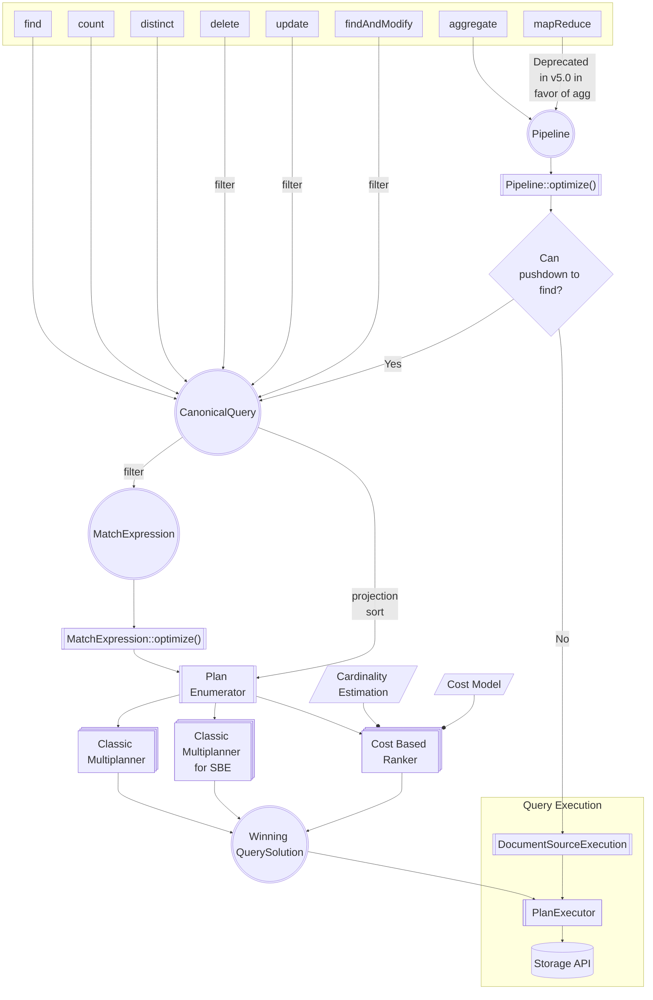

# Query Optimization Architecture Guide

This page provides an overview of the source code architecture for MongoDB's Query Optimization system. It is designed for engineers working on the core server, with introductory sections offering low-level details particularly useful for new members of the QO team.

_Disclaimer_: This guide (SPM-2301) is a work in progress.

## Table of Contents

1. [Parsing](../commands/query_cmd/README.md)
   - [Stable API](../STABLE_API_README.md)
1. [Logical Models](README_logical_models.md)
   - Heuristic Rewrites
     - [`MatchExpression` Rewrites](../matcher/README.md)
     - [Pipeline Rewrites](../pipeline/README.md)
   - [Views](../views/README.md)
1. Index Selection
   - [QueryPlanner and Plan Enumeration](#)
   - [Classic Runtime Planning](classic_runtime_planner/README.md)
1. [Explain](README_explain.md)
1. [Plan Cache](plan_cache/README.md)
1. [Cluster Planning](../../s/query/planner/README.md)
1. Testing
   - [Golden Testing](../../../../docs/golden_data_test_framework.md)
   - [QueryTester](query_tester/README.md)
   - [Fuzzers](https://github.com/10gen/jstestfuzz/blob/master/HitchhikersGuide.md)

## Glossary: QO Terminology and Acronyms

- **Aggregation**: The subsystem that runs aggregate stages.
- **BSON**: Binary-encoded serialization of JSON-like documents.
  - A data format developed by MongoDB for data representation in its core.
- **`CanonicalQuery`**: A standardized form for queries, in BSON.
  - It works as a container for the parsed query, projection, and sort portions of the original query message. The filter portion is parsed into a **`MatchExpression`**.
- **`DocumentSource`**: Represents one stage in an **aggregation** **pipeline**
  - Not necessarily one-to-one with the stages in the user-defined pipeline.
- **`ExpressionContext`**: An object that stores state that may be useful to access throughout the lifespan of a query, but is probably not relevant to any other operations. This includes the collation, a time zone database, various random booleans and state, etc.
- **Find**: The subsystem that runs **find** stages and **pushed-down** **aggregate** stages.
- **IDL**: Interface Definition Language. YAML-formatted files to generate C++ code.
- **`LiteParsedPipeline`**: A very simple model of an **aggregate** **pipeline**, constructed through a semi-parse that proceeds just enough to tease apart the stages that are involved.
  - It has neither verified that the input is well-formed, nor parsed the expressions or detailed arguments to the stages. It can be used for requests that we want to inspect before proceeding and building a full model of the user's query or request.
- **`MatchExpression`**: The parsed Abstract Syntax Tree (AST) from the filter portion of the query.
- **MQL**: MongoDB Query Language.
- **Plan Cache**: Stores previously generated query plans to allow for faster retrieval and execution of recurring queries by avoiding the need to generate and score possible query plans from scratch.
- **`PlanExecutor`**: An abstract type that executes a **`QuerySolution`** plan by cranking its tree of stages into execution. **`PlanExecutor`** has three primary subclasses:
  1. `PlanExecutorImpl`: Executes **find** stages
  1. `PlanExecutorPipeline`: Executes **aggregation** stages.
  1. `PlanExecutorSBE`: Executes SBE plans.
- **Pipeline**: A list of **`DocumentSource`s** which handles a part of the optimization.
- **Pushdown**: Convert an **aggregate** stage in the **pipeline** to a **find** stage.
- **`QuerySolution`**: A tree structure of `QuerySolutionNode`s that represents one possible execution plan for a query.
  - Various operation nodes inherit from `QuerySolutionNode`
    - For example: `CollectionScanNode`, `FetchNode`, `IndexScanNode`, `OrNode`, etc.
  - Generally speaking, one winning **`QuerySolution`** is the output of the QO system.

## High-Level Diagram

