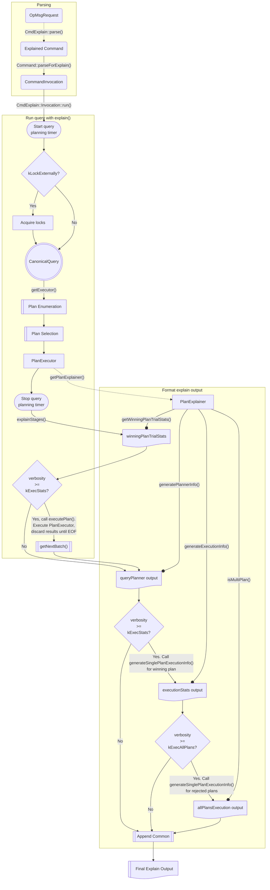

# Explain

## Overview

The `explain` command provides observability into query plans and their execution stats, helping users analyze a query's performance and index usage. Explain queries don't return any documents for reads or modify the underlying collection for writes. Some modes will only perform query planning, while others will also run the query to gather execution stats.

Moreover, `explain` ignores the [plan cache](plan_cache/README.md) during query planning, always generating a set of candidate plans and choosing a winner without consulting the plan cache. The query planner will also avoid caching the winning plan.

This document will cover the following aspects of `explain`:

1. [**Explain Usage**](#explain-usage) to provide insight into how a query can be dissected for its query planning, index usage, and execution stats. This is especially helpful when investigating a performance regression or understanding the plan space given a dataset, set of indexes, and query.
1. [**Explain Implementation**](#explain-implementation) for a deep dive into how `explain` is implemented in the codebase. This section traces an `explain` command through parsing, query planning, and query execution. It also discusses how `explain` is implemented in a sharded cluster, as well as different plan explainers for `explain`.

## Explain Usage

You may want to run the `explain` command for a query to gather information on the amount of time a query took to complete, whether the query used an index, the number of documents and index keys scanned to fulfill a query, etc. This section provides a guide that will walk you through the following:

1. How to [issue an `explain` command](#syntax)
1. Choose a [verbosity mode](#verbosity-modes)
1. How to [analyze `explain` output](#analyze-explain-output)

### Syntax

To use `explain`, you must have permission to run the underlying command. You can run `explain` using:

- `db.runCommand()`, wrapping the command to be explained
  - This is supported for most explainable commands (`aggregate`, `count`, `delete`, `distinct`, `find`, `findAndModify`, `mapReduce`, `update`).
  - The default [verbosity mode](#verbosity-modes) is "allPlansExecution":

```
db.runCommand(
   {
     explain: <command>,
     verbosity: <string>,
     comment: <any>
   }
)
```

- `db.collection.explain(<verbosity>).<method(...)>`
  - This is supported for `aggregate`, `count`, `distinct`, `find`, `findAndModify`, `mapReduce`, and `remove`.
  - The default [verbosity mode](#verbosity-modes) is "queryPlanner".

```
db.collection.explain().aggregate(<pipeline>)
```

- `cursor.explain(<verbosity>)` for the `db.collection.find()` method
  - This is similar to the above (`db.collection.explain().find()`), but that is more expressive and allows for additional chaining of query modifiers.
  - Meanwhile, this returns a cursor and may require a call to `.next()` to return full `explain` results:

```
db.collection.find().explain()
```

- The `explain: true` option in an `aggregate` command
  - This is a legacy format that is equivalent to `db.collection.explain().aggregate()`:

```
db.aggregate(pipeline, {explain: true})
```

The first two syntaxes are recommended as they support the most commands.

### Verbosity Modes

The **verbosity mode** describes the amount of information returned by the `explain` command. These are the available modes in ascending order:

1. **`queryPlanner`**: The query optimizer is run to choose the winning plan for the operation under evaluation.
1. **`executionStats`**: The query optimizer chooses the winning plan and executes it to completion. This mode returns its execution statistics.
1. **`allPlansExecution`**: The query optimizer chooses the winning plan and executes it to completion. This mode returns statistics about the execution of the winning plan as well as of the other candidate plans captured during [plan selection](../exec/runtime_planners/classic_runtime_planner/README.md).

### Analyze Explain Output

Let's examine the output of an `explain` run on a sample query with different verbosity modes:

```
// Input data
for (let i = 1; i <= 100; i++) {
    db.coll.insertOne({ a: i, b: i % 2 });
}

// Indexes
[ {a: 1}, {b: 1}, {a: 1, b: 1} ]

// Query
db.coll.explain(<verbosity>).find({a: 1, b: 1})
```

#### Shared Info

```
{
  explainVersion: '1',
  ... (distinct information)
  queryShapeHash: 'A32708A2B0AF397E3E04E9C33C179B17AC67A4F9E9EB90ED30E35B2B106004C6',
  command: { find: 'coll', filter: { a: 1, b: 1 }, '$db': 'test' },
  serverInfo: {
    host: 'ip-10-122-12-23',
    ...
  },
  serverParameters: {
    internalQueryFrameworkControl: 'trySbeRestricted',
    ...
  },
  ok: 1
}
```

- **explainVersion**: "1" is used for the classic engine, whereas "2" is used for SBE.
  > ### Aside: Execution Engine
  >
  > Operations may use the classic execution engine or the [slot-based execution engine](https://www.mongodb.com/docs/manual/reference/sbe/#std-label-sbe-landing) (SBE). The `explain` output structure may differ in this case:
  >
  > **Classic Execution Engine**:
  >
  > ```
  > winningPlan: {
  >   stage: <STAGE1>,
  >   ...
  >   inputStage: {
  >      stage: <STAGE2>,
  >      ...
  >      inputStage: {
  >         stage: <STAGE3>,
  >         ...
  >      }
  >   }
  > },
  > ```
  >
  > **Slot-based Execution Engine**:
  >
  > ```
  > winningPlan: {
  >   queryPlan: {
  >      stage: <STAGE1>,
  >      ...
  >      inputStage: {
  >         stage: <STAGE2>,
  >         ...
  >         inputStage: {
  >            stage: <STAGE3>,
  >            ...
  >         }
  >      }
  >   }
  >   slotBasedPlan: {
  >      ...
  >   }
  > },
  > ```
- **queryShapeHash**: a hex string that represents the hash of the [query shape](https://www.mongodb.com/docs/manual/core/query-shapes/#std-label-query-shapes).
- **serverInfo**: For unsharded collections, the info is returned for the `mongod` instance. For sharded collections, the info is returned for each accessed shard; there is additionally a top-level `serverInfo` object for the `mongos`.
- **serverParameters**: details about several internal [query parameters](https://github.com/mongodb/mongo/blob/28df8e56046e44f5977671e85fef7bcd38ffbea1/src/mongo/db/query/query_knobs.idl).

#### `queryPlanner` Mode

```
{
  queryPlanner: {
    namespace: 'test.coll',
    parsedQuery: {
      '$and': [ { a: { '$eq': 1 } }, { b: { '$eq': 1 } } ]
    },
    indexFilterSet: false,
    queryHash: 'BBC007A6',
    planCacheShapeHash: 'BBC007A6',
    planCacheKey: '437C5619',
    optimizationTimeMillis: 3,
    maxIndexedOrSolutionsReached: false,
    maxIndexedAndSolutionsReached: false,
    maxScansToExplodeReached: false,
    prunedSimilarIndexes: false,
    winningPlan: {
      isCached: false,
      stage: 'FETCH',
      inputStage: {
        stage: 'IXSCAN',
        keyPattern: { a: 1, b: 1 },
        indexName: 'a_1_b_1',
        isMultiKey: false,
        multiKeyPaths: { a: [], b: [] },
        isUnique: false,
        isSparse: false,
        isPartial: false,
        indexVersion: 2,
        direction: 'forward',
        indexBounds: { a: [ '[1, 1]' ], b: [ '[1, 1]' ] }
      }
    },
    rejectedPlans: [
      {
        isCached: false,
        stage: 'FETCH',
        filter: { a: { '$eq': 1 } },
        inputStage: {
          stage: 'IXSCAN',
          keyPattern: { b: 1 },
          indexName: 'b_1',
          isMultiKey: false,
          multiKeyPaths: { b: [] },
          isUnique: false,
          isSparse: false,
          isPartial: false,
          indexVersion: 2,
          direction: 'forward',
          indexBounds: { b: [ '[1, 1]' ] }
        }
      },
      {
        isCached: false,
        stage: 'FETCH',
        filter: { b: { '$eq': 1 } },
        inputStage: {
          stage: 'IXSCAN',
          keyPattern: { a: 1 },
          indexName: 'a_1',
          isMultiKey: false,
          multiKeyPaths: { a: [] },
          isUnique: false,
          isSparse: false,
          isPartial: false,
          indexVersion: 2,
          direction: 'forward',
          indexBounds: { a: [ '[1, 1]' ] }
        }
      }
    ]
  },
}
```

This returns information in the `queryPlanner` section about the winning plan and rejected plans. It describes their data access patterns as well as details about the indexes under consideration. There is metadata about overall optimizer stats, such as the total time spent in query optimization (heuristic rewrites, plan enumeration, and plan selection) (`optimizationTimeMillis`), whether we hit the limit for an optimizer knob, and whether a particular plan was cached.

#### `executionStats` Mode

```
{
  queryPlanner: {
    // same as queryPlanner mode
  },
  executionStats: {
    executionSuccess: true,
    nReturned: 1,
    executionTimeMillis: 3,
    totalKeysExamined: 1,
    totalDocsExamined: 1,
    executionStages: {
      isCached: false,
      stage: 'FETCH',
      nReturned: 1,
      executionTimeMillisEstimate: 0,
      works: 3,
      advanced: 1,
      needTime: 0,
      needYield: 0,
      saveState: 0,
      restoreState: 0,
      isEOF: 1,
      docsExamined: 1,
      alreadyHasObj: 0,
      inputStage: {
        stage: 'IXSCAN',
        nReturned: 1,
        executionTimeMillisEstimate: 0,
        works: 2,
        advanced: 1,
        needTime: 0,
        needYield: 0,
        saveState: 0,
        restoreState: 0,
        isEOF: 1,
        keyPattern: { a: 1, b: 1 },
        indexName: 'a_1_b_1',
        isMultiKey: false,
        multiKeyPaths: { a: [], b: [] },
        isUnique: false,
        isSparse: false,
        isPartial: false,
        indexVersion: 2,
        direction: 'forward',
        indexBounds: { a: [ '[1, 1]' ], b: [ '[1, 1]' ] },
        keysExamined: 1,
        seeks: 1,
        dupsTested: 0,
        dupsDropped: 0
      }
    }
  },
}
```

This contains all the information in the `queryPlanner` mode, with additional `executionStats` information from executing the `winningPlan`, such as the number of documents returned and the number of documents and index keys examined. The `executionTimeMillis` field describes the total amount of time required for both query optimization and query execution. It does not include the network time required to transmit the data back to the client.

For write operations, query execution refers to the modifications that **would** be performed, but does **not** make those modifications to the database.

#### `allPlansExecution` Mode

```
{
    queryPlanner: {
      // same as queryPlanner mode
    },
    executionStats: {
      // same as executionStats mode
    },
    allPlansExecution: [
      {
        nReturned: 1,
        executionTimeMillisEstimate: 0,
        totalKeysExamined: 1,
        totalDocsExamined: 1,
        score: 2.5002,
        executionStages: {
          isCached: false,
          stage: 'FETCH',
          nReturned: 1,
          executionTimeMillisEstimate: 0,
          works: 2,
          advanced: 1,
          needTime: 0,
          needYield: 0,
          saveState: 0,
          restoreState: 0,
          isEOF: 1,
          docsExamined: 1,
          alreadyHasObj: 0,
          inputStage: {
            stage: 'IXSCAN',
            nReturned: 1,
            executionTimeMillisEstimate: 0,
            works: 2,
            advanced: 1,
            needTime: 0,
            needYield: 0,
            saveState: 0,
            restoreState: 0,
            isEOF: 1,
            keyPattern: { a: 1, b: 1 },
            indexName: 'a_1_b_1',
            isMultiKey: false,
            multiKeyPaths: { a: [], b: [] },
            isUnique: false,
            isSparse: false,
            isPartial: false,
            indexVersion: 2,
            direction: 'forward',
            indexBounds: { a: [ '[1, 1]' ], b: [ '[1, 1]' ] },
            keysExamined: 1,
            seeks: 1,
            dupsTested: 0,
            dupsDropped: 0
          }
        }
      },
      {
        nReturned: 1,
        executionTimeMillisEstimate: 0,
        totalKeysExamined: 2,
        totalDocsExamined: 2,
        score: 1.5002,
        executionStages: {
          isCached: false,
          stage: 'FETCH',
          filter: { a: { '$eq': 1 } },
          nReturned: 1,
          executionTimeMillisEstimate: 0,
          works: 2,
          advanced: 1,
          needTime: 1,
          needYield: 0,
          saveState: 1,
          restoreState: 0,
          isEOF: 0,
          docsExamined: 2,
          alreadyHasObj: 0,
          inputStage: {
            stage: 'IXSCAN',
            nReturned: 2,
            executionTimeMillisEstimate: 0,
            works: 2,
            advanced: 2,
            needTime: 0,
            needYield: 0,
            saveState: 1,
            restoreState: 0,
            isEOF: 0,
            keyPattern: { b: 1 },
            indexName: 'b_1',
            isMultiKey: false,
            multiKeyPaths: { b: [] },
            isUnique: false,
            isSparse: false,
            isPartial: false,
            indexVersion: 2,
            direction: 'forward',
            indexBounds: { b: [ '[1, 1]' ] },
            keysExamined: 2,
            seeks: 1,
            dupsTested: 0,
            dupsDropped: 0
          }
        }
      },
      {
        nReturned: 1,
        executionTimeMillisEstimate: 0,
        totalKeysExamined: 1,
        totalDocsExamined: 1,
        score: 2.5002,
        executionStages: {
          isCached: false,
          stage: 'FETCH',
          filter: { b: { '$eq': 1 } },
          nReturned: 1,
          executionTimeMillisEstimate: 0,
          works: 2,
          advanced: 1,
          needTime: 0,
          needYield: 0,
          saveState: 1,
          restoreState: 0,
          isEOF: 1,
          docsExamined: 1,
          alreadyHasObj: 0,
          inputStage: {
            stage: 'IXSCAN',
            nReturned: 1,
            executionTimeMillisEstimate: 0,
            works: 2,
            advanced: 1,
            needTime: 0,
            needYield: 0,
            saveState: 1,
            restoreState: 0,
            isEOF: 1,
            keyPattern: { a: 1 },
            indexName: 'a_1',
            isMultiKey: false,
            multiKeyPaths: { a: [] },
            isUnique: false,
            isSparse: false,
            isPartial: false,
            indexVersion: 2,
            direction: 'forward',
            indexBounds: { a: [ '[1, 1]' ] },
            keysExamined: 1,
            seeks: 1,
            dupsTested: 0,
            dupsDropped: 0
          }
        }
      }
    ]
}
```

This contains all the information in the `executionStats` mode, with additional execution information for the rejected plans such as the estimated execution time (`executionTimeMillisEstimate`) and the candidate plan's `score`, which is calculated based on how [productive](../exec/runtime_planners/classic_runtime_planner/README.md#plan-ranking) it was during the trial period.

From the output above, we can see that the plans using the `{a: 1}` and `{a: 1, b: 1}` indexes resulted in higher-scoring plans than the `{b: 1}` index, which is expected because the predicate on `a` is far more selective than the predicate on `b` (100 unique values for the former vs 2 buckets of values for the latter). The better plans also have the `isEOF` flag set, meaning they ran to completion and returned all results in the trial period, whereas the worst plan did not run to completion and has a value of 0 in that field.

The multiplanner has additional [tie-breaking](../exec/runtime_planners/classic_runtime_planner/README.md#tie-breakers) heuristics when two plans score equally well. While both the plan using the index on `{a: 1, b: 1}` and the plan using the index on `{a: 1}` only needed to examine one document and scan one index key, the latter plan required a residual filter predicate on `{ b: { '$eq': 1 } }` in its `FETCH` stage. Thus, the plan using the `{a: 1, b: 1}` index is the most optimal.

For a full list of fields and their definitions in the `explain` output, refer to the [docs](https://www.mongodb.com/docs/manual/reference/explain-results/).

## Explain Implementation

1. [Tracing an `explain` command](#tracing-an-explain-command)
1. [Plan explainers](#plan-explainers)
1. [Sharded `explain`](#sharded-explain)

### Tracing an `explain` command

Just like a [non-explain command](../commands/query_cmd/README.md), an `explain` command is parsed, canonicalized when possible, normalized, and sent to the query planner for plan enumeration and plan selection.

The entrypoint to `explain` is [`CmdExplain::parse()`](https://github.com/mongodb/mongo/blob/28df8e56046e44f5977671e85fef7bcd38ffbea1/src/mongo/db/commands/query_cmd/explain_cmd.cpp#L212), which takes in an [`OpMsgRequest`](https://github.com/mongodb/mongo/blob/28df8e56046e44f5977671e85fef7bcd38ffbea1/src/mongo/rpc/op_msg.h#L194).

- The inner explained command is extracted from the outer command. The explained command's override of the [`parseForExplain()`](https://github.com/mongodb/mongo/blob/28df8e56046e44f5977671e85fef7bcd38ffbea1/src/mongo/db/commands.h#L465) function returns a [`CommandInvocation`](https://github.com/mongodb/mongo/blob/28df8e56046e44f5977671e85fef7bcd38ffbea1/src/mongo/db/commands.h#L793).

The [`CmdExplain::Invocation::run()`](https://github.com/mongodb/mongo/blob/28df8e56046e44f5977671e85fef7bcd38ffbea1/src/mongo/db/commands/query_cmd/explain_cmd.cpp#L145) function executes the parsed `explain` command. The inner invocation, or explained command, calls its override of the [`explain()`](https://github.com/mongodb/mongo/blob/28df8e56046e44f5977671e85fef7bcd38ffbea1/src/mongo/db/commands/query_cmd/explain_cmd.cpp#L145) function. Different commands have their own implementations for this function, but they generally share the following steps:

1. Begin the [query planning timer](https://github.com/mongodb/mongo/blob/28df8e56046e44f5977671e85fef7bcd38ffbea1/src/mongo/db/commands/query_cmd/find_cmd.cpp#L432) after the command has been parsed.
1. Acquire any locks that are required.
1. Construct a [`CanonicalQuery`](README_logical_models.md#canonicalquery) from the parsed request.
1. Get a plan executor for the query. This phase covers [plan enumeration](plan_enumerator/README.md) and [plan selection](../exec/runtime_planners/classic_runtime_planner/README.md).
1. Once the executor is returned, it [stops the query planning timer](https://github.com/mongodb/mongo/blob/28df8e56046e44f5977671e85fef7bcd38ffbea1/src/mongo/db/query/get_executor.cpp#L1307).
1. Get a [`PlanExplainer`](#plan-explainers) with query planning stats from the `PlanExecutor`.
1. Given the [`PlanExecutor`](https://github.com/mongodb/mongo/blob/28df8e56046e44f5977671e85fef7bcd38ffbea1/src/mongo/db/query/plan_executor.h#L168), if the verbosity level is `executionStats` or higher, the [`explainStages()`](https://github.com/mongodb/mongo/blob/28df8e56046e44f5977671e85fef7bcd38ffbea1/src/mongo/db/query/explain.cpp#L471) function first calls [`executePlan()`](https://github.com/mongodb/mongo/blob/28df8e56046e44f5977671e85fef7bcd38ffbea1/src/mongo/db/query/explain.cpp#L326), executing the `PlanExecutor` and discarding the resulting documents until it reaches `EOF`. It will log an error and throw an exception if the query doesn't run to completion successfully. This function calls [`getNextBatch()`](https://github.com/mongodb/mongo/blob/28df8e56046e44f5977671e85fef7bcd38ffbea1/src/mongo/db/query/plan_executor.cpp#L88) under the hood so that the `PlanExecutor` is executed in a tighter loop.
1. Generate human-readable `explain` `BSON` from the `PlanStats` tree. Any operation with a query component can be explained using this function. This will call helper functions to generate [query planner info](https://github.com/mongodb/mongo/blob/28df8e56046e44f5977671e85fef7bcd38ffbea1/src/mongo/db/query/explain.cpp#L88), [execution stats info](https://github.com/mongodb/mongo/blob/28df8e56046e44f5977671e85fef7bcd38ffbea1/src/mongo/db/query/explain.cpp#L261) for the winning plan, or [all plans execution info](https://github.com/mongodb/mongo/blob/28df8e56046e44f5977671e85fef7bcd38ffbea1/src/mongo/db/query/explain.cpp#L261) depending on the verbosity.

> ### Aside: `Pipeline` Explain
>
> Note that `explain` is implemented slightly differently for aggregate commands. The [`_runAggregate`](https://github.com/mongodb/mongo/blob/28df8e56046e44f5977671e85fef7bcd38ffbea1/src/mongo/db/commands/query_cmd/run_aggregate.cpp#L774) function calls [`executeExplain()`](https://github.com/mongodb/mongo/blob/28df8e56046e44f5977671e85fef7bcd38ffbea1/src/mongo/db/commands/query_cmd/run_aggregate.cpp#L728) if we're in an `explain` command. If a `PlanExecutorPipeline` is provided, the [`explainPipeline()`](https://github.com/mongodb/mongo/blob/28df8e56046e44f5977671e85fef7bcd38ffbea1/src/mongo/db/query/explain.cpp#L390) function is invoked, which turns `explain` `BSON` for document sources into a human-readable format. The underlying logic is similar despite the divergence in code paths.

> ### Aside: Lock Acquisition
>
> The [`LockPolicy`](https://github.com/mongodb/mongo/blob/28df8e56046e44f5977671e85fef7bcd38ffbea1/src/mongo/db/query/plan_executor.h#L187) describes whether callers should acquire locks when using a `PlanExecutor`. `find` executors using the legacy `PlanStage` engine require the caller to lock the collection `MODE_IS`. On the other hand, aggregate and `SBE` executors may access multiple collections and acquire their own locks on any involved collections when producing query results. In this case, callers don't need to explicitly acquire any locks ahead of time.
>
> These are the possible lock policies:
>
> - `kLockExternally`: The caller is responsible for locking the collection over which this `PlanExecutor` executes.
> - `kLockInternally`: The caller need not hold any locks, the `PlanExecutor` will acquire all the required locks itself.
>
> Although an `explain` command never modifies the underlying collection, it must still acquire the same locks that are acquired by the explained command (if it were run normally) as it will at least partially execute the candidate plans during the trial period. Explains on write commands will hold write locks even though no writes are actually performed so that timing info is more accurate.

### Plan Explainers

The [`PlanExplainer`](https://github.com/mongodb/mongo/blob/28df8e56046e44f5977671e85fef7bcd38ffbea1/src/mongo/db/query/plan_explainer.h#L46) interface defines an API to provide information on the execution plans generated by the query planner in various formats. At a high-level, it provides information such as:

- Whether the multiplanner was used
- What query knobs were hit during plan enumeration
- What version of `explain` was used
- Summary statistics for the following:
  - The secondary collection, if it was referenced in a stage like `$lookup`. (Note that `explain` doesn't include any information about subpipelines executed on the `from` collection in `$lookup`.)
  - The winning plan
  - The rejected plans

It contains a [`PlanStatsDetails`](https://github.com/mongodb/mongo/blob/28df8e56046e44f5977671e85fef7bcd38ffbea1/src/mongo/db/query/plan_explainer.h#L62) structure containing the plan selected by the query planner, as well as an optional [`PlanSummaryStats`](https://github.com/mongodb/mongo/blob/28df8e56046e44f5977671e85fef7bcd38ffbea1/src/mongo/db/query/plan_summary_stats.h#L58) container if the verbosity is `executionStats` or higher. This tracks information that will be in the `explain` output, as well as other stats that the profiler, slow query log, and other non-explain output may want to collect such as:

- `nReturned` - the number of results returned by the plan
- `totalKeysExamined` - the number of index keys examined by the plan
- `hasSortStage` - whether or not the plan used an in-memory sort stage
- `replanReason` - If replanning was triggered, what caused it?

The [`accumulate()`](https://github.com/mongodb/mongo/blob/28df8e56046e44f5977671e85fef7bcd38ffbea1/src/mongo/db/query/plan_summary_stats_visitor.h#L147) function walks through a [`PlanStageStats`](https://github.com/mongodb/mongo/blob/28df8e56046e44f5977671e85fef7bcd38ffbea1/src/mongo/db/exec/sbe/stages/plan_stats.cpp#L52) tree to compute aggregate stats from the stats each stage has gathered during its execution.

Different executors will provide overrides of the functions in the `PlanExplainer` interface, and will provide its own stats in the `PlanSummaryStats` container:

- **Classic executor**: Uses [`PlanExplainerImpl`](https://github.com/mongodb/mongo/blob/11b6fc54aaeddbb6dd85d2a808827f8048f366a1/src/mongo/db/query/plan_explainer_impl.h#L59). All the information required to generate `explain` output in various formats is stored in the execution tree. Starting from the root stage of the execution tree, plan summary stats are gathered by traversing through the rest of the tree. The `MultiPlanStage` is skipped, and stats are extracted from its children. Note that if [subplanning](../exec/runtime_planners/classic_runtime_planner/README.md#subplanner) was triggered, it doesn't include information about rejected plans.
- **Express executor**: Uses [`PlanExplainerExpress`](https://github.com/mongodb/mongo/blob/11b6fc54aaeddbb6dd85d2a808827f8048f366a1/src/mongo/db/query/plan_explainer_express.h#L193). Since we don't build a plan tree for express queries, this doesn't include stage information that's typically included in other `PlanExplainer`s, such as whether shard filtering was required and what index bounds were used. It will, however, include the chosen index.

> ### Aside: Express Executor
>
> An [`ExpressPlan`](https://github.com/mongodb/mongo/blob/11b6fc54aaeddbb6dd85d2a808827f8048f366a1/src/mongo/db/exec/express/express_plan.h#L1313) is a streamlined execution engine that supports a specific sequence of query stages:
>
> - Document iterator --> optional shard filter --> optional write --> optional projection
>
> Notably, it skips the plan enumeration and plan selection phases, as well as the intermediate materialization of a `PlanStage` tree.
>
> Queries are [eligible](https://github.com/mongodb/mongo/blob/11b6fc54aaeddbb6dd85d2a808827f8048f366a1/src/mongo/db/query/query_utils.h#L118) for the express executor if they are:
>
> - A point query that can be fulfilled via a single lookup on the `_id` index or with a direct lookup into a clustered collection
> - An simple equality query that has a suitable index

- **SBE executor**: Uses [`PlanExplainerClassicRuntimePlannerForSBE`](https://github.com/mongodb/mongo/blob/11b6fc54aaeddbb6dd85d2a808827f8048f366a1/src/mongo/db/query/plan_explainer_sbe.h#L125), which extends [`PlanExplainerSBEBase`](https://github.com/mongodb/mongo/blob/0a68308f0d39a928ed551f285ba72ca560c38576/src/mongo/db/query/plan_explainer_sbe.h#L59). This will display the stringified SBE plan(s) (the `QuerySolutionNode`-derived format for the given plan). Since SBE also go through a trial period using the classic multiplanner, it holds a pointer to the `MultiPlanStage` that allows calling into `PlanExplainerImpl` to extract information about the trial period using the `PlanStage`-derived format.
- **Pipeline exector**: Uses [`PlanExplainerPipeline`](https://github.com/mongodb/mongo/blob/0a68308f0d39a928ed551f285ba72ca560c38576/src/mongo/db/pipeline/plan_explainer_pipeline.h#L46). This is used for aggregation pipelines and has special logic to iterate through the pipeline stages to accumulate general stats, as well as note down specific stats that certain stages provide.



### Sharded Explain

When `explain` is run in a sharded cluster, it is parsed similarly to the non-sharded `explain`. However, there are some differences in what is measured by the timer and the execution output displayed.

The entrypoint to sharded `explain` is [`ClusterExplainCmd::parse()`](https://github.com/mongodb/mongo/blob/0a68308f0d39a928ed551f285ba72ca560c38576/src/mongo/s/commands/query_cmd/cluster_explain_cmd.cpp#L219), which is similar to `CmdExplain::parse()`. However, it calls [`makeExplainedObj()`](https://github.com/mongodb/mongo/blob/0a68308f0d39a928ed551f285ba72ca560c38576/src/mongo/s/commands/query_cmd/cluster_explain_cmd.cpp#L188) to synthesize a `BSONObj` for the explained command, copying [generic arguments](https://github.com/mongodb/mongo/blob/0a68308f0d39a928ed551f285ba72ca560c38576/src/mongo/idl/generic_argument.idl#L49) from the outer `explain` command.

The [`ClusterExplainCmd::run()`](https://github.com/mongodb/mongo/blob/0a68308f0d39a928ed551f285ba72ca560c38576/src/mongo/s/commands/query_cmd/cluster_explain_cmd.cpp#L141) function executes the parsed `explain` command. The inner invocation, or explained command, calls its override of the [`explain()`](https://github.com/mongodb/mongo/blob/11b6fc54aaeddbb6dd85d2a808827f8048f366a1/src/mongo/db/commands.h#L825) function. Different sharded commands have their own implementations for this function, but they generally share the following steps:

1. Parse the command to a `CanonicalQuery`.
1. Begin the timer to measure how long it takes to run the command on the shards.
1. Call [`wrapAsExplain()`](https://github.com/mongodb/mongo/blob/11b6fc54aaeddbb6dd85d2a808827f8048f366a1/src/mongo/s/commands/query_cmd/cluster_explain.cpp#L130) to wrap the passed in inner command into an `explain` command request. This step will prune any generic arguments in the inner command, only keeping what was provided in the outer command.
1. Call [`scatterGatherVersionedTargetByRoutingTable`](https://github.com/mongodb/mongo/blob/8e6b2afd632cbcc67a2a129da0b1393d7576367e/src/mongo/s/cluster_commands_helpers.h#L300), which dispatches versioned commands to the shards, deciding which ones to target by applying the passed-in query and collation to the local routing table cache.
1. Finally, call [`buildExplainResult`](https://github.com/mongodb/mongo/blob/8e6b2afd632cbcc67a2a129da0b1393d7576367e/src/mongo/s/commands/query_cmd/cluster_explain.cpp#L432) to construct the sharded `explain` output format based on the responses from the shards in `shardResponses`. A sharded `explain` will only succeed if all shards support the `explain` command. This will also return mock `mongos` execution stages to describe how results are combined for read operations, or if a write would be performed:

   - `kSingleShard` - only a single shard is targeted and returns results.
   - `kMergeFromShards` - multiple shards were targeted, and the results must be merged.
   - `kMergeSortFromShards`- similar to the above, but the results must be merged in a sorted order.
   - `kWriteOnShards` - this command would perform a write on the shards.

Here is the sample output for sharded `explain`. It includes the core query planner and server information for each accessed shard in the `shards` field:

```
{
   queryPlanner: {
      mongosPlannerVersion: <int>
      winningPlan: {
         stage: <STAGE1>,
         shards: [
         {
            shardName: <string>,
            connectionString: <string>,
            serverInfo: {
               ...
            },
            namespace: <string>,
            indexFilterSet: <boolean>,
            parsedQuery: {
               ...
            },
            querySettings: {
               ...
            },
            planCacheShapeHash: <hexadecimal string>,
            planCacheKey: <hexadecimal string>,
            maxIndexedOrSolutionsReached: <boolean>,
            maxIndexedAndSolutionsReached: <boolean>,
            maxScansToExplodeReached: <boolean>,
            winningPlan: {
               stage: <STAGE1>,
               inputStage: {
                  stage: <string>,
                  ...
               }
            },
            rejectedPlans: [
              <candidate plan1>,
            ]
         },
         {
          ...
         },
         ...
         ]
      }
   }
}
```

---

[Return to Cover Page](README_QO.md)
