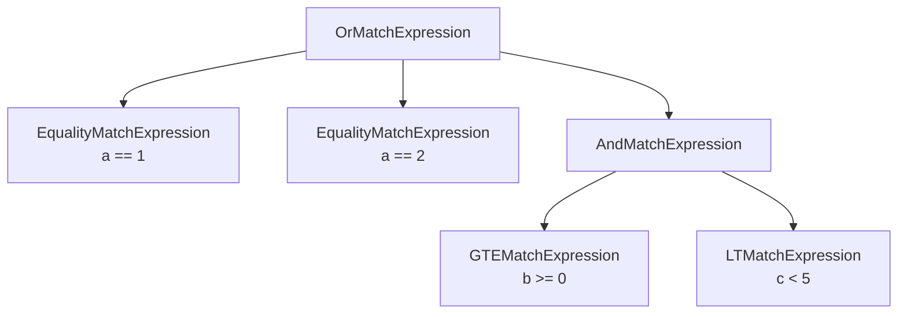
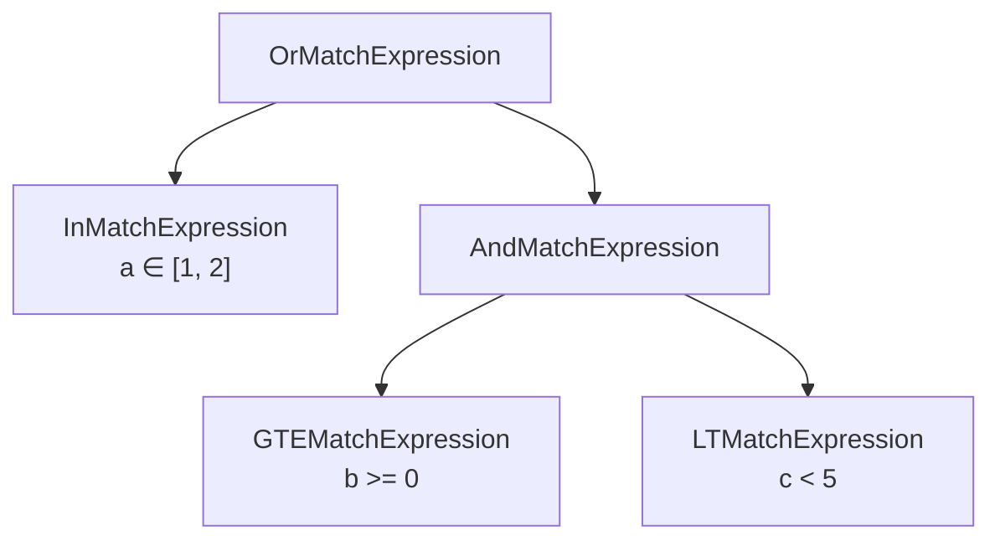
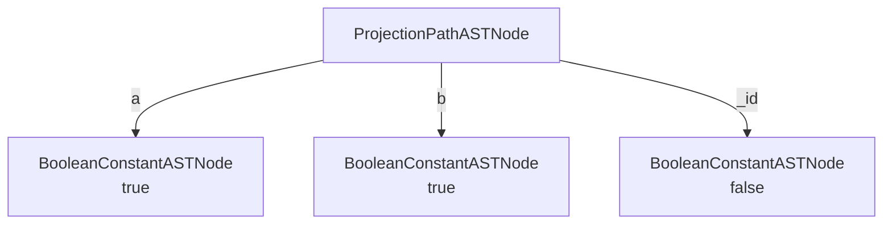
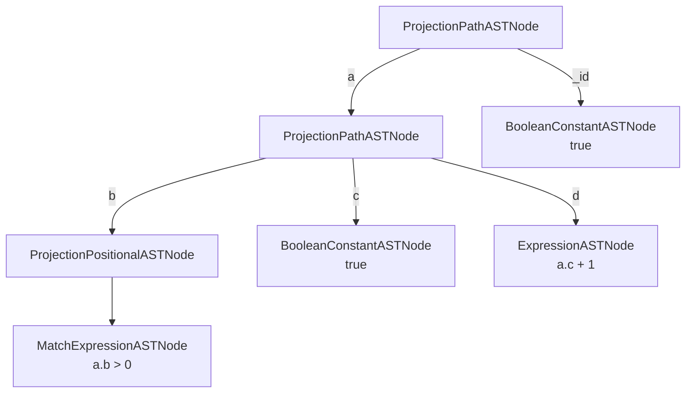

# Logical Models

## Overview

A **logical model** is a representation of how data is structured and how its components relate to other data. In our case, the main logical model of a query is a [`CanonicalQuery`](#canonicalquery). `CanonicalQuery` is itself a logical model, but also delegates to four other logical models to represent its components:
| Query Component | Logical Model |
| ---------------------------|---------------|
| filter | [`MatchExpression`](#matchexpression) |
| projection | [`Projection`](#projection) |
| sort | [`SortPattern`](#sortpattern) |
| distinct | [`CanonicalDistinct`](#canonicaldistinct) |

The first step of query planning will take a `CanonicalQuery` as input, but the goal of our logical models is to refine and simplify all the components of a `CanonicalQuery` into its most basic form through desugaring, normalization, and other rewrites.

> ### Aside: Desugaring
>
> When writing MQL, you might use shorthand notation which simplifies more explicit expressions. This shorthand notation is considered _syntactic sugar_ for the full form equivalent expression. For example:
> | Implicit (Syntactic Sugar) | Explicit |
> |----------------------------|----------|
> | `{field: "value"}` | `{field: {$eq: "value"}}` |
> | `{a: {$gte: 0}, b: {$lt: 5}}` | `{$and: [{a: {$gte: 0}}, {b: {$lt: 5}}]}` |
>
> During desugaring, the parser interprets the shorthand notation and [converts](https://github.com/mongodb/mongo/blob/8e6b2afd632cbcc67a2a129da0b1393d7576367e/src/mongo/db/matcher/expression_parser.cpp#L284) it into the explicit form that it processes internally.

By converting all instances of syntactic sugar into their explicit forms, we simplify later optimization steps. For example, rather than including logic to handle both implicit and explicit `$eq` separately, we convert all implicit `$eq`s to explicit `$eq`s, and therefore can handle both cases in the same logic path.

## `CanonicalQuery`

A [`CanonicalQuery`](https://github.com/mongodb/mongo/blob/8e6b2afd632cbcc67a2a129da0b1393d7576367e/src/mongo/db/query/canonical_query.h#L72) is a container that represents a parsed and normalized query. It contains the filter, projection, and sort components of the original query message. Each of these components is generated via the [`CanonicalQuery` constructor](https://github.com/mongodb/mongo/blob/8e6b2afd632cbcc67a2a129da0b1393d7576367e/src/mongo/db/query/canonical_query.cpp#L94). In order to create the `CanonicalQuery` in its "base" form, the `CanonicalQuery` delegates to three more processes and related data structures: `MatchExpression`, `Projection`, and `SortPattern` to handle the simplification, each of which is discussed in detail below.

If a `CanonicalQuery` [cannot be generated](../commands/query_cmd/README.md#parsing-aggregations) after parsing, we move the query straight to the Query Execution layer without optimization.

> ### Aside: Canonicalization
>
> `ParsedFindCommand` already contains the parsed filter, projection, and sort in their _original_ form. `CanonicalQuery` does not create these data structures; it _simplifies_ them from their original form and stores the result. For example, these `ParsedFindCommand`s all result in the same `CanonicalQuery` because `$and` and `$or` are normalized away when they have only one child.
>
> ```
> db.c.find({a: 1})
> db.c.find({$and: [{a: 4}]})
> db.c.find({$or: [{a: 4}]})
> ```

## `MatchExpression`

The `CanonicalQuery` holds a reference to an abstract syntax tree (AST) called a [`MatchExpression`](https://github.com/mongodb/mongo/blob/e16bc2248a3410167e39d09bb9bc29a96f026ead/src/mongo/db/matcher/expression.h#L72), a representation of the query's `filter` component.

> ### Aside: Abstract Syntax Trees
>
> An Abstract Syntax Tree (AST) is a tree representation of a program's syntax. While a Concrete Syntax Tree (CST) models the exact grammar of a language, an AST _abstracts_ away unnecessary syntax details and models logical structure. Using an AST generally makes it easier to perform optimizations and static analysis. For an example of how we model `MatchExpression`s as ASTs, see below.

`MatchExpression` is also the abstract type from which all nodes inherit. All possible `MatchExpression` nodes are enumerated by the [`MatchType`](https://github.com/mongodb/mongo/blob/8e6b2afd632cbcc67a2a129da0b1393d7576367e/src/mongo/db/matcher/expression.h#L80) enum. For each of these types, there exists a subclass that inherits from `MatchExpression`. For example:

- [`EqualityMatchExpression`](https://github.com/mongodb/mongo/blob/b0816f32f1eff965ffe069fc556ea968cc8533a6/src/mongo/db/matcher/expression_leaf.h#L314) corresponds to `MatchType::EQ` and the `$eq` operator; it must have 0 children nodes, also known as a `LeafMatchExpression`.
- [`AndMatchExpression`](https://github.com/mongodb/mongo/blob/b0816f32f1eff965ffe069fc556ea968cc8533a6/src/mongo/db/matcher/expression_tree.h#L139) corresponds to `MatchType::AND` and the `$and` operator; it has N children nodes, where N is the number of conjuncts of the `$and`.

Let's take a look at how this query would be modeled as an AST:

```
db.c.find({
  $or: [
    {a: 1},
    {a: 2},
    {$and: [{b: {$gte: 0}}, {c: {$lt: 5}}]}
  ]
})
```

During `MatchExpressionParser::parse()`, the request's `filter` component (in this case, our entire query) is broken down into individual `BSONElement`s and parsed separately into individual `MatchExpression`s. The `BSONObj`'s structure is then rebuilt as an AST of `MatchExpression`s. For example, this section:

```
{$and: [{b: {$gte: 0}}, {c: {$lt: 5}}]}
```

is broken up as 3 `BSONElement`s, each with their own `MatchExpression`. See below for the tree representation.

In this case, the structure becomes an `AndMatchExpression` with two children: `GTEMatchExpression` and `LTMatchExpression`. This process occurs in [`parseSub()`](https://github.com/mongodb/mongo/blob/b0816f32f1eff965ffe069fc556ea968cc8533a6/src/mongo/db/matcher/expression_parser.cpp#L2132) for each element. If something doesn't fit the expected `BSONElement` pattern for `MatchExpression` conversion, [desugaring](#aside-desugaring) can be performed to convert the `filter` component into a parser-compatible form.

After `MatchExpressionParser::parse()`, the underlying AST for our query looks like this:



While `MatchExpressionParser::parse()` creates the initial `MatchExpression` and `ParsedFindCommand` holds the AST in its unoptimized form, `CanonicalQuery` calls [`MatchExpression::normalize()`](https://github.com/mongodb/mongo/blob/b0816f32f1eff965ffe069fc556ea968cc8533a6/src/mongo/db/query/canonical_query.cpp#L166), which begins the simplification process. The goal of normalization is to convert the `MatchExpression` AST into its most simple form. By simplifying `MatchExpression`s as much as possible, we ensure that:

1. Any resulting `QuerySolution`s will be as simple as possible
1. The [plan cache](plan_cache/README.md) will recognize logically equivalent queries as equivalent and reuse a cached plan when possible, even if the initial queries are different.

In this case, we can apply the `$or` to `$in` rewrite rule because we have two `$eq` disjuncts on the same field. After normalization, our AST looks like this:



This simplified `MatchExpression` AST could stem from an infinite number of queries, as we could always write queries with more and more complex boolean logic. This is just one example of a [**heuristic rewrite**](../matcher/README.md).

## `Projection`

Much like `MatchExpression`, [`Projection`](https://github.com/mongodb/mongo/blob/b0816f32f1eff965ffe069fc556ea968cc8533a6/src/mongo/db/query/projection.h#L74) is also represented as an AST. From the initial `BSONObj` of the projection, [`parseAndAnalyze()`](https://github.com/mongodb/mongo/blob/b0816f32f1eff965ffe069fc556ea968cc8533a6/src/mongo/db/query/projection_parser.h#L52) is called to convert the raw `BSONObj` representation of the projection into an AST. By representing the `Projection` as an AST, we can traverse the tree and optimize each node based on its necessary dependencies.

> ### Aside: Inclusion and Exclusion Projections
>
> An MQL projection is classified as either an inclusion projection or exclusion projection. In an inclusion projection, all desired fields are marked with a `1`; all other fields are excluded. In an exclusion projection, all undesired fields are marked with a `0`; all other fields are included. Because of this, a projection must be entirely "inclusion-based" or "exclusion-based"; you cannot specify some fields as included and others as excluded.
>
> The only exception to the inclusion/exclusion rule is `_id`. The `_id` field _can_ differ from other fields, since `_id` is always assumed to be included. For example:
>
> ```
> // Assume db.c contains fields 'a', 'b', and 'c'.
> db.c.find({}, {a: 1, b: 1}) // Inclusion: includes _id, a, and b.
> db.c.find({}, {a: 1, b: 1, _id: 0}) // Inclusion: includes a and b.
> db.c.find({}, {a: 0}) // Exclusion: includes _id, b, and c.
> ```

For example, given this query:

```
db.c.find({}, {a: 1, b: 1, _id: 0})
```

the underlying Projection AST looks like this:



Here, each `BooleanConstantASTNode` represents whether our final result will contain the field that points to it.

A more complex projection that involves nested fields or arrays may require substantially more complex syntax. This may involve many recursive children nodes for nested fields, or uses of the `$`, `$elemMatch` or `$slice` operators for arrays. Each of these is defined as its own node in [`projection_ast.h`](https://github.com/mongodb/mongo/blob/b0816f32f1eff965ffe069fc556ea968cc8533a6/src/mongo/db/query/projection_ast.h#L61).

For example, given this more complex query:

```
db.c.find({"a.b": {$gt: 0}}, {"a.b.$": 1, "a.c": 1, "a.d": {$add: ["$a.c", 1]}})
```

the underlying Projection AST looks like this:



Note that in this example, the `a.d` field is a new field that is created by the projection as the result of an expression. This is a third type of projection beyond inclusion and exclusion, called addition.

After parsing, [`optimizeProjection()`](https://github.com/mongodb/mongo/blob/e16bc2248a3410167e39d09bb9bc29a96f026ead/src/mongo/db/query/projection.cpp#L241) walks the AST to find areas for optimization. This optimization has the potential to modify the AST in-place in simplifying it. For this reason, a `ProjectionASTMutableVisitor` recursively traverses the AST, calling `preVisit`, `inVisit`, and `postVisit` on each node in the AST.

For example, given this `ExpressionASTNode`:

```
{x: {$and: [false, "$b"]}}
```

the initial construction of the AST would imply that `x` is dependent on `b`. After optimization, however, it becomes clear that this expression is unsatisfiable, and `x`'s dependency on `b` is released.

## `SortPattern`

If a query contains a sort specification, the `CanonicalQuery` will store the sort as a [`SortPattern`](https://github.com/mongodb/mongo/blob/e16bc2248a3410167e39d09bb9bc29a96f026ead/src/mongo/db/query/sort_pattern.h#L53), which is a vector of [`SortPatternPart`s](https://github.com/mongodb/mongo/blob/e16bc2248a3410167e39d09bb9bc29a96f026ead/src/mongo/db/query/sort_pattern.h#L64). Each `SortPatternPart` represents one field and its sort order. This data structure can be used for reference throughout the optimization process and accessed via the `CanonicalQuery`. This is generally as simple as:

```
db.c.find({}).sort({"a": 1, "b.c": -1})

SortPattern: [
  SortPatternPart: {fieldPath="a", isAscending=true},
  SortPatternPart: {fieldPath="b.c", isAscending=false},
]
```

> ### Aside: Metadata Sort
>
> There is one exception to the `{field: (-)1}` sort pattern: `$meta` sort. For example:
>
> ```
> aggregate([{$match: {$text: {$search: 'Some Text'}}}, {$sort: {textScore: {$meta: 'textScore'}}}])
> ```
>
> Here, `{$meta: 'textScore'}` is an example of "document metadata" which sorts by descending relevance score. This sort order ignores its specifying field name and instead uses the metadata as an implicit top-level field. For more information on text score metadata sort, see [here](https://www.mongodb.com/docs/manual/reference/operator/aggregation/sort/#std-label-sort-pipeline-metadata).

## `CanonicalDistinct`

When a `distinct()` query is run or an aggregation pipeline is eligible to use a `DISTINCT_SCAN`, the `CanonicalQuery` holds a [`CanonicalDistinct`](https://github.com/mongodb/mongo/blob/e16bc2248a3410167e39d09bb9bc29a96f026ead/src/mongo/db/query/canonical_distinct.h#L52). The `CanonicalDistinct` is effectively a container that holds all the data regarding a distinct query, just as `CanonicalQuery` is for find. Note that data such as the distinct command's `filter` is still maintained by the `CanonicalQuery`, however. For example, in this query:

```
db.c.distinct("x", {x: {$gt: 0}})
```

the `CanonicalDistinct` holds the information that the distinct key is `"x"`, but the `CanonicalQuery` holds the `MatchExpression` representing `x > 0`.

---

[Return to Cover Page](README_QO.md)
