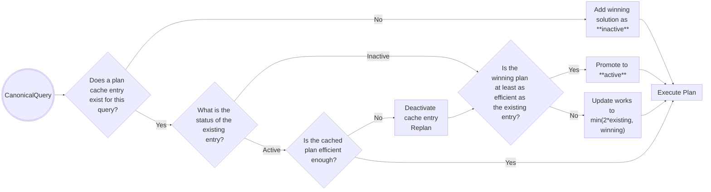

# Plan Cache

## Overview

Plan caching is a technique that stores the winning execution plan of a query and subsequently reuses it when an equivalent or similar query is issued. This is a performance optimization that avoids expensive and redundant query planning on subsequent queries with the same plan cache query shape.

> ### Aside: Query Shapes
>
> A query shape is a combination of the `filter`, `sort`, `projection`, `collation`, and `distinct` portions of a `CanonicalQuery`. It is not a full representation of the query, for only the information regarding the query's _structure_ is used.
>
> For example, these two query filters have the same query shape: `{field: "valueA"}` and `{field: "valueB"}`.
>
> See the [Query Shapes README](../query_shape/README.md) and [docs](https://www.mongodb.com/docs/manual/core/query-shapes/) for more information.

The query engine currently supports two plan cache implementations:

1. [Classic Plan Cache](#classic-plancache)
1. [Slot-Based Execution (SBE) Plan Cache](#sbe-plancache)

In both cases, logically, the plan cache is an in-memory `map<PlanCacheKey, PlanCacheEntry>`. See below for implementation details of their respective key-value pairs.

|                  | Classic                                | SBE                                  |
| ---------------- | -------------------------------------- | ------------------------------------ |
| `PlanCacheKey`   | [`encodeClassic()`](#plancachekey)     | [`encodeSBE()`](#plancachekey-1)     |
| `PlanCacheEntry` | [`SolutionCacheData`](#plancacheentry) | [`CachedSbePlan`](#plancacheentry-1) |

> ### Aside: Checking the Status of the Plan Cache
>
> To view the current status of the plan cache, you can run either of these two commands:
>
> ```
> db.coll.getPlanCache().list();
>
> db.coll.aggregate([{$planCacheStats: {}}]);
> ```
>
> At a high level, the output is a document that contains a list of entries, each of which contains the query shape's `CanonicalQuery`, `planCacheShapeHash`, `planCacheKey`, active/inactive status, and many other data points.
>
> See the [docs](https://www.mongodb.com/docs/manual/reference/operator/aggregation/planCacheStats/#output) for an in-depth explanation of the output.

## Classic [`PlanCache`](https://github.com/mongodb/mongo/blob/0765809bf08f0c55e37ab6d7ef496568b662cc33/src/mongo/db/query/plan_cache/classic_plan_cache.h#L289)

Each collection has its own instance of the Classic plan cache. The plan cache only exists on `mongod`.

### [`PlanCacheKey`](https://github.com/mongodb/mongo/blob/0765809bf08f0c55e37ab6d7ef496568b662cc33/src/mongo/db/query/plan_cache/classic_plan_cache.h#L54)

A `PlanCacheKey` is a hash value that encodes the [query shape](#aside-query-shapes).

[`encodeClassic()`](https://github.com/mongodb/mongo/blob/0765809bf08f0c55e37ab6d7ef496568b662cc33/src/mongo/db/query/canonical_query_encoder.cpp#L1287) is used to convert a `CanonicalQuery` into a hexadecimal string representation of the query shape: the `PlanCacheKey`.

For example, given this query:

```
db.c.find({a: 1, b: 2}).sort({c: 1});
```

The classic encoding is "`an[eqa,eqb]|ac|||fc`".

- `|` is a delimiter that separates portions of the query
  - They are generally used in this order: `filter|sort|projection|collation|<distinct|>other`.
- `an` represents the implicit `MatchExpression::AND`
- `[eqa, eqb]` represents the two children of the `AND`, "equals a" and "equals b".
- `ac` represents an _ascending_ sort on `c`.
- `f` [indicates](https://github.com/mongodb/mongo/blob/0765809bf08f0c55e37ab6d7ef496568b662cc33/src/mongo/db/query/canonical_query_encoder.cpp#L1298-L1302) `apiStrict`=_false_.
- `c` [indicates](https://github.com/mongodb/mongo/blob/0765809bf08f0c55e37ab6d7ef496568b662cc33/src/mongo/db/query/canonical_query_encoder.cpp#L1305-L1336) _classic_ execution.

Note that `db.c.find({a: 1, b: 2}, {a: 0}).sort({c: 1})` has the same encoding as above, since the projection section is [left empty](https://github.com/mongodb/mongo/blob/0765809bf08f0c55e37ab6d7ef496568b662cc33/src/mongo/db/query/canonical_query_encoder.cpp#L671-L675) when the entire document is required to complete the projection regardless.

### [`PlanCacheEntry`](https://github.com/mongodb/mongo/blob/0765809bf08f0c55e37ab6d7ef496568b662cc33/src/mongo/db/query/plan_cache/classic_plan_cache.h#L274)

A `PlanCacheEntry` is a wrapper for [`SolutionCacheData`](https://github.com/mongodb/mongo/blob/0a68308f0d39a928ed551f285ba72ca560c38576/src/mongo/db/query/plan_cache/classic_plan_cache.h#L223), which is a member of the winning `QuerySolution`. This `SolutionCacheData` is a "hint" that when joined with an actual query can be used to reconstruct a copy of the original `QuerySolution`. This is done by traversing `SolutionCacheData`'s internal [`PlanCacheIndexTree`](https://github.com/mongodb/mongo/blob/0a68308f0d39a928ed551f285ba72ca560c38576/src/mongo/db/query/plan_cache/classic_plan_cache.h#L242), which consists of [index tags](../plan_enumerator/README.md#i-index-tagging) that assign specific indexes to the `MatchExpression`'s leaf predicates.

For example, `SolutionCacheData` does not store index _bounds_, but it does store which indexes are best suited each leaf predicate. By combining this information with the actual query, we can reproduce the index bounds.

See [here](https://github.com/mongodb/mongo/blob/bc7d24c035466c435ade89b62f958a6fa4e22333/src/mongo/db/query/classic_plan_cache.h#L93-L112) for more information.

## SBE [`PlanCache`](https://github.com/mongodb/mongo/blob/aaef082f46f3a48a1134ae870b25da28f4d94e08/src/mongo/db/query/plan_cache/sbe_plan_cache.h#L248)

Unlike the classic plan cache, the SBE plan cache exists as one instance for the entire `mongod` process, rather than on a per-collection basis; it [decorates](https://github.com/mongodb/mongo/blob/aaef082f46f3a48a1134ae870b25da28f4d94e08/src/mongo/db/query/plan_cache/sbe_plan_cache.cpp#L50) the [`ServiceContext`](https://github.com/mongodb/mongo/blob/aaef082f46f3a48a1134ae870b25da28f4d94e08/src/mongo/db/service_context.h#L357).

This approach is beneficial to SBE's design because SBE is intended to execute queries that span multiple collections, thus avoiding the classic plan cache's restriction to one collection per instance.

### [`PlanCacheKey`](https://github.com/mongodb/mongo/blob/aaef082f46f3a48a1134ae870b25da28f4d94e08/src/mongo/db/query/plan_cache/sbe_plan_cache.h#L114)

The SBE Plan Cache's `PlanCacheKey`s are conceptually equivalent to the [Classic Plan Cache's](#plancachekey), but [`encodeSBE()`](https://github.com/mongodb/mongo/blob/aaef082f46f3a48a1134ae870b25da28f4d94e08/src/mongo/db/query/canonical_query_encoder.cpp#L1341) is used to generate `PlanCacheKey`s.

For example, the same query:

```
db.c.find({a: 1, b: 2}).sort({c: 1})
```

after undergoing `encodeSBE()` looks like this: `an[eqa?,eqb?]|ac|||nnnnf|`. The encoding accounts for the auto-parameterization of the `MatchExpression` component, ensuring that identical expression trees have the same key. See [`encodeSBE()`](https://github.com/mongodb/mongo/blob/aaef082f46f3a48a1134ae870b25da28f4d94e08/src/mongo/db/query/canonical_query_encoder.cpp#L1341) for details.

### [`PlanCacheEntry`](https://github.com/mongodb/mongo/blob/aaef082f46f3a48a1134ae870b25da28f4d94e08/src/mongo/db/query/plan_cache/sbe_plan_cache.h#L233)

Unlike the Classic Plan Cache, the SBE Plan Cache directly stores [`CachedSbePlan`](https://github.com/mongodb/mongo/blob/aaef082f46f3a48a1134ae870b25da28f4d94e08/src/mongo/db/query/plan_cache/sbe_plan_cache.h#L210)s. Each `CachedSbePlan` is a wrapper for an entire `sbe::PlanStage` execution tree. See [below](#building-cached-plans) for more information.

## General Plan Cache Behavior

### Initial Writes

When a query is planned for the first time and a winning solution is selected, the [`ClassicPlanCacheWriter`](https://github.com/mongodb/mongo/blob/aaef082f46f3a48a1134ae870b25da28f4d94e08/src/mongo/db/exec/plan_cache_util.h#L148) [adds](https://github.com/mongodb/mongo/blob/aaef082f46f3a48a1134ae870b25da28f4d94e08/src/mongo/db/exec/plan_cache_util.cpp#L380) the winning query plan to the plan cache for future use. When plans are initially added to the cache, they are marked as **inactive**.

> ### Aside: Inactive vs. Active Cache Entries
>
> An _inactive_ cache entry exists but cannot be used (yet). Inactive cache entries can be [promoted to active](#updating-the-plan-cache) when a query of the same shape runs and exhibits similar or better trial period performance, as measured by the entry's number of ["works"](#aside-plan-cache-works). This behavior prevents situations where a plan cache entry is created with an unreasonably high works value. When this happens, the plan can get stuck in the cache since [replanning](#aside-replanning) will never kick in.

> ### Aside: Plan Cache "Works"
>
> The plan cache stores a [`ReadsOrWorks`](https://github.com/mongodb/mongo/blob/aaef082f46f3a48a1134ae870b25da28f4d94e08/src/mongo/db/query/plan_cache/plan_cache.h#L112) value for each entry, equivalent to the amount of ["work"](../../exec/runtime_planners/classic_runtime_planner/README.md#aside-works) associated with the plan at the time of caching.
>
> - For Classic, this is the number of calls to `PlanStage::work()`
> - For SBE, this is the number of individual _reads_ done from storage-level cursors.

### Updating the Plan Cache

If after multiplanning, a query's shape matches an existing entry, a few possible scenarios may occur, as described in [`getNewEntryState()`](https://github.com/mongodb/mongo/blob/aaef082f46f3a48a1134ae870b25da28f4d94e08/src/mongo/db/query/plan_cache/plan_cache.h#L763).

1. If the existing entry is **inactive**:
   1. If the new winning plan's efficiency is greater than or equal to the existing entry (fewer or equal works), the plan is believed to be "valuable" and it replaces the existing entry. This new entry is given _active_ state.
   2. If the new winning plan is less efficient (more works) than the existing entry, the existing entry's "works" value is updated to `min(new works, 2 * existing works)`. The entry remains _inactive_.
2. If the existing entry is **active**:
   1. If the new winning plan is more efficient (fewer works), the cache is updated with a new (lower) works value and the plan from the new entry.
   2. If the new winning plan is not as efficient, no change occurs.

### Using Active Entries

When a query is issued and an **active** plan cache entry already exists for the query, the cached plan cache entry is utilized and query planning is skipped altogether. See [Building Cached Plans](#building-cached-plans) for details on how cached query plans are reconstructed and executed.

> ### Aside: Replanning
>
> If we've decided to use a cached plan, a trial execution period is run to gather the first batch of results. If the number of works required exceeds the [`internalQueryCacheEvictionRatio`](https://github.com/mongodb/mongo/blob/aaef082f46f3a48a1134ae870b25da28f4d94e08/src/mongo/db/query/query_knobs.idl#L288) (10x by default), this cache entry is deactivated and the query [replans](https://github.com/mongodb/mongo/blob/aaef082f46f3a48a1134ae870b25da28f4d94e08/src/mongo/db/exec/cached_plan.h#L112) using standard multiplanning.



## Building Cached Plans

### Classic

After a query command is converted into a `CanonicalQuery`, the plan cache is immediately consulted to confirm whether a `PlanCacheEntry` for this query already exists, using `encodeClassic()` to check if a `PlanCacheKey` is already in the cache. If an active cache entry already exists, the index tags from the `PlanCacheEntry`'s `PlanCacheIndexTree` are applied to the query's `MatchExpression` filter to [reconstruct](https://github.com/mongodb/mongo/blob/aaef082f46f3a48a1134ae870b25da28f4d94e08/src/mongo/db/query/query_planner.cpp#L692) the corresponding `QuerySolution` and `PlanStage` trees, entirely bypassing plan enumeration and ranking.

### SBE

Building an SBE `PlanCacheEntry` is more complex. The process is as follows:

1. Clone the original `CachedSbePlan` so that each query can have its own `sbe::PlanStage` tree, while the plan cache holds the original.
1. Compile any expressions in the execution tree to SBE bytecode.
1. Queries are [auto-parameterized](https://github.com/mongodb/mongo/blob/aaef082f46f3a48a1134ae870b25da28f4d94e08/src/mongo/db/query/canonical_query.cpp#L227-L233), meaning that eligible constants in the incoming `MatchExpression` are automatically assigned input parameter ids.
   - Only the `filter` of the query is auto-parameterized.
1. Now as an `sbe::PlanStage` tree, replace any constants with references to slots in the SBE `RuntimeEnvironment`.
   - The resulting plan is now parameterized; it can be rebound to new constants by assigning new values to `RuntimeEnvironment` slots via a [`inputParamToSlotMap`](https://github.com/mongodb/mongo/blob/17f71567688c266de1f9a4cfc20ef6a42570ba03/src/mongo/db/query/stage_builder/sbe/builder_data.h#L229), a map from input parameter id to runtime environment slot.

> ### Aside: `IntervalEvaluationTree`
>
> The [Interval Evaluation Tree](https://github.com/mongodb/mongo/blob/17f71567688c266de1f9a4cfc20ef6a42570ba03/src/mongo/db/query/interval_evaluation_tree.h#L59) (IET) is used to restore index bounds from a cached SBE plan, allowing index bounds to be evaluated dynamically from [`_inputParamIdToExpressionMap`](https://github.com/mongodb/mongo/blob/17f71567688c266de1f9a4cfc20ef6a42570ba03/src/mongo/db/query/canonical_query.h#L429-L430), generated by [`MatchExpression::parameterize()`](https://github.com/mongodb/mongo/blob/17f71567688c266de1f9a4cfc20ef6a42570ba03/src/mongo/db/matcher/expression.h#L343-L347).
>
> `translate()` has two function definitions, [one](https://github.com/mongodb/mongo/blob/17f71567688c266de1f9a4cfc20ef6a42570ba03/src/mongo/db/query/index_bounds_builder.h#L118-L135) for generating an IET and [another](https://github.com/mongodb/mongo/blob/17f71567688c266de1f9a4cfc20ef6a42570ba03/src/mongo/db/query/index_bounds_builder.h#L137-L145) for generating index bounds from a cached IET.

See [here](https://github.com/mongodb/mongo/blob/17f71567688c266de1f9a4cfc20ef6a42570ba03/src/mongo/db/query/stage_builder/sbe/builder_data.h#L217-L228) for an example.

## Cache Eviction and Invalidation

The Plan Cache supports a least-recently used (LRU) [eviction policy](https://github.com/mongodb/mongo/blob/17f71567688c266de1f9a4cfc20ef6a42570ba03/src/mongo/db/query/lru_key_value.h#L76) in order to avoid growing too large. This value is controlled by [`internalQueryCacheMaxEntriesPerCollection`](https://github.com/mongodb/mongo/blob/17f71567688c266de1f9a4cfc20ef6a42570ba03/src/mongo/db/query/query_knobs.idl#L258)

Any DDL event (e.g. collection drop or index creation, deletion, or hiding) empties the plan cache for the relevant collection. In the Classic case, this is a full flush.

> ### Aside: Multiplanning Storms
>
> When the plan cache is fully flushed (or generally empty for a common query shape), the server is susceptible to a **multiplanning storm**. A multiplanning storm occurs when many queries of the same shape hit the server at once, all simultaneously multiplanning and using resources accordingly. Without a plan cache entry for this recurring query shape or enough time to store one query's winning plan for future use, the server may unnecessarily consume large amounts of memory. For example, if a query shape requires a multikey index scan or blocking sort and many are issued concurrently without a plan cache entry, the risk of an Out-of-Memory (OOM) error is high. See [SPM-3900](https://jira.mongodb.org/browse/SPM-3900) for mitigation efforts.

## Single-Solution Queries

While the classic plan cache was designed specifically to avoid repeated multi-planning, the SBE plan cache skips all phases of query optimization and compilation. This skips the costly `QuerySolution` to a `sbe::PlanStage` conversion.

When a query using the Classic engine has only one `QuerySolution`, multiplanning does not occur, so no cache entry is created. However, in the SBE case, we store cache entries for single-solution queries to avoid re-converting to an `sbe::PlanStage` tree.

There is a long-standing request ([SERVER-13341](https://jira.mongodb.org/browse/SERVER-13341)) to cache single-solution queries in the Classic Plan Cache.

## Subplanning

Rooted `$or` queries (queries that include a `$or` at the top level) interact differently with the [plan cache](https://github.com/mongodb/mongo/blob/17f71567688c266de1f9a4cfc20ef6a42570ba03/src/mongo/db/exec/subplan.cpp#L188-L203). For an introduction to subplanning, refer to [Classic Runtime Planning](../../exec/runtime_planners/classic_runtime_planner/README.md#subplanner).

Rooted `$or` queries interact with the plan cache on a [_per-clause basis_](https://github.com/mongodb/mongo/blob/17f71567688c266de1f9a4cfc20ef6a42570ba03/src/mongo/db/exec/subplan.cpp#L247-L249); each branch of the `$or` uses the plan cache separately.

For each `$or` branch:

- If there is a cache entry for this branch, recover and use it.
- If there is no plan cache entry for this branch:
  - If there is only a single solution for this branch, use it.
  - If there are multiple solutions for this branch, multiplan each branch individually. Cache the winner only if there is no tie and we return at least one document.

The restriction on when to cache a winning plan helps keep the plan cache contained to "good" plans, since [we don't replan (and evict) subplanned queries](https://jira.mongodb.org/browse/SERVER-18777).

For example, say we run these three queries, where `A`, `B`, `C`, and `D` are arbitrary predicates:

```
db.c.find({$or: [A, B, C]});
db.c.find({$or: [A, B, D]});
db.c.find({$or: [B, C, D]});
```

Assuming all four predicates justify more than one solution, the plan cache will contain four entries, one for each predicate.

## Plan Pinning

The SBE plan cache supports ["plan pinning"](https://github.com/mongodb/mongo/blob/17f71567688c266de1f9a4cfc20ef6a42570ba03/src/mongo/db/query/plan_cache/plan_cache.h#L183-L185), which gives pinned plans no works value and therefore does not subject them to replanning. For example, [single-solution queries](#single-solution-queries) and [rooted `$or`](#subplanning) queries are pinned. These plans can still be invalidated via [standard cache eviction](#cache-eviction-and-invalidation), however.

---

[Return to Cover Page](../README_QO.md)
