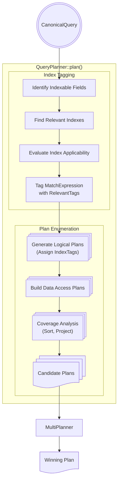
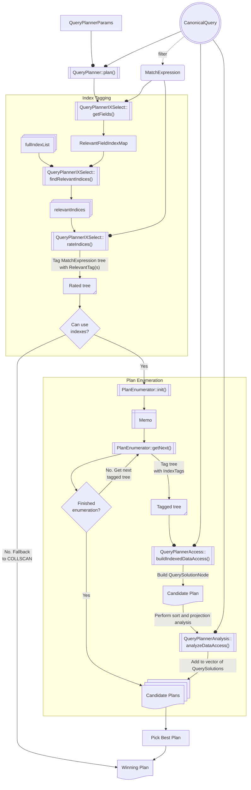

# Plan Enumeration

## Overview

After a query is [canonicalized](../README_logical_models.md#canonicalquery) and optimized through [heuristic rewrites](../../matcher/README.md), the query planner generates multiple candidate plans, exploring various combinations of available indexes to optimize data access. The resulting physical plans, represented as a vector of `QuerySolution`s, are passed on to either the [multiplanner](../../exec/runtime_planners/classic_runtime_planner/README.md) or the [cost-based ranker](TODO SERVER-100250) to determine an efficient winning plan.

The entrypoint to query planning is [`QueryPlanner::plan()`](https://github.com/mongodb/mongo/blob/3b45ca6c10c2a964ab7d606d4f4b04fc3d493bcc/src/mongo/db/query/query_planner.cpp#L938), which is invoked during the [process](https://github.com/mongodb/mongo/blob/e16bc2248a3410167e39d09bb9bc29a96f026ead/src/mongo/db/query/get_executor.cpp#L521) of constructing a plan executor for a query. Given a `CanonicalQuery` and a list of available indices and other data in [`QueryPlannerParams`](https://github.com/mongodb/mongo/blob/e16bc2248a3410167e39d09bb9bc29a96f026ead/src/mongo/db/query/query_planner_params.h#L115), the function returns a list of possible query solutions. Broadly, planning involves two main phases:

1. [**Index Tagging**](#i-index-tagging): This phase identifies the indexes that can be used to satisfy query predicates. The output is a [**rated tree**](https://github.com/mongodb/mongo/blob/e16bc2248a3410167e39d09bb9bc29a96f026ead/src/mongo/db/query/query_planner.cpp#L1161-L1164) that contains annotations of relevant indices to indexable nodes in the query's `MatchExpression` tree.
1. [**Plan Enumeration**](#ii-plan-enumeration): Once the tree is tagged with index information, the plan enumeration phase generates a set of feasible execution plans from the power set (all possible subsets) of tagged indexes. A **data access plan** is built for each enumerated plan, with additional **coverage analysis** for sorts and projections. The output is a set of candidate query solutions.



Note that if no indexed plans are possible, we will fallback to a [collection scan](#collection-scan-plans). If indexed plans are present, we will always choose one of them over a collection scan.

## I. Index Tagging

The purpose of index tagging is to produce a set of indexes that can satisfy components of the query's filter, which will then be systematically combined and assigned to predicates in the plan enumeration phase. The process involves:

1. Identifying which fields of the `MatchExpression` are satisfiable by an index.
1. Figuring out which indexes can be used to answer predicates over the indexable fields.
1. Determining how useful each index is to each predicate.

### 1. Identify indexable fields in the query

Given a `MatchExpression` tree, the [`QueryPlannerIXSelect::getFields()`](https://github.com/mongodb/mongo/blob/e16bc2248a3410167e39d09bb9bc29a96f026ead/src/mongo/db/query/planner_ixselect.cpp#L247) function recursively traverses the tree, identifies the fields that can potentially use an index, and populates a map ([`RelevantFieldIndexMap`](https://github.com/mongodb/mongo/blob/e16bc2248a3410167e39d09bb9bc29a96f026ead/src/mongo/db/query/planner_ixselect.h#L55)) with those fields and metadata about their indexability requirements.

The current node's type affects its traversal behavior in the following manner:

- If the node is a [**sargable**](https://github.com/mongodb/mongo/blob/e16bc2248a3410167e39d09bb9bc29a96f026ead/src/mongo/db/query/indexability.h#L46) leaf node, i.e. it can use an index over its field path, then it's added to the map. [Metadata](https://github.com/mongodb/mongo/blob/e16bc2248a3410167e39d09bb9bc29a96f026ead/src/mongo/db/query/planner_ixselect.h#L51) about whether it can use a sparse index is stored as well.

> ### Aside: Sparse Indexes
>
> A **sparse index** only contains entries for documents where the indexed field is present, even if it contains a null value. It skips over any document that's missing the indexed field. Since it doesn't contain all the documents in a collection, it is considered "sparse." On the other hand, non-sparse indexes will store null values for documents that don't contain the indexed field.
>
> Sparse indexes can answer queries presuming the existence of the sparse field. For instance, the following index
>
> ```
> db.coll.createIndex({field: 1}, {sparse: true});
> ```
>
> will be able to answer the query `{field: {$gt: 3}}` or `{field: {$type: "array"}}`. However, it cannot be used for the query `{field: {$exists: false}}`.

- If we're in a logical node (e.g. `AND` or `OR`), its children are traversed.
- If the node is an [`ELEM_MATCH_OBJECT`](https://github.com/mongodb/mongo/blob/e16bc2248a3410167e39d09bb9bc29a96f026ead/src/mongo/db/query/planner_ixselect.cpp#L260) with a non-empty path component, then its children are traversed with the prefix prepended to the path.
- If the node is a [`NOR`](https://github.com/mongodb/mongo/blob/e16bc2248a3410167e39d09bb9bc29a96f026ead/src/mongo/db/query/planner_ixselect.cpp#L252), the function stops traversal because any children nodes are not indexable.

### 2. Find relevant indexes

#### a. Expand indexes

First, the planner [expands](https://github.com/mongodb/mongo/blob/e16bc2248a3410167e39d09bb9bc29a96f026ead/src/mongo/db/query/planner_ixselect.cpp#L334) the list of `IndexEntry`s present in the collection, resolving all wildcard (`$**`) indexes that may be able to answer the query.

> ### Aside: Wildcard Indexes
>
> Since MongoDB supports flexible schemas where document field names may differ within a collection, it may not always be possible or helpful to index a specific field. **Wildcard indexes** support queries against such arbitrary or unknown fields. It can be created using the wildcard specifier (`$**`) as the index key:
>
> ```
> db.coll.createIndex({"$**": <sortOrder>});
> ```

This process will first filter out fields that aren't supported by a sparse index, because wildcard indexes are inherently sparse. For the remaining fields, the planner will build mock `IndexEntry`s by stubbing in the provided field into the wildcard field. In the case of a compound wildcard index, even if the wildcard field is irrelevant, it may be possible that the regular fields can be used to answer the query. The index is expanded for later analysis.

#### b. Filter relevant indexes

Next, the planner [filters](https://github.com/mongodb/mongo/blob/e16bc2248a3410167e39d09bb9bc29a96f026ead/src/mongo/db/query/planner_ixselect.cpp#L314) a list of all `IndexEntry`s in the collection and outputs only those indexes prefixed by fields we have predicates over. These are the indexes that could be useful in answering the query. Each considered index must be either (1) non-sparse or (2) able to answer a field that is supported by a sparse index.

### 3. Determine how useful each index is to each predicate

Finally, the planner calls the [`rateIndices()`](https://github.com/mongodb/mongo/blob/e16bc2248a3410167e39d09bb9bc29a96f026ead/src/mongo/db/query/planner_ixselect.cpp#L760) function to determine how useful each relevant index is to the predicates in the subtree rooted at 'node'. It outputs a **rated tree**, where each indexable node in the query's `MatchExpression` is affixed with [`RelevantTag`](https://github.com/mongodb/mongo/blob/e16bc2248a3410167e39d09bb9bc29a96f026ead/src/mongo/db/query/index_tag.h#L100)(s).

An index is considered useful if it is [**compatible**](https://github.com/mongodb/mongo/blob/e16bc2248a3410167e39d09bb9bc29a96f026ead/src/mongo/db/query/planner_ixselect.cpp#L369), which can depend on the index type, `MatchExpression` type, and other query metadata. For instance:

- Hashed indexes can only be used with sets of equalities.
- For comparisons to collatable types (strings, arrays, objects), the query collation must match the index collation.
- Expression (`$expr`) language comparisons aren't indexable if the field has multikey components.
- The `NOT` operator has specific restictions on when it can use an index.

Generally, compound indexes are more useful when the predicate is on the primary field because the data is grouped by the first field in the index and then by each subsequent field. However, if a compound index is not prefixed by a predicate's path, it may still be useful if there exists another predicate that (1) will use that index and (2) is connected to the original predicate by sharing an `AND` parent. Given a leaf node with the predicate `{b: 1}` and the compound index `{a: 1, b: 1}`, the predicate will still be tagged with the index if its part of a query like `{$and: [{a: 1}, {$or: [{b: 1}, {c: 1}]}]}`.

Before the rated tree is passed into the plan enumeration phase, it goes through some additional post-processing to ensure a correct and minimal set of index assignments is applied to each node in the tree. The planner [removes](https://github.com/mongodb/mongo/blob/e16bc2248a3410167e39d09bb9bc29a96f026ead/src/mongo/db/query/planner_ixselect.cpp#L841) invalid assignments to text and geo indexes, as these can only be used to satisfy text and geo queries. It also strips invalid assignments to wildcard indexes and partial indexes if the assignment is incompatible with the index's filter expression.

It also applies an optimization that [removes](https://github.com/mongodb/mongo/blob/e16bc2248a3410167e39d09bb9bc29a96f026ead/src/mongo/db/query/planner_ixselect.cpp#L900) unnecessary index assignments, reducing time spent considering redundant or similar indexes in the plan enumeration and selection phases. For instance, imagine we have a query `{$and: [{a: 1}, {b: 1}]}`, where `a` is a unique field that doesn't contain any duplicate values. It can be satisfiable by the following indexes:

- `{a: 1}` with `{unique: true}`
- `{a: 1, b: 1}`
- `{a: 1, c: 1}`

Since there is a single-field unique index on `a`, we can strip all the other index assignments and just keep this one, as key-value lookups are the fastest plan and thus preferred over any more complex plan. Instead of having to generate multiple plans, the plan enumerator only needs to generate a plan containing an index scan over `a`.

### 4. Special Cases

**`$elemMatch`**:
The [`ElemMatchContext`](https://github.com/mongodb/mongo/blob/e16bc2248a3410167e39d09bb9bc29a96f026ead/src/mongo/db/query/planner_ixselect.h#L70) is used during index selection to keep track of if any `$elemMatch` predicates were encountered when walking a `MatchExpression` tree. Special logic is required here because `$elemMatch` has different semantics regarding multikey indexes (indexes on fields containing array values). Additionally, if we're inside an `ELEM_MATCH_OBJECT`, every predicate in the current clause has an implicit prefix on the `$elemMatch` path, so we shouldn't tag indexes that don't account for the prefix. For instance, if we're evaluating the first clause of the `$or` in

```
{a: {$elemMatch: {$or: [{b: 1, f: 1}, ... ]}}}
```

and we have a partial index on the clause `{b: 1, f: 1}`, we would see that the expression above is actually referring to `a.b` and `a.f`, and should thus remove the invalid index from consideration.

**Hints**:
A user may override the default index selection and query optimization process by providing a [**hint**](https://www.mongodb.com/docs/manual/reference/method/cursor.hint/). In this case, the query planner will only consider the hinted index and skip the process above entirely. If the hint in a range query also contains valid values for `.min()` and `.max()`, we can skip index bounds building and return a single solution.

**Query Settings**:
A user may also pass in a list of allowed indices in the **indexHints** field of the **query settings**. This takes precedence if a hint is also provided. Usually, a hint can only be used for a specific query and is tied to the operation it is issued with, but the query settings can be applied to a query shape cluster-wide and are persisted after shutdown.

**Text and Geo Queries**:
Text and geo queries are unique in that they require a text and geo index, respectively, for successful execution. Each index type has special restrictions that require different index tagging logic than what is described above. For more information, refer to the docs on [text](https://www.mongodb.com/docs/manual/core/indexes/index-types/index-text/) and [geo](https://www.mongodb.com/docs/manual/core/indexes/index-types/index-geospatial/) indexes.

## II. Plan Enumeration

If there are any relevant indexes at the end of the index tagging phase, the query planner tries to create indexed plans through the [`PlanEnumerator`](https://github.com/mongodb/mongo/blob/e16bc2248a3410167e39d09bb9bc29a96f026ead/src/mongo/db/query/plan_enumerator/plan_enumerator.h#L112). The output is a vector of `QuerySolution`s that will undergo multiplanning in order to pick one winning plan. The process is broken up into several steps:

1. Enumerate plan trees with `IndexTag`s.
1. Construct a data access plan for each tagged tree.
1. Perform sort and covering analysis for the plan.
1. Add each `QuerySolution` to the vector of query solutions.

> ### Aside: Enable Debug Logging
>
> The whole plan enumeration process can be quite complex, and it can be difficult to reason about how a sample query on a collection with a set of indexes is processed. Thus, it can be helpful to turn on debug logging to visualize the outputs of the different phases (e.g. the rated tree, tagged tree, and memo). Start up a `mongod` with the following options:
>
> ```
> ./bazel-bin/install-dist-test/bin/mongod --setParameter logComponentVerbosity='{query: {verbosity: 5}}'
> ```

### 1. Enumerate plans with `IndexTag`s

#### a. Initialize the memo

First, the plan enumerator [initializes](https://github.com/mongodb/mongo/blob/e16bc2248a3410167e39d09bb9bc29a96f026ead/src/mongo/db/query/plan_enumerator/plan_enumerator.cpp#L312) the underlying **memo** structure starting from the tagged `_root` of the `MatchExpression`.

> ### Aside: Memo
>
> The `_memo` structure tracks and manages reusable subplans during plan enumeration, avoiding redundant computations for parts of the query that share the same structure. It helps efficiently handle complex queries by storing and combining intermediate results.
>
> **Key Components**:
>
> - `MemoID`:
>   - A unique identifier used to index into `_memo`.
>   - Defined as a `typedef` over `size_t` for readability.
>   - An entry in `_memo` is a `NodeAssignment`.
> - `NodeAssignment`
>   - Represents an association between query predicates and indexes. For a full description of the different types of `NodeAssignment`s, refer to [`enumerator_memo.h`](https://github.com/mongodb/mongo/blob/e16bc2248a3410167e39d09bb9bc29a96f026ead/src/mongo/db/query/plan_enumerator/enumerator_memo.h):
>   - `OR` and array node assignments generally associate a `MemoID` to a `subnodes` vector of other `MemoID`s.
>   - `AndAssignment` holds a `choices` vector of possible subplans represented by an `AndEnumerableState`, which itself holds a vector of `OneIndexAssignment`s.
>     - This holds a single `index`, as well as a vector of `MatchExpression`s (`preds`) and a vector of `IndexPosition`s (`positions`).
>     - These are associated vectors: `preds[i]` uses the current index at position `positions[i]`.
>
> **Example**:
> Given the following query:
>
> ```
> {
>   "a": { "$gt": 5 },
>   "$or": [
>      { "b": { "$lt": 10 } },
>      { "c": { "$eq": 3 } }
>    ]
> }
> ```
>
> and the following indexes:
>
> 1. **Index 0**: `{a: 1}`
> 1. **Index 1**: `{b: 1}`
> 1. **Index 2**: `{c: 1}`
> 1. **Index 3**: `{a: 1, b: 1}`
>
> this is a visual representation of what the memo structure would look like:
>
> ```
> Root (AND) [MemoID: 0]
> ├── "a > 5" [MemoID: 1]
> │   ├── Index 0: {a: 1}
> │   └── Index 3: {a: 1, b: 1} (uses "a")
> └── OR [MemoID: 2]
>    ├── "b < 10" [MemoID: 3]
>    │   ├── Index 1: {b: 1}
>    │   └── Index 3: {a: 1, b: 1} (uses "b")
>    └── "c == 3" [MemoID: 4]
>        ├── Index 2: {c: 1}
> ```

The [`prepMemo()`](https://github.com/mongodb/mongo/blob/e16bc2248a3410167e39d09bb9bc29a96f026ead/src/mongo/db/query/plan_enumerator/plan_enumerator.cpp#L383) function traverses the `MatchExpression` recursively and generates the memo from it. The function returns true if the provided node uses an index, and false otherwise. A parent node may require information from its children nodes to determine whether or not it can be indexed.

For example, an `OR` requires all its children to be indexed in order to be indexed, because an `IXSCAN` on one branch doesn't provide a superset of the documents required by the other branches. An `AND`, on the other hand, only requires one of its fields to be indexed because the `IXSCAN` returns a superset of the documents required by the query. The rest of the query filter can be applied as a filter on top of a `FETCH` that's placed on top of the `IXSCAN`. If a node cannot be indexed, we immediately bail out and return to the parent node, so we don't do any additional work (e.g. in the case of an `OR` whose first child can't be indexed, we don't check to see if the remaining children can be indexed).

If the current node can be indexed, the memo [allocates](https://github.com/mongodb/mongo/blob/e16bc2248a3410167e39d09bb9bc29a96f026ead/src/mongo/db/query/plan_enumerator/plan_enumerator.cpp#L370) a `NodeAssignment` and associates it with the provided `MatchExpression`.

After filling out the memo, if the `internalQueryPlannerEnableIndexPruning` feature flag is enabled, the plan enumerator [prunes](https://github.com/mongodb/mongo/blob/e16bc2248a3410167e39d09bb9bc29a96f026ead/src/mongo/db/query/plan_enumerator/memo_prune.cpp#L275) index assignments from the memo if they're interchangeable with another existing assignment. This ensures that we output a set of plans that are sufficiently distinct from one another. For example, given the query `{a: 1}`, the indexes `{a: 1}` and `{a: 1, b: 1}` are interchangeable, so only one will be kept for further consideration.

#### b. Generate tagged trees

At this point, the memo is fully initialized and pruned so that the most relevant indexes remain. The plan enumerator generates successive tagged trees by calling [`getNext()`](https://github.com/mongodb/mongo/blob/e16bc2248a3410167e39d09bb9bc29a96f026ead/src/mongo/db/query/plan_enumerator/plan_enumerator.cpp#L349), which outputs a possible plan. Leaves in the plan that have a field name (not logical nodes) are tagged with an index to use. The function returns a `MatchExpression` representing a point in the query tree, or a `nullptr` if no more plans can be outputted. Plans are generated until there are no more plans left, or until we hit the [`maxIndexedSolutions`](https://github.com/mongodb/mongo/blob/e16bc2248a3410167e39d09bb9bc29a96f026ead/src/mongo/db/query/query_planner_params.h#L340) limit.

The [`tagMemo()`](https://github.com/mongodb/mongo/blob/e16bc2248a3410167e39d09bb9bc29a96f026ead/src/mongo/db/query/plan_enumerator/plan_enumerator.cpp#L1648) function traverses the memo structure and annotates the tree with `IndexTag`s for the chosen indices recursively, exploring the available indexes for each node, and for each index, exploring the available indexes for the node's children. The `IndexTag` contains information such as the index number, index type, relevant position in the index (for compound indexes), and whether or not it is safe to combine bounds for multiple leaf expressions on the same field in the index. Next, [`tagForSort()`](https://github.com/mongodb/mongo/blob/e16bc2248a3410167e39d09bb9bc29a96f026ead/src/mongo/db/query/plan_enumerator/plan_enumerator.cpp#L254) tags each node of the tree with the lowest numbered index that the subtree rooted at that node uses.

Finally, we move to the next enumeration state by calling [`nextMemo()`](https://github.com/mongodb/mongo/blob/e16bc2248a3410167e39d09bb9bc29a96f026ead/src/mongo/db/query/plan_enumerator/plan_enumerator.cpp#L1793). This step advances the enumeration state for a particular subtree of the query, attempting to move the current node (and its subtree) to the next valid state of enumeration. If the current node has exhausted all of its states, it restarts its enumeration at the beginning state and signals to its parent to advance to the next state. This ensures that valid query plans are enumerated efficiently while respecting certain constraints, such as an upper bound for `OR` enumerations.

> ### Aside: Or Pushdown
>
> `OR` pushdown is an optimization that pushes down predicates in a `MatchExpression` deeper into the tree if it has a sibling `OR`, with the goal of enabling better index utilization. For example, imagine we had the following `MatchExpression` tree:
>
> ```
>        AND
>       /    \
>   {a: 5}    OR
>           /    \
>         AND    {e: 9}
>       /     \
>    {b: 6}   OR
>           /    \
>       {c: 7}  {d: 8}
> ```
>
> Let's say the collection has an index `{a: 1}`.
>
> At a first glance, it looks like we can't satisfy the query with the index because we are missing indexes on `c`, `d`, and `e`, which are part of an `OR`. But if we push down the `{a: 5}` predicate to `{c: 7}` and `{d: 8}` in the deepest `OR`, and to the `{e: 9}` in the mid-level `OR`, we can `AND`-combine the predicates. The query is now satisfiable with the given index:
>
> ```
>                OR
>               /   \
>              /     \
>             /       \
>            /         \
>         AND          AND
>        /   \        /   \
>     {b: 6} OR    {a: 5} {e: 9}
>           /  \
>          /    \
>         /      \
>        /        \
>      AND        AND
>     /   \       /  \
>    /     \     /    \
> {a: 5} {c: 7} {a: 5} {d: 8}
> ```

> ### Aside: Lockstep Or Enumeration
>
> `$or` enumeration can generate an exponential number of plans, so it is usually limited at some [arbitrary](https://github.com/mongodb/mongo/blob/e16bc2248a3410167e39d09bb9bc29a96f026ead/src/mongo/db/query/query_knobs.idl#L378) cutoff. To maximize our chances of enumerating better plans within this cutoff limit, the lockstep `OR` enumeration prefers plans which use the same index across all branches of a contained `$or`. Consider the following example:
>
> ```
> // Query
> { a: 1, $or: [{ b: 1, c: 1 }, { b: 2, c: 2 }]}
>
> // Indexes
> [ a_b={ a: 1, b: 1 }, a_c={ a: 1, c: 1 }]
>
> // Normal Enumeration Order
> [a_b, a_b], [a_c, a_b], [a_b, a_c], [a_c, a_c]
>
> // Lockstep Or Enumeration Order
> [a_b, a_b], [a_c, a_c], [a_c, a_b], then [a_b, a_c]
> ```
>
> This behavior is controlled by the [`internalQueryEnumerationPreferLockstepOrEnumeration`](https://github.com/mongodb/mongo/blob/e16bc2248a3410167e39d09bb9bc29a96f026ead/src/mongo/db/query/query_knobs.idl#L389) knob, and is turned on by default.

### 2. Construct data access plan for each tagged tree

For each tagged tree that's enumerated, the planner [builds](https://github.com/mongodb/mongo/blob/e16bc2248a3410167e39d09bb9bc29a96f026ead/src/mongo/db/query/planner_access.cpp#L1977) a **data access plan**. This involves mapping the logical plan into a physical plan that can be understood by the plan executor. The physical representation is encapsulated by a `QuerySolutionNode`.

> ### Aside: `QuerySolutionNode`
>
> A [`QuerySolutionNode`](https://github.com/mongodb/mongo/blob/e16bc2248a3410167e39d09bb9bc29a96f026ead/src/mongo/db/query/query_solution.h#L166) is an abstract representation of a query plan. It defines the hierarchy and sequence of operations needed to execute the query, such as index scan scans, collection scans, and fetches. Once constructed, this tree of `QuerySolutionNode` objects can be transcribed into a tree of [`PlanStage`](https://github.com/mongodb/mongo/blob/e16bc2248a3410167e39d09bb9bc29a96f026ead/src/mongo/db/exec/plan_stage.h#L125)s, each of which is a basic building block used in executing a compiled query plan. The `PlanStage` tree is what gets handed off to the [`PlanExecutor`](https://github.com/mongodb/mongo/blob/e16bc2248a3410167e39d09bb9bc29a96f026ead/src/mongo/db/query/plan_executor_impl.cpp#L345) for execution.
>
> For a complete list of the different types of `QuerySolutionNode`s, refer to [`query_solution.h`](https://github.com/mongodb/mongo/blob/e16bc2248a3410167e39d09bb9bc29a96f026ead/src/mongo/db/query/query_solution.h). Here are some common ones:
>
> - `IndexScanNode`: Represents a scan over a particular index. It retrieves index entries within the specified index bounds, minimizing the amount of data scanned.
> - `FetchNode`: Provides additional filtering or data retrieval after an index scan. It retrieves full documents from the collection matching the `RecordId`s returned from the index scan, and applies a residual filter from the query, if present.
> - `CollectionScanNode`: Represents a full collection scan, typically used when no suitable indexes are available. Tends to be the most expensive as it requires scanning all the documents in the collection from disk.

Starting from the node at `root`, the data access plan is built recursively:

- **Leaf nodes**: If a leaf node is tagged with an index, the function builds an `IndexScanNode`, generating a set of index bounds and filling out their tightness information. If the bounds are exact, the set of documents that satisfy the predicate is equivalent to the set of documents that the scan provides, and the `QuerySolutionNode` is complete. If the bounds are inexact, then the set of documents returned by the scan are a superset of the documents satisfying the predicate. A `FETCH` must be placed above the `IXSCAN` to guarantee the correct results are returned.
- **Logical operators**: Logical operators like `AND` and `OR` delegate their access planning to [`buildIndexedAnd()`](https://github.com/mongodb/mongo/blob/e16bc2248a3410167e39d09bb9bc29a96f026ead/src/mongo/db/query/planner_access.cpp#L1691) and [`buildIndexedOr()`](https://github.com/mongodb/mongo/blob/e16bc2248a3410167e39d09bb9bc29a96f026ead/src/mongo/db/query/planner_access.cpp#L1841), respectively.
  - The `AND` node requires that at least one child uses an index. All non-indexed predicates are placed above the `AND` with a fetch and filter, as the index provides a superset of results. If an index intersection plan is chosen, we choose between `AndHashNode` or an `AndSortedNode` depending on whether the data is already sorted by disk location.
  - The `OR` node requires that all children use an index. An `OR` cannot have any filters hanging above it, so if any children are missing indes tags, we immediately bail out of processing. There is a special case: if some children are unable to be satisfied by an index scan, it may be possible to use a `CLUSTERED_IXSCAN` plan for them. At the end, the node collapses any identical index scans across its branches into a single scan to prevent duplicate work.

> ### Aside: Clustered Index Scans
>
> Clustered indexes are available on clustered collections, which store indexed documents in the same WiredTiger file as the index specification. This allows documents to be retrieved directly from the index file and avoids an expensive fetch from the disk.
>
> The clustered index key must be `{_id: 1}`.

- **Array operators**: Nodes like `ELEM_MATCH_OBJECT` are processed by recursively building subplans for child expressions. The result is wrapped in a `FetchNode` because may return a superset of results. For instance, consider this example:

```
// Query
{ arr: { $elemMatch: { a: 10, b: 20 } } }

// Indexes (multikey on "arr", but not on "a" or "b")
{ arr.a: 1 }
{ arr.b: 1 }

// Documents
[
    { _id: 1, arr: [{ a: 10, b: 20 }, { a: 30, b: 40 }] }
    { _id: 2, arr: [{ a: 10, b: 25 }] }
    { _id: 3, arr: [{ a: 5, b: 20 }] }
    { _id: 4, arr: [{ a: 10, b: 20 }] }
]
```

The index scan on `arr.a = 10` would return documents 1, 2, and 3; the index scan on `arr.b = 20` would return documents 1, 3, and 4. This is a superset of the desired documents, so a filter is required to match only documents where `arr` contains an element where both `a = 10` and `b = 20` are true. The final result after the fetch + filter would be:

```
[
    { _id: 1, arr: [{ a: 10, b: 20 }, { a: 30, b: 40 }] }
    { _id: 4, arr: [{ a: 10, b: 20 }] }
]
```

#### a. Index Bounds Building

The entrypoint to index bounds building is [`translate()`](https://github.com/mongodb/mongo/blob/e16bc2248a3410167e39d09bb9bc29a96f026ead/src/mongo/db/query/index_bounds_builder.cpp#L359), which turns the `MatchExpression` in `expr` into a set of index bounds over a particular field. These index bounds are represented by an [`OrderedIntervalList`](https://github.com/mongodb/mongo/blob/e16bc2248a3410167e39d09bb9bc29a96f026ead/src/mongo/db/query/index_bounds.h#L53), which is an ordered list of intervals over one field.

Bounds will fall into one of the following categories:

- **Point interval**: These represent a point predicate over `[N, N]`. They represent equality matches.
- **All values interval**: These bounds span from `[MinKey, MaxKey]`, or `[MaxKey, MinKey]` if the index is sorted in the reverse order. These are non-type bracketing, meaning they scan across `BSON` type boundaries and consider all values. They are often used for `{$exists: true}` queries, and can be exact bounds if the index is sparse.
- **Range interval**: These bounds are commonly used for range predicates, and will span `start, end`. They also have `BoundsInclusion` information describing whether the bounds are inclusive or exclusive (e.g. for `GTE` vs `GT`).

Given an `OrderedIntervalList` of intervals containing index bounds, it is possible to **intersect**, **union**, and **complement** those intervals.

- **Intersect**: this compares intervals in an `AND` and merges overlaps, reducing the amount of work done during an index scan. For instance, the following query will scan a smaller range of values after its interval bounds are intersected:

```
// Query
db.coll.find({ age: {$and: [{ $gte: 5, $lte: 25 }, { $gte: 10, $lte: 30 } ]}});

// Original index bounds
OIL: [ [5, 25], [10, 30] ]

// After intersection:
OIL: [ [10, 25] ]
```

- **Union**: this sorts and then compares intervals in an `OR`, merging overlapping or adjacent intervals. The output is a minimal set of non-overlapping intervals and removing redundancies. For example, the overlapping intervals below are merged and simplified:

```
// Query
db.coll.find({
    $or: [
        { age: { $gte: 10, $lte: 20 } },
        { age: { $gte: 18, $lte: 25 } },
        { age: { $gte: 30, $lte: 40 } }
    ]
});

// Original index bounds
OIL: [ [10, 20], [18, 25], [30, 40] ]

// After intersection:
OIL: [ [10, 25], [30, 40] ]
```

- **Complement**: this complements the `OrderedIntervalList` for `NOT` predicates. For example:

```
// Query
db.coll.find({ field: { $not: { $gte: 3, $lt: 6 } } });

// Original index bounds
OIL: [ [3, 6) ]

// After complement:
OIL: [ [MinKey, 3), [6, MaxKey] ]
```

The direction of the scan will impact the bounds that are generated. The forward direction (`{field: 1}`) is the default, and would result in the intervals above. If the index is in the reverse direction (`{field: -1}`), the intervals must also scan the index in that order. For instance, the interval `[MinKey, MaxKey]` would become `[MaxKey, MinKey]`.

> ### Aside: `IntervalEvaluationTree`
>
> The [Interval Evaluation Tree](https://github.com/mongodb/mongo/blob/e16bc2248a3410167e39d09bb9bc29a96f026ead/src/mongo/db/query/interval_evaluation_tree.h#L59) (IET) is used to restore index bounds from a cached SBE plan, allowind index bounds to be evaluated dynamically from an `inputParamIdMap`. An `ietBuilder` can be passed into the `translate()` function, producing parameterized index bounds. For more information, refer to the Plan Cache [README](../plan_cache/README.md).

#### b. Bounds Tightness

**Tightness** describes the degree of precision with which predicates can be evaluated based on the index bounds. It contains two axes: (1) exactness, and (2) fetch requirement.

1. **Exact** vs **inexact** refers to whether a residual predicate needs to be applied after an index scan. Given the query `{$and: [{a: 1}, {b: 1}]}` and an index on `a`, the scan will return documents where `a = 1`. To satisfy the query predicate, we still need to apply the residual `b = 1` filter to return the desired results.
1. A **fetch** is required if the query requires data which is not in the index to be satisfied. **Covered** plans are able to access all the required data from the index. For instance, a query with a filter of `{a: 1}` and an inclusion projection on `{a: 1}` can be covered by a (non-multikey) index on `{a: 1}`, because the values of `a` are stored in the index file, and that is the only field the query cares about. We don't need to fetch any additional information about the documents from disk. (A multikey index couldn't cover this query because it stores each array element separately.)

The comprehensive list of `BoundsTightness` values can be found [here](https://github.com/mongodb/mongo/blob/e16bc2248a3410167e39d09bb9bc29a96f026ead/src/mongo/db/query/index_bounds_builder.h#L80).

> ### Aside: missing and null
>
> Our current index format does not distinguish between missing fields, and fields with an explicit `null` value. This means that an index scan over `{field: '[null, null]'}` is inexact for the query `{field: null}`, as it returns documents where the field is both `missing` and has an exact value equal to `null`. Thus, a fetch with a filter over `{field: null}` is required to return the correct results. This is what the simplified explain looks like:
>
> ```
>    winningPlan: {
>      stage: 'FETCH',
>      filter: { field: { '$eq': null } },
>      inputStage: {
>        stage: 'IXSCAN',
>        keyPattern: { field: 1 },
>        indexName: 'field_1',
>        direction: 'forward',
>        indexBounds: { field: [ '[null, null]' ] }
>      }
>    }
> ```
>
> Note that the opposite is true for the inverse, `{field: {$ne: null}}`. Here, the semantics of the `$ne` implicitly require that the field is present in the document. The bounds can be inverted and are exact, so a filter is not required to return the correct results. This is what the simplified explain looks like:
>
> ```
>    winningPlan: {
>      stage: 'FETCH',
>      inputStage: {
>        stage: 'IXSCAN',
>        keyPattern: { field: 1 },
>        indexName: 'field_1',
>        direction: 'forward',
>        indexBounds: { field: [ '[MinKey, null)', '(null, MaxKey]' ] }
>      }
>    }
> ```
>
> Note that sparse indexes can provide an exact scan over explicit `null` values, but not missings, because it distinguishes them by not indexing the missing values. Partial indexes can do the same thing, with even more flexibility.

### 3. Perform sort and covering analysis for the `QuerySolutionNode`

After the planner generates a `QuerySolutionNode` that defines the data access plan, the solution root is passed to [`analyzeDataAccess()`](https://github.com/mongodb/mongo/blob/e16bc2248a3410167e39d09bb9bc29a96f026ead/src/mongo/db/query/planner_analysis.cpp#L1340) for sort and covering analysis. The data access planning phase primarily uses the `MatchExpression` component of a query's filter to determine what indexes can be used to retrieve the required data, but it may be possible that the query's `sort` or `projection` can also be satisfied by those indexes even though they are independent of the data. Otherwise, additional stages may need to be added on top of the root to provide the sort, projection, etc. During this phase, the `QuerySolutionNode` root is wrapped into a [`QuerySolution`](https://github.com/mongodb/mongo/blob/e16bc2248a3410167e39d09bb9bc29a96f026ead/src/mongo/db/query/query_solution.h#L409), which is a container that holds the root node as well as metadata such as index usage and coverage analysis.

#### a. Analyze Sort

If the query contains a sort, the [`analyzeSort()`](https://github.com/mongodb/mongo/blob/e16bc2248a3410167e39d09bb9bc29a96f026ead/src/mongo/db/query/planner_analysis.cpp#L1249) function attempts to use the index to provide a sort to avoid falling back on an expensive in-memory blocking sort. For instance, if a traversal preference is provided, it tries to reverse the direction of the index scans to match that order. It may be the case that the indexed plan naturally provides the requested sort order, so no additional stages are required.

At this point, if the plan cannot cover the sort through an index scan, it attempts an [`explodeForSort()`](https://github.com/mongodb/mongo/blob/e16bc2248a3410167e39d09bb9bc29a96f026ead/src/mongo/db/query/planner_analysis.cpp#L1021) optimization to "explode" index scans over point intervals to an `OR` of subscans to provide a sort. If that is still insufficient, we must add a blocking sort stage.

> ### Aside: Explode for Sort Optimization
>
> The "explode for sort" optimization tries to rewrite an index scan over many point intervals to an `OR` of several index scans to leverage an indexed sort. For example:
>
> ```
> // Query
> db.coll.find({a: {$in: [1, 2]}}).sort({b: 1});
>
> // Chosen index
> {a: 1, b: 1}
>
> // Default solution
> Index Scan: a: [ [1, 1], [2, 2] ], b: [MinKey, MaxKey]
>
> // "Exploded" scans
> Index Scan 1: a: [1, 1], b: [MinKey, MaxKey]
> Index Scan 2: a: [2, 2], b: [MinKey, MaxKey]
> ```
>
> When the bounds on the primary key are on a point interval, each scan provides the sort order on the secondary key. If these scans are unioned with a merge sort instead of a hashing `OR`, the sort order provided by the scans is maintained.

#### b. Analyze Projection

If the query contains a projection, the [`analyzeProjection()`](https://github.com/mongodb/mongo/blob/e16bc2248a3410167e39d09bb9bc29a96f026ead/src/mongo/db/query/planner_analysis.cpp#L501) function determines the most efficient way to apply a projection to the plan. If the query requires the entire document or other fields that aren't fully provided by the index scans, a `FETCH` is added if it's not present. Otherwise, we know that all the required fields are provided by the index scans. A projection may still be required if:

- The plan returns extra fields that must be removed.
- The projection computes new values.
- The projection requires reformatting data.

`ProjectionNodeDefault` will handle all these scenarios, but it is the slowest option. The planner may be able to leverage a fast path using `ProjectionNodeSimple`, which can be used for projections that operate only on top-level fields (no dotted fields), or even better, `ProjectionNodeCovered`, which can be used for plans whose index scans can cover the projection.

## III. Cleanup and Refinement

After every plan is enumerated, converted into a physical `QuerySolution`, and added to the vector of all plans, the planner cleans up any index tags on the query's `MatchExpression` tree. Some final optimizations are made:

- We will always use an `EOF` solution if the query is trivially false, avoiding an unbounded index scan where all fetched documents are filtered out.
- If a sort is provided, there may be an index that satisfies it, even if it wasn't over any predicates in the filter component of the query.
- Similarly, if a projection is required, there may be an index that allows for a covered plan, even if none were considered earlier.
- Distinct queries can use an index even in the absence of a filter or sort.

### Collection Scan Plans

We will **only** consider a collection scan in the following cases:

1. A collection scan is explicitly requested by the user.
1. There are no indexed plans, so we fallback to a full collection scan.
1. The collection is clustered, and the clustered index is used by the query.
1. The collection is clustered, and the query contains a sort that is provided by the clustered index.



---

[Return to Cover Page](../README_QO.md)
