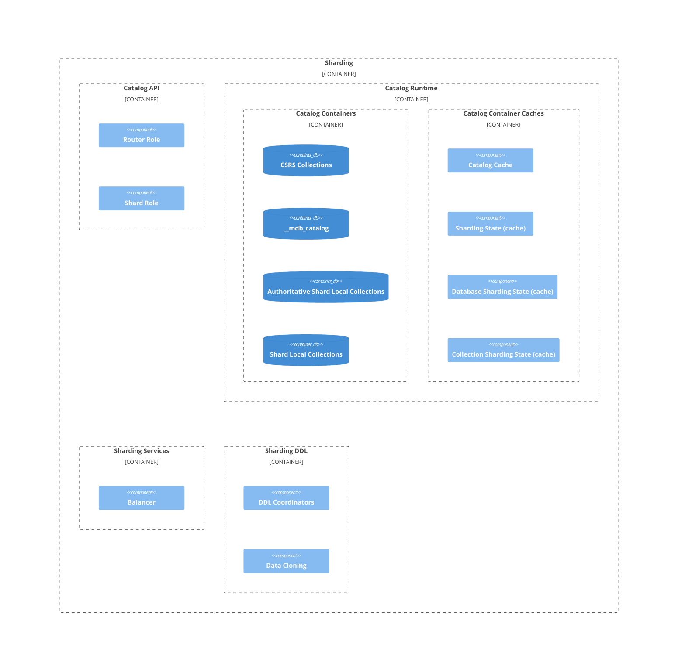

# Sharding Architecture Guide

This page contains details of the source code architecture of the MongoDB Sharding system. It is intended to be used by engineers working on the core server, with some sections containing low-level details which are most appropriate for new engineers on the sharding team.

It is not intended to be a tutorial on how to operate sharding as a user and it requires that the reader is already familiar with the general concepts of [sharding](https://docs.mongodb.com/manual/sharding/#sharding), the [architecture of a MongoDB sharded cluster](https://docs.mongodb.com/manual/sharding/#sharded-cluster), and the concept of a [shard key](https://docs.mongodb.com/manual/sharding/#shard-keys).

## Sharding terminology and acronyms

-   Config Data: All the [catalog containers](README_sharding_catalog.md#catalog-containers) residing on the CSRS.
-   Config Shard: Same as CSRS.
-   CRUD operation: Comes from [Create, Read, Update, Delete](https://en.wikipedia.org/wiki/Create,_read,_update_and_delete), and indicates operations which modify a collection's data as opposed to the catalog.
-   CSRS: **C**onfig **S**erver as a **R**eplica **S**et. This is a fancy name for the [config server](https://www.mongodb.com/docs/manual/core/sharded-cluster-config-servers/). Comes from the times of version 3.2 and earlier, when there was a legacy type of Config server called [SCCC](https://www.mongodb.com/docs/manual/release-notes/3.4-compatibility/#removal-of-support-for-sccc-config-servers) which didn't operate as a replica set.
-   CSS: [Collection Sharding State](https://github.com/mongodb/mongo/blob/master/src/mongo/db/s/collection_sharding_state.h#L59)
-   DDL operation: Comes from [Data Definition Language](https://en.wikipedia.org/wiki/Data_definition_language), and indicates operations which modify the catalog (e.g., create collection, create index, drop database) as opposed to CRUD, which modifies the data.
-   DSS: [Database Sharding State](https://github.com/mongodb/mongo/blob/master/src/mongo/db/s/database_sharding_state.h#L42)
-   Routing Info: The subset of data stored in the [catalog containers](README_sharding_catalog.md#catalog-containers) which is used for making routing decisions. As of the time of this writing, the contents of _config.databases_, _config.collections_, _config.indexes_ and _config.chunks_.
-   SS: [Sharding State](https://github.com/mongodb/mongo/blob/master/src/mongo/s/sharding_state.h#L51)

## Sharding code architecture

The graph further down visualises the architecture of the MongoDB Sharding system and the relationships between its various components and the links below point to the relevant sections describing these components.

-   [Sharding catalog](README_sharding_catalog.md#sharding-catalog)
-   [Router role](README_sharding_catalog.md#router-role)
-   [Shard role](README_sharding_catalog.md#router-role)
-   [Routing Info Consistency Model](README_routing_info_cache_consistency_model.md)
-   [Shard versioning protocol](README_versioning_protocols.md)
-   [Balancer](README_balancer.md)
-   [Range deleter](README_range_deleter.md)
-   [DDL Operations](README_ddl_operations.md)
    -   [Migrations](README_migrations.md)
    -   [UserWriteBlocking](README_user_write_blocking.md)
-   [Sessions and Transactions](README_sessions_and_transactions.md)
-   [Startup and Shutdown](README_startup_and_shutdown.md)
-   [Query Sampling for Shard Key Analyzer](README_analyze_shard_key.md)

