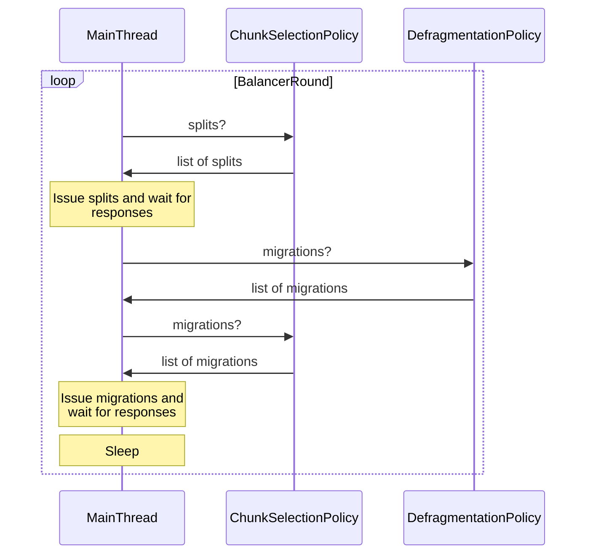
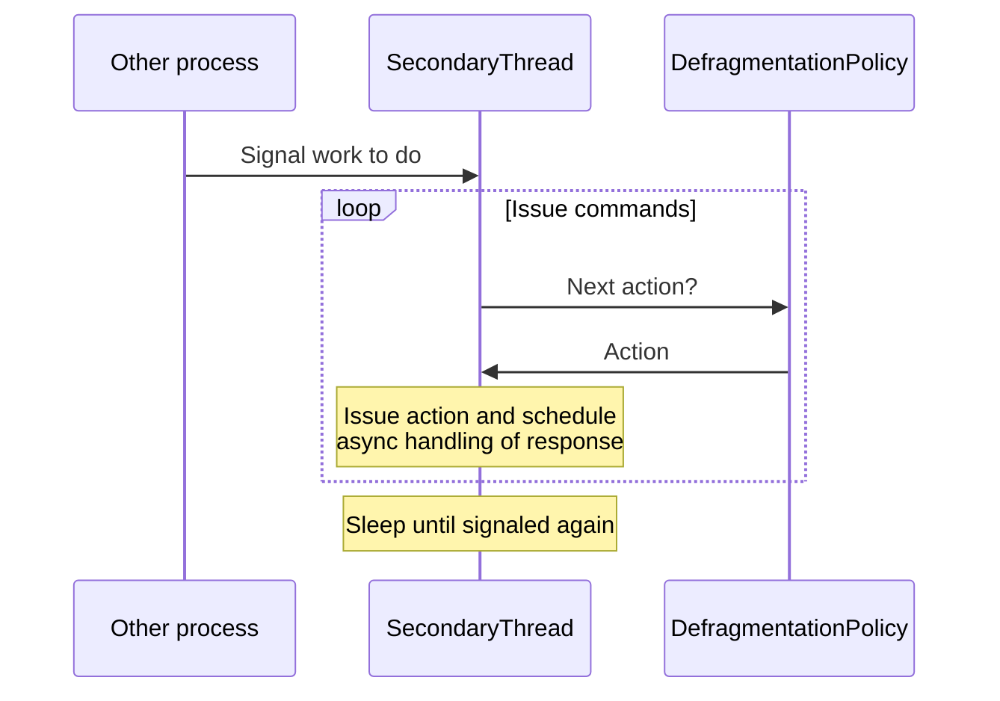

# Balancer
The [balancer](https://github.com/mongodb/mongo/blob/r6.2.0/src/mongo/db/s/balancer/balancer.h) is an application built on top of sharding that monitors the data distribution of sharded collections and issues commands to improve that distribution. It is enabled by default, and can be disabled and reenabled for the entire cluster or per-collection at any time. It can also be configured to run during specific hours each day, a period called the balancing window.

The balancer runs as a background daemon of the config server primary, and consists of two separate threads which issue requests generated by action policies. During their executions, each thread will query the different balancer policies to determine which operations to run. The two action policies are the [ChunkSelectionPolicy](#chunkselectionpolicy), which handles normal collection balancing actions, and the [DefragmentationPolicy](#defragmentationpolicy), which handles collection defragmentation.

## MainThread
The [main thread](https://github.com/mongodb/mongo/blob/6e25f79b5a12ebcb768297e15bf5cd9775a48d48/src/mongo/db/s/balancer/balancer.cpp#L695-L934) runs continuously but in "rounds" with [a delay](https://github.com/mongodb/mongo/blob/6e25f79b5a12ebcb768297e15bf5cd9775a48d48/src/mongo/db/s/balancer/balancer.cpp#L83-L89) between each round. This thread is responsible for issuing splits generated by the chunk selection policy as well as migrations from both the chunk selection and defragmentation policies. Its operation cycle looks like the following.

During each balancer round, the main thread will dispatch a batch of splits and wait for them all to complete, and then it will dispatch a batch of migrations and wait for them to complete. All of the commands issued during the round will be waited for before the round ends. Any encountered errors are logged, but otherwise ignored by the main thread.

### Jumbo chunks
If the main thread issues a migration for a chunk that is larger than twice the maximum chunk size, the migration will fail telling the balancer that the chunk is too large to be migrated. In this case, the main thread will try to split the chunk. If this fails (due to there being too many of the same shard key value in the chunk), the chunk will be marked as __jumbo__. This flag is used by the chunk selection policy to avoid selecting large chunks for migration in the future.

A jumbo chunk may still be migrated off a shard when a `moveChunk/moveRange` command is issued with `forceJumbo: true`. Users can take advantage of this option to manually redistribute jumbo chunks across a cluster.

## Secondary Thread
The [secondary thread](https://github.com/mongodb/mongo/blob/6e25f79b5a12ebcb768297e15bf5cd9775a48d48/src/mongo/db/s/balancer/balancer.cpp#L504-L693) waits on a condition variable and needs to be signaled by some other process before it will start working - usually this other process is a client thread or the main balancer thread. The secondary thread is responsible for issuing the non-migration commands (such as merge and datasize) from the defragmentation policy.

Contrary to the main thread, the secondary thread dispatches server commands asynchronously. It is possible to have up to 50  outstanding operations at any time, though there is a configurable [throttling parameter](https://github.com/mongodb/mongo/blob/6e25f79b5a12ebcb768297e15bf5cd9775a48d48/src/mongo/db/s/sharding_config_server_parameters.idl#L39-L48) that introduces a wait between scheduling operations in order to reduce the impact of the issued commands on the rate of catalog cache refreshes in secondary nodes. The default value of this throttling parameter is 1 second.

## ClusterStatistics and CollectionDataSizeInfoForBalancing
All of the migration decisions made by the two balancer policies require information about cluster data distribution. Each balancer policy has a reference to the [ClusterStatistics](https://github.com/mongodb/mongo/blob/r6.2.0/src/mongo/db/s/balancer/cluster_statistics.h) which is an interface that allows the policy to obtain the data distribution and shard utilization statistics for the cluster. This includes information about which chunks are owned by which shards, the zones defined for the collection, and which chunks are a part of which zones. The chunk selection policy also needs more specific information about the data size for each collection on each shard and uses the [CollectionDataSizeInfoForBalancing](https://github.com/mongodb/mongo/blob/6e25f79b5a12ebcb768297e15bf5cd9775a48d48/src/mongo/db/s/balancer/balancer_policy.h#L202-L212) to track this information.

## ChunkSelectionPolicy
The [chunk selection policy](https://github.com/mongodb/mongo/blob/r6.2.0/src/mongo/db/s/balancer/balancer_chunk_selection_policy.h) is responsible for generating operations to maintain the balance of sharded collections within the cluster. A collection is considered balanced when all shards have an equal amount of its data.

### Splits
The chunk selection policy will generate split requests if a chunk crosses zone boundaries. The split command will create a smaller chunk whose min and max values are equal to the zone boundaries.

### Migrations
The chunk selection policy will look through all of the sharded collections to create a list of migrations for the balancer to issue in order to distribute data more evenly across shards.

For each collection, the policy will select all elegible ranges to be migrated, prioritizing them with the following criteria:
1. If any range is owned by a shard that is draining (being removed), select that range.
2. If any ranges are violating zones (on the wrong shard), select that range.
3. If neither of the above is true, the policy will select ranges to move in order to obtain an even amount of data per shard. It will look at the most overloaded shard (the one with the most data) and the least loaded shard (with the least data) and will select a range from the larger shard if the difference in data size between them is greater than 3 times the max chunk size.

In all three scenarios, the range will be moved to the least loaded shard that is still available for a migration. A shard is considered available for a migration as long as it is not draining and is not involved in any previously selected migration during the current balancing round.

The chunk selection policy will submit as many migrations as it can during each balancing round. However, the defragmentation policy has priority when it comes to issuing migrations, so the chunk selection policy will not be able to schedule migrations on any shards that are migrating data for defragmentation.

## DefragmentationPolicy
Collection defragmentation is the process of merging as many chunks as possible in a collection with the goal of reducing the overall number of chunks in a collection. Chunks are the subdivisions of user data stored in the sharding routing table and used route commands, so reducing the number of chunks in a collection shrinks the routing information and makes sharding refreshes faster. The [defragmentation policy](https://github.com/mongodb/mongo/blob/r6.2.0/src/mongo/db/s/balancer/balancer_defragmentation_policy.h) is responsible for generating commands throughout the defragmentation process. Defragmentation consists of three phases - MergeAndMeasureChunks, MoveAndMergeChunks, and MergeChunks. Once a user initiates defragmentation for a collection, that collection will only be considered by the defragmentation policy and will not undergo standard balancing while defragmentation is running.

### MergeAndMeasureChunksPhase
The first phase of defragmentation consists of merge and datasize commands for all chunks in the collection. On each shard, the defragmentation policy will generate a merge request for each set of consecutive chunks on the shard. After each merge completes, a datasize command will be generated for the chunk that was just created. The datasize values are persisted to the config.chunks entries to be used by the second phase of defragmentation, and they are cleaned up when defragmentation finishes. The merge and datasize commands are issued by the balancer secondary thread, which will issue the requests in parallel, scheduling a callback to notify the defragmentation policy of the outcome.

### MoveAndMergeChunksPhase
The second phase of defragmentation is the most complex. Using the datasizes calculated in phase 1, the second phase will create migration requests for any chunk that is less than 25% of the collection max chunk size. Each so called small chunk will be migrated to a shard the contains a chunk consequtive with it. If there are two such shards, the potential recipients will be given a score based on the following criteria in order of importance:
1. Is this recipient shard the current shard this chunk is on?
2. Is this chunk smaller than the one it will be merged with on the recipient shard?
3. Will merging this chunk with the one on the recipient make the resulting chunk big enough that it is no longer a small chunk?
4. Does this recipient shard have less data than the other possible recipient?

For each answer yes to the above questions, the recipient gets a higher score with the first question scoring the most points and the last question scoring the least. The recipient with the highest score will become the destination shard for the migration.

After the migration has been completed by the main balancer thread, the defragmentation policy will create a merge request for the migrated shard and the consecutive chunk it was moved to meet. This merge action will be executed by the secondary balancer thread. This process will continue until all chunks are bigger than 25% of the max chunk size.

### MergeChunksPhase
The last phase of defragmentation is very similar to the first phase but without issuing datasize commands for the chunks. This phase will issue merge requests for all consecutive chunks on all shards. As with the first phase, all of these commands will be issued by the balancer secondary thread.

### Error Handling
There are two classes of errors during defragmentation, retriable and non-retriable errors. When an operation generated by the defragmentation policy hits a retriable error, the policy will issue the same operation again until it succeeds. For a non-retriable error, defragmentation will restart execution, returning to the beginning of a phase. For both the MergeAndMeasureChunksPhase and the MergeChunksPhase, defragmentation will restart from the beginning of that phase. For the MoveAndMergeChunksPhase, defragmentation will restart from the MergeAndMeasureChunksPhase.
