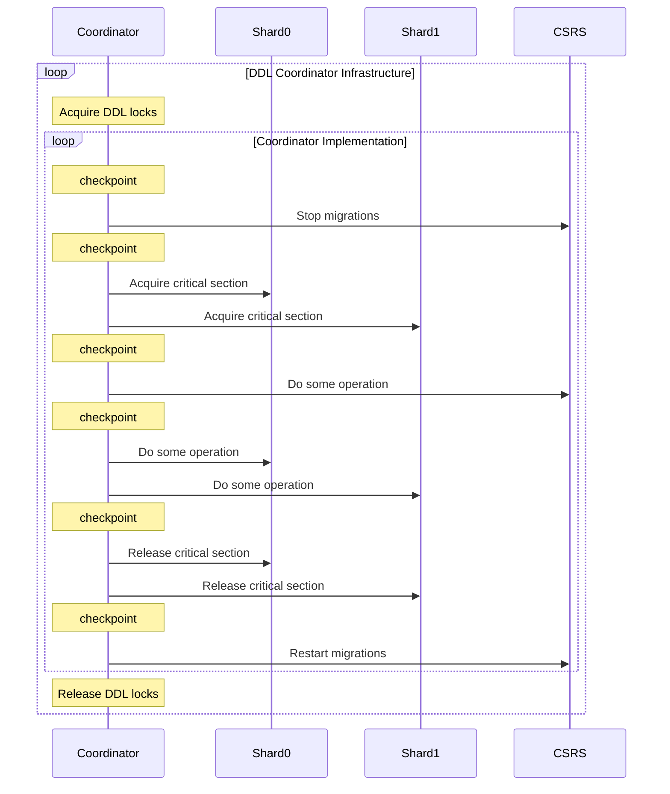

# DDL Operations

On the Sharding team, we use the term _DDL_ to mean any operation that needs to update any subset of [catalog containers](README_sharding_catalog.md#catalog-containers). Within this definition, there are standard DDLs that use the DDL coordinator infrastructure as well as non-standard DDLs that each have their own implementations.

## Standard DDLs

Most DDL operations are built upon the DDL coordinator infrastructure which provides some [retriability](#retriability), [synchronization](#synchronization), and [recoverability](#recovery) guarantees.

Each of these operations has a _coordinator_ - a node that drives the execution of the operation. In [most operations](https://github.com/mongodb/mongo/blob/e61bf27c2f6a83fed36e5a13c008a32d563babe2/src/mongo/db/s/sharding_ddl_coordinator_service.cpp#L60-L120), this coordinator is the database primary, but in [a few others](https://github.com/mongodb/mongo/blob/e61bf27c2f6a83fed36e5a13c008a32d563babe2/src/mongo/db/s/config/configsvr_coordinator_service.cpp#L75-L94) the coordinator is the CSRS. These coordinators extend either the [RecoverableShardingDDLCoordinator class](https://github.com/mongodb/mongo/blob/9fe03fd6c85760920398b7891fde74069f5457db/src/mongo/db/s/sharding_ddl_coordinator.h#L266) or the [ConfigSvrCoordinator class](https://github.com/mongodb/mongo/blob/9fe03fd6c85760920398b7891fde74069f5457db/src/mongo/db/s/config/configsvr_coordinator.h#L47), which make up the DDL coordinator infrastructure.

The diagram below shows a simplified example of a DDL operation's execution. The coordinator can be one of the shards or the config server, and the commands sent to that node will just be applied locally.

The outer loop is common to all standard DDL operations and ensures that different DDLs within the same database/namespace serialize properly by acquiring [DDL locks](#synchronization). The inner loop is specific to each operation, and will perform some set of updates to the sharding metadata while under the critical section. Some operations may not involve all shards or may have more complex phases on the participant shards, but all follow the same general pattern of acquiring the critical section, updating some metadata, and releasing the critical section, checkpointing their progress along the way.

The checkpoints are majority write concern updates to a persisted document on the coordinator. This document - called a state document - contains all the information about the running operation including the operation type, namespaces involved, and which checkpoint the operation has reached. An initial checkpoint must be the first thing any coordinator does in order to ensure that the operation will continue to run even [in the presence of failovers](#recovery). Subsequent checkpoints allow retries to skip phases that have already been completed.

### Retriability

Most DDL operations must complete after they have started. An exception to this is often a _CheckPreconditions_ phase at the beginning of a coordinator in which the operation will check some conditions and will be allowed to exit if these conditions are not met. After this, however, the operation will continue to retry until it succeeds. This is because the updates to the sharding metadata would cause inconsistencies if the critical section were released partially through the operation. For this reason, DDL operations should not throw non-retriable errors after the initial phase of checking preconditions.

### Synchronization

DDL operations are serialized on the coordinator by acquisition of the DDL locks, handled by the [DDL Lock Manager](https://github.com/mongodb/mongo/blob/r7.0.0-rc7/src/mongo/db/s/ddl_lock_manager.h). DDL locks are local to the coordinator and only in memory, so they must be reacquired during [recovery](#recovery).

The DDL locks follow a [multiple granularity hierarchical approach](https://en.wikipedia.org/wiki/Multiple_granularity_locking), which means DDL locks must be acquired in a specific order using the [intentional locking protocol](https://en.wikipedia.org/wiki/Multiple_granularity_locking#:~:text=MGL%20also%20uses%20intentional%20%22locks%22) appropriately. With that, we ensure that a DDL operation acting over a whole database serializes with another DDL operation targeting a collection from that database, and, at the same time, two DDL operations targeting different collections can run concurrently.

Every DDL lock resource should be taken in the following order:

1. DDL Database lock
2. DDL Collection lock

Therefore, if a DDL operation needs to update collection metadata, a DDL lock will be acquired first on the database in IX mode and then on the collection in X mode. On the other hand, if a DDL operation only updates the database metadata (like dropDatabase), only the DDL lock on the database will be taken in X mode.

Some operations also acquire additional DDL locks, such as renameCollection, which will acquire the database and collection DDL locks for the target namespace after acquiring the DDL locks on the source collection.

Finally, at the end of the operation, all of the locks are released in reverse order.

### Recovery

DDL coordinators are resilient to elections and sudden crashes because they are implemented as [primary only services](https://github.com/mongodb/mongo/blob/r6.0.0/docs/primary_only_service.md#primaryonlyservice) that - by definition - get automatically resumed when the node of a shard steps up.

When a new primary node is elected, the DDL primary only service is rebuilt, and any ongoing coordinators will be restarted based on their persisted state document. During this recovery phase, any new requests for DDL operations are put on hold, waiting for existing coordinators to be re-instatiated to avoid conflicts with the DDL locks.

### Sections about specific standard DDL operations

-   [User write blocking](README_user_write_blocking.md)

## Non-Standard DDLs

Some DDL operations do not follow the structure outlined in the section above. These operations are [chunk migration](README_migrations.md), resharding, and refine collection shard key. There are also other operations such as add and remove shard that do not modify the sharding catalog but do modify local metadata and need to coordinate with ddl operations. These operations also do not use the DDL coordinator infrastructure, but they do take the DDl lock to synchronize with other ddls.

Both chunk migration and resharding have to copy user data across shards. This is too time intensive to happen entirely while holding the collection critical section, so these operations have separate machinery to transfer the data and commit the changes. These commands do not commit transactionally across the shards and the config server, rather they commit on the config server and rely on shards pulling the updated commit information from the config server after learning via a router that there is new information. They also do not have the same requirement as standard DDL operations that they must complete after starting except after entering their commit phases.

Refine shard key commits only on the config server, again relying on shards to pull updated information from the config server after hearing about this more recent information from a router. In this case, this was done not because of the cost of transfering data, but so that refine shard key did not need to involve the shards. This allows the refineShardKey command to run quickly and not block operations.

### Sections explaining specific non-standard DDL operations

-   [Chunk Migration](README_migrations.md)
