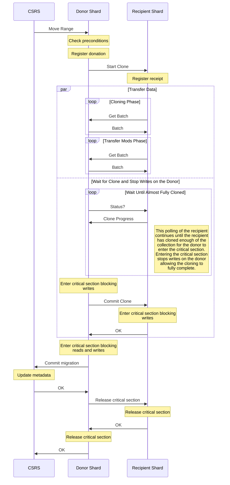

# Migrations

The migration procedure allows data for sharded collections to be moved from one shard to another. This procedure is normally initiated by the balancer, but can also be triggered manually by the user by calling the `moveRange` command. MoveRange can move a range of data within existing data boundaries, or it can perform a split and a move if called on a sub-range of data.

Migrations involve the config server and two shards. The first shard is the donor or source shard, which currently owns the range being moved. The second shard is the recipient or destination shard, which is the shard the range is being moved to.

The config server initiates the migration by forwarding the moveRange request to the donor shard. The donor and recipient shards will then run the migration before contacting the config server again to commit the migration. The diagram below details the migration process.

### Synchronization

A shard can only be a donor or a recipient at any given time, not both. Because of this there can only be a single migration between a pair of shards at a time. This syhchronization is handled by the [ActiveMigrationsRegistry](https://github.com/mongodb/mongo/blob/r6.0.0/src/mongo/db/s/active_migrations_registry.h). The migration is registered on the donor and on the recipient at the beginning of the migration, and no other migrations can begin while another migration is registered. This registration is done by persisting a document describing the migration with write concern majority, ensuring that there will be no conflicting migrations even in the case of failover.

Most DDL operations require that the set of shards that comprise a database or collection remain fixed for the duration of the DDL. They achieve this using the [setAllowMigrations](https://github.com/mongodb/mongo/blob/r6.0.0/src/mongo/db/s/config/configsvr_set_allow_migrations_command.cpp) command, which stops any new migrations from starting in a specific collection and then waits for all ongoing migrations to complete, aborting any that haven't reached the commit stage yet.

### Recovery

If a change in primary occurs on a shard that is acting as the donor or recipient of a migration, the migration will be recovered on step up by the new primary. The registration of the migration on the donor and recipient at the beginning of the migration persists a migration task document. When a new primary steps up, it will begin an asychronous recovery for the migration documents that it has on disk.

If the migration document already contains the decision for the migration (committed or aborted), the new primary uses the persisted decision to complete the migration. If the decision has not been persisted, the primary will query the config server to see if the migration committed or not. If it has already been committed, the new primary will complete the migration using that decision. Otherwise, the primary will abort the migration.

### Session Migration

The session information for a given collection also needs to be transferred during a migration. This is done in parallel with the user data migration, and has a very similar workflow. The request to start cloning on the recipient shard begins the user data transfer as shown in the diagram above, and it also starts a separate cloning process for the session information. The status polling by the donor to determine when to enter the critical section takes into account both the user data transfer progress as well as the session data transfer progress.

## Ownership Filter

Because the [range deletions](#range-deletions) happen asynchronously, there is a period of time during which documents exist on a shard that doesn't actually own them. This can happen either on the recipient shard while the migration is still ongoing and the ownership has not changed yet, on the donor shard after the migration has committed, or on the recipient after the migration has been aborted. These documents are called orphan documents, and they should not be visible to the user.

Shards store a copy of the data placement information for each collection in which they own data. This information is called the _filtering metadata_ because it is used to filter orphaned documents out of queries. A query obtains a reference to the current filtering metadata for a collection, called the _ownership filter_, by calling CollectionShardingRuntime::getOwnershipFilter(). A cluster timestamp can be specified which will cause an earlier version of the filtering metadata to be returned.

## Range Deletions

In order to improve the performance of migrations, the deletion of documents from the donor shard after the migration is not part of the migration process. Instead, document is persisted describing the range and the [range deleter](https://github.com/mongodb/mongo/blob/r6.2.0/src/mongo/db/s/range_deleter_service.h) - running on shard primary nodes - will clean up the local documents later. This also applies to any documents that were copied to the recipient in the event that the migration failed.

At the beginning of the migration, before the donor sends the request to begin cloning, it persists a document locally describing the range that is to be deleted along with a pending flag indicating that the range is not yet ready to be deleted. The recipient does likewise after receiving the request to begin cloning but before requesting the first batch from the donor. If the migration succeeds, the range is marked as ready to delete on the donor and the range deletion document is deleted from the recipient. If the migration fails, the range deletion document is deleted from the donor and the range is marked as ready on the recipient. The range deleter service will be notified that the document was marked as ready through the op observer, scheduling the range for deletion as soon as the update marking the range as ready is committed.

On the donor, there is a risk that the documents to be deleted are still being accessed in ongoing queries. The range deleter will wait for these queries to complete using a promise which will be signaled after their completion. There is then a configurable (best effort) delay with a default of 15 minutes to allow queries on secondaries to complete before starting the deletion.

After waiting for ongoing queries to complete, the documents in the range are deleted in batches with a delay between each batch. The rate limiting is intended to reduce the I/O load from many deletions happening at the same time. After all the documents have been removed, the persisted range deletion document is deleted.
