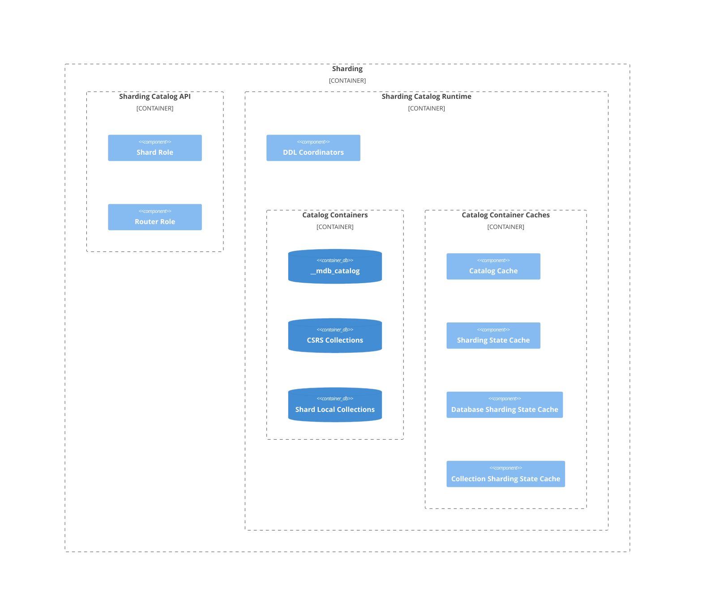

> **Warning**
> This is work in progress and some sections are incomplete

# Sharding Architecture Guide
This page contains details of the code architecture of the MongoDB Sharding system. It is intended to be used by engineers on the core server, with some sections being more appropriate for sharding engineers.

It is not intended to be a tutorial on how to operate sharding as a user and it requires that the reader is already familiar with the general concepts of [sharding](https://docs.mongodb.com/manual/sharding/#sharding), the
[architecture of a MongoDB sharded cluster](https://docs.mongodb.com/manual/sharding/#sharded-cluster),
and the concept of a [shard key](https://docs.mongodb.com/manual/sharding/#shard-keys).

## Sharding terminology and acronyms

TODO: 

## Table of contents

TODO: 

## Sharding code architectural diagram

This section visualises the architecture of the Sharding system and contains links to the sections which describe the various subsystems.

