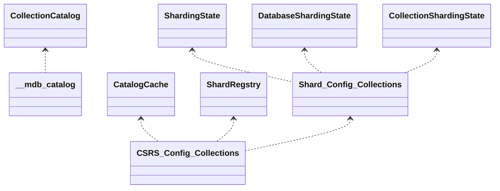

# Sharding Catalog

Depending on the team, the definition of "the catalog" can be different. Here, we will define it as a combination of the following:

-   **Catalog objects:** The set of conceptual "objects" which we use to talk about in the core server without regard to how they are implemented or stored. Examples are shards, databases, collections, indexes, collMods and views; but not config servers, caches or internal system collections.
-   [**Catalog containers:**](#catalog-containers) The set of WT tables, system collections and in-memory caches that store all or part of the descriptions of the _Catalog Objects_, without regard to the protocols that are used when being read or written to. Examples are the [_\_\_mdb_catalog_](https://github.com/mongodb/mongo/blob/r6.0.0/src/mongo/db/storage/storage_engine_impl.cpp#L75), _config.databases_, _config.collections_, _config.chunks_, [_CollectionCatalog_](https://github.com/mongodb/mongo/blob/r6.0.0/src/mongo/db/catalog/collection_catalog.h#L50), [_CatalogCache_](https://github.com/mongodb/mongo/blob/r6.0.0/src/mongo/s/catalog_cache.h#L134), [_SS_](https://github.com/mongodb/mongo/blob/r6.0.0/src/mongo/s/sharding_state.h#L51), [_DSS_](https://github.com/mongodb/mongo/blob/r6.0.0/src/mongo/db/s/database_sharding_state.h#L45), [_CSS_](https://github.com/mongodb/mongo/blob/r6.0.0/src/mongo/db/s/collection_sharding_state.h#L59) and any WT tables backing the data for the user collections; but not the actual classes that implement them or the shard versioning protocol
-   [**Sharding catalog API:**](#sharding-catalog-api) The actual C++ classes and methods representing the above concepts that developers use in order to program distributed data applications, along with their contracts. Examples are [_CatalogCache_](https://github.com/mongodb/mongo/blob/r6.0.0/src/mongo/s/catalog_cache.h#L134), [_SS_](https://github.com/mongodb/mongo/blob/r6.0.0/src/mongo/s/sharding_state.h#L51), [_DSS_](https://github.com/mongodb/mongo/blob/r6.0.0/src/mongo/db/s/database_sharding_state.h#L45), [_CSS_](https://github.com/mongodb/mongo/blob/r6.0.0/src/mongo/db/s/collection_sharding_state.h#L59), DDL Coordinator and the shard versioning protocol; but not the transactions API, replication subsystem or the networking code.

## Catalog containers

The catalog containers store all or part of the descriptions of the various catalog objects. There are two types of containers - persisted and in-memory (caches) and the diagram below visualises their relationships. The dotted lines between the containers indicate the flow of data between them.

### Authoritative containers

Put in a naive way, a container is said to be "authoritative" if it can be "frozen in time" and its data can be trusted to be definitive for the respective catalog object. For example, if the CSRS is "frozen", we can safely trust the _config.chunks_ collection to know where data is located; however, currently it is not possible to "freeze" a shard and trust it to know what set of chunks it owns. On the other hand, if a shard is "frozen" we can safely trust it about what global indexes are under any collections that it owns.

Based on the above, as it stands, different containers on different nodes are authoritative for different parts of the catalog. Most authoritative containers are on the CSRS. In the future we would like the shards to be authoritative for everything they own and the CSRS just acting as a materialised view (i.e., cache) of all shards' catalogs.

### Synchronisation

The most important requirement of any sharded feature is that it scales linearly with the size of the data or the workload.

In order to scale, sharding utilises "optimistic" distributed synchronisation protocols to avoid creating nodes which are a bottleneck (i.e., the CSRS). One of these protocols, named [shard versioning](README_versioning_protocols.md), allows the routers to use cached information to send queries to one or more shards, and only read from the CSRS if the state of the world changes (e.g. chunk migration).

The main goal of these protocols is to maintain certain causal relationships between the different catalog containers, where _routers_ operate on cached information and rely on the _shards_ to "correct" them if the data is no longer where the router thinks it is.

## Sharding catalog API

The purpose of the Sharding Catalog API is to present server engineers with an abstract programming model, which hides the complexities of the catalog containers and the protocols used to keep them in sync.

Even though the code currently doesn't always reflect it, this abstract programming model in practice looks like a tree of nested router and shard loops.

The [_router loop_](#router-role) takes some cached routing information, sends requests to a set of shards along with some token describing the cached information it used (i.e., the _shard version_) and must be prepared for any of the targeted shards to return a stale shard version exception, indicating that the router is stale. Upon receiving that exception, the router "refreshes" and tries again.

The [_shard loop_](#shard-role) takes a request from a router, checks whether the cache it used is up-to-date and if so, serves the request, otherwise returns a stale shard version exception.

### Router role

When a piece of code is running in a router loop, it is also said that it is executing in the Router role. Currently, the code for the router role is scattered across at least the following utilities:

-   [ShardRegistry](https://github.com/mongodb/mongo/blob/r6.0.0/src/mongo/s/client/shard_registry.h#L164)
-   [CatalogCache](https://github.com/mongodb/mongo/blob/r6.0.0/src/mongo/s/catalog_cache.h#L134)
-   [Router](https://github.com/mongodb/mongo/blob/r6.0.0/src/mongo/s/router.h#L41)
-   [Stale Shard Version Helpers](https://github.com/mongodb/mongo/blob/r6.0.0/src/mongo/s/stale_shard_version_helpers.h#L71-L72)

### Shard role

For a piece of code to be executing in the shard role, it must be holding some kind of synchronisation which guarantees the stability of the catalog for that scope. See [here](https://github.com/mongodb/mongo/blob/master/src/mongo/db/README_shard_role_api.md) for details about the Shard Role API.
