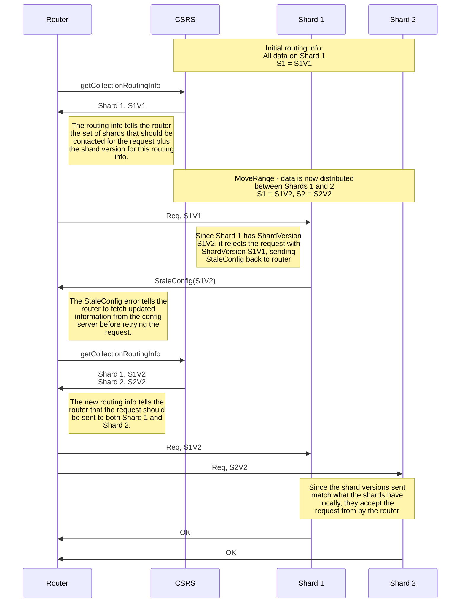
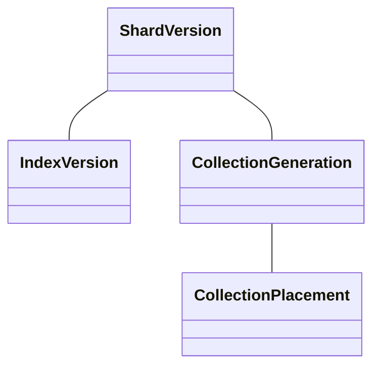

# Versioning Protocols

When a command is sent to a router, the router must decide which shards to forward this request to - a process called routing. Routing in MongoDB acts optimistically, meaning that a router will use on whatever information it has cached to decide which shards to send the request to, and then rely on the shards to return an error if this information is stale.

This process is implemented via the shard versioning protocol and it is what prevents the config servers from becoming a bottleneck for commands while ensuring that the router eventually sends the command to the correct set of shards.

## Shard Versioning Protocol

When a router uses its cached information to send a request to a shard, it attaches a token describing the information it used. This token is the [database version](#database-version) for unsharded collections and the [shard version](#shard-version) for sharded collections.

When a shard receives the request, it will check this token to make sure that it matches the shard's local information. If it matches, then the request will proceed. If the version does not match, the shard will throw [an exception](https://github.com/mongodb/mongo/blob/r6.0.0/src/mongo/s/stale_exception.h).

When the router recieves this exception, it knows that the routing information must have changed, and so it will [perform a refresh](#routing-information-refreshes) to get more recent information before sending the request again.

The following diagram depicts a simple example of the shard versioning protocol in action. It assumes that the router is a shard server primary, thus the refresh is simply fetching newer information from the config server.

The protocol is the same when using a DBVersion, the only difference is that StaleDbRoutingVersion is returned to the router instead of StaleConfig. In practice, both the Database Version and Shard Version are more complicated than an increasing integer, and their components are described below.

## Database Version

A database version is represented as DBV<U, T, Mod> and consists of three elements:

1. **U** (the uuid) : a unique identifier to distinguish different instances of the database. The UUID remains unchanged for the lifetime of the database, changing when the database is dropped and recreated.
2. **T** (the timestamp) : a new unique identifier introduced in version 5.0 which also remains unchanged for the lifetime of a database. The difference between the uuid and timestamp is that timestamps are comparable, allowing for ordering database versions in which the UUID/Timestamp do not match.
3. **M** (last modified) : an integer incremented when the database changes its primary shard.

## Shard Version

The shard version is represented as SV<E, T, M, m, I> and consists of five elements:

1. **E** (the epoch) : a unique identifier that distinguishes an instance of the collection.
2. **T** (the timestamp) : a new unique identifier introduced in version 5.0. The difference between the epoch and timestamp is that timestamps are comparable, allowing for ordering shard versions in which the epoch/timestamp do not match.
3. **M** (major version) : an integer used to indicate a change in data placement, as from a migration.
4. **m** (minor version) : an integer used to indicate a change to data boundaries within a shard such as from a split or merge.
5. **I** (index version) : a timestamp representing the time of the last modification to a global index in the collection.

The epoch and timestamp serve the same functionality, that of uniquely identifying an instance of the collection. For this reason, we group them together and call them the [**collection generation**](https://github.com/mongodb/mongo/blob/10fd84b6850ef672ff6ed367ca9292ad8db262d2/src/mongo/s/chunk_version.h#L38-L80). Likewise, the major and minor versions work together to describe the layout of data on the shards. Together, they are called the [**collection placement**](https://github.com/mongodb/mongo/blob/10fd84b6850ef672ff6ed367ca9292ad8db262d2/src/mongo/s/chunk_version.h#L82-L113) (or placement version). The [index version](https://github.com/mongodb/mongo/blob/r6.2.1/src/mongo/s/index_version.h) (or collection indexes) stands alone, describing the global indexes present in a collection. The relationship between these components can be visualized as the following.

A change in the CollectionGeneration implies that the CollectionPlacement must have changed as well, since the collection itself has changed. The index version is independent of this hierarchy.

Each shard has its own shard version, which consists of the collection generation, the index version, and the maximum placement version of the ranges located on the shard. Similarly, the overall collection version consists of the collection generation, index version, and the maximum placement version of any range in the collection.

### Operations that change the shard versions

Changes of the shard version indicate that some routing information has changed, and routers need to request updated information. Changes in different components of the shard version indicate different routing information changes.

#### Generation Changes

A change in the collection generation indicates that the collection has changed so significantly that all previous placement information is incorrect. Changes in this component can be caused by dropping and recreating the collection, refining its shard key, renaming it, or resharding it. This will indicate that all routing information is stale, and all routers need to fetch new information.

#### Placement Version Changes

A placement version change indicates that something has changed about what data is placed on what shard. The most important operation that changes the placement version is migration, however split, merge and even some other operations change it as well, even though they don't actually move any data around. These changes are more targeted than generation changes, and will only cause the router to refresh if it is targeting a shard that was affected by the operation.

#### Index Version Changes

An index version change indicates that there has been some change in the global index information of the collection, such as from adding or removing a global index.

## Routing Information Refreshes

For sharded collections, there are two sets of information that compose the routing information - the chunk placement information and the collection index information. The config server is [authoritative](README_sharding_catalog.md#authoritative-containers) for the placement information, while both the shards and the config server are authoritative for the index information.

When a router receives a stale config error, it will refresh whichever component is stale. If the router has an older CollectionGeneration or CollectionPlacement, it will refresh the placement information, whereas if it has an older IndexVersion, it will refresh the index information.

### Placement Information Refreshes

MongoS and shard primaries refresh their placement information from the config server. Shard secondaries, however, refresh from the shard primaries through a component called the Shard Server Catalog Cache Loader. When a shard primary refreshes from a config server, it persists the refreshed information to disk. This information is then replicated to secondaries who will refresh their cache from this on-disk information.

#### Incremental and Full Refreshes

A full refresh clears all cached information, and replaces the cache with the information that exists on the node’s source whereas an incremental refresh only replaces modified routing information from the node’s source.

Incremental refreshes will happen whenever there has been a [placement version change](#placement-version-changes), while [collection generation changes](#generation-changes) will cause a full refresh.

### Index Information Refreshes

Index information refreshes are always done from the config server. The router will fetch the whole index information from the config server and replace what it has in its cache with the new information.
