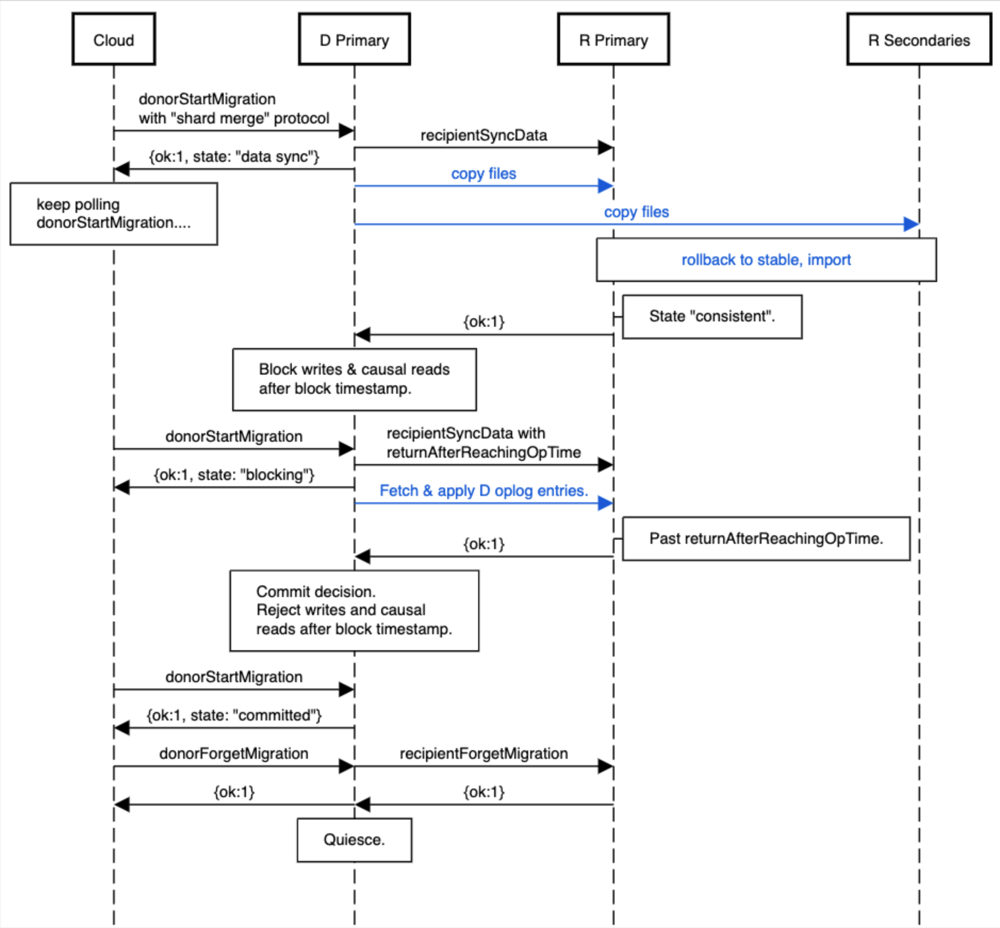

# Serverless Internals

Using `replication.serverless` also enables a node to apply a recipient config to join a new recipient set as part of a split.

### Glossary

**recipient config**
The config for the recipient replica set.

**blockTimestamp**
Timestamp after which reads and writes are blocked on the donor replica set for all tenants involved until completion of the split.

## Shard Merge

A shard split is one of the serverless scaling primitives, allowing for scale in by migrating all tenant data from an underutilized replica set to another existing replica set. The initial replica set will be decomissioned by the cloud control plane after completion of the operation.

The following diagram illustrates the lifetime of a shard split operation:

### Protocol

1. **Start the merge operation**
   The donor primary receives the `donorStartMigration` command to begin the operation. The [TenantMigrationDonorOpObserver](https://github.com/mongodb/mongo/blob/f05053d2cb65b84eaed4db94c25e9fe4be82d78c/src/mongo/db/repl/tenant_migration_donor_op_observer.cpp#L82) creates a donor access blocker for each tenant and a global donor access blocker.

   All active index builds for collections belonging to tenants which will be migrated are [aborted](https://github.com/mongodb/mongo/blob/f05053d2cb65b84eaed4db94c25e9fe4be82d78c/src/mongo/db/repl/tenant_migration_donor_service.cpp#L949-L968) at the start of the merge operation. All index builds for tenants being migrated will be blocked for the duration of the operation.

   The donor then reserves an oplog slot, called the `startMigrationDonorTimestamp`. It then [durably records](https://github.com/mongodb/mongo/blob/f05053d2cb65b84eaed4db94c25e9fe4be82d78c/src/mongo/db/repl/tenant_migration_donor_service.cpp#L982) a state document update to the `kDataSync` state at the `startMigrationDonorTimestamp` and sends the `recipientSyncData` command to the recipient primary with the `startMigrationDonorTimestamp` and waits for a response.

2. **Recipient copies donor data**
   The recipient primary receives the `recipientSyncData` command and [durably persists](https://github.com/mongodb/mongo/blob/f05053d2cb65b84eaed4db94c25e9fe4be82d78c/src/mongo/db/repl/shard_merge_recipient_service.cpp#L2428) a state document used to track migration progress. The [ShardMergeRecipientOpObserver](https://github.com/mongodb/mongo/blob/f05053d2cb65b84eaed4db94c25e9fe4be82d78c/src/mongo/db/repl/shard_merge_recipient_op_observer.cpp#L163-L167) creates a recipient access blocker for each tenant. The primary then opens a backup cursor on the donor, records the checkpoint timestamp, and then inserts the list of wired tiger files that need to be cloned into the [donated files collection](https://github.com/mongodb/mongo/blob/f05053d2cb65b84eaed4db94c25e9fe4be82d78c/src/mongo/db/repl/shard_merge_recipient_service.cpp#L1034-L1046) The backup cursor is kept alive (by periodic `getMore`'s) until all recipient nodes have copied donor data. Wiredtiger will not modify file data on the donor while the cursor is open.

   Additionally, the recipient primary will ensure that it's majority commit timestamp is greater than the backup cursor timestamp from the donor. We [advance](https://github.com/mongodb/mongo/blob/a723af8863c5fae1eee7b0a891066e923468e974/src/mongo/db/repl/shard_merge_recipient_service.cpp#L1787-L1789) the cluster time to `donorBackupCursorCheckpointTimestamp` and then write a majority committed noop.

   A `ShardMergeRecipientOpObserver` on each recipient node will [watch for inserts](https://github.com/mongodb/mongo/blob/f05053d2cb65b84eaed4db94c25e9fe4be82d78c/src/mongo/db/repl/shard_merge_recipient_op_observer.cpp#L198) into the donated files collection and then [clone and import](https://github.com/mongodb/mongo/blob/f05053d2cb65b84eaed4db94c25e9fe4be82d78c/src/mongo/db/repl/tenant_file_importer_service.cpp#L299-L303) all file data via the `TenantFileImporterService`. When the data is consistent and all files have been imported, the recipient replies `OK` to the `recipientSyncData` command and kills the backup cursor.

3. **Donor enters blocking state**
   Upon receiving a `recipientSyncData` response, the donor reserves an oplog slot and updates the state document to the `kBlocking` state and sets the `blockTimestamp` to prevent writes. The donor then sends a second `recipientSyncData` command to the recipient with the `returnAfterReachingDonorTimestamp` set to the `blockTimestamp` and waits for a reply.

4. **Recipient oplog catchup**
   After the cloned data is consistent, the recipient primary enters the oplog catchup phase. Here, the primary fetches and [applies](https://github.com/mongodb/mongo/blob/f05053d2cb65b84eaed4db94c25e9fe4be82d78c/src/mongo/db/repl/shard_merge_recipient_service.cpp#L2230) any donor oplog entries that were written between the backup cursor checkpoint timestamp and the `blockTimestamp`. When all entries have been majority replicated and we have [ensured](https://github.com/mongodb/mongo/blob/f05053d2cb65b84eaed4db94c25e9fe4be82d78c/src/mongo/db/repl/shard_merge_recipient_service.cpp#L599-L602) that the recipient's logical clock has advanced to at least `returnAfterReachingDonorTimestamp`, the recipient replies `OK` to the second `recipientSyncData` command.

5. **Committing the merge**
   After receiving a successful response to the `recipientSyncData` command, the Donor updates its state document to `kCommitted` and sets the `commitOrAbortOpTime`. After the commit, the Donor will respond to `donorStartMigration` with `OK`. At this point, all traffic should be re-routed to the Recipient. Finally, cloud will send `donorForgetMigration` to the Donor (which will in turn send `recipientForgetMigration` to the Recipient) to mark the migration as garbage collectable.

## Access Blocking

During the critical section of a serverless operation the server will queue user requests for data involved in the operation, waiting to produce a response until after the critical section has completed. This process is called “blocking”, and the server provides this functionality by maintaining a [map of namespace to tenant access blocker](https://github.com/mongodb/mongo/blob/a723af8863c5fae1eee7b0a891066e923468e974/src/mongo/db/repl/tenant_migration_access_blocker_registry.h#L242-L243). This registry is consulted when deciding to block:

- **commands** in the ServiceEntryPoint ([InvokeCommand::run](https://github.com/mongodb/mongo/blob/bc57b7313bce890cf1a7d6cdf20f1ec25949698f/src/mongo/db/service_entry_point_common.cpp#L886-L888), or [CheckoutSessionAndInvokeCommand::run](https://github.com/mongodb/mongo/blob/bc57b7313bce890cf1a7d6cdf20f1ec25949698f/src/mongo/db/service_entry_point_common.cpp#L886-L888))
- **linearizable reads** in the [RunCommandImpl::\_epilogue](https://github.com/mongodb/mongo/blob/a723af8863c5fae1eee7b0a891066e923468e974/src/mongo/db/service_entry_point_common.cpp#L1249)
- **writes** in [OpObserverImpl::onBatchedWriteCommit](https://github.com/mongodb/mongo/blob/a723af8863c5fae1eee7b0a891066e923468e974/src/mongo/db/op_observer/op_observer_impl.cpp#L1882-L1883), [OpObserverImpl::onUnpreparedTransactionCommit](https://github.com/mongodb/mongo/blob/a723af8863c5fae1eee7b0a891066e923468e974/src/mongo/db/op_observer/op_observer_impl.cpp#L1770-L1771), and the [\_logOpsInner oplog helper](https://github.com/mongodb/mongo/blob/a723af8863c5fae1eee7b0a891066e923468e974/src/mongo/db/repl/oplog.cpp#L429-L430)
- **index builds** in [ReplIndexBuildState::tryAbort](https://github.com/mongodb/mongo/blob/a723af8863c5fae1eee7b0a891066e923468e974/src/mongo/db/repl_index_build_state.cpp#L495), IndexBuildsCoordinatorMongod::\_startIndexBuild ([here](https://github.com/mongodb/mongo/blob/a723af8863c5fae1eee7b0a891066e923468e974/src/mongo/db/index_builds_coordinator_mongod.cpp#L282), [here](https://github.com/mongodb/mongo/blob/a723af8863c5fae1eee7b0a891066e923468e974/src/mongo/db/index_builds_coordinator_mongod.cpp#L356-L357))

## Mutual Exclusion

Of the three types of serverless operation (tenant migration, shard merge, and shard split), no new operation may start if there are any active operations of another serverless operation type. The serverless operation lock allows multiple Tenant Migrations to run simultaneously, but it does not allow running operations of a different type at the same time.

This so-called “serverless operation lock” is acquired the first time a state document is inserted for a particular operation ([shard split](https://github.com/mongodb/mongo/blob/a723af8863c5fae1eee7b0a891066e923468e974/src/mongo/db/serverless/shard_split_donor_op_observer.cpp#L150-L151), [tenant migration donor](https://github.com/mongodb/mongo/blob/1c4fafd4ae5c082f36a8af1442aa48174962b1b4/src/mongo/db/repl/tenant_migration_donor_op_observer.cpp#L58-L60), [tenant migration recipient](https://github.com/mongodb/mongo/blob/a723af8863c5fae1eee7b0a891066e923468e974/src/mongo/db/repl/tenant_migration_recipient_op_observer.cpp#L127-L129), [shard merge recipient](https://github.com/mongodb/mongo/blob/f05053d2cb65b84eaed4db94c25e9fe4be82d78c/src/mongo/db/repl/shard_merge_recipient_op_observer.cpp#L152-L154)). Once the lock is acquired, any attempt to insert a state document of a different operation type will [result in a ConflictingServerlessOperation](https://github.com/mongodb/mongo/blob/1c4fafd4ae5c082f36a8af1442aa48174962b1b4/src/mongo/db/serverless/serverless_operation_lock_registry.cpp#L52-L54). The lock is released when an operation durably records its decision, and marks its state document as garbage collectable ([shard split](https://github.com/mongodb/mongo/blob/1c4fafd4ae5c082f36a8af1442aa48174962b1b4/src/mongo/db/serverless/shard_split_donor_op_observer.cpp#L261-L263), [tenant migration donor](https://github.com/mongodb/mongo/blob/1c4fafd4ae5c082f36a8af1442aa48174962b1b4/src/mongo/db/repl/tenant_migration_donor_op_observer.cpp#L169-L171), [tenant migration recipient](https://github.com/mongodb/mongo/blob/a723af8863c5fae1eee7b0a891066e923468e974/src/mongo/db/repl/tenant_migration_recipient_op_observer.cpp#L152-L154), [shard merge recipient](https://github.com/mongodb/mongo/blob/f05053d2cb65b84eaed4db94c25e9fe4be82d78c/src/mongo/db/repl/shard_merge_recipient_op_observer.cpp#L280-L282)). Serverless operation locks continue to be held even after a stepdown for the same reason access blockers do, if an election occurs later we ensure the lock is already held to prevent conflicting operations on the newly elected primary.

## Change Streams

Change Stream data for a Serverless cluster is stored in a handful of tenantId-prefixed collections:

- change collection: `<tenantId>_config.system.change_collection`
- pre-images: `<tenantId>_config.system.preimages`
- cluster parameters: `<tenantId>_config.system.cluster_parameters`

A Shard Split operation will copy these collections from donor to recipient via Initial Sync. Upon completion, these collections will be cleaned up on the donor (by the cloud control plane) along with all other tenant-specific databases.

A Shard Merge operation will copy these collections from donor to recipient via backup cursor. For writes that take place during the oplog catchup phase, some additional handling is required in order to ensure correctness of the data written to the tenant's change collection and pre-image collection.

We extract the 'o2' entry from a given noop oplog entry written during this phase (which will contain the original entry on the donor timeline) and write it to the tenant's change collection (see [here](https://github.com/mongodb/mongo/blob/26a441e07f3885dc8b3d9ef9b564eb4f5143bded/src/mongo/db/change_stream_change_collection_manager.cpp#L133-L135) for implementation details). Change collection entries written on the recipient during oplog catchup must be written on the donor timeline so that a change stream can be resumed on the recipient after the Shard Merge.

For pre-image support, two oplog entry fields (`donorOpTime` and `donorApplyOpsIndex`, see [here](https://github.com/mongodb/mongo/blob/26a441e07f3885dc8b3d9ef9b564eb4f5143bded/src/mongo/db/repl/oplog_entry.idl#L168-L180)) were added in order to ensure that pre-image entries written on the recipient will be identical to those on the donor. These fields are conditionally set on oplog entries written during the oplog catchup phase of a Shard Merge and used to determine which timestamp and applyOps index to use when writing pre-images. See [here](https://github.com/mongodb/mongo/blob/07b38e091b48acd305469d525b81aebf3aeadbf1/src/mongo/db/repl/oplog.cpp#L1237-L1268) for details.
