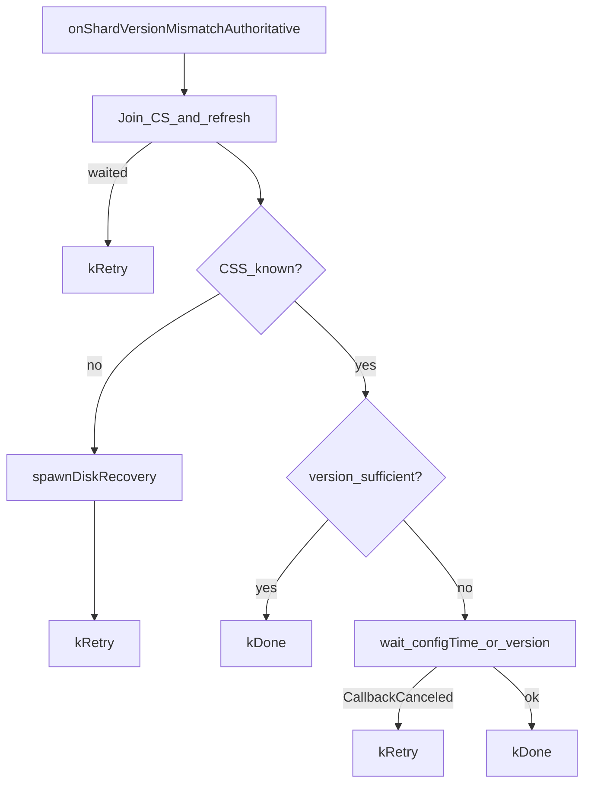
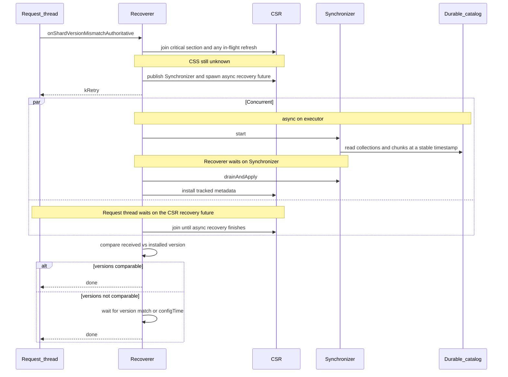
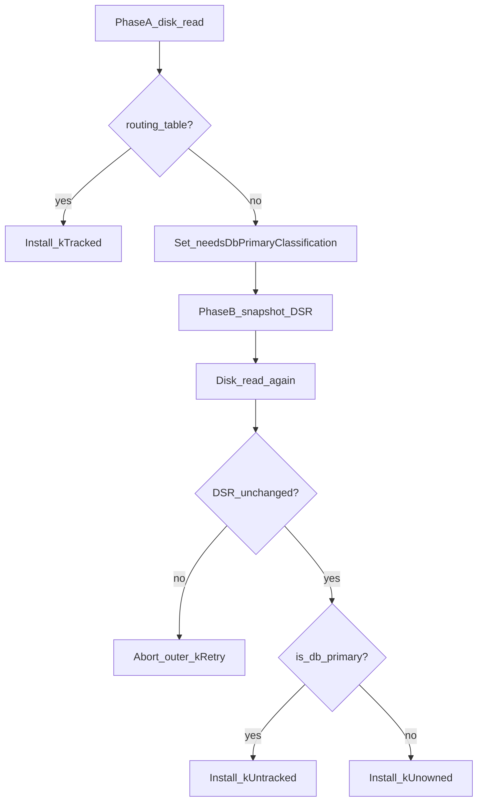
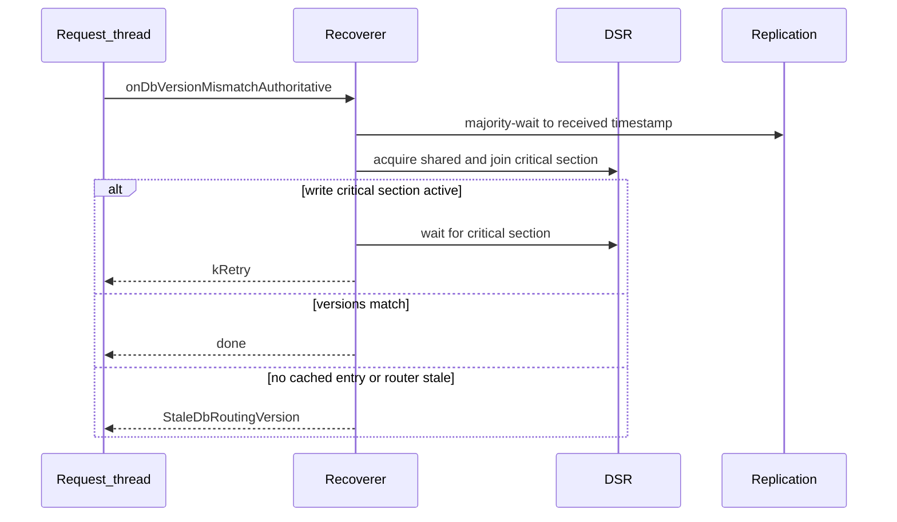

# Shard Catalog Recovery

This document describes how a shard recovers shard catalog metadata (CSS / DSS) when a router's
attached `shardVersion` or `databaseVersion` does not match the shard's in-memory view. Under the
[authoritative shards](README_sharding_catalog.md#authoritative-containers) model, the shard
recovers from its own durable catalog (`config.shard.catalog.*`), not from the CSRS.

After reading this document you should understand the algorithms, threads, and ownership of recovery
without needing to read the implementation files.

For the router-facing versioning protocol (how routers attach versions and retry), see
[Authoritative Shard Versioning Protocol](../../versioning_protocol/README_versioning_protocols.md#authoritative-shard-versioning-protocol).
For durable containers, oplog `c` entries, and cache coherency, see
[Sharding Catalog](README_sharding_catalog.md).

## Purpose and end state

Recovery brings the in-memory cache for a collection or database to a known, locally consistent
state. The shard then either accepts the router's version or throws `StaleConfig` /
`StaleDbRoutingVersion` so the router refreshes.

| Concern                   | Authoritative path                                                                                                                                                                                            |
| ------------------------- | ------------------------------------------------------------------------------------------------------------------------------------------------------------------------------------------------------------- |
| Collection metadata (CSS) | [`onShardVersionMismatchAuthoritative`](collection_metadata_recoverer.h) rebuilds from `config.shard.catalog.{collections,chunks}` via [`CollectionMetadataSynchronizer`](collection_metadata_synchronizer.h) |
| Database metadata (DSS)   | [`onDbVersionMismatchAuthoritative`](database_metadata_recoverer.h) majority-waits, then validates the DSS without a disk re-read                                                                             |

---

When a router version check fails, the shard throws `StaleConfig` or `StaleDbRoutingVersion`. The
shard role loop recovers through [`FilteringMetadataCache`](shard_filtering_metadata_refresh.h)
(`onShardVersionMismatch` / `onDbVersionMismatch`), which dispatches to the recoverers below.
Details of that call path live in
[`stale_shard_exception_handler.cpp`](stale_shard_exception_handler.cpp) and
[`shard_filtering_metadata_refresh.cpp`](shard_filtering_metadata_refresh.cpp).

## Collection metadata recovery

Implementation: [`collection_metadata_recoverer.cpp`](collection_metadata_recoverer.cpp).

Almost all recoveries take the simple path. The disk has a routing table, the CSS is installed as
tracked, and the received version is compared or reconciled via `configTime`. The
[DB-primary serialization](#with-db-primary-serialization-rare) path exists only when the durable
catalog has no routing table for the namespace and the shard must decide between untracked and
unowned.

### Simple model (common case)

1. The CSS is `kUnknown` (startup, rollback, invalidate, or never loaded).
2. One disk recovery reads `config.shard.catalog.{collections,chunks}` and installs tracked
   metadata.
3. Compare the router's version to the installed version. If they are not comparable, wait until the
   shard version matches or majority `configTime` is reached.

Waiting without further disk recovery is correct: the node continues to apply oplog entries that
mutate CSR state. That either installs a version comparable to the router's, or an invalidate clears
the CSS and forces another disk read, after which resolution is possible again. Reaching majority
`configTime` without a match means all relevant DDLs have been applied and the router is stale.

### With DB-primary serialization (rare)

When the durable shard catalog has no entries for the collection, the shard cannot yet tell:

- `kUntracked`: this shard is the database primary and the collection is unsharded.
- `kUnowned`: this shard is not the database primary and simply does not own chunks.

That choice depends on DSS state. The recoverer therefore serializes with database metadata
mutations (critical section and mutation counter) instead of installing immediately.

This is an extension of the simple model, not a separate entry point. It reuses the same request and
background recovery flow. Only classification and DSR coordination differ.

## Database metadata recovery

Implementation: [`database_metadata_recoverer.cpp`](database_metadata_recoverer.cpp).

This is not analogous to collection disk recovery. The DSS is kept warm by oplog `c` entries
(`CreateDatabaseMetadataOplogEntry` / `DropDatabaseMetadataOplogEntry`) and by
[`commit_database_metadata_locally`](commit_database_metadata_locally.h) on the primary. The
mismatch handler only waits and validates.

1. Majority-wait to the timestamp in `receivedDbVersion`.
2. Acquire the DSR shared. If a write critical section is active, wait it out and return `kRetry`.
3. Compare the received version to the cached database version. In the common case they match and
   recovery is done. If the cache is newer, the router is stale and the shard throws
   `StaleDbRoutingVersion`. If there is no cached entry, the database was moved or dropped and this
   node is no longer primary for it, so the shard also throws `StaleDbRoutingVersion`. After the
   majority wait the shard cannot still be behind the router.

