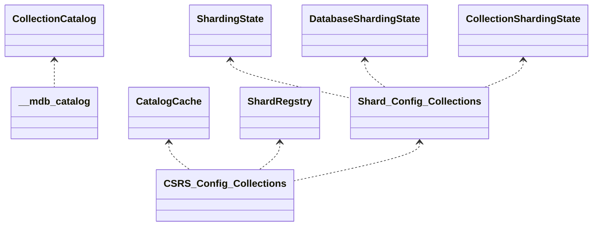

# Sharding Catalog

Depending on the team, the definition of "the catalog" can be different. Here, we will define it as
a combination of the following:

- **Catalog objects:** The set of conceptual "objects" which we use to talk about in the core server
  without regard to how they are implemented or stored. Examples are shards, databases, collections,
  indexes, collMods and views; but not config servers, caches or internal system collections.
- [**Catalog containers:**](#catalog-containers) The set of WT tables, system collections and
  in-memory caches that store all or part of the descriptions of the _Catalog Objects_, without
  regard to the protocols that are used when being read or written to. Examples are the
  [_\_\_mdb_catalog_](https://github.com/mongodb/mongo/blob/r6.0.0/src/mongo/db/storage/storage_engine_impl.cpp#L75),
  _config.databases_, _config.collections_, _config.chunks_,
  [_CollectionCatalog_](https://github.com/mongodb/mongo/blob/r6.0.0/src/mongo/db/catalog/collection_catalog.h#L50),
  [_CatalogCache_](https://github.com/mongodb/mongo/blob/r6.0.0/src/mongo/s/catalog_cache.h#L134),
  [_SS_](https://github.com/mongodb/mongo/blob/r6.0.0/src/mongo/db/s/sharding_state.h#L51),
  [_DSS_](https://github.com/mongodb/mongo/blob/r6.0.0/src/mongo/db/s/database_sharding_state.h#L45),
  [_CSS_](https://github.com/mongodb/mongo/blob/r6.0.0/src/mongo/db/s/collection_sharding_state.h#L59)
  and any WT tables backing the data for the user collections; but not the actual classes that
  implement them or the shard versioning protocol
- [**Sharding catalog API:**](#sharding-catalog-api) The actual C++ classes and methods representing
  the above concepts that developers use in order to program distributed data applications, along
  with their contracts. Examples are
  [_CatalogCache_](https://github.com/mongodb/mongo/blob/r6.0.0/src/mongo/s/catalog_cache.h#L134),
  [_SS_](https://github.com/mongodb/mongo/blob/r6.0.0/src/mongo/db/s/sharding_state.h#L51),
  [_DSS_](https://github.com/mongodb/mongo/blob/r6.0.0/src/mongo/db/s/database_sharding_state.h#L45),
  [_CSS_](https://github.com/mongodb/mongo/blob/r6.0.0/src/mongo/db/s/collection_sharding_state.h#L59),
  DDL Coordinator and the shard versioning protocol; but not the transactions API, replication
  subsystem or the networking code.

## Catalog containers

The catalog containers store all or part of the descriptions of the various catalog objects. There
are two types of containers - persisted and in-memory (caches) and the diagram below visualises
their relationships. The dotted lines between the containers indicate the flow of data between them.

### Authoritative containers

Put in a naive way, a container is said to be "authoritative" if it can be "frozen in time" and its
data can be trusted to be definitive for the respective catalog object. For example, if a shard is
"frozen" we can safely trust _config.shard.catalog.chunks_ to know the set of chunks it owns, and
_config.shard.catalog.databases_ to know the set of databases it is primary for.

With the _Authoritative Shards_ model, different containers on different nodes are authoritative for
different parts of the catalog. Each shard is the definitive source for the metadata it owns,
durably persisted in its [shard-local authoritative catalog](#shard-local-authoritative-catalog).
The CSRS holds a cluster-wide **materialised view** of all shards' catalogs — it is kept in sync on
every DDL commit (so DDL operations commit to **both** catalogs), but it is not the true source for
metadata a shard owns.

### Synchronisation

The most important requirement of any sharded feature is that it scales linearly with the size of
the data or the workload.

In order to scale, sharding utilises "optimistic" distributed synchronisation protocols to avoid
creating nodes which are a bottleneck (i.e., the CSRS). One of these protocols, named
[shard versioning](../../versioning_protocol/README_versioning_protocols.md), allows the routers to
use cached information to send queries to one or more shards, and only read from the CSRS if the
state of the world changes (e.g. chunk migration).

The main goal of these protocols is to maintain certain causal relationships between the different
catalog containers, where _routers_ operate on cached information and rely on the _shards_ to
"correct" them if the data is no longer where the router thinks it is.

### Persistent state at a glance

The catalog is persisted in ordinary replicated MongoDB collections backed by WiredTiger and the
standard replication/transaction machinery. There is no separate store or persistence technology.
There are three layers of persisted catalog state:

1. **Global catalog (CSRS)** — the cluster-wide materialised view used for routing, on the config
   server. It is kept in sync with the shards' authoritative catalogs on every DDL commit.
2. **Shard-local authoritative catalog** — the [authoritative](#authoritative-containers) copy of
   the metadata each shard owns, persisted locally on the shard (`config.shard.catalog.*`). This is
   the model described as _Authoritative Shards_.
3. **Shard-local cache (legacy)** — the pre-authoritative on-disk cache of routing information
   (`config.cache.*`), still used when the Authoritative Shards feature is not enabled. It is being
   superseded by the shard-local authoritative catalog.

The transition between the legacy cache model and the authoritative model is FCV-gated by the
`featureFlagAuthoritativeShardsDDL` (store shard-local metadata) and
`featureFlagAuthoritativeShardsCRUD` (read from shard-local metadata) feature flags.

### Persisted containers

#### Global catalog (CSRS)

These collections live in the `config` database on the CSRS and hold the cluster-wide materialised
view used for routing.

| Collection                | Reserved-namespace constant           | Document type            | Contents                                                                        |
| ------------------------- | ------------------------------------- | ------------------------ | ------------------------------------------------------------------------------- |
| `config.databases`        | `kConfigDatabasesNamespace`           | `DatabaseType`           | One doc per database: primary shard and `databaseVersion`.                      |
| `config.collections`      | `kConfigsvrCollectionsNamespace`      | `CollectionType`         | One doc per tracked collection: UUID, shard key, `timestamp`/`epoch`, flags.    |
| `config.chunks`           | `kConfigsvrChunksNamespace`           | `ChunkType`              | One doc per chunk: `min`/`max`, owning shard, `history`, `onCurrentShardSince`. |
| `config.shards`           | `kConfigsvrShardsNamespace`           | `ShardType`              | One doc per shard; carries the `topologyTime`.                                  |
| `config.placementHistory` | `kConfigsvrPlacementHistoryNamespace` | `NamespacePlacementType` | Historical placement, used to answer point-in-time placement queries.           |

#### Shard-local authoritative catalog

These collections live in the `config` database on **each shard** and durably persist the metadata
that the shard owns.

| Collection                         | Reserved-namespace constant               | Contents                                                                                                                |
| ---------------------------------- | ----------------------------------------- | ----------------------------------------------------------------------------------------------------------------------- |
| `config.shard.catalog.databases`   | `kConfigShardCatalogDatabasesNamespace`   | Authoritative state of each database the shard owns (is primary for): primary shard + `databaseVersion`.                |
| `config.shard.catalog.collections` | `kConfigShardCatalogCollectionsNamespace` | Authoritative state of each tracked collection relevant to the shard: UUID, shard key, version, `allowChunkOperations`. |
| `config.shard.catalog.chunks`      | `kConfigShardCatalogChunksNamespace`      | Authoritative chunk metadata relevant to the shard.                                                                     |

Notable properties:

- **Only metadata "relevant to the shard" is stored.** This is the true source of that metadata on
  the shard. For `config.shard.catalog.chunks` that means chunks currently owned, as well as stale
  data for chunks previously owned by the shard (retained locally to support point-in-time reads).
- **Unowned-chunks in DB primary.** The DB primary always records the collection entry for a tracked
  collection it owns no chunks for, so it can correctly represent the _tracked-without-chunks_ state
  (as opposed to _untracked_ or _unknown_). See `commitChunklessCollectionMetadataLocally` in
  [`commit_collection_metadata_locally.h`](commit_collection_metadata_locally.h).
- The `_id` index on `config.shard.catalog.collections` and the indexes on
  `config.shard.catalog.chunks` are created at sharding initialization (see
  `ensureCollectionIndexes` in
  [`sharding_initialization_mongod.cpp`](../../sharding_environment/sharding_initialization_mongod.cpp)).

#### Supporting persisted state (recoverable operations)

These collections do not hold catalog _objects_ directly, but they persist the state of in-flight
operations that mutate the catalog, so that those operations survive failover. They are listed here
because they are part of how catalog mutations become durable and recoverable.

| Collection                                | Reserved-namespace constant            | Purpose                                                                                                    |
| ----------------------------------------- | -------------------------------------- | ---------------------------------------------------------------------------------------------------------- |
| `config.collectionCriticalSections`       | `kCollectionCriticalSectionsNamespace` | Recoverable critical sections, persisted by the [ShardingRecoveryService](#recoverable-critical-sections). |
| `config.system.sharding_ddl_coordinators` | `kShardingDDLCoordinatorsNamespace`    | DDL coordinator state documents (PrimaryOnlyService).                                                      |
| `config.sharding_configsvr_coordinators`  | `kConfigsvrCoordinatorsNamespace`      | ConfigsvrCoordinator state documents.                                                                      |
| `config.migrationCoordinators`            | `kMigrationCoordinatorsNamespace`      | Donor-side chunk-migration coordinator state (e.g. the `MoveRangeCoordinator` document).                   |
| `config.migrationRecipients`              | `kMigrationRecipientsNamespace`        | Recipient-side chunk-migration state.                                                                      |
| `config.rangeDeletions`                   | `kRangeDeletionNamespace`              | Pending range deletions (see [Range Deleter](../../s/README_range_deleter.md)).                            |
| `config.localReshardingOperations.*`      | (donor/recipient namespaces)           | Resharding coordinator/donor/recipient state (see [Resharding](../../s/resharding/README.md)).             |
| `config.dropPendingDBs`                   | `kConfigDropPendingDBsNamespace`       | Serializes `dropDatabase` against a following concurrent `createDatabase`.                                 |

DDL and chunk-operation coordinators recover on step-up from these documents via the
PrimaryOnlyService machinery. The full list of reserved namespaces is in
[`namespace_string_reserved.h`](../../namespace_string_reserved.h).

### In-memory caches

Catalog state is materialised in memory in several caches. They split along the
[router/shard role](#sharding-catalog-api) boundary.

#### Router-side caches

| Cache           | Class                                                                | Backed by                    | Role                                                                                                                                                                                                                           |
| --------------- | -------------------------------------------------------------------- | ---------------------------- | ------------------------------------------------------------------------------------------------------------------------------------------------------------------------------------------------------------------------------ |
| `CatalogCache`  | [`catalog_cache.h`](../../router_role/routing_cache/catalog_cache.h) | CSRS `config.*` (via loader) | Routing table cache backing the [Router role](#router-role). Its consistency model is described in the [Routing Info Cache Consistency Model](../../router_role/routing_cache/README_routing_info_cache_consistency_model.md). |
| `ShardRegistry` | [`shard_registry.h`](../../topology/shard_registry.h)                | CSRS `config.shards`         | Shard connection strings; tracks gossiped `topologyTime`.                                                                                                                                                                      |

#### Shard-side caches (filtering / ownership)

| Cache                           | Class                                                                                           | Backed by                                                   | Role                                                                                                |
| ------------------------------- | ----------------------------------------------------------------------------------------------- | ----------------------------------------------------------- | --------------------------------------------------------------------------------------------------- |
| `ShardingState` (SS)            | [`sharding_state.h`](../../topology/sharding_state.h)                                           | `shardIdentity` document                                    | Per-process shard identity / initialization state.                                                  |
| `DatabaseShardingState` (DSS)   | [`database_sharding_state.h`](database_sharding_state.h), `DatabaseShardingRuntime`             | `config.shard.catalog.databases` (authoritative)            | In-memory DB primary + `databaseVersion` + database critical section.                               |
| `CollectionShardingState` (CSS) | [`collection_sharding_state.h`](collection_sharding_state.h), `CollectionShardingRuntime` (CSR) | `config.shard.catalog.{collections,chunks}` (authoritative) | In-memory `CollectionMetadata` (ownership filter) + collection critical section + range preservers. |
| `FilteringMetadataCache`        | [`shard_filtering_metadata_refresh.h`](shard_filtering_metadata_refresh.h)                      | the above + the durable shard catalog                       | Orchestrates refresh/recovery of CSS and DSS (`onShardVersionMismatch`, `onDbVersionMismatch`).     |

#### Cache recoverability

In the authoritative model the in-memory caches are coherent with the durable state through oplog
`c` entries and are recoverable from disk:

- **DSS** is reconstructed from `config.shard.catalog.databases`. On secondaries and during recovery
  it is kept coherent by `CreateDatabaseMetadataOplogEntry` / `DropDatabaseMetadataOplogEntry` oplog
  `c` entries (see [oplog entries](#oplog-c-entries-for-cache-coherency)). It is available
  immediately on step-up and after replication rollback.
- **CSS** is left `kUnknown` on startup or replication rollback and resolved **lazily** on first
  access via authoritative
  [`onShardVersionMismatch`](README_shard_catalog_recovery.md#collection-metadata-recovery)
  (algorithms, threads, and actors are documented in
  [Shard Catalog Recovery](README_shard_catalog_recovery.md); the router-facing protocol is in
  [Authoritative Shard Versioning Protocol](../../versioning_protocol/README_versioning_protocols.md#authoritative-shard-versioning-protocol)).
  Recovery reads `config.shard.catalog.{collections,chunks}` through the
  [`CollectionMetadataSynchronizer`](collection_metadata_synchronizer.h), draining any concurrent
  oplog deltas. This deliberately avoids a long, resource-holding reconstruction at startup and
  avoids reading at a non-stable snapshot.

#### Oplog `c` entries for cache coherency

Authoritative catalog commits write an oplog `c` entry alongside the durable write, so secondaries
(and primaries during recovery) update their in-memory caches consistently. The entry formats are
defined in [`type_oplog_catalog_metadata.idl`](type_oplog_catalog_metadata.idl) and handled in
[`shard_server_op_observer.cpp`](../../sharding_environment/shard_server_op_observer.cpp):

| Oplog `c` entry                          | Effect                                                                        |
| ---------------------------------------- | ----------------------------------------------------------------------------- |
| `CreateDatabaseMetadataOplogEntry`       | Populates the DSS for a database (also used by the authoritative clone).      |
| `DropDatabaseMetadataOplogEntry`         | Clears the DSS for a database.                                                |
| `InvalidateCollectionMetadataOplogEntry` | Triggers a CSS recovery from the durable shard catalog (optionally pre-drop). |
| `UpdateCollectionMetadataOplogEntry`     | Applies inserted/updated chunks to the CSS.                                   |
| `SetAllowChunkOperationsOplogEntry`      | Updates the `allowChunkOperations` flag of a collection.                      |

## Service commands

The commands below operate directly on the catalog containers. They are internal (server-to-server)
commands.

### Authoritative catalog commands

These commands write the shard-local authoritative catalog (`config.shard.catalog.*`) and emit the
oplog `c` entries that keep the in-memory caches coherent. The DDL coordinators (see
[DDL Operations](../../global_catalog/ddl/README_ddl_operations.md)) commit to **both** the global
catalog (CSRS) and the shard-local catalog.

| Command                                            | Operates on                                                   | Description                                                                                                                                                                                           |
| -------------------------------------------------- | ------------------------------------------------------------- | ----------------------------------------------------------------------------------------------------------------------------------------------------------------------------------------------------- |
| `_shardsvrCloneAuthoritativeMetadata`              | `config.shard.catalog.databases` / `.collections` / `.chunks` | During FCV upgrade, clones all owned DB/collection metadata from the CSRS into the shard catalog (via the `CloneAuthoritativeMetadataCoordinator`). Idempotent if the shard is already authoritative. |
| `_shardsvrFetchCollMetadata`                       | `config.shard.catalog.collections` / `.chunks`                | Fetches a collection's metadata + owned chunks from the CSRS and persists them into the shard catalog.                                                                                                |
| `_shardsvrCommitCreateDatabaseMetadata`            | `config.shard.catalog.databases`                              | Commits a `createDatabase` into the shard catalog.                                                                                                                                                    |
| `_shardsvrCommitDropDatabaseMetadata`              | `config.shard.catalog.databases`                              | Commits a `dropDatabase` into the shard catalog.                                                                                                                                                      |
| `_shardsvrCommitCreateCollectionMetadata`          | `config.shard.catalog.collections` / `.chunks`                | Commits a `shardCollection`/`createCollection` into the shard catalog.                                                                                                                                |
| `_shardsvrCommitCreateCollectionChunklessMetadata` | `config.shard.catalog.collections`                            | Commits the collection entry for a tracked collection the shard owns no chunks for (the chunkless sentinel).                                                                                          |
| `_shardsvrCommitDropCollectionMetadata`            | `config.shard.catalog.collections` / `.chunks`                | Drops a collection's metadata from the shard catalog.                                                                                                                                                 |
| `_shardsvrCommitRenameCollectionMetadata`          | `config.shard.catalog.collections` / `.chunks`                | Commits a `renameCollection` into the shard catalog (both source and target namespaces).                                                                                                              |
| `_shardsvrCommitRefineCollectionShardKey`          | `config.shard.catalog.collections` / `.chunks`                | Commits a `refineCollectionShardKey` into the shard catalog.                                                                                                                                          |
| `_shardsvrCommitCollModCollectionMetadata`         | `config.shard.catalog.collections`                            | Commits a `collMod` into the shard catalog.                                                                                                                                                           |

## Recoverable critical sections

Catalog mutations are protected by critical sections that block conflicting CRUD/DDL on a namespace.
These are made recoverable across failover by the `ShardingRecoveryService`
([`sharding_recovery_service.h`](../../global_catalog/ddl/sharding_recovery_service.h)), which
persists them in `config.collectionCriticalSections`. Because the critical section is durable, it is
always released even after a failover, and it is re-acquired in memory on step-up and re-evaluated
on rollback. The two-phase critical section (block writes, then also block reads) is described in
[DDL Operations](../../global_catalog/ddl/README_ddl_operations.md) and
[Migrations](../../s/README_migrations.md).

## Sharding catalog API

The purpose of the Sharding Catalog API is to present server engineers with an abstract programming
model, which hides the complexities of the catalog containers and the protocols used to keep them in
sync.

Even though the code currently doesn't always reflect it, this abstract programming model in
practice looks like a tree of nested router and shard loops.

The [_router loop_](#router-role) takes some cached routing information, sends requests to a set of
shards along with some token describing the cached information it used (i.e., the _shard version_)
and must be prepared for any of the targeted shards to return a stale shard version exception,
indicating that the router is stale. Upon receiving that exception, the router "refreshes" and tries
again.

The [_shard loop_](#shard-role) takes a request from a router, checks whether the cache it used is
up-to-date and if so, serves the request, otherwise returns a stale shard version exception.

### Router role

When a piece of code is running in a router loop, it is also said that it is executing in the Router
role. Currently, the code for the router role is scattered across at least the following utilities:

- [ShardRegistry](https://github.com/mongodb/mongo/blob/r6.0.0/src/mongo/s/client/shard_registry.h#L164)
- [CatalogCache](https://github.com/mongodb/mongo/blob/r6.0.0/src/mongo/s/catalog_cache.h#L134)
- [Router](https://github.com/mongodb/mongo/blob/r6.0.0/src/mongo/s/router.h#L41)

### Shard role

For a piece of code to be executing in the shard role, it must be holding some kind of
synchronisation which guarantees the stability of the catalog for that scope. See
[here](../README_shard_role_api.md) for details about the Shard Role API.
