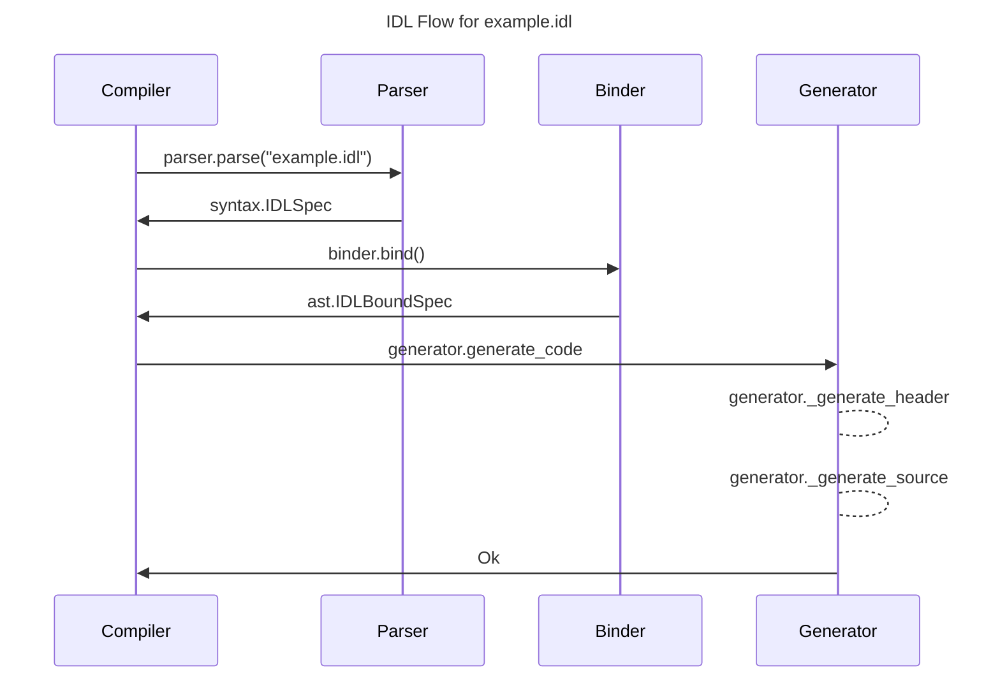

# IDL (Interface Definition Language)

-   [IDL (Interface Definition Language)](#idl-interface-definition-language)
    -   [Key Features](#key-features)
    -   [Overview](#overview)
    -   [Getting started](#getting-started)
        -   [Getting Started with Commands](#getting-started-with-commands)
    -   [The IDL file](#the-idl-file)
    -   [Global](#global)
    -   [Imports](#imports)
    -   [Enums](#enums)
        -   [String Enums](#string-enums)
        -   [Integer Enums](#integer-enums)
        -   [Reference](#reference)
    -   [Types](#types)
        -   [Type Overview](#type-overview)
        -   [Basic Types](#basic-types)
        -   [Custom Types](#custom-types)
        -   [Any Types](#any-types)
        -   [Type Reference](#type-reference)
    -   [Structs](#structs)
        -   [BSON Lifetime](#bson-lifetime)
        -   [Chained Structs (aka struct reuse by composition)](#chained-structs-aka-struct-reuse-by-composition)
        -   [Struct Reference](#struct-reference)
        -   [Struct Fields Attribute Reference](#struct-fields-attribute-reference)
        -   [Field Validator Reference](#field-validator-reference)
    -   [Commands](#commands)
        -   [Commands Reference](#commands-reference)
        -   [Access Check Reference](#access-check-reference)
            -   [Check or Privilege](#check-or-privilege)
    -   [IDL Compiler Overview](#idl-compiler-overview)
        -   [Trees](#trees)
        -   [Passes](#passes)
        -   [Error Handling and Recovery](#error-handling-and-recovery)
        -   [Testing](#testing)
        -   [Extending IDL](#extending-idl)
        -   [Implementation Details](#implementation)
    -   [Best Practices](#best-practices)

Interface Definition Language (IDL) is a custom Domain Specific Language (DSL) originally designed
to generate code to meets MongoDB's needs for handling BSON. Server parameters and configuration
options support was added later. It uses YAML 1.1 to defined a custom IDL and generates C++ code.
IDL is primarily written in Python 3 (Python 2 originally) in the [buildscripts/idl/] directory. It
has C++ support code for the generated code in the [src/mongo/idl] directory. The config option
parsing support code is in [src/mongo/util/options_parser]. It is inspired by other IDL languages
like XDR, ASN.1, MIDL, and Google's Protocol Buffers.

## Key Features

1. Generate C++ classes that represent BSON documents of a specific schema, and parse/serialize
   between BSON documents and the class (aka `struct` in IDL ) using `BSONObj` and `BSONObjBuilder`
2. Generate C++ classes that represent MongoDB BSON commands of a specific schema, and
   parse/serialize between BSON documents
    - Commands are a subset of `struct` but understand the unique requirements of commands. Also, can
      parse `OpMsg`'s document sequences.
3. Parse and serialize Enums as strings or integers
4. Declare, parse and serialize server parameters (aka setParameters)
5. Declare, parse and serialize configuration options
6. C++ Exception based design. IDL throws C++ exceptions on errors, does not use `Status/StatusWith`

## Overview

IDL is like a giant script that prints C++ code. For each invocation of the IDL compiler
[idlc.py](buildscripts/idl/idlc.py), there are two files generated, a header and a source file. For
instance,

```sh
python buildscripts/idl/idlc.py src/mongo/idl/unittest.idl
```

generates two files when invoked from SCons.

```sh
build/opt/mongo/idl/unittest_gen.h
build/opt/mongo/idl/unittest_gen.cpp
```

The generated files always have a suffix of either `_gen.h` or `_gen.cpp`. These files are human
readable and the output tries to match MongoDB's C++ style.

**Important**: At the top of each file is warning about modifying the generated file by hand. Any
modifications to the files are lost when the build is rerun since the build regenerates the files.
Also, the command used to regenerate the file is at top if one wants to generate a file without
running the build system.

## Getting started

IDL is wide spread across the code base. Existing IDL files are good examples of how to use IDL. A
good reference is [`src/mongo/idl/unittest.idl`](unittest.idl) which tests all IDL features.

IDL automates the tedious work of writing BSON parsers. Before IDL, a developer would need to write
code to read the document and then add tests cases to validate the parser worked by design. IDL
eliminates the need to write hand-written parsers and the test burden they incur.

Example Document:

```json
{
    "intField": 42,
    "stringField": "question"
}
```

to represent this in IDL, write the following file:

`src\mongo\example\example.idl`:

```yaml
global:
    cpp_namespace: "mongo"

imports:
    - "mongo/db/basic_types.idl"

structs:
    example:
        description: An example struct
        fields:
            intField:
                type: int
            stringField:
                type: string
```

The next step is to actually generate code from the YAML description. To do that, add the following
to a `SConscript` file:

`src\mongo\example\SConscript`:

```python
env.Library(
    target='example',
    source=[
        'example.idl',
    ],
    LIBDEPS=[
        '$BUILD_DIR/mongo/idl/idl_parser',
    ],
)
```

SCons knows how to invoke the IDL compiler and generate files in the build directory with the C++
code. This code can also be generated by `generated-sources` target in SCons which is useful for
code navigation.

The generated IDL code looks something like the simplified code below.

`build\<variant_director>\mongo\example\example_gen.h`:

```cpp
/**
 * An example struct
 */
class Example {
public:
    Example(std::int32_t intField, std::string stringField,
            boost::optional<SerializationContext> serializationContext = boost::none)

    void serialize(BSONObjBuilder* builder) const;
    BSONObj toBSON() const;

    static Example parse(const IDLParserContext& ctxt, const BSONObj& bsonObject);

    std::int32_t getIntField() const;
    void setIntField(std::int32_t value);
    StringData getStringField() const
    void setStringField(StringData value);
private:
    std::int32_t _intField;
    std::string _stringField;
};
```

IDL generates 5 sets of key methods.

-   `constructor` - a C++ constructor with only the required fields as arguments
-   `parse` - a static function that parses a BSON document to the C++ class
-   `serialize`/`toBSON` - a method that serializes the C++ class to BSON
-   `get*` - methods to value of a field after parsing
-   `set*` - methods to set a field in the C++ class before serialization

To use this class in a C++ file, write the following code:

`src\mongo\example\example.cpp`:

```cpp
#include "mongo/example/example_gen.h"

bool is42(BSONObj& doc) {
    Example example = Example::parse(IDLParserContext("root"), doc);
    return doc.getIntField() == 42;
}
```

If there are any problems parsing, the generated parser throws an exception. More details on the
various features of IDL are described in the sections below.

### Getting Started with Commands

Commands are a subset of structs. All commands are structs but not all structs are commands.
Commands are part of the MongoDB RPC protocol. As such, commands have special rules like the first
field of the command must be its name. IDL supports the unique needs of commands with additional
fields on the `commands` object.

The special features of commands:

1. First element must match the name of the command
2. In `OP_MSG`, `$db` must be present or defaults to `admin`
3. Commands may have a `struct` as a reply
4. Commands may be a part of API Version 1
5. Commands and command replies ignore the generic arguments fields like `$db`, `comment`, `ok`, etc
   during parsing. The list of these fields is in [`generic_arguments.idl`](generic_argument.idl).
   Even if a `command` is marked as `strict: true` these generic arguments are ignored by IDL
   parsers. These fields are parsed by common request and reply parsing code in
   `service_entry_point_common.cpp`.

Example Command:

```json
{
    "hasEncryptedFields": "testCollection",
    "encryptionType": "queryableEncryption",
    "comment": "Example command",
    "$db": "testDB"
}
```

which has a reply

```json
{
    "answer": "yes",
    "ok": 1
}
```

to represent this in IDL, write the following file:

`src\mongo\example\example_command.idl`:

```yaml
global:
    cpp_namespace: "mongo"

imports:
    - "mongo/db/basic_types.idl"

structs:
    hasEncryptedFieldReply:
        is_command_reply: true
        fields:
            answer:
                type: string

commands:
    hasEncryptedFields:
        description: An example command
        namespace: concatenate_with_db
        fields:
            encryptionType:
                type: string
```

Commands have a few unique features compared to structs:

1. Generic fields like `comment` and `$db` are implicitly ignored during parsing. The list of these
   fields is in [`generic_arguments.idl`](generic_argument.idl).
2. The generated code has a method `const NamespaceString getNamespace()` to get the target of the
   command.

To see how to integrate a command IDL file in SCons, see the example above for structs.

## The IDL file

A IDL file consist of a series of top-level sections (i.e. YAML maps).

-   `global` - Global settings that affect code generation
-   `imports`- List of other IDL files that contain enums, types and structs this file refers to
-   `enums` - List of enums to generate code for
-   `types` - List of types which instruct IDL how deserialize/serialize primitives
-   `structs` - List of BSON documents to deserialize/serialize to C++ classes
-   `commands` - List of BSON commands used by MongoDB RPC to deserialize/serialize to C++ classes
-   `server_parameters` - See [docs/server-parameters.md](../../../docs/server-parameters.md)
-   `configs` - TODO SERVER-79135
-   `feature_flags` - TODO SERVER-79135
-   `generic_argument_lists`- List of arguments common to all commands requests - not documented
-   `generic_reply_field_lists`-Li st of arguments common to all command replies - not documented

## Global

-   `cpp_namespace` - string - The C++ namespace for all generated classes and enums to belong to.
    Must start with `mongo`.
-   `cpp_includes` - sequence - A list of C++ headers to include in the generated `.h` file. You
    should not list generated IDL headers here as includes for them are automatically generated from
    `imports`.
-   `configs` - map - A section that defines global settings for configuration options

    -   `source` - sequence - a subset of [`yaml`, `cli`, `ini`]
        -   `cli` - configuration option handled by command line
        -   `yaml` - configuration option handled by yaml config file
        -   `ini` - configuration option handled by deprecated ini file format. Do not use for new flags.
    -   `section` - string - Name of displayed section in `--help`
    -   `initializer` - map

        -   `register` - string - Name of generated function to add configuration options.

            If not provided, an anonymous MONGO*MODULE_STARTUP_OPTIONS_REGISTER initializer will be
            declared which will automatically register the config settings named in this file at startup
            time. This initializer will be named "idl*" followed by a string of hex digits. Currently this
            string is the SHA1 hash of the header's filename, but this should not be used in dependency
            rules since it may change at a later time.

            If provided, all registration logic will be implemented in a public function of the form
            Status registerName(optionenvironment::OptionSection\* options_ptr). It it up to additional
            code to decide how and when this registration function is called.

        -   `store` - string - Name of generated function to store configuration options.

            This behaves like `register`, but using a MONGO_STARTUP_OPTIONS_STORE initializer in the
            not-provided case, and declaring Status storeName(const optionenvironment::Environment&
            params) in the provided case.

An example for a typical global section is:

```yaml
global:
    cpp_namespace: "mongo"
    cpp_includes:
        - "mongo/idl/idl_test_types.h"
```

`mongo` is the C++ namespace for the generated code. One header is listed because the IDL types
depend on it in this imaginary example.

## Imports

The `imports` section is a list of other IDL files to include. If your IDL references other enums,
types, or structs, the imports section lists IDL file with the definition or IDL throws an error.
_Note_: The IDL compiler does not generate code for imported things, it generates code for the file
listed on the command line. For instance, if your IDL file imports a struct named `ImportedStruct`,
the generated code calls its `ImportedStruct::parse` function but does not generate the
`ImportedStruct::parse` definition or declaration.

The `imports` are transitive. The IDL compiler will recursively import all IDL files imported by
other IDL files. IDL will also implicitly de-duplicate imports and only process each file once. The
de-duplication is similar to how `#pragma once` works in C++.

IDL generates a C++ include for the generated headers of each IDL file in the generated code.

An example for a typical `imports` section is:

```yaml
imports:
    - "mongo/db/basic_types.idl"
```

_Note_: [src/mongo/db/basic_types.idl](../db/basic_types.idl) is a foundational file for IDL. This
file defines the standard types of IDL. Without this file, IDL does not know how to read and write a
string or integer for instance.

## Enums

The `enums` section is a YAML map that allow `integer` and `string` enumeration. These both map to
C++ enums, but differ in whether they parse integers or strings in a bson document.

### String Enums

Used to map a string value to a C++ enum value. In this case, the values of the enums themselves are
not important. Use string enums when strings are persisted, not integers. For string enums, the
`values` map is a map of enum value names to strings.

```yaml
StringEnum:
    description: "An example string enum"
    type: string
    values:
        s0: "zero"
        s1: "one"
        s2: "two"
```

it generates an enum and functions to parse and serialize the enum:

```cpp
enum class StringEnumEnum : std::int32_t {
    s0,
    s1,
    s2,
};

StringEnumEnum StringEnum_parse(const IDLParserContext& ctxt, StringData value);
StringData StringEnum_serializer(StringEnumEnum value);
```

### Integer Enums

Used to map a integer value to a C++ enum value. In this case, the values of the enums themselves
are important unlike string enums. Use integer enums when integers are persisted. For integer enums,
the `values` map is a map of enum value names to integers.

```yaml
IntEnum:
    description: "An example int enum"
    type: int
    values:
        s0: 0
        s1: 2
        s2: 4
```

it generates an enum and functions to parse and serialize the enum:

```cpp
enum class IntEnum : std::int32_t {
    kS0 = 0,
    kS1 = 2,
    kS2 = 4,
};

IntEnum IntEnum_parse(const IDLParserContext& ctxt, std::int32_t value);
std::int32_t IntEnum_serializer(IntEnum value);
```

### Reference

Each `enum` can have the following pieces:

-   `description` - string - A comment to add to the generated C++
-   `type` - string - can be either `string` or `int`
-   `values` - map - a map of `enum value name` -> `enum value`

Like struct.fields[], enum.values[] may be given as either a simple mapping `name: value` and indeed
most are, but the may also map names to a dictionary of information:

```yaml
IntEnum:
    description: "An example int enum"
    type: int
    values:
        s0:
            description: Nothing, nada, zip.
            value: 0
        s1: 2
            description: 2 to the first power
            value: 2
        s2: 4
            description: 2 squared!
            value: 4
```

This is not needed in a lot of cases, but in some places it provides good documentation (which will
be surfaced in the generated files as well) for future readers.

There's also a third, very rarely used property for enum values called `extra_data`. You can see an
example of this in [`src/mongo/db/auth/action_type.idl`](../db/auth/action_type.idl) where the
`ResourcePattern` enum correlates itself to permitted `ActionType` enums allowed in Serverless. This
data gets used in
[`src/db/auth/authorization_session_impl.cpp`](../db/auth/authorization_session_impl.cpp).

## Types

A `type` declares all the information that IDL needs to know to read and write a C++ type from/to
BSON. Types are typically string values but can be anything such as documents. They are the main
extensibility point into IDL for C++ code. They allow users to incrementally adopt IDL in their
parsing. This means that not all structs have to be defined in IDL for IDL to be useful. Finally,
types allow users to customize IDL parsing for their own unique needs.

A field in a struct or command can be defined as a type but a field can also be an array, enum,
struct or variant. Declaring a field as something other then a type preferred to using types since
it allows more type information to be represented in IDL over C++. See `type` in the [field
reference](#struct-fields-attribute-reference) for more information.

Type supports builtin BSON types like int32, int64, and string. These are types built into
`BSONElement`/`BSONObjBuilder`. It also supports custom types to give the code full control of
parsing and serialization. _Note_: IDL has no builtin types. The
[src/mongo/db/basic_types.idl](../db/basic_types.idl) file declares all common BSON types and must
be manually imported into every file. This separation makes unit testing easier and allows IDL to be
extendable by separating most type concerns from the python code.

The declaration of a type does not generate any code. The code for a type is generated once it is
instantiated in a struct or command.

### Type Overview

Kinds of types:

1. Types builtin to `BSONElement`/`BSONObjBuilder`. The
   [src/mongo/db/basic_types.idl](../db/basic_types.idl) file declares all common BSON types
2. Types with custom deserialization/serialization behavior but rely on IDL to validate BSON types.
   For example, IDL checks if a type is string before calling deserialize.
3. Types that want full control of deserialization/serialization. Specify `any` as the
   `bson_serialization_type`.

### Basic Types

Here is a basic type definition for the string type.

```yaml
string:
    bson_serialization_type: string
    description: "A BSON UTF-8 string"
    cpp_type: "std::string"
    deserializer: "mongo::BSONElement::str"
    is_view: false
```

The five key things to note in this example:

-   `bson_serialization_type` - a list of types BSON generated code should check a type is before
    calling the deserializer. In this case, IDL generated code checks if the BSON type is `string`.
-   `cpp_type` - The C++ type to store the deserialized value as. This is type of the member variable
    in the generated C++ class when this type is instantiated in a struct.
-   `deserializer` - a method to all deserialize the type. Typically this is a function that takes
    `BSONElement` as a parameter. The IDL generator has custom rules for `BSONElement`.
-   `serializer` - omitted in this example because `BSONObjBuilder` has builtin support for
    `std::string`
-   `is_view` - indicates whether the type is a view or not. If the type is a view, then it's
    possible that objects of the type will not own all of it's members. If the type is not a view,
    then objects of the type are guaranteed to own all of it's members. This field is optional and
    defaults to True. To reduce the size of the C++ representation of structs including this type,
    you can specify this field as False if the type is not a view type.

### Custom Types

Here is a more interesting example for `mongo::NamespaceString`. A NamespaceString is a BSON string
but has custom serialization rules.

```yaml
namespacestring:
    bson_serialization_type: string
    description: "A MongoDB NamespaceString"
    cpp_type: "mongo::NamespaceString"
    serializer: ::mongo::NamespaceStringUtil::serialize
    deserializer: ::mongo::NamespaceStringUtil::deserialize
    deserialize_with_tenant: true
    is_view: false
```

The key thing to note is this example specifies that both `deserializer` and `serializer`. They are
both prefixed with `::` which tells IDL these are global static functions, not members of the C++
type `mongo::NamespaceString`. This also impacts what is passed to the function. Global static (or
free) serializer functions get the instance as the first arg, while member methods do not (because
they have access to this).

### Any Types

`any` types are the escape hatch of the IDL type system. Use `any` types when custom types are not
flexible enough. This is often used to deal pre-IDL fields/structs. IDL `any` types are responsible
for their own BSON type checking. They are also responsible for serializing the field name itself in
the BSON. IDL provides any type serializers with the field name but any types are responsible for
actually writing it to the `BSONObjBuilder`.

```yaml
IDLAnyType:
    bson_serialization_type: any
    description: "Holds a BSONElement of any type."
    cpp_type: "mongo::IDLAnyType"
    serializer: mongo::IDLAnyType::serializeToBSON
    deserializer: mongo::IDLAnyType::parseFromBSON
    is_view: true
```

### Type Reference

-   `description` - string - A comment to add to the generated C++
-   `bson_serialization_type` - string or sequence - a list of types BSON generated code should check
    a type is before calling the deserializer. Can also be `any`.
    [buildscripts/idl/idl/bson.py](../../../buildscripts/idl/idl/bson.py) lists the supported types.
-   `bindata_subtype` - string - if `bson_serialization_type` is `bindata`, this is the required
    bindata subtype. [buildscripts/idl/idl/bson.py](../../../buildscripts/idl/idl/bson.py) lists the
    supported bindata subtypes.
-   `cpp_type` - The C++ type to store the deserialized value as. This is type of the member variable
    in the generated C++ class when a struct/command uses this type.
    -   `std::string` - When using `std::string`, the getters/setters using `mongo::StringData` instead
    -   `std::vector<_>` - When using `std::vector<->`, the getters/setters using
        `mongo::ConstDataRange` instead
-   `deserializer` - string - a method name to all deserialize the type. Typically this is a function
    that takes `BSONElement` as a parameter. The IDL generator has custom rules for `BSONElement`. - By default, IDL assumes it is a instance methods of `cpp_type`. - If prefixed with `::`, assumes the function is a global static function - By default, the deserializer's function signature is `<function_name>(<cpp_type>)`. - For `object` types, the deserializer's function signature is `<function_name>(const BSONObj&
obj)` - For `any` types, the deserializer's function signature is `<function_name>(BSONElement
element)`.
-   `serializer` - string -a method name to all serialize the type. - By default, IDL assumes it is a instance methods of `cpp_type`. - If prefixed with `::`, assumes the function is a global static function - By default, the deserializer's function signature is `<type_append> <function_name>(const
<cpp_type>&)` where `type_append` is a type `BSONObjBuilder` understands. - For `object` types, the deserializer's function signature is `<function_name>(const BSONObj&
obj)` - For `any` types that are not in an array, the serializer's function signature is
    `<function_name>(StringData fieldName, BSONObjBuilder* builder)`. - For `any` types that are in an array, the serializer's function signature is
    `<function_name>(BSONArrayBuilder* builder)`.
-   `deserialize_with_tenant` - bool - if set, adds `TenantId` as the first parameter to
    `deserializer`
-   `internal_only` - bool - undocumented, DO NOT USE
-   `default` - string - default value for a type. A field in a struct inherits this value if a field
    does not set a default. See struct's `default` rules for more information.
-   `is_view` - indicates whether the type is a view or not. If the type is a view, then it's
    possible that objects of the type will not own all of it's members. If the type is not a view,
    then objects of the type are guaranteed to own all of it's members.

## Structs

Structs are the main IDL feature. They are used to serialize and deserialize a BSON document to C++.
A struct consists of a description, a set of optional flags and a sequence of fields. Commands are a
separate feature of IDL designed to handle the unique needs of commands (such as the first field of
a command is its name, common fields across commands). See `commands` [below](#commands)

The generated C++ parsers for structs are strict by default. This means that they throw an error on
fields that do not know about. Use `strict: false` to change this behavior. Mark persisted structs
with `strict: false` for future backwards compatibility needs.

A struct consists of one or more fields. All fields are required by default. The generated parser
errors if field is missing from the BSON document. On serialization, if a field has not been set,
the serializer calls `invariant`.

Fields can optionally be marked as `optional` and stored as `boost::optional`. These fields are
optional in the BSON document and the parser does not throw an error if missing. Also, they are not
required to be set before serialization. Non-optional fields can also have a `default` value. If a
field has a default, then it does not need to present in the BSON document or set in a setter.

```yaml
exampleStruct:
    description: An example command
    fields:
        requiredField: int
        optionalField:
            description: Provide it if you want to.
            type: bool
            optional: true
        defaultedField:
            description: >-
                Most callers should rely on 42
                as it is the answer to the question
                of life the universe and everything.
            type: long
            validator:
                gt: 0
                lt: 50
            default: 42
```

This generates a C++ function with methods to parse and serialize the struct. _Note_: This code has
been simplified from the full code IDL generates.

```cpp
class ExampleStruct {
public:
    static constexpr auto kValueFieldName = "value"_sd;

    ExampleStruct(boost::optional<SerializationContext> serializationContext = boost::none);
    ExampleStruct(mongo::BSONObj value, boost::optional<SerializationContext> serializationContext = boost::none);

    void serialize(BSONObjBuilder* builder) const;
    BSONObj toBSON() const;

    static ExampleStruct parse(const IDLParserContext& ctxt, const BSONObj& bsonObject);

    std::int32_t getRequiredField() const { return _requiredField; }
    void setRequiredField(std::int32_t value) {  _requiredField = std::move(value); }

    boost::optional<bool> getOptionalField() const { return _optionalField; }
    void setOptionalField(boost::optional<bool> value) {  _optionalField = std::move(value);  }

    std::int64_t getDefaultedField() const { return _defaultedField; }
    void setDefaultedField(std::int64_t value) { validateDefaultedField(value); _defaultedField = std::move(value);  }

    const mongo::SerializationContext& getSerializationContext() const { return _serializationContext; }
    void setSerializationContext(mongo::SerializationContext value) {  _serializationContext = std::move(value);  }

protected:
    void parseProtected(const IDLParserContext& ctxt, const BSONObj& bsonObject);

    BSONObj _anchorObj;
private:
    string _value;
};

```

The IDL serializers take `mongo::SerializationContext` which a class to provide to the functions
that serialize `mongo::NameSpaceString` and `mongo::DatabaseName`. For more details see
[`src/mongo/util/serialization_context.h`](../util/serialization_context.h).

### BSON Lifetime

By default IDL parsers do not hold a reference to the `BSONObj` they parse. In the typical case, of
parsing a command from the network, this is fine since the network buffer outlives the generated
parser. But in other cases, you may want to anchor the BSONObj to the IDL generated parser. To do
this call `parseOwned` instead of `parse`.

`BSONObj` behaves as either a view type (i.e. `StringData`) or owned type (i.e. `std::string`). In
the first case, a view type, it is a `const char*` pointer to a block if memory. It does not control
the lifetime of the memory. In the second case, the owned case, it a block of memory with the first
8 bytes being pair of [uint32, uint32]. The first member is a reference count using
`boost::intrusive_ptr` and the second is the length of the bson document. The rest of the BSON
document is adjacent to this the second uint32. In this second case, every copy of the `BSONObj`
increments the reference count and when the reference count drops to zero, the `BSONObj` deletes the
memory block.

A unowned `BSONObj` can be converted to a owned type with the method `getOwned()`. This performs a
memory copy. This method is a no-op if type is already owned.

It can be advantageous to use `parseOwned` instead of `parse` since your IDL struct can use `object`
for fields instead of `object_owned` which create copies. The `parseOwned` method only affects the
lifetime of view types like `object`. IDL deep-copies all other types like `string` and `binary`
today.

### Chained Structs (aka struct reuse by composition)

Chained Structs is IDL's mechanism of IDL reuse by composition. Chained structs allow re-use of
common struct definitions across IDL structs and commands.

For instance, the write commands `insert`, `delete`, and `update` all take
`bypassDocumentValidation` as an optional field. These write commands share
`WriteCommandRequestBase` as a chained struct that defines `bypassDocumentValidation`. By using
chained structs, IDL structs share the definition of the fields. This allows users to write a set of
field definitions once and reuse them across structs.

When IDL generates the classes, the chained structs are available as getters/setters on the
generated class. This allows code that works with them to treat the shared IDL struct as a shared
C++ class. Code can written once to work with the shared struct without having to resort to C++
templates. The fields of a chained struct are not stored in the parent class, they remain in the
child chained struct. Also, chaining does not affect the code generation of any chained structs,
only the type declares it wants to include chained structs.

If `inline_chained_structs` is true, then the members of the chained struct are also available on
the struct including them. This means that instead of users have to call
`obj.getChainedStruct.getCommonField()`, they can call `obj.getCommonField()` instead. Field storage
is not affected as this option is only syntactic sugar.

### Struct Reference

-   `description` - string - A comment to add to the generated C++
-   `fields` - sequence - see [fields attributes reference below](#struct-fields-attribute-reference)
-   `strict` - bool - defaults to true, a strict parser errors if a unknown field is encountered by
    the generated parser. Persisted structs should set this to `false` to allow them to encounter
    documents from future versions of MongoDB without throwing an error.
-   `chained_types` - mapping - undocumented
-   `chained_structs` - mapping - a list of structs to include this struct. IDL adds the chained
    structs as member variables in the generated C++ class. IDL also adds a getter for each chained
    struct.
-   `inline_chained_structs` - bool - if true, exposes chained struct getters as members of this
    struct in generated code.
-   `immutable` - bool - if true, does not generate mutable getters for structs
-   `generate_comparison_operators` - bool - if true, generates support for C++ operatiors: `==`,
    `!=`, `<`, `>`, `<=`, `>=`,
-   `non_const_getter` - bool - if true, generates mutable getters for non-struct fields
-   `cpp_validator_func` - string - name of a C++ function to call after a BSON document has been
    deserialized. Function has signature of `void <function_name>(<struct_name>* obj)`. Method is
    expected to thrown a C++ exception (i.e. `uassert`) if validation fails.
-   `is_command_reply` - bool - if true, marks the struct as a command reply. A struct marked a
    `is_command_reply` generates a parser that ignores known generic or common fields across all
    replies when parsing replies (i.e. `ok`, `errmsg`, etc)
-   `is_generic_cmd_list` - string - choice [`arg`, `reply`], if set, generates functions `bool
hasField(StringData)` and `bool shouldForwardToShards(StringData)` for each field in the struct
-   `query_shape_component` - bool - true indicates this special serialization code will be generated
    to serialize as a query shape
-   `unsafe_dangerous_disable_extra_field_duplicate_checks` - bool - undocumented, DO NOT USE

### Struct Fields Attribute Reference

-   `description` - string - A comment to add to the generated C++
-   `cpp_name` - string - Optional name to use for member variable and getters/setters. Defaults to
    `camelCase` of field name.
-   `type` - string or mapping - supports a single type, `array<type>`, or variant. Can also be
    arrays.
    -   string name of a type must be a `enum`, `type`, or `struct` that is defined in an IDL file or
        imported
    -   string can also be `array<type>` where type must be a `enum`, `type`, `struct`, or `variant`.
        The C++ type will be `std::vector<type>` in this case
    -   Mappings or Variants - IDL supports a variant that chooses among a set of IDL types. You can
        have a variant of strings and structs.
        -   Variant string support differentiates the type to choose based on the BSON type.
        -   Variant struct support differentiates the type to choose based on the _first_ field of the
            struct. The first field must be unique in each struct across the structs. When parsing a
            BSON object as a variant of multiple structs, the parser assumes that the first field
            declared in the IDL struct is always the first field in its BSON representation.
            See `bulkWrite` for an example.
-   `ignore` - bool - true means field generates no code but is ignored by the generated deserializer.
    Used to deprecate fields that no longer have an affect but allow strict parsers to ignore them.
-   `optional` - bool - true means the field is optional. Generated C++ type is
    `boost::optional<type>`.
-   `default` - string - the default value of type. Types with default values are not required to be
    found in the original document or set before serialization
-   `supports_doc_sequence` - bool - true indicates the field can be found in a `OpMsg`'s document
    sequence. Must use the generated `<struct>::parse(OpMsgRequest)` parser to use this
-   `comparison_order` - sequence - comparison order for fields
-   `validator` - see [validator reference](#field-validator-reference)
-   `non_const_getter` - bool - true indicates it generates a mutable getter
-   `unstable` - bool - deprecated, prefer `stability` = `unstable` instead
-   `stability` - string - choice [`unstable`, `stable`] - if `unstable`, parsing the field throws a
    field if strict api checking is enabled
-   `always_serialize` - bool - whether to always serialize optional fields even if none
-   `forward_to_shards` - bool - used by generic arg code to generate `shouldForwardToShards`, no
    affect on BSON deserialization/serialization
-   `forward_from_shards` - bool - used by generic arg code to generate `shouldForwardFromShards`, no
    affect on BSON deserialization/serialization
-   `query_shape` - choice of [`anonymize`, `literal`, `parameter`, `custom`] - see
    [src/mongo/db/query/query_shape.h]

### Field Validator Reference

Validators generate functions that ensure a value during parse or set in a setter are valid.
Comparisons are generated with C++ operators for these comparisons

-   `gt` - string - Validates field is greater than `string`
-   `lt` - string - Validates field is less than or equal to `string`
-   `gte` - string - Validates field is greater than `string`
-   `lte` - string - Validates field is less than or equal to `string`
-   `callback` - string - A static function to call of the shape `Status <function_name>(const
<cpp_type> value)`. For non-simple types, `value` is passed by const-reference.

## Commands

Commands are a customized version of structs designed for MongoDB RPC. All structs are commands but
not all structs are commands. IDL supports the unique needs of commands with additional fields on
the `command` object when compared to `struct`.

The special features:

1. First element must match the name of the command
2. In `OP_MSG`, `$db` must be present or defaults to `admin`
3. Commands may have a `struct` as a reply
4. Commands may be a part of API Version 1
5. Commands and command replies ignore the generic arguments fields like `$db`, `comment`, `ok`, etc

The `namespace` field is the field that describes one kind of parameter a command takes.

1. `concatenate_with_db` - takes a collection name. Generates a method `const NamespaceString
getNamespace()`. Examples: `insert`, `update`, `delete`
2. `concatenate_with_db_or_uuid` - takes a collection name. Generates a method `const
NamespaceStringOrUUID& getNamespaceOrUUID()`. Examples: `find`, `count`
3. `ignored` - ignores the first argument entirely. Examples: `hello`, `setParameter`, `ping`
4. `type` - takes a struct as the first argument. Examples: `getLog`, `clearLog`, `renameCollection`

Commands can also specify their replies that they return. Replies are regular `struct` with
`is_command_reply` = `true`.

### Commands Reference

-   `description` - [see structs](#struct-reference)
-   `chained_types` - - [see structs](#struct-reference)
-   `chained_structs` - - [see structs](#struct-reference)
-   `fields` - - [see structs](#struct-reference)
-   `cpp_name` - - [see structs](#struct-reference)
-   `strict` - - [see structs](#struct-reference)
-   `generate_comparison_operators` - [see structs](#struct-reference)
-   `inline_chained_structs` - [see structs](#struct-reference)
-   `immutable` - [see structs](#struct-reference)
-   `non_const_getter` - [see structs](#struct-reference)
-   `namespace` - string - choice of a string [`concatenate_with_db`, `concatenate_with_db_or_uuid`,
    `ignored`, `type`]. Instructs how the value of command field should be parsed - `concatenate_with_db` - Indicates the command field is a string and should be treated as a
    collection name. Typically used by commands that deal with collections. Automatically
    concatenated with `$db` by the IDL parser. Adds a method `const NamespaceString getNamespace()`
    to the generated class. - `concatenate_with_db_or_uuid` - Indicates the command field is a string or uuid, and should be
    treated as a collection name. Typically used by commands that deal with collections.
    Automatically concatenated with `$db` by the IDL parser. Adds a method `const
NamespaceStringOrUUID& getNamespaceOrUUID()` to the generated class. - `ignored` - Ignores the value of the command field. Used by commands that ignore their command
    argument entirely - `type` - Indicates the command takes a custom type for the first field. `type` field must be
    set.
-   `type` - string - name of IDL type or struct to parse the command field as
-   `command_name` - string - IDL generated parser expects the command to be named the name of YAML
    map. This can be overwritten with `command_name`. Commands should be `camelCase`
-   `command_alias` - string - allows commands to have multiple names. DO NOT USE. Some older commands
    have both `lowercase` and `camelCase` names.
-   `reply_type` - string - IDL struct that this command replies with. Reply struct must have
    `is_command_reply` set
-   `api_version` - string - Typically set to the empty string `""`. Only set to a non-empty string if
    command is part of the stable API. Generates a class name
    `<command_name>CommandNameCmdVersion1Gen` derived from `TypedCommand` that commands should be
    derived from.
-   `is_deprecated` - bool - indicates command is deprecated
-   `allow_global_collection_name` - bool - if true, command can accept both collect names and
    non-collection names. Used by the `aggregate` command
-   `access_check` - mapping - see [access check reference](#access-check-reference)

### Access Check Reference

A list of privileges the command checks. Only applicable for commands that are a part of
API Version 1. Checked at runtime when test commands are enabled.

-   `none` - bool - No privileges required
-   `simple` - mapping - single [check or privilege](#check-or-privilege)
-   `complex` - sequence - list of [check and/or privilege](#check-or-privilege)

#### Check or Privilege

-   `check` - string - checks a part of the access control system like is_authenticated. See
    [`src/mongo/db/auth/access_checks.idl`](../db/auth/access_checks.idl) for a complete list.
-   `privilege` - mapping
    -   `resource_pattern` - string - a resource pattern to check for a given set of privileges. See
        `MatchType` enum in [`src/mongo/db/auth/action_type.idl`](../db/auth/action_type.idl) for
        complete list.
    -   `action_type` - sequence - list of action types the command may check. See `ActionType` enum in
        [`src/mongo/db/auth/action_type.idl`](../db/auth/action_type.idl) for complete list.
    -   `agg_stage` - string - aggregation only. Name of aggregation stage. Used to appease the idl
        compatibility checker.

## IDL Compiler Overview

The IDL compiler is organized as a traditional compiler written in Python 3 (originally Python 2)
and is located in [`buildscripts\idl`](../../../buildscripts/idl/). It has 3 passes and has two
different tree representations that pass between passes. Having multiple passes reduces the
complexity of each pass by separating tasks across different files.

Here is an example of how IDL processes a file `example.idl`.



[`compiler.py`](../../../buildscripts/idl/idl/compiler.py) orchestrates the 3 passes by calling each
one in sequence. For instance, it calls the parser and passes the syntax tree it returns to the
binder. It also fixes up the include files for the generated code.

### Trees

1. [Concrete Syntax](../../../buildscripts/idl/idl/syntax.py) - a tree representation of the YAML
   file. Each item in the tree is 1-1 match for an item in the YAML file. Also stores the symbol
   table. May have errors in like references to missing types.
2. [AST](../../../buildscripts/idl/idl/ast.py) - (Abstract Syntax Tree) - a simplified version of
   the syntax tree. AST tree does not map 1-1 to YAML file as some "internal types" and hidden
   fields are injected into the tree. The AST tree has no errors.

The two trees (syntax and ast) share just one type `common.SourceLocation` between them. While it
means there is some duplication between trees, it makes code readability better. If types were
shared between passes but with some fields just read/written in some passes, it would make reasoning
about the code more difficult.

### Passes

1. [Parser](../../../buildscripts/idl/idl/parser.py) - Parses YAML file and produces a concrete
   syntax tree. Does some error checking like checks for duplicate symbols.
2. [Binder](../../../buildscripts/idl/idl/binder.py) - Translates concrete syntax tree to ast tree.
   Does most error checking. Injects hidden fields and other things into AST tree. AST tree is clean
   of errors after binder.py
3. [Generator](../../../buildscripts/idl/idl/generator.py) - Writes header file `_gen.h` and source
   file `_gen.cpp`. Generator does no error checks (it does have a few asserts though) as error
   checking is the responsibility of earlier passes.

### Error Handling and Recovery

IDL compiler does not throw exceptions. The C++ generated code does throw exceptions though. The
compiler adds all errors to the `errors.ParserContext` in
[errors.py](../../../buildscripts/idl/idl/errors.py). This allows the IDL to capture more than one
error from the user's IDL file and report it to the user. All errors codes start with `ID` and are
of the format `IDNNNN` where N is a number. The python unit tests assert these error codes in
negative tests but by using string constants `ERROR_ID_...` for each error.

### Testing

IDL has two sets of tests:

1. Python unit tests for the parser and binder - see [tests](../../../buildscripts/idl/tests/)
2. C++ Unit Tests for the code generator and generated code - see [unittest.idl](unittest.idl) and
   [idl_test.cpp](idl_test.cpp) respectively

### Extending IDL

Since IDL is a python script, it is quick to iterate on since it does not need to be compiled. When
making changes to IDL, it is recommended to call the IDL compiler directly instead of through the
build system. If the IDL scripts are changed, this often triggers all the IDL generated files to be
regenerated and then recompiled. It can be faster to just invoke the scripts manually and then
invoke the compiler by hand also. Every IDL file has the python invocation to generate it printed at
the top of the file.

When extending IDL, add tests to the python unit tests and C++ unit tests. With few exceptions, the
unit tests exercise all features and combinations IDL can handle.

### Implementaion Details

#### BSONObj Anchor

The parsing method a struct is initialized with indicates what type of ownership the constructed
object has on the `BSONObj` parameter. An internal `BSONObj` anchor ensures that the lifetime of
the `BSONObj` matches the lifetime of the object in the cases that the `BSONObj` parameter is
owned or shared.

#### View Types

If the struct is a view, then it's possible that objects of the type will not own all of it's
members. If the struct is not a view, then objects of the type are guaranteed to own all of it's
members. This is determined by recursively checking the fields of a struct. This info is used
during generation to determine whether or not a struct will need a `BSONObj` anchor.

## Best Practices

IDL has been in use since 2017. In that time, here are a few best practices:

1. strict or non-strict parsers - Structs that are persisted to disk should set `strict: false`.
   It's better for upgrade/downgrade. Commands should set `strict: true` or omit it as `strict:
true` is the default. 1. For persistance: For upgrade/downgrade, if a persisted document with a strict parser has a
   field added in new version N+1 and then the user downgrades to old version N, the strict
   parser will throw an exception and reject the document. If this document was part of the
   storage catalog for instance, the server would fail to start. 2. For commands: By using strict parsers, it gives the server the ability to add fields without
   the risk of clients accidentally sending fields with the same name that had been ignored.
2. Extending existing structs/commands - all new fields in a struct/command must be marked optional
   to support backwards compatibility. For new structs/commands, there should be some required
   fields. It does not matter if the struct is not persisted, non-optional fields break backwards
   compatibility. If optional fields are not the right fit, a new field can be given a default value
   instead. Fields with default values are not required fields.
3. Lifetime - Use `object_owned` instead of `object`. If your IDL uses `object`, it does not own
   that `BSONObj` that it is returned from its getter. This means that once the `BSONObj` that was
   passed to `parse()` goes out of scope, the object will point to free memory. Use `object_owned`
   if this is not desired. `object_owned` incurs extra memory allocations though.
    1. An alternative is to use either the `parseSharingOwnership` or `parseOwned` methods. These
       methods will ensure the IDL generated class has an anchor to the `BSONObj`. See comments in
       the generated class. It is not advisable though to use these methods during normal command
       request processing. The network buffer that holds the inbound request is available during the
       lifetime of the request even though IDL does not anchor the network buffer.
