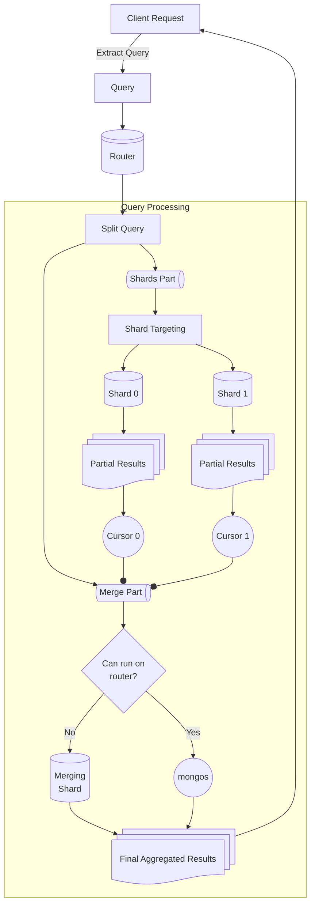
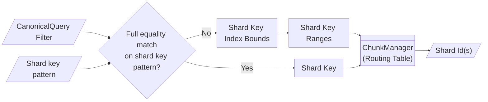

# Cluster Planning

## Overview

> ### Aside: Sharding
>
> **Sharding** is the process of distributing data across multiple servers (shards) to horizontally scale the database. Each shard owns a subset of the data, enabling parallel processing and improved performance by spreading the workload across multiple machines. For more information on sharding, refer to the [Sharding Architecture Guide](../../../db/s/README.md).

Queries on distributed data are processed in a distributed fashion. This is generally a two-step process:

1. [Cluster Planning and Optimization](#cluster-planning-and-optimization): Determining which parts can run in parallel and which parts cannot.
1. [Shard and Host Targeting](#shard-and-host-targeting): Identifying the nodes that should run the various components.

## Cluster Planning and Optimization

### Shared Logic for all Commands

Both `mongos` and `mongod` acting as a router can do distributed query planning.

> ### Aside: mongos
>
> For a sharded cluster, the **`mongos`** instances provide the interface between the client applications and the sharded cluster, routing queries and write operations to the appropriate shard(s) based on the shard key.

> ### Aside: mongod
>
> **`mongod`** is the primary daemon process for the MongoDB system. It handles data requests, manages data access, and performs background management operations.
>
> In a sharded cluster, `mongod` instances are deployed as shard servers, each responsible for storing a subset of the data in a cluster. They handle queries targeting their owned data ranges (chunks), determined by the shard key. In some cases, a `mongod` may also act as a router and perform shard targeting.

For queries that must run on more than one shard (i.e. the query requires data that is spread across shards), there is (1) a _shards part_ of the query and (2) a _merge part_ of the query. The _shards part_ includes components that can be executed in parallel by all the targeted shards, such as filters. The _merge part_ performs the remaining query operations globally on a single node, gathering the results from the _shards part_ and then executing the rest of the query over the aggregated results. These commands are processed through the following steps:

1. **Determine Shards Part and Merge Part**: The query is analyzed and split into the _shards part_, which can be run in parallel across shards, and _merge part_, which must be executed globally on a merge host.

2. **Shard Targeting**: The **routing table** is consulted to determine which `shardIds` own data required by the _shards part_ (details in [Shard and Host Targeting](#shard-and-host-targeting)). This is usually the latest routing table, although a historical routing table may be retrieved for transactions. For details on how the shard key is extracted from the query and how the set of shard ids is produced, refer to [Shard and Host Targeting](#shard-and-host-targeting).

> ### Aside: Routing table
>
> The **routing table** maps chunks of data to shard ids, and it is consulted by `mongos` for shard targeting. It must be updated as data moves between shards, such as when the balancer is turned on or a range migration commits. For more information on the shard versioning protocol it uses to ensure a consistent view of data across a request, refer to the [Distributed CRUDs README](../README.md).
>
> A **chunk** is a contiguous range over the shard key.

3. **Shards Part Dispatch & Response**: Next, cursors are established with a consistent `shardVersion` across the selected shards. They are transferred to a `ClusterClientCursor`, which returns the first batch of results.

> ### Aside: Cursor
>
> A **cursor** is a pointer to the result set of a query. The client can iterate over large result sets without loading all the data into memory at once. Queries return cursor ids, as well as a number of documents within the specified `batchSize`. If there are more documents remaining in the result set, the client will construct subsequent `getMore` requests with the same cursor id. If all documents have been returned in the first batch, the returned cursor id is 0.

4. **Merge Part Dispatch & Execution**: Once shard responses are ready, the _merge part_ is prepared for execution. The _merge part_ is executed on the merge host, which can be either the `mongos` or a merging shard. It collects data from shard cursors and performs a global aggregation or processing to produce the final result.



### Command-Specific Logic

There are some high-level differences between the different distributed commands. For example, find commands use the `AsyncResultsMerger` for the _merge part_, whereas aggregate commands use a merging pipeline with a `$mergeCursors` stage.

Find commands have fairly straightforward logic for what goes into the _shards part_ and what goes into the _merge part_. The `filter` is always processed by the shards. If the query targets multiple shards, the `skip`, `limit`, and `sort` are applied on the router. If it only targets a single shard, they are applied on the `mongod`.

Agg commands are more expressive and thus have stage-specific logic that determines where the "pipeline splitting" happens. Generally, it is desirable for the split to happen as late as possible so that the bulk of the pipeline can be executed in parallel in the _shards part_. For more details, refer to the [Distributed Aggregations README](../README_aggregation.md).

> ### Aside: Exchange Operator
>
> In certain cases, an additional [check](https://github.com/10gen/mongo/blob/868afa0e0f3f1a547103b1805d5610ec831b8c3f/src/mongo/db/pipeline/sharded_agg_helpers.cpp#L1079) is performed to see if the `mergePipeline` is eligible for the `$exchange` operator. This is useful for queries that send results to different remote hosts, such as `$out` to a sharded collection. The goal is to shuffle documents with the exchange such that the merging can be done on multiple shards, rather than selecting a single merger. There will be an exchange producer on each shard generating results, as well as an exchange consumer on each output shard. This increases parallelism during the merging stage.
>
> For example, the pipeline
>
> ```
> db.coll.aggregate([
> 	{$addFields: {value: <expression>}},
> 	{$group: {_id: "$value"}},
> 	{$project: {shardKey: "$_id"}},
> 	{$out: {
> 		to: "sharded",
> 		mode: "replaceDocuments"
> 	}}
> ]);
> ```
>
> would normally perform the merge part (final `$group` + `$project` + `$out`) remotely on a single merging shard, before sending the data owned by each shard back to the shard.
>
> But because the pipeline is shard key-preserving, we could exchange documents such that the results of each partial group are sent to their owning shards. The optimized split pipeline would look like:
>
> ```
> {
> 	shards: [
> 		{$addFields: {value: <expression>}},
> 		{$group: {_id: "$value"}},
> 		{exchange: {...}}
> 	],
> 	merger: [
> 		{$mergeCursors: {...}},
> 		{$group: {_id: "$shardKey"}},
> 		{$project: {shardKey: "$_id"}},
> 		{$out: {...}}
> 	]
> }
> ```
>
> There will be multiple mergers, one per shard owning chunks of the output collection. This increases the chance that each `$out` write is done locally, rather than remotely.
>
> The data is partitioned based on the specific redistribution policy:
>
> 1. `kBroadcast` - each produced document is sent to all consumers.
> 1. `kRoundRobin` - each produced document is sent to one producer in a round-robin fashion.
> 1. `kKeyRange` - the data is routed to consumers based on ranges of values. This can be beneficial for merge pipelines that preserve the shard key.
>
> For more information about `$exchange`, refer to [`exchange_spec.idl`](https://github.com/10gen/mongo/blob/868afa0e0f3f1a547103b1805d5610ec831b8c3f/src/mongo/db/pipeline/exchange_spec.idl) or [`document_source_exchange.h`](https://github.com/10gen/mongo/blob/868afa0e0f3f1a547103b1805d5610ec831b8c3f/src/mongo/db/pipeline/document_source_exchange.h).

**Top-Level Entrypoints**:

_Find_:

- [`cluster_find_cmd::run()`](https://github.com/10gen/mongo/blob/868afa0e0f3f1a547103b1805d5610ec831b8c3f/src/mongo/s/commands/query_cmd/cluster_find_cmd.h#L336)
  - Builds a `CanonicalQuery` from the command request and sends it to [`cluster_find::runQuery()`](https://github.com/10gen/mongo/blob/868afa0e0f3f1a547103b1805d5610ec831b8c3f/src/mongo/s/query/planner/cluster_find.cpp#L632).
  - This function targets remote hosts according to the provided `readPreference`, returning the first batch of results and a cursor id for subsequent `getMore` requests on success.

_Aggregate_:

- [`cluster_aggregate::runAggregate()`](https://github.com/10gen/mongo/blob/868afa0e0f3f1a547103b1805d5610ec831b8c3f/src/mongo/s/query/planner/cluster_aggregate.cpp#L514)
  - Standard entrypoint for most sharded aggregations.
  - Called from [`ClusterPipelineCommandBase::_runAggCommand()`](https://github.com/10gen/mongo/blob/868afa0e0f3f1a547103b1805d5610ec831b8c3f/src/mongo/s/commands/query_cmd/cluster_pipeline_cmd.h#L131).
  - Processes full aggregation pipelines issued from the cluster.
- [`MongosProcessInterface::preparePipelineForExecution()`](https://github.com/10gen/mongo/blob/868afa0e0f3f1a547103b1805d5610ec831b8c3f/src/mongo/db/pipeline/process_interface/mongos_process_interface.cpp#L160).
  - Handles pipelines issued from a `mongos` router.
  - Prepares and optimizes pipelines, splitting them as needed for execution across shards.
- [`ShardServerProcessInterface::preparePipelineForExecution()`](https://github.com/10gen/mongo/blob/868afa0e0f3f1a547103b1805d5610ec831b8c3f/src/mongo/db/pipeline/process_interface/shardsvr_process_interface.cpp#L636)
  - Handles pipelines issued from a `mongod` node that acts as a shard server.
  - Typically processes subpipelines for stages like `$lookup` and `$unionWith`.

### Example

Let's see how this process is applied to the following sample collection and pipeline:

**Sample Data**

```
[
    {_id: 0, brand: "Anthropologie", inventory: 15, type: "dresses", location: "5th Avenue"},
    {_id: 1, brand: "Anthropologie", inventory: 7, type: "accessories", location: "5th Avenue"},
    {_id: 2, brand: "Anthropologie", inventory: 3, type: "pants", location: "Tribeca"},
    {_id: 3, brand: "Adidas", inventory: 18, type: "pants", location: "5th Avenue"},
    {_id: 4, brand: "Adidas", inventory: 12, type: "shoes", location: "Tribeca"},
    {_id: 5, brand: "Adidas", inventory: 18, type: "pants", location: "Tribeca"},
    {_id: 6, brand: "Nike", inventory: 25, type: "shoes", location: "Soho"},
    {_id: 7, brand: "Zara", inventory: 20, type: "dresses", location: "Soho"}
]
```

**Pipeline**

```
[
    {$match: {location: {$in: ["5th Avenue", "Tribeca"]}}},
    {$group: {_id: "$brand", totalInventory: {$sum: "$inventory"}}}
]
```

Imagine the collection is sharded on `location`.

- **shard0**: `{location: "5th Avenue"}`
- **shard1**: `{location: "Tribeca"}`
- **shard2**: `{location: "Soho"}`

The `$match` stage can be pushed down to the shards, as can part of the work in the `$group` stage. During shard targeting, `shard0` and `shard1` are identified. The `$match` and `$group` are executed independently on each shard, producing intermediate results:

```
// shard0
[
    {_id: "Anthropologie", totalInventory: 22},
    {_id: "Adidas", totalInventory: 18}
]

// shard1
[
    {_id: "Anthropologie", totalInventory: 3},
    {_id: "Adidas", totalInventory: 30}
]
```

The merge host then collects these intermediate results from the shards and performs a final aggregation to combine the results:

```
[
    {_id: "Anthropologie", totalInventory: 25},
    {_id: "Adidas", totalInventory: 48}
]
```

This reduces the amount of data transferred over the network between shards and the merge host, since we filter only the data that matches the `location` and return only the requested fields back from the shards.

## Shard and Host Targeting

As part of optimization on the router, query commands (find and agg alike) build a `CanonicalQuery` containing all the information needed to figure out which nodes should run the shards part of the query.

Given a filter from a `CanonicalQuery` and a `ChunkManager` that's a wrapper around a routing table at a specific point in time, we can calculate the relevant shard ids ([`shard_key_pattern_query_util::getShardIdsAndChunksForCanonicalQuery()`](https://github.com/10gen/mongo/blob/868afa0e0f3f1a547103b1805d5610ec831b8c3f/src/mongo/s/shard_key_pattern_query_util.cpp#L515)). The process varies depending on how much shard key information is present in the filter.

> ### Aside: Shard Key Pattern
>
> The field(s) used to partition data across shards. A query must include the full shard key pattern or a prefix of a compound shard key pattern to be targeted to the shards. If no shard key fields are present in the query, the query may need to be broadcasted to all shards.

**Case 1: Full Shard Key Extraction (Equality Match)**

For queries involving simple equality matches covering the whole shard key pattern, we can directly extract the corresponding shard key values. This can usually be targeted to a single shard, barring special cases such as a non-simple collation, so we take the fast path and return the `shardId` immediately.

```
// Shard key pattern:
{a: 1, b: 1}

// Filter over full shard key
{a: {$eq: 3}, b: {$eq: "hi"}}

// Shard key extracted
{a: 3, b: "hi"}
```

> ### Aside: Collation and Shard Targeting
>
> A collation is a set of rules that defines how strings are compared and stored. Rules can be related to case sensitivity (whether `A` and `a` are considered equivalent or distinctly ordered) and locale awareness (whether `a` sorts before `z` can depend on the locale/language). Shard keys are created with the default collation, so when a query specifies a different collation, the query may not be targeted correctly.
>
> For example, the equality predicate `{location: 'Nice'}` with a case-insensitive collation is expected to match documents where location = 'Nice' or 'nice'. However, because shard keys use the default case-sensitive collation, the query may only target the shard containing the exact match for `Nice`. This can lead to incomplete or incorrect query results, so the query is ineligible for shard targeting unless we explicitly allow forcing targeting with a simple collation.

**Case 2: Non-Equality Matches on Shard Key**

When the filter contains non-equality predicates (ranges), or the fields in the query filter don't match the full shard key pattern, the query is transformed into index bounds for each shard key field, leveraging query planning as a subroutine. These bounds are then transformed into full shard key ranges.

```
// Shard key pattern:
{a: 1, b: 1}

// Filter
{a: {$gte: 1, $lt: 2}, b: {$gte: 3, $lt: 4}}

// Bounds
{a: [1, 2), b: [3, 4)}

// Ranges
{a: 1, b: 3} => {a: 2, b: 4}
```

The chunk manager returns the `shardId`s that map to the provided shard key ranges.



> ### Aside: [`ShardTargetingPolicy`](https://github.com/10gen/mongo/blob/868afa0e0f3f1a547103b1805d5610ec831b8c3f/src/mongo/db/pipeline/sharded_agg_helpers_targeting_policy.h#L33)
>
> The `ShardTargetingPolicy` defines policies that determine whether and how a query or operation can target shards.
>
> 1. `kNotAllowed` - operations that can only perform local reads on the node, disallowed from communicating with other shards. For instance, a `$lookup` that's run in a transaction doesn't support a sharded `from` collection by default, so its subpipeline would have a shard targeting policy of `kNotAllowed`.
> 1. `kAllowed` - operations can be targeted to specific shards. This is the default in most cases, and applies to queries that perform equality and range lookups over a shard key.
> 1. `kForceTargetingWithSimpleCollation` - this forces shard targeting with the `simple` collation, ignoring a potentially different collation specified by the query.

---

[Return to Cover Page](../../../db/query/README_QO.md)
