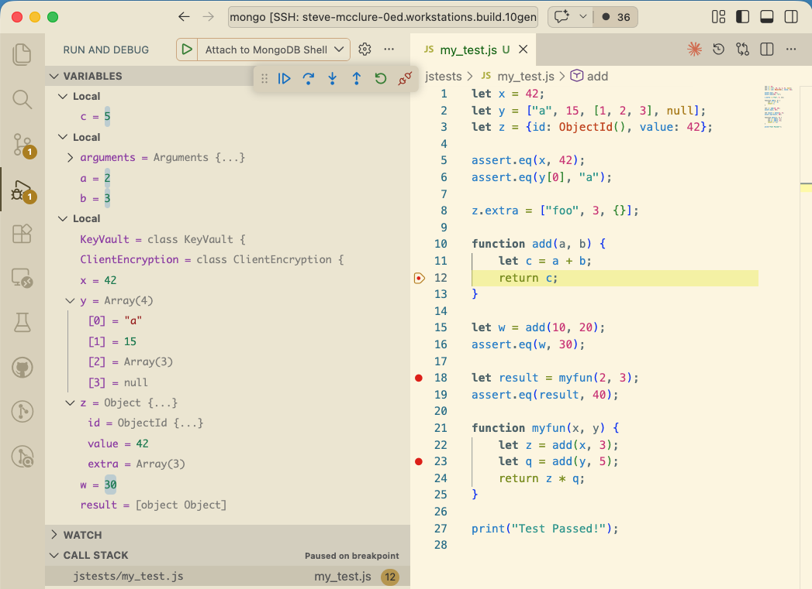

# VSCode Extension for Debugging JS in the Mongo Shell

Use VSCode's Debugger UI with resmoke's `--jsdbg` flag.



## Features

- Add breakpoints directly inside JS files in the VSCode editor UI.
- **Pause execution**
  - Pause the shell execution on breakpoints
  - Automatically stop on uncaught exceptions
- **Inspect**
  - See all variables across scopes in the sidebar
  - Update variable values directly in the Variables sidebar
  - Hover on variables in the editor to see their current values in a tooltip
- **Navigate**
  - See the full JS callstack and easily jump to those files/lines
  - Continue to the next breakpoint
- **REPL**
  - Use the Debug Console to inspect/modify variables and evaluate expressions
  - debugger; statements will pause at the terminal for user input, to inspect/modify variables and evaluate expressions.

### Limitations

- Step functionality (step, step in, step out) is not supported. Each currently redirects to the Continue functionality.
- Watching variables is not supported.
- Deeply nested variables are truncated in the Variables sidebar display, with only 1 level of expansion. Use the Debug Console to inspect more. See [SERVER-121664](https://jira.mongodb.org/browse/SERVER-121664).
- Breakpoints set while the shell is paused take effect immediately. Breakpoints set while the shell is running will apply the next time a breakpoint is hit (the shell is not interrupted mid-execution).
- The debugger uses port 9229, the default Chrome debugging port. Any open Chrome debuggers (eg. Developer Tools open in a Chrome tab) will conflict with this VSCode Debugger.

## Install

Run the following to package and install the latest extension:

```bash
./src/mongo/shell/debugger/vscode/install.sh
```

You'll see something like the following upon completion:

```
 DONE  Packaged: /home/ubuntu/mongo/src/mongo/shell/debugger/vscode/mongo-shell-debugger-1.0.0.vsix (7 files, 8.88 KB)
Installing extensions on SSH: steve-mcclure-0ed.workstations.build.10gen.cc...
Extension 'mongo-shell-debugger-1.0.0.vsix' was successfully installed.
```

> **One-time setup: Launch Configuration**
>
> Add a "mongo-shell" type configuration in your `.vscode/launch.json` file:
>
> ```json
> {
>   "version": "0.1.0",
>   "configurations": [
>     {
>       "type": "mongo-shell",
>       "request": "attach",
>       "name": "Attach to MongoDB Shell",
>       "debugPort": 9229
>     }
>   ]
> }
> ```

## Usage

1. Open a .js test file in VSCode
2. Add a breakpoint next to the line number (a red dot)
3. Start the debugger. Either:
   - Press F5 while in a JS file to start the (VSCode) debug server, or
   - In the "Run and Debug" side bar, choose "Attach to MongoDB Shell" in the dropdown, and click the play button.
     > You should see the following in the "Debug Console" of VSCode:
   ```
   Debug server listening on port 9229
   Waiting for mongo shell to connect on port 9229...
   Use resmoke's --jsdbg flag when running a JS test file to stop on breakpoints.
   ```
4. Run resmoke with the `--jsdbg` flag to stop on the breakpoints.
5. Use VSCode's breakpoint UI to navigate (continue, inspect scope variables, etc).

## Architecture

### Overview

```
┌─────────────────┐
│   VSCode UI     │
└────────┬────────┘
         │ DAP
         │
┌─────────────────┐
│   session.js    │  (VSCode Extension)
└────────┬────────┘
         │ JSON/TCP
         │
      :9229
         │
         │
┌─────────────────┐
│   adapter.cpp   │  (MongoDB Shell)
└────────┬────────┘
         │ DAP Messages
         │
┌─────────────────┐
│  debugger.cpp   │
└────────┬────────┘
         │ SM Debugger API
         │
┌─────────────────┐
│  SpiderMonkey   │  (JS Execution)
└─────────────────┘
```

### Components

**Client (VSCode Extension)**

- `extension.js` - Registers the extension and its configuration with VSCode
- `adapter.js` - Main entrypoint for VSCode Debug Adapter
- `session.js` - DAP server, listens on TCP port, translates VSCode ↔ shell protocol

**Server (MongoDB Shell)**

- `adapter.h/cpp` - DAP message handler, TCP client, connects to session.js
- `debugger.h/cpp` - SpiderMonkey Debugger API wrapper, breakpoint management

### Message Flow

**Initialization**

1. VSCode starts → session.js creates TCP server on :9229
2. Shell starts with `--jsdbg` → adapter.cpp connects to :9229
3. Shell waits for a "handshake" (configurationDone) from session.js
4. session.js sends all known breakpoints to the shell, then sends configurationDone
5. Shell begins execution, pausing on any breakpoints it encounters

**Breakpoints set before shell connects**

session.js stores breakpoints as `Breakpoint` objects with locally-assigned IDs and responds
to VSCode immediately with unverified status. When the shell connects, step 4 above delivers
them all. The shell responds with verified status, and session.js emits `BreakpointEvent("changed")`
using the same IDs so VSCode updates the gutter indicators.

**Breakpoints set after shell connects**

`setBreakpoints` is forwarded to the shell immediately. The shell applies them retroactively
to any already-loaded scripts (via `debugger.findScripts()`) and to any scripts that load in
the future (via `onNewScript`). The shell's response is passed directly back to VSCode.

**Breakpoint Hit**

1. JS execution hits breakpoint → SpiderMonkey calls `hit()` handler
2. `debugger.cpp` stores location, sends "stopped" event via adapter
3. adapter blocks execution
4. VSCode shows paused state, requests stackTrace
5. User clicks continue → adapter unpauses, execution resumes

### Protocol

Newline-delimited JSON over TCP, eg:

```json
{"type":"request","seq":1,"command":"setBreakpoints","arguments":{...}}
{"type":"response","seq":1,"success":true,"body":{...}}
{"type":"event","event":"stopped","body":{"reason":"breakpoint"}}
```

### SpiderMonkey Integration

**Two Compartments**

- Main compartment: runs user JS, is observed by Debugger
- Debugger compartment: owns Debugger instance, separate from debuggee

> MozJS prohibits compartment "re-entry": we can spin-wait in JS and call C++, but that can't call back into JS execution. It can get/set properties, but it can't invoke any execution.

**Breakpoint Mechanism**

`_breakpoints` (source URL → set of line numbers) is the canonical server-side state. It is
always up to date regardless of when breakpoints were set.

- **New scripts**: `onNewScript` fires, reads from `_breakpoints`, calls `script.setBreakpoint(offset, {hit: handler})`
- **Already-loaded scripts**: when `setBreakpoints` arrives while running, the URL is queued in
  `_pendingBPUpdateUrls`. The shared `__spinwait` (defined in `helpers.js`) detects this flag
  while paused in any scenario (breakpoint hit, exception, or `debugger;` statement), calls
  `debugger.findScripts({url})`, clears stale breakpoints, and re-applies the current set.
- **Hit handler**: stores location, invokes C++ pause logic, then calls shared `__spinwait`

Shared pause logic (`__spinwait`, `__processScopes`, `__storeCallStack`, `__applyPendingBPUpdates`)
lives in `helpers.js` and is used by all three handler files.

**Execution Control**

- Pause: `_paused` atomic flag + condition variable blocks C++ thread
- Continue: flag cleared, condition variable notified, execution resumes
- REPL: stdin thread accepts commands, evaluates via `frame.eval()` in paused context
