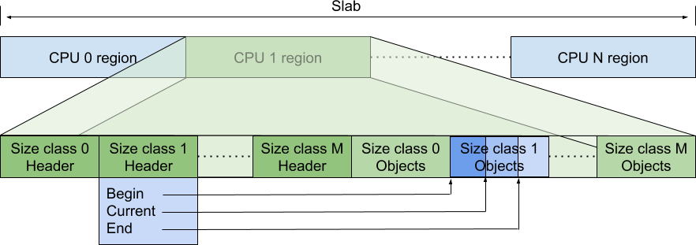

# TCMalloc : Thread-Caching Malloc

## Motivation

TCMalloc is a memory allocator designed as an alternative to the system default
allocator that has the following characteristics:

*   Fast, uncontended allocation and deallocation for most objects. Objects are
    cached, depending on mode, either per-thread, or per-logical-CPU. Most
    allocations do not need to take locks, so there is low contention and good
    scaling for multi-threaded applications.
*   Flexible use of memory, so freed memory can be reused for different object
    sizes, or returned to the OS.
*   Low per object memory overhead by allocating "pages" of objects of the same
    size. Leading to space-efficient representation of small objects.
*   Low overhead sampling, enabling detailed insight into applications memory
    usage.

## Usage

You use TCMalloc by specifying it as the `malloc` attribute on your binary rules in Bazel.

## Overview

The following block diagram shows the rough internal structure of TCMalloc:

We can break TCMalloc into three components. The front-end, middle-end, and
back-end. We will discuss these in more details in the following sections. A
rough breakdown of responsibilities is:

*   The front-end is a cache that provides fast allocation and deallocation of
    memory to the application.
*   The middle-end is responsible for refilling the front-end cache.
*   The back-end handles fetching memory from the OS.

Note that the front-end can be run in either per-CPU or legacy per-thread mode,
and the back-end can support either the hugepage aware pageheap or the legacy
pageheap.

## The TCMalloc Front-end

The front-end handles a request for memory of a particular size. The front-end
has a cache of memory that it can use for allocation or to hold free memory.
This cache is only accessible by a single thread at a time, so it does not
require any locks, hence most allocations and deallocations are fast.

The front-end will satisfy any request if it has cached memory of the
appropriate size. If the cache for that particular size is empty, the front-end
will request a batch of memory from the middle-end to refill the cache. The
middle-end comprises the CentralFreeList and the TransferCache.

If the middle-end is exhausted, or if the requested size is greater than the
maximum size that the front-end caches handle, a request will go to the back-end
to either satisfy the large allocation, or to refill the caches in the
middle-end. The back-end is also referred to as the PageHeap.

There are two implementations of the TCMalloc front-end:

*   Originally it supported per-thread caches of objects (hence the name Thread
    Caching Malloc). However, this resulted in memory footprints that scaled
    with the number of threads. Modern applications can have large thread
    counts, which result in either large amounts of aggregate per-thread memory,
    or many threads having minuscule per-thread caches.
*   More recently TCMalloc has supported per-CPU mode. In this mode each logical
    CPU in the system has its own cache from which to allocate memory. Note: On
    x86 a logical CPU is equivalent to a hyperthread.

The differences between per-thread and per-CPU modes are entirely confined to
the implementations of malloc/new and free/delete.

## Small and Large Object Allocation

Allocations of "small" objects are mapped onto one of
[60-80 allocatable size-classes](https://github.com/google/tcmalloc/blob/master/tcmalloc/size_classes.cc).
For example, an allocation of 12 bytes will get rounded up to the 16 byte
size-class. The size-classes are designed to minimize the amount of memory that
is wasted when rounding to the next largest size-class.

When compiled with `__STDCPP_DEFAULT_NEW_ALIGNMENT__ <= 8`, we use a set of
sizes aligned to 8 bytes for raw storage allocated with `::operator new`. This
smaller alignment minimizes wasted memory for many common allocation sizes (24,
40, etc.) which are otherwise rounded up to a multiple of 16 bytes. On many
compilers, this behavior is controlled by the `-fnew-alignment=...` flag.
When
`__STDCPP_DEFAULT_NEW_ALIGNMENT__` is not specified (or is larger than 8 bytes),
we use standard 16 byte alignments for `::operator new`. However, for
allocations under 16 bytes, we may return an object with a lower alignment, as
no object with a larger alignment requirement can be allocated in the space.

When an object of a given size is requested, that request is mapped to a request
of a particular size-class using the
[`SizeMap::GetSizeClass()` function](https://github.com/google/tcmalloc/blob/master/tcmalloc/common.h),
and the returned memory is from that size-class. This means that the returned
memory is at least as large as the requested size. Allocations from size-classes
are handled by the front-end.

Objects of size greater than the limit defined by
[`kMaxSize`](https://github.com/google/tcmalloc/blob/master/tcmalloc/common.h)
are allocated directly from the [backend](#tcmalloc-backend). As such they are
not cached in either the front or middle ends. Allocation requests for large
object sizes are rounded up to the [TCMalloc page size](#tcmalloc-page-sizes).

## Deallocation

When an object is deallocated, the compiler will provide the size of the object
if it is known at compile time. If the size is not known, it will be looked up
in the [pagemap](#pagemap). If the object is small it will be put back into the
front-end cache. If the object is larger than kMaxSize it is returned directly
to the pageheap.

### Per-CPU Mode

In per-CPU mode a single large block of memory is allocated. The following
diagram shows how this slab of memory is divided between CPUs and how each CPU
uses a part of the slab to hold metadata as well as pointers to available
objects.

Each logical CPU is assigned a section of this memory to hold metadata and
pointers to available objects of particular size-classes. The metadata comprises
one /header/ block per size-class. The header has a pointer to the start of the
per-size-class array of pointers to objects, as well as a pointer to the
current, dynamic, maximum capacity and the current position within that array
segment. The static maximum capacity of each per-size-class array of pointers is
[determined at start time](https://github.com/google/tcmalloc/blob/master/tcmalloc/internal/percpu_tcmalloc.h)
by the difference between the start of the array for this size-class and the
start of the array for the next size-class.

At runtime the maximum number of items of a particular size-class that can be
stored in the per-cpu block will vary, but it can never exceed the statically
determined maximum capacity assigned at start up.

When an object of a particular size-class is requested it is removed from this
array, when the object is freed it is added to the array. If the array is
[exhausted](https://github.com/google/tcmalloc/blob/master/tcmalloc/cpu_cache.h)
the array is refilled using a batch of objects from the middle-end. If the array
would
[overflow](https://github.com/google/tcmalloc/blob/master/tcmalloc/cpu_cache.h),
a batch of objects are removed from the array and returned to the middle-end.

The amount of memory that can be cached is limited per-cpu by the parameter
`MallocExtension::SetMaxPerCpuCacheSize`. This means that the total amount of
cached memory depends on the number of active per-cpu caches. Consequently
machines with higher CPU counts can cache more memory.

To avoid holding memory on CPUs where the application no longer runs,
`MallocExtension::ReleaseCpuMemory` frees objects held in a specified CPU's
caches.

Within a CPU, the distribution of memory is managed across all the size-classes
so as to keep the maximum amount of cached memory below the limit. Notice that
it is managing the maximum amount that can be cached, and not the amount that is
currently cached. On average the amount actually cached should be about half the
limit.

The maximum capacity is increased when a size-class
[runs out of objects](https://github.com/google/tcmalloc/blob/master/tcmalloc/cpu_cache.h),
and when fetching more objects, it also considers
[increasing the capacity](https://github.com/google/tcmalloc/blob/master/tcmalloc/cpu_cache.h)
of the size-class. It can increase the capacity of the size-class up until the
total memory (for all size-classes) that the cache could hold reaches the
per-cpu limit or until the capacity of that size-class reaches the hard-coded
size limit for that size-class. If the size-class has not reached the hard-coded
limit, then in order to increase the capacity it can
[steal](https://github.com/google/tcmalloc/blob/master/tcmalloc/cpu_cache.h)
capacity from another size-class on the same CPU.

### Restartable Sequences and Per-CPU TCMalloc

To work correctly, per-CPU mode relies on restartable sequences (man rseq(2)). A
restartable sequence is just a block of (assembly language) instructions,
largely like a typical function. A restriction of restartable sequences is that
they cannot write partial state to memory, the final instruction must be a
single write of the updated state. The idea of restartable sequences is that if
a thread is removed from a CPU (e.g. context switched) while it is executing a
restartable sequence, the sequence will be restarted from the top. Hence the
sequence will either complete without interruption, or be repeatedly restarted
until it completes without interruption. This is achieved without using any
locking or atomic instructions, thereby avoiding any contention in the sequence
itself.

The practical implication of this for TCMalloc is that the code can use a
restartable sequence like
[TcmallocSlab_Internal_Push](https://github.com/google/tcmalloc/blob/master/tcmalloc/internal/percpu_tcmalloc.h)
to fetch from or return an element to a per-CPU array without needing locking.
The restartable sequence ensures that either the array is updated without the
thread being interrupted, or the sequence is restarted if the thread was
interrupted (for example, by a context switch that enables a different thread to
run on that CPU).

Additional information about the design choices and implementation are discussed
in a specific [design doc](rseq.md) for it.

### Legacy Per-Thread mode

In per-thread mode, TCMalloc assigns each thread a thread-local cache. Small
allocations are satisfied from this thread-local cache. Objects are moved
between the middle-end into and out of the thread-local cache as needed.

A thread cache contains one singly linked list of free objects per size-class
(so if there are N size-classes, there will be N corresponding linked lists), as
shown in the following diagram.

On allocation an object is removed from the appropriate size-class of the
per-thread caches. On deallocation, the object is prepended to the appropriate
size-class. Underflow and overflow are handled by accessing the middle-end to
either fetch more objects, or to return some objects.

The maximum capacity of the per-thread caches is set by the parameter
`MallocExtension::SetMaxTotalThreadCacheBytes`.
However it is possible for the
total size to exceed that limit as each per-thread cache has a minimum size
[KMinThreadCacheSize](https://github.com/google/tcmalloc/blob/master/tcmalloc/common.h)
which is usually 512KiB. In the event that a thread wishes to increase its
capacity, it needs to
[scavenge](https://github.com/google/tcmalloc/blob/master/tcmalloc/thread_cache.cc)
capacity from other threads.

When threads exit their cached memory is
[returned](https://github.com/google/tcmalloc/blob/master/tcmalloc/thread_cache.cc)
to the middle-end

### Runtime Sizing of Front-end Caches

It is important for the size of the front-end cache free lists to adjust
optimally. If the free list is too small, we'll need to go to the central free
list too often. If the free list is too big, we'll waste memory as objects sit
idle in there.

Note that the caches are just as important for deallocation as they are for
allocation. Without a cache, each deallocation would require moving the memory
to the central free list.

Per-CPU and per-thread modes have different implementations of a dynamic cache
sizing algorithm.

*   In per-thread mode the maximum number of objects that can be stored is
    [increased](https://github.com/google/tcmalloc/blob/master/tcmalloc/thread_cache.cc)
    up to a limit whenever more objects need to be fetched from the middle-end.
    Similarly the capacity is
    [decreased](https://github.com/google/tcmalloc/blob/master/tcmalloc/thread_cache.cc)
    when we find that we have cached too many objects. The size of the cache is
    also
    [reduced](https://github.com/google/tcmalloc/blob/master/tcmalloc/thread_cache.cc)
    should the total size of the cached objects exceed the per-thread limit.
*   In per-CPU mode the
    [capacity](https://github.com/google/tcmalloc/blob/master/tcmalloc/cpu_cache.h)
    of the free list is increased depending on whether we are alternating
    between underflows and overflows (indicating that a larger cache might stop
    this alternation). The capacity is
    [reduced](https://github.com/google/tcmalloc/blob/master/tcmalloc/cpu_cache.h)
    when it has not been grown for a time and may therefore be over capacity.

## TCMalloc Middle-end

The middle-end is responsible for providing memory to the front-end and
returning memory to the back-end. The middle-end comprises the Transfer cache
and the Central free list. Although these are often referred to as singular,
there is one transfer cache and one central free list per size-class. These
caches are each protected by a mutex lock - so there is a serialization cost to
accessing them.

### Transfer Cache

When the front-end requests memory, or returns memory, it will reach out to the
transfer cache.

The transfer cache holds an array of pointers to free memory, and it is quick to
move objects into this array, or fetch objects from this array on behalf of the
front-end.

The transfer cache gets its name from situations where one CPU (or thread) is
allocating memory that is deallocated by another CPU (or thread). The transfer
cache allows memory to rapidly flow between two different CPUs (or threads).

If the transfer cache is unable to satisfy the memory request, or has
insufficient space to hold the returned objects, it will access the central free
list.

### Central Free List

The central free list manages memory in "[spans](#spans)", a span is a
collection of one or more "[TCMalloc pages](#tcmalloc-page-sizes)" of memory.
These terms will be explained in the next couple of sections.

A request for one or more objects is satisfied by the central free list by
[extracting](https://github.com/google/tcmalloc/blob/master/tcmalloc/central_freelist.cc)
objects from spans until the request is satisfied. If there are insufficient
available objects in the spans, more spans are requested from the back-end.

When objects are
[returned to the central free list](https://github.com/google/tcmalloc/blob/master/tcmalloc/central_freelist.cc),
each object is mapped to the span to which it belongs (using the
[pagemap](#pagemap-and-spans)) and then released into that span. If all the
objects that reside in a particular span are returned to it, the entire span
gets returned to the back-end.

### Pagemap and Spans

The heap managed by TCMalloc is divided into [pages](#pagesize) of a
compile-time determined size. A run of contiguous pages is represented by a
`Span` object. A span can be used to manage a large object that has been handed
off to the application, or a run of pages that have been split up into a
sequence of small objects. If the span manages small objects, the size-class of
the objects is recorded in the span.

The pagemap is used to look up the span to which an object belongs, or to
identify the size-class for a given object.

TCMalloc uses a 2-level or 3-level
[radix tree](https://github.com/google/tcmalloc/blob/master/tcmalloc/pagemap.h)
in order to map all possible memory locations onto spans.

The following diagram shows how a radix-2 pagemap is used to map the address of
objects onto the spans that control the pages where the objects reside. In the
diagram **span A** covers two pages, and **span B** covers 3 pages.

Spans are used in the middle-end to determine where to place returned objects,
and in the back-end to manage the handling of page ranges.

### Storing Small Objects in Spans

A span contains a pointer to the base of the TCMalloc pages that the span
controls. For small objects those pages are divided into at most 216
objects. This value is selected so that within the span we can refer to objects
by a two-byte index.

This means that we can use an
[unrolled linked list](https://en.wikipedia.org/wiki/Unrolled_linked_list) to
hold the objects. For example, if we have eight byte objects we can store the
indexes of three ready-to-use objects, and use the forth slot to store the index
of the next object in the chain. This data structure reduces cache misses over a
fully linked list.

The other advantage of using two byte indexes is that we're able to use spare
capacity in the span itself to
[cache four objects](https://github.com/google/tcmalloc/blob/master/tcmalloc/span.h).

When we have
[no available objects](https://github.com/google/tcmalloc/blob/master/tcmalloc/central_freelist.cc)
for a size-class, we need to fetch a new span from the pageheap and
[populate](https://github.com/google/tcmalloc/blob/master/tcmalloc/central_freelist.cc)
it.

## TCMalloc Page Sizes

TCMalloc can be built with various
["page sizes"](https://github.com/google/tcmalloc/blob/master/tcmalloc/common.h)
. Note that these do not correspond to the page size used in the TLB of the
underlying hardware. These TCMalloc page sizes are currently 4KiB, 8KiB, 32KiB,
and 256KiB.

A TCMalloc page either holds multiple objects of a particular size, or is used
as part of a group to hold an object of size greater than a single page. If an
entire page becomes free it will be returned to the back-end (the pageheap) and
can later be repurposed to hold objects of a different size (or returned to the
OS).

Small pages are better able to handle the memory requirements of the application
with less overhead. For example, a half-used 4KiB page will have 2KiB left over
versus a 32KiB page which would have 16KiB. Small pages are also more likely to
become free. For example, a 4KiB page can hold eight 512-byte objects versus 64
objects on a 32KiB page; and there is much less chance of 64 objects being free
at the same time than there is of eight becoming free.

Large pages result in less need to fetch and return memory from the back-end. A
single 32KiB page can hold eight times the objects of a 4KiB page, and this can
result in the costs of managing the larger pages being smaller. It also takes
fewer large pages to map the entire virtual address space. TCMalloc has a
[pagemap](https://github.com/google/tcmalloc/blob/master/tcmalloc/pagemap.h)
which maps a virtual address onto the structures that manage the objects in that
address range. Larger pages mean that the pagemap needs fewer entries and is
therefore smaller.

Consequently, it makes sense for applications with small memory footprints, or
that are sensitive to memory footprint size to use smaller TCMalloc page sizes.
Applications with large memory footprints are likely to benefit from larger
TCMalloc page sizes.

## TCMalloc Backend

The back-end of TCMalloc has three jobs:

*   It manages large chunks of unused memory.
*   It is responsible for fetching memory from the OS when there is no suitably
    sized memory available to fulfill an allocation request.
*   It is responsible for returning unneeded memory back to the OS.

There are two backends for TCMalloc:

*   The Legacy pageheap which manages memory in TCMalloc page sized chunks.
*   The hugepage aware pageheap which manages memory in chunks of hugepage
    sizes. Managing memory in hugepage chunks enables the allocator to improve
    application performance by reducing TLB misses.

### Legacy Pageheap

The legacy pageheap is an array of free lists for particular lengths of
contiguous pages of available memory. For `k < 256`, the `k`th entry is a free
list of runs that consist of `k` TCMalloc pages. The `256`th entry is a free
list of runs that have length `>= 256` pages:

An allocation for `k` pages is satisfied by looking in the `k`th free list. If
that free list is empty, we look in the next free list, and so forth.
Eventually, we look in the last free list if necessary. If that fails, we fetch
memory from the system `mmap`.

If an allocation for `k` pages is satisfied by a run of pages of length `> k` ,
the remainder of the run is re-inserted back into the appropriate free list in
the pageheap.

When a range of pages are returned to the pageheap, the adjacent pages are
checked to determine if they now form a contiguous region, if that is the case
then the pages are concatenated and placed into the appropriate free list.

### Hugepage Aware Allocator

The objective of the hugepage aware allocator is to hold memory in hugepage size
chunks. On x86 a hugepage is 2MiB in size. To do this the back-end has three
different caches:

*   The filler cache holds hugepages which have had some memory allocated from
    them. This can be considered to be similar to the legacy pageheap in that it
    holds linked lists of memory of a particular number of TCMalloc pages.
    Allocation requests for sizes of less than a hugepage in size are
    (typically) returned from the filler cache. If the filler cache does not
    have sufficient available memory it will request additional hugepages from
    which to allocate.
*   The region cache which handles allocations of greater than a hugepage. This
    cache allows allocations to straddle multiple hugepages, and packs multiple
    such allocations into a contiguous region. This is particularly useful for
    allocations that slightly exceed the size of a hugepage (for example, 2.1
    MiB).
*   The hugepage cache handles large allocations of at least a hugepage. There
    is overlap in usage with the region cache, but the region cache is only
    enabled when it is determined (at runtime) that the allocation pattern would
    benefit from it.

Additional information about the design choices made in HPAA are discussed in a
specific [design doc](temeraire.md) for it.

## Caveats

TCMalloc will reserve some memory for metadata at start up. The amount of
metadata will grow as the heap grows. In particular the pagemap will grow with
the virtual address range that TCMalloc uses, and the spans will grow as the
number of active pages of memory grows. In per-CPU mode, TCMalloc will reserve a
slab of memory per-CPU (typically 256 KiB), which, on systems with large numbers
of logical CPUs, can lead to a multi-mebibyte footprint.

It is worth noting that TCMalloc requests memory from the OS in large chunks
(typically 1 GiB regions). The address space is reserved, but not backed by
physical memory until it is used. Because of this approach the VSS of the
application can be substantially larger than the RSS. A side effect of this is
that trying to limit an application's memory use by restricting VSS will fail
long before the application has used that much physical memory.

Don't try to load TCMalloc into a running binary (e.g., using JNI in Java
programs). The binary will have allocated some objects using the system malloc,
and may try to pass them to TCMalloc for deallocation. TCMalloc will not be able
to handle such objects.
