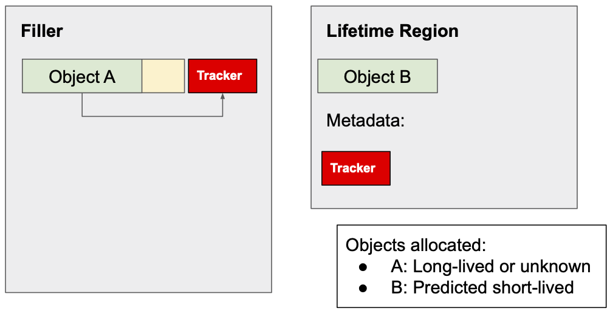
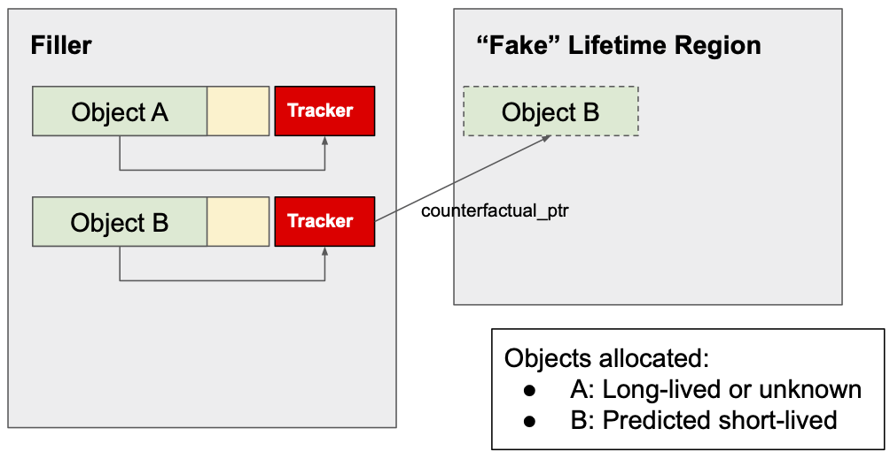

# Lifetime-based Memory Allocation

TCMalloc contains an experimental feature that leverages object lifetime
information for managing memory allocations. [Temeraire](temeraire.md)'s default
allocation policy binpacks medium-sized allocations into the last hugepage
associated with a large allocation. If the large allocation is short-lived, this
can cause persistent fragmentation from long-lived medium-sized allocations that
get binpacked into this region.

The lifetime-based allocator attempts to side-step this problem by predicting
the lifetime of large allocations and allocating short-lived large objects from
a special [HugeRegion](regions-are-not-optional.md) instead. Lifetimes are
treated as binary (short, long) and are predicted based on the stack trace at
the time of allocation. While the application is running, we are recording
statistics about all large allocations that we encounter and once we have enough
samples, we use these statistics to make a prediction when we encounter that
same stack trace again. If a large allocation is predicted to be short-lived, it
is placed into a special short-lived HugeRegion, otherwise it is handled as
usual. We call this region "lifetime region".

The allocator can run in two different modes:

*   **Enabled**: The allocator will execute the allocation policy described
    above.
*   **Counterfactual**: The allocator will execute the lifetime-based policy on
    the side but not affect the actual allocation behavior. Instead, it will
    collect statistics about the correctness of its decisions as well as the
    size of the lifetime region had the lifetime-based allocator been enabled.

The lifetime-based allocator has one configuration parameter (T), which is the
cutoff below which an object is considered short-lived (T = 0.5s by default).
Note that setting T = infinity causes all large allocations to be placed into
the separate region.

## Lifetime Profiling

Lifetime profiling is implemented through two components:

*   `LifetimeDatabase`: This component stores a dictionary of lifetime
    statistics, indexed by allocation stack trace. The size of the dictionary is
    limited to avoid memory blow-up. Entries are managed through a combination
    of LRU and reference counting. Each entry stores the number of long-lived
    (lifetime > T) and short-lived objects with this allocation stack trace that
    were encountered. The lifetime database does not track lifetimes itself but
    gets called from other components to 1) record lifetimes, and 2) look up
    lifetime predictions for a given stack trace. The latter works by looking up
    the statistics associated with that stack trace and predicting the object as
    long-lived if the number of long-lived allocations emanating from this stack
    trace exceeds the number of short-lived allocations by a significant margin.

*   `LifetimeTracker`: A lifetime tracker is a small amount of meta-data that
    can be associated with an allocation and is used to track its lifetime. The
    tracker (among other information) stores a pointer to the lifetime
    statistics associated with this allocation, a timestamp, and a (possibly
    unused) counterfactual pointer whose purpose will be explained later in this
    document. Active trackers are strung together in a linked list sorted by
    allocation timestamp. The timestamp associated with the tracker at the front
    of this list is checked on every operation and if the lifetime of this
    object exceeds T, it is classified as long-lived. In this case, all trackers
    whose lifetime exceeds T are removed from the list (i.e., their trackers
    become inactive) and their associated lifetime statistics are updated to
    reflect that a long-lived allocation was encountered. If an object is
    deallocated before its tracker becomes inactive, its tracker is removed from
    the list and a short-lived allocation is recorded.

The use of trackers differs between enabled and counterfactual mode. In enabled
mode, a tracker is associated with every large allocation that is placed in the
regular hugepage-aware allocator and results in a filler donation. This tracker
is allocated with the remaining meta-data that is already associated with any
such donation. If an object is allocated in the lifetime region, its tracker is
allocated in a special meta-data region associated with the lifetime region.
This ensures that lifetimes continue to be tracked even if the allocator has
decided to treat a particular allocation site as short-lived.

In counterfactual mode, no actual objects are allocated in the short-lived
region. Instead, the lifetime region is a HugeRegion that is not backed by
actual memory but otherwise executes the same logic. This means that for any
object that would have been placed in the lifetime region had it been enabled,
the real backing object is allocated in the existing hugepage-aware allocator.
In this case, the tracker will store a `counterfactual_ptr` that points towards
the address that the object would have had if it were actually allocated in the
lifetime region. Otherwise, the object is tracked just like any other object in
the hugepage-aware allocator.

## Lifetime-based Allocation

The lifetime-based allocator uses the existing HugeRegion implementation for all
objects that are predicted short-lived. Whenever a large allocation is
encountered, the current stack trace is collected, and the lifetime is looked up
in the lifetime database. In regular enabled mode, the object is placed in the
lifetime region or the regular allocator, depending on this prediction, and a
tracker is installed. In counterfactual mode, the object is always allocated in
the regular allocator and if the prediction called for the allocation to be
placed in the lifetime region, an *additional* allocation call is placed to the
lifetime region (which, in counterfactual mode, is not backed by actual memory).
In this case, the tracker's `counterfactual_ptr` is set to the address that the
object would have been allocated at, so that on deallocation, a corresponding
call can be made to the lifetime region to deallocate the object.
