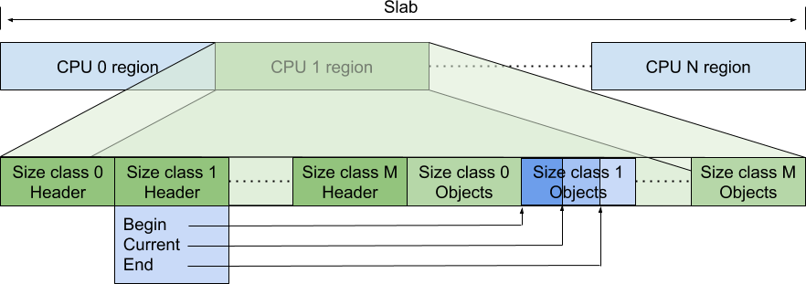

# Restartable Sequence Mechanism for TCMalloc

<!--*
# Document freshness: For more information, see go/fresh-source.
freshness: { owner: 'ckennelly' reviewed: '2022-12-14' }
*-->

## per-CPU Caches

TCMalloc implements its per-CPU caches using restartable sequences (`man
rseq(2)`) on Linux. This kernel feature was developed by
[Paul Turner and Andrew Hunter at Google](http://www.linuxplumbersconf.net/2013/ocw//system/presentations/1695/original/LPC%20-%20PerCpu%20Atomics.pdf)
and Mathieu Desnoyers at EfficiOS. Restartable sequences let us execute a region
to completion (atomically with respect to other threads on the same CPU) or to
be aborted if interrupted by the kernel by preemption, interrupts, or signal
handling.

Choosing to restart on migration across cores or preemption allows us to
optimize the common case - we stay on the same core - by avoiding atomics, over
the more rare case - we are actually preempted. As a consequence of this
tradeoff, we need to make our code paths actually support being restarted. The
entire sequence, except for its final store to memory which *commits* the
change, must be capable of starting over.

This carries a few implementation challenges:

*   We need fine-grained control over the generated assembly, to ensure stores
    are not reordered in unsuitable ways.
*   The restart sequence is triggered if the kernel detects a context switch
    occurred with the PC in the restartable sequence code. If this happens
    instead of restarting at this PC, it restarts the thread at an abort
    sequence, the abort sequence determines the interrupted restartable
    sequence, and then returns to control to the entry point of this sequence.

    We must preserve adequate state to successfully restart the code sequence.
    In particular, we must preserve the function parameters so that we can
    restart the sequence with the same conditions; next we must reload any
    parameters like the CPU ID, and recompute any necessary values.

## Structure of the `TcmallocSlab`

In per-CPU mode, we allocate an array of `N` `TcmallocSlab::Slabs`. For all
operations, we index into the array with the logical CPU ID.

Each slab has a header region of control data (one 8-byte header per-size
class). These index into the remainder of the slab, which contains pointers to
free listed objects.



In
[C++ code](https://github.com/google/tcmalloc/blob/master/tcmalloc/internal/percpu_tcmalloc.h),
these are represented as:

```
struct Slabs {
  std::atomic<int64_t> header[NumClasses];
  void* mem[((1ul << Shift) - sizeof(header)) / sizeof(void*)];
};

// Slab header (packed, atomically updated 64-bit).
// All {begin, current, end} values are pointer offsets from per-CPU region
// start. The slot array is in [begin, end), and the occupied slots are in
// [begin, current).
struct Header {
  // The end offset of the currently occupied slots.
  uint16_t current;
  // Copy of end. Updated by Shrink/Grow, but is not overwritten by Drain.
  uint16_t end_copy;
  // Lock updates only begin and end with a 32-bit write.

  // The begin offset of the slot array for this size class.
  uint16_t begin;
  // The end offset of the slot array for this size class.
  uint16_t end;

  // Lock is used by Drain to stop concurrent mutations of the Header.
  // Lock sets begin to 0xffff and end to 0, which makes Push and Pop fail
  // regardless of current value.
  bool IsLocked() const;
  void Lock();
};

```

The atomic `header` allows us to read the state (esp. for telemetry purposes) of
a core without undefined behavior.

The fields in `Header` are indexed in `sizeof(void*)` strides into the slab. For
the default value of `Shift=18`, this allows us to cache nearly 32K objects per
CPU. Ongoing work encodes `Slabs*` and `Shift` into a single pointer, allowing
it to be dynamically updated at runtime.

We have allocated capacity for `end-begin` objects for a given size-class.
`begin` is chosen via static partitioning at initialization time. `end` is
chosen dynamically at a higher-level (in `tcmalloc::CPUCache`), as to:

*   Avoid running into the next size-classes' `begin`
*   Balance cached object capacity across size-classes, according to the
    specified byte limit.

## Usage: Allocation

As the first operation, we can look at allocation, which needs to read the
pointer at index `current-1`, return that object, and decrement `current`.
Decrementing `current` is the *commit* operation.

In pseudo-C++, this looks like:

```
void* TcmallocSlab_Pop(
    void *slabs,
    size_t size_class,
    UnderflowHandler underflow_handler) {
  // Expanded START_RSEQ macro...
restart:
  __rseq_abi.rseq_cs = &__rseq_cs_TcmallocSlab_Pop;
start:
  // Actual sequence
  uint64_t cpu_id = __rseq_abi.cpu_id;
  Header* hdr = &slabs[cpu_id].header[size_class];
  uint64_t current = hdr->current;
  uint64_t begin = hdr->begin;
  if (ABSL_PREDICT_FALSE(current <= begin)) {
    goto underflow;
  }

  void* next = *(&slabs[cpu_id] + current * sizeof(void*) - 2 * sizeof(void*))
  prefetcht0(next);

  void* ret = *(&slabs[cpu_id] + current * sizeof(void*) - sizeof(void*));
  --current;
  hdr->current = current;
commit:
  return ret;
underflow:
  return underflow_handler(cpu_id, size_class);
}

// This is implemented in assembly, but for exposition.
ABSL_CONST_INIT kernel_rseq_cs __rseq_cs_TcmallocSlab_Pop = {
  .version = 0,
  .flags = 0,
  .start_ip = &&start,
  .post_commit_offset = &&commit - &&start,
  .abort_ip = &&abort,
};
```

`__rseq_cs_TcmallocSlab_Pop` is a read-only data structure, which contains
metadata about this particular restartable sequence. When the kernel preempts
the current thread, it examines this data structure. If the current instruction
pointer is between `[start, commit)`, it returns control to a specified,
per-sequence restart header at `abort`.

Since the *next* object is frequently allocated soon after the current object,
the allocation path prefetches the pointed-to object. To avoid prefetching a
wild address, we populate `slabs[cpu][begin]` for each CPU/size-class with a
pointer-to-self.

This sequence terminates with the *single* committing store to `hdr->current`.
If we are migrated or otherwise interrupted, we restart the preparatory steps,
as the values of `cpu_id`, `current`, `begin` may have changed.

As these operations work on a single core's data and are executed on that core.
From a memory ordering perspective, loads and stores need to appear on that core
in program order.

### Restart Handling

The `abort` label is distinct from `restart`. The `rseq` API provided by the
kernel (see below) requires a "signature" (typically an intentionally invalid
opcode) in the 4 bytes prior to the restart handler. We form a small
trampoline - properly signed - to jump back to `restart`.

In x86 assembly, this looks like:

```
  // Encode nop with RSEQ_SIGNATURE in its padding.
  .byte 0x0f, 0x1f, 0x05
  .long RSEQ_SIGNATURE
  .local TcmallocSlab_Push_trampoline
  .type TcmallocSlab_Push_trampoline,@function
  TcmallocSlab_Push_trampoline:
abort:
  jmp restart
```

This ensures that the 4 bytes prior to `abort` match up with the signature that
was configured with the `rseq` syscall.

On x86, we can represent this with a nop which would allow for interleaving in
the main implementation. On other platforms - with fixed width instructions -
the signature is often chosen to be an illegal/trap instruction, so it has to be
disjoint from the function's body.

## Usage: Deallocation

Deallocation uses two stores, one to store the deallocated object and another to
update `current`. This is still compatible with the restartable sequence
technique, as there is a *single* commit step, updating `current`. Any preempted
sequences will overwrite the value of the deallocated object until a successful
sequence commits it by updating `current`.

```
int TcmallocSlab_Push(
    void *slab,
    size_t size_class,
    void* item,
    OverflowHandler overflow_handler) {
  // Expanded START_RSEQ macro...
restart:
  __rseq_abi.rseq_cs = &__rseq_cs_TcmallocSlab_Push;
start:
  // Actual sequence
  uint64_t cpu_id = __rseq_abi.cpu_id;
  Header* hdr = &slabs[cpu_id].header[size_class];
  uint64_t current = hdr->current;
  uint64_t end = hdr->end;
  if (ABSL_PREDICT_FALSE(current >= end)) {
    goto overflow;
  }

  *(&slabs[cpu_id] + current * sizeof(void*) - sizeof(void*)) = item;
  current++;
  hdr->current = current;
commit:
  return;
overflow:
  return overflow_handler(cpu_id, size_class, item);
}
```

## Initialization of the Slab

To reduce metadata demands, we lazily initialize the slabs, relying on the
kernel to provide zeroed pages from the `mmap` call to obtain memory for the
slab metadata.

At startup, this leaves the `Header` of each initialized to `current = begin =
end = 0`. The initial push or pop will trigger the overflow or underflow paths
(respectively), so that we can populate these values.

## More Complex Operations: Batches

When the cache under or overflows, we populate or remove a full batch of objects
obtained from inner caches. This amortizes some of the lock acquisition/logic
for those caches. Using a similar approach to push and pop, we read/write a
batch of `N` items and we update `current` to commit the operation.

## Kernel API and implementation

This section contains notes on the rseq API provided by the kernel, which is not
well documented, and code pointers for how it is implemented.

The `rseq` syscall is implemented by
[`sys_rseq`](https://github.com/torvalds/linux/blob/414eece95b98b209cef0f49cfcac108fd00b8ced/kernel/rseq.c#L304-L366).
It starts by
[handling](https://github.com/torvalds/linux/blob/414eece95b98b209cef0f49cfcac108fd00b8ced/kernel/rseq.c#L312-L328)
the case where the thread wants to unregister, implementing that by clearing the
[rseq information](https://github.com/torvalds/linux/blob/414eece95b98b209cef0f49cfcac108fd00b8ced/include/linux/sched.h#L1188-L1189)
out of the `task_struct` for the thread running
[on the current CPU](https://github.com/torvalds/linux/blob/414eece95b98b209cef0f49cfcac108fd00b8ced/arch/x86/include/asm/current.h#L11-L18).
It then moves on to
[return an error](https://github.com/torvalds/linux/blob/414eece95b98b209cef0f49cfcac108fd00b8ced/kernel/rseq.c#L333-L345)
if the thread is already registered for rseq. Then it
[validates](https://github.com/torvalds/linux/blob/414eece95b98b209cef0f49cfcac108fd00b8ced/kernel/rseq.c#L347-L355)
and
[saves](https://github.com/torvalds/linux/blob/414eece95b98b209cef0f49cfcac108fd00b8ced/kernel/rseq.c#L356-L357)
the input from the user, and
[sets](https://github.com/torvalds/linux/blob/414eece95b98b209cef0f49cfcac108fd00b8ced/kernel/rseq.c#L358-L363)
the
[`TIF_NOTIFY_RESUME` flag](https://github.com/torvalds/linux/blob/414eece95b98b209cef0f49cfcac108fd00b8ced/include/linux/sched.h#L2044-L2048)
for the thread.

### Restarts

Among other things, the user's input to the `rseq` syscall is used by
`rseq_ip_fixup` to
[decide](https://github.com/torvalds/linux/blob/414eece95b98b209cef0f49cfcac108fd00b8ced/kernel/rseq.c#L232-L238)
whether we're in a critical section and if so
[restart](https://github.com/torvalds/linux/blob/414eece95b98b209cef0f49cfcac108fd00b8ced/kernel/rseq.c#L247)
at the abort point. That function is
[called](https://github.com/torvalds/linux/blob/414eece95b98b209cef0f49cfcac108fd00b8ced/kernel/rseq.c#L271)
by `__rseq_handle_notify_resume`, which is
[documented](https://github.com/torvalds/linux/blob/414eece95b98b209cef0f49cfcac108fd00b8ced/kernel/rseq.c#L251-L261)
as needing to be called after preemption or signal delivery before returning to
the user. That in turn is called by
[`rseq_handle_notify_resume`](https://github.com/torvalds/linux/blob/414eece95b98b209cef0f49cfcac108fd00b8ced/include/linux/sched.h#L2052-L2057),
a simple wrapper that bails if rseq is not enabled for the thread.

Here is one path that causes us to wind up here on x86:

*   [`rseq_signal_deliver`](https://github.com/torvalds/linux/blob/414eece95b98b209cef0f49cfcac108fd00b8ced/include/linux/sched.h#L2065)
*   [`setup_rt_frame`](https://github.com/torvalds/linux/blob/414eece95b98b209cef0f49cfcac108fd00b8ced/arch/x86/kernel/signal.c#L690-L691)
*   [`handle_signal`](https://github.com/torvalds/linux/blob/414eece95b98b209cef0f49cfcac108fd00b8ced/arch/x86/kernel/signal.c#L746)
*   [`arch_do_signal_or_restart`](https://github.com/torvalds/linux/blob/414eece95b98b209cef0f49cfcac108fd00b8ced/arch/x86/kernel/signal.c#L812-L813)
*   [`handle_signal_work`](https://github.com/torvalds/linux/blob/414eece95b98b209cef0f49cfcac108fd00b8ced/kernel/entry/common.c#L147)
*   [`exit_to_user_mode_loop`](https://github.com/torvalds/linux/blob/414eece95b98b209cef0f49cfcac108fd00b8ced/kernel/entry/common.c#L171)
*   [`exit_to_user_mode_prepare`](https://github.com/torvalds/linux/blob/414eece95b98b209cef0f49cfcac108fd00b8ced/kernel/entry/common.c#L208)

So the choke point is the code that returns to user space. Here are some notes
on how the restart logic varies based on user input:

*   `rseq_ip_fixup`
    [calls](https://github.com/torvalds/linux/blob/414eece95b98b209cef0f49cfcac108fd00b8ced/kernel/rseq.c#L228)
    `rseq_get_rseq_cs` every time. That means it
    [reads](https://github.com/torvalds/linux/blob/414eece95b98b209cef0f49cfcac108fd00b8ced/kernel/rseq.c#L123-L124)
    the
    [pointer](https://github.com/torvalds/linux/blob/414eece95b98b209cef0f49cfcac108fd00b8ced/include/uapi/linux/rseq.h#L91-L124)
    to `struct rseq_cs` and then
    [indirects](https://github.com/torvalds/linux/blob/414eece95b98b209cef0f49cfcac108fd00b8ced/kernel/rseq.c#L131-L133)
    through it fresh from user memory each time. It
    [checks](https://github.com/torvalds/linux/blob/414eece95b98b209cef0f49cfcac108fd00b8ced/kernel/rseq.c#L135-L145)
    for invalid cases (which
    [cause](https://github.com/torvalds/linux/blob/414eece95b98b209cef0f49cfcac108fd00b8ced/kernel/rseq.c#L278-L280)
    a segfault for the user process) and then does
    [validation](https://github.com/torvalds/linux/blob/414eece95b98b209cef0f49cfcac108fd00b8ced/kernel/rseq.c#L147-L157)
    of the abort IP signature discussed below.

*   Signature validation: from
    [the code](https://github.com/torvalds/linux/blob/414eece95b98b209cef0f49cfcac108fd00b8ced/kernel/rseq.c#L147-L157)
    linked above we can see that the requirement is that the abort handler
    specified by `rseq_cs::abort_ip` be preceded by a 32-bit magic integer that
    [matches](https://github.com/torvalds/linux/blob/414eece95b98b209cef0f49cfcac108fd00b8ced/kernel/rseq.c#L152)
    the one originally provided to and
    [saved by](https://github.com/torvalds/linux/blob/414eece95b98b209cef0f49cfcac108fd00b8ced/kernel/rseq.c#L357)
    the `rseq` syscall.

    The intent is to avoid turning buffer overflows into arbitrary code
    execution: if an attacker can write into memory then they can control
    `rseq_cs::abort_ip`, which is kind of like writing a jump instruction into
    memory, which can be seen as breaking
    [W^X](https://en.wikipedia.org/wiki/W%5EX) protections. Instead the kernel
    has the caller pre-register a magic value from the executable memory that
    they want to run, under the assumption that an attacker is unlikely to be
    able to find other usable "gadgets" in executable memory that happen to be
    preceded by that value.

It's also worth noting that signals and preemption always
[result in](https://github.com/torvalds/linux/blob/414eece95b98b209cef0f49cfcac108fd00b8ced/kernel/rseq.c#L238-L242)
[clearing](https://github.com/torvalds/linux/blob/414eece95b98b209cef0f49cfcac108fd00b8ced/kernel/rseq.c#L197-L210)
`rseq::rseq_cs::ptr64` from user space memory on the way out, except in error
cases that cause a segfault.

### CPU IDs

The other thing `rseq.c` takes care of is writing CPU IDs to user space memory.

There are two fields in user space that get this information:
[`rseq::cpu_id_start`](https://github.com/torvalds/linux/blob/414eece95b98b209cef0f49cfcac108fd00b8ced/include/uapi/linux/rseq.h#L63-L75)
and
[`rseq::cpu_id`](https://github.com/torvalds/linux/blob/414eece95b98b209cef0f49cfcac108fd00b8ced/include/uapi/linux/rseq.h#L76-L90).
The difference between the two is that `cpu_id_start` is always in range,
whereas `cpu_id` may contain error values. The kernel provides both in order to
support computation of values derived from the CPU ID that happens before
entering the critical section. We could do this with one CPU ID, but it would
require an extra branch to distinguish "not initialized" from "CPU ID changed
after fetching it". On the other hand if (like tcmalloc) you only fetch the CPU
Id within a critical section, then you need only one field because you have only
one branch: am I initialized. There is no such thing as a CPU mismatch because
instead you are just restarted when the CPU ID changes.

The two CPU ID fields are maintained as follows:

*   [`rseq_update_cpu_id`](https://github.com/torvalds/linux/blob/414eece95b98b209cef0f49cfcac108fd00b8ced/kernel/rseq.c#L84-L94)
    writes a CPU ID into each. This is
    [called](https://github.com/torvalds/linux/blob/414eece95b98b209cef0f49cfcac108fd00b8ced/kernel/rseq.c#L274-L275)
    by `__rseq_handle_notify_resume`, which is discussed above.

*   [`rseq_reset_rseq_cpu_id`](https://github.com/torvalds/linux/blob/414eece95b98b209cef0f49cfcac108fd00b8ced/kernel/rseq.c#L96-L113)
    sets the `cpu_id_start` field to zero and the `cpu_id` field to
    [`RSEQ_CPU_ID_UNINITIALIZED`](https://github.com/torvalds/linux/blob/414eece95b98b209cef0f49cfcac108fd00b8ced/include/uapi/linux/rseq.h#L17)
    (an out of range value). It is
    [called](https://github.com/torvalds/linux/blob/414eece95b98b209cef0f49cfcac108fd00b8ced/kernel/rseq.c#L322)
    in the unregister path discussed above.

## Cross-CPU Operations

With restartable sequences, we've optimized the fast path for same-CPU
operations at the expense of costlier cross-CPU operations. Cross-CPU operations
are rare&mdash;typically done only to facilitate periodic drains of idle
caches&mdash;so this is a desirable tradeoff.

Cross-CPU operations rely on operating system assistance (wrapped in
`tcmalloc::tcmalloc_internal::subtle::percpu::FenceCpu`) to interrupt any
running restartable sequences on the remote core. When control is returned to
the thread running on that core, we have guaranteed that either the restartable
sequence that was running has completed *or* that the restartable sequence was
preempted.

We use preemption and "locks" (`TcmallocSlab::Header::Lock`) to ensure that
during a particular period, all accesses to the fast path will fail&mdash;the
cache is both simultaneously "full" and "empty" so all inserts and removes will
go to the slow path. Unlike using `sched_setaffinity` to run a remote core, this
approach allows us to perform longer operations, such as taking elements from
the cache and inserting them into the `TransferCache` as part of `Drain`, while
still maintaining correctness.

Since we are using relaxed loads and stores, potentially with word-level
granularity, our operations need to potentially store part of the needed data to
`Header`, fence, and then write additional fields. For example, at the end of of
`Drain`, we:

*   Store `hdr.current`. `hdr.begin = 0xFFFF` and `hdr.end = 0x0`, ensuring
    insert and remove operations continue to fail.
*   `FenceCpu`
*   Store `hdr.begin` and `hdr.end` to their proper values.

This sequence ensures that a thread running on the remote core can only see one
of:

*   `hdr.current = X`; `hdr.begin = 0xFFFF`; `hdr.end = 0x0`
*   `hdr.current = Y`; `hdr.begin = 0xFFFF`; `hdr.end = 0x0`
*   `hdr.current = Y`; `hdr.begin = Y`; `hdr.end = Y`

`FenceCpu` ensures that after it completes, no thread can see `current=X` any
longer.

If we did a single store or omitted the intervening fence operation, a thread on
the remote core could potentially see `hdr.begin = Y < hdr.current = X` and
attempt to remove an element from the cache. (This failure would lead to data
corruption as the element had already been "deallocated" to the `TransferCache`,
essentially triggering a double-free.)
