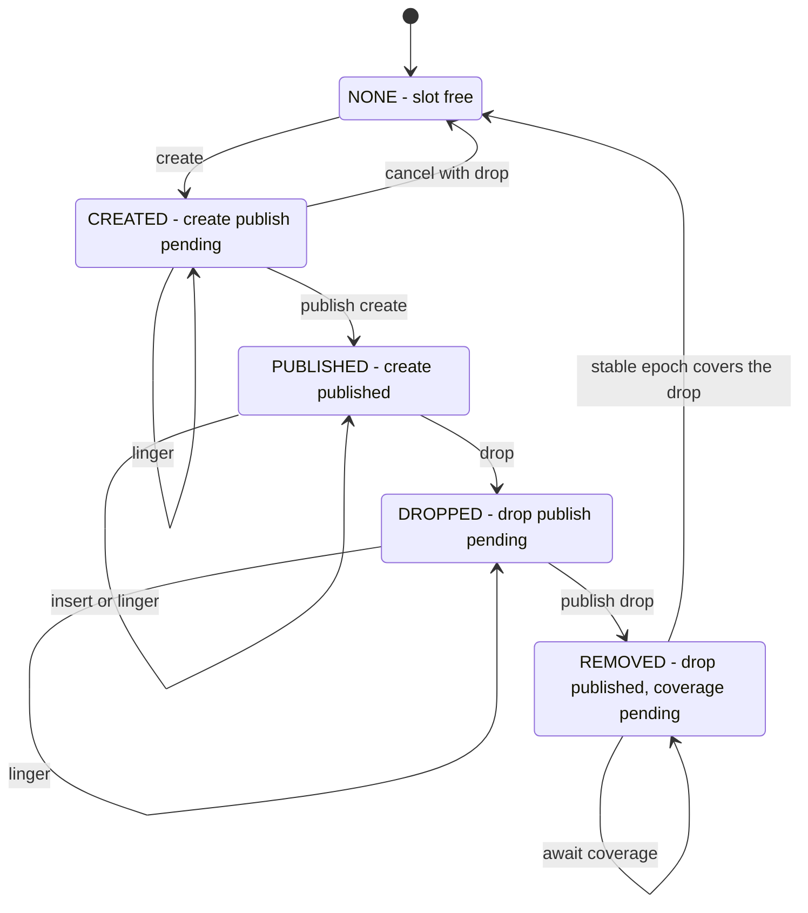

# schema_disagg_abort

Stress test for disaggregated schema operations under crashes and role switches. One or two nodes
continuously create, populate and drop tables while sharing a PALite page log. The parent switches
roles, kills nodes or stops them cleanly, then recovers each node from shared storage and verifies
the durable state against per-operation record files.

## Architecture

- A leader generates events into a self-pipe. Its reader demultiplexes them into per-worker queues,
  and the workers apply and relay the events to the follower through a process pipe.
- A peered follower consumes the leader's relay. A lone follower generates its own workload but
  cannot make it durable until it becomes leader.
- In epoch mode, creates and drops have separate operation and publish events, allowing checkpoints
  and crashes to land between the two. In legacy mode each schema operation is complete without a
  publish event. Inserts are generated only after the create is complete.
- A published drop parks the slot in REMOVED until the stable schema epoch passes the drop's epoch;
  recreating the name earlier is an API violation WiredTiger panics on.
- Leaders write checkpoints to the shared page log; followers adopt them. Role changes are events in
  the same stream, so all earlier work is drained before the connection is reconfigured.

## Directory layout

```text
WT_TEST.foo/
├── records/                      verifier ground truth
│   ├── node<N>-leader-<T>        operations originated by node N
│   └── node<N>-follower-<T>      peer operations applied by node N
├── PALITE/                       shared page log
├── WT_NODE0/                     node 0 local home
├── WT_NODE1/                     node 1 local home (`-r lf` only)
├── leader_ready                  ┐
├── follower_ready                │ sentinel files: the parent⇄node
├── switch_request                │ coordination protocol
├── switch_done.<k>               │
├── stop_run                      ┘
└── ckpt_adopted                  latest follower checkpoint LSN
WT_TEST.foo.SAVE/                 pre-verification copy of the home
```

## Generator state machine

Each worker owns a pool of table slots. The generator chooses a slot and takes one valid transition
or lingers, widening the window in which a checkpoint or crash can occur. (The diagram shows epoch
mode only.)



## Threads

Threads are created for each leader or follower phase.

| Thread | Count | Responsibility |
|---|---:|---|
| generator | 1 for a leader or lone node | Advance the slot state machines and emit workload and role-transition events. |
| reader | 1 | Read the self-pipe or peer pipe, demultiplex events and drain work at transition markers. |
| worker | `-T N` | Apply events, relay leader events, append records and report completed timestamps. |
| timestamp | 1 | Advance oldest and stable timestamps, plus the stable schema epoch in epoch mode, to the completed frontier. |
| checkpoint | 1 | Write leader checkpoints to PALite or adopt the latest checkpoint as follower. |

Shutdown is ordered generator, reader, workers, checkpoint, timestamp. The last two remain available
while workers drain because a schema operation can be waiting for a checkpoint.

## Recovery and verification

The verifier discards each node's local data and rebuilds it from the shared page log. Record files
describe creates, drops and inserts; records newer than the recovered durable schema epoch are
ignored. The verifier checks table presence, inserted values and the relayed event prefix.

Note: Legacy (epoch-less) mode has limited verification. Slots with schema operations after the last
checkpont cannot be verified reliably.

## Running

```text
test_schema_disagg_abort [-b build-dir] [-e] [-h dir] [-k [l|f]N] [-p] [-r l|f|lf]
                         [-s N] [-T threads] [-t time] [-q] [-u pool] [-v]
```

`-r` selects a lone leader, lone follower or leader/follower pair. `-s` schedules role switches,
`-k` schedules kills, and `-t` sets the graceful stop time. Every run prints a reproducible `CONFIG:`
line including its random seeds. `-e` runs legacy schema operations and requires a single-node
`-r l` or `-r f` topology.
