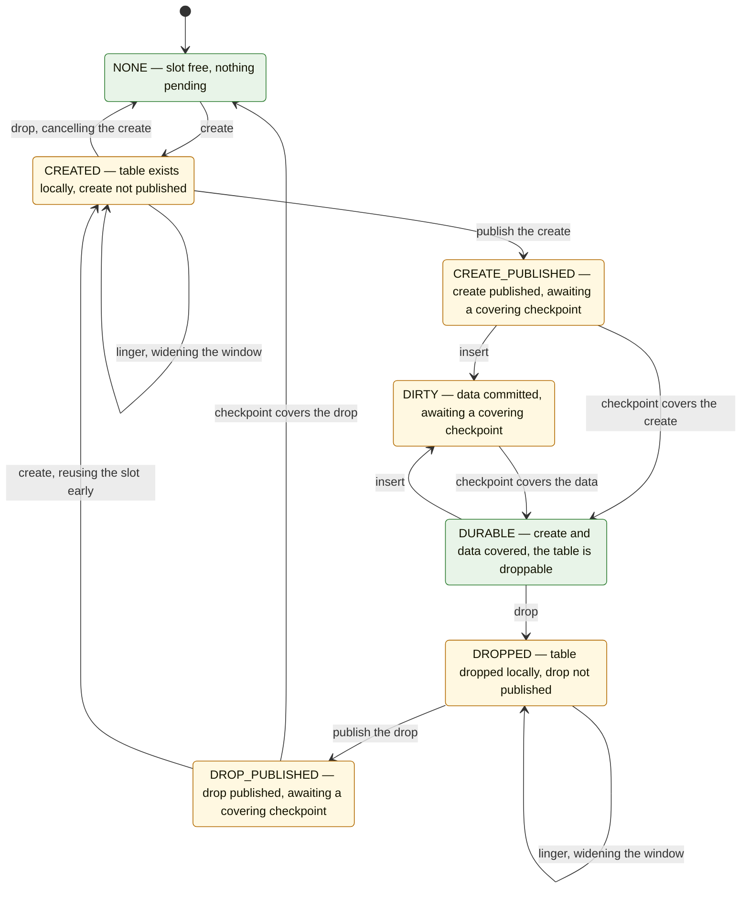

# schema_disagg_abort

Stress test for disaggregated (layered) schema operations under crashes and role switches.
One or two nodes share a page log; tables are created, populated, and dropped continuously
while checkpoints move data into shared storage; the parent kills nodes and swaps
leader/follower roles mid-run; a final recovery pass verifies what survived against
per-operation record files.

## Processes

The binary runs in one of two roles, dispatched in `main.c`:

- **parent** — orchestrator and verifier (`parent.c`). Spawns the nodes per the `-r`
  topology, then drives a one-second-tick timeline of switches, kills, and a graceful stop
  (see [Running](#running)); a child dying at any other point fails the test. It opens
  WiredTiger only afterwards, to recover and verify.
- **node** — a database node running as leader or follower (`node.c`; role specifics in
  `leader.c`/`follower.c` behind the `NODE_ROLE` vtable). Spawned by re-executing the binary
  with internal options (`-r node -i <id> -A l|f`, pipe fds via `-R`/`-W`), so nothing is
  inherited by forking. `subproc.[ch]` is the posix_spawn layer.

## Directory layout

One run under the test home (`-h WT_TEST.foo`):

```
WT_TEST.foo/
├── records/                      the verifier's ground truth
│   ├── node<N>-leader-<T>        ops node N ORIGINATED itself, per worker thread T
│   └── node<N>-follower-<T>      peer ops node N APPLIED as follower, per thread T
├── PALITE/                       shared page log — the "disaggregated storage"
├── WT_NODE0/                     node 0's local WiredTiger home
├── WT_NODE1/                     node 1's local WT home (only with -r lf)
├── leader_ready                  ┐
├── follower_ready                │ sentinel files: the parent⇄node
├── switch_request                │ coordination protocol
├── switch_done.<k>               │
└── stop_run                      ┘
WT_TEST.foo.SAVE/                 copy of the home, taken just before verification
```

- **`PALITE/`** — shared by both nodes, and the only durable state that matters. Leader
  checkpoints write pages and checkpoint metadata into it; followers adopt from it via
  `pl_get_complete_checkpoint` → `reconfigure(checkpoint_meta)`. Single-writer is enforced by
  protocol ordering: the old leader completes its step-down before the peer steps up.
- **`WT_NODE<i>/`** — a node's local database, kept across its role switches; both transitions are
  in-place reconfigures of a connection that stays open. Verification does wipe it: it opens with
  `disaggregated=(lose_all_my_data=true)`, deleting the local files and rebuilding the home
  from the page log — hence the `.SAVE` copy, taken first and replaced on every rerun.
- **`records/`** — named for the origin of what they log: `leader` files for the operations the
  node produced itself, `follower` files for the peer's events it applied. Line formats:
  `CREATE <epoch> <uri>`, `DROP <epoch> <uri>`, `INSERT <commit_ts> <kmin> <kmax> <uri>`
  (`record_event_line` defines them). A schema operation is recorded when its PUBLISH applies, at
  the publish epoch, so an operation whose publish never ran leaves no record and no expectation.
  Opened lazily, appended across terms, line-buffered so completed lines survive SIGKILL.
- **Sentinels** (home root): `leader_ready` = first checkpoint (the parent starts the clock);
  `follower_ready` = first pickup; `switch_request` = switch command, **consumed (unlinked)**
  by the acting node so each request fires once; `switch_done.<k>` = k-th switch finished;
  `stop_run` = graceful stop, not consumed.

## Event pipeline

One pipeline, identical in both roles: a *source* writes `SCHEMA_EVENT`s to a pipe, the
reader demuxes them by `thread_id` into per-worker queues, and the workers execute them. What
differs is where the source is.

- **A phase that generates** — a leader always, and a follower with no peer to receive from —
  runs the node's own **generator** thread, writing the term's full stream (workload ops,
  `EVENT_CKPT` at random 0–3 s intervals, `EVENT_SWITCH` to end the term) into a process-local
  **self-pipe**. A leader's workers also relay every applied event to the peer.
- **A phase that consumes** — a follower with a live peer — has no generator at all: its
  source is the peer's relay (one pipe per direction, each named for the node that reads it).
  Nothing is relayed onward.

A peerless follower therefore creates and publishes tables of its own but never checkpoints, so
its slots pile up in the waiting states until it steps up and its first checkpoints cover them —
the way a fresh node bootstraps before taking leadership.

A schema operation is split into two events: `EVENT_CREATE`/`EVENT_DROP` execute it, and a later
`EVENT_PUBLISH_CREATE`/`EVENT_PUBLISH_DROP` publishes it at a fresh schema epoch, so the
independently paced checkpoints land on either side of the pair — the window this test targets.
What a slot may emit, and when, is the [slot lifecycle](#slot-lifecycle) below.

Valued events carry an `event_ts` from the node-wide monotonic allocator (`current_ts`): a publish
epoch, or an insert's commit timestamp, which also values the rows. One counter for both axes makes
causality an ordering property — an insert is generated only after its table's create published —
so a single frontier serves the stable timestamp and the stable schema epoch alike. Backpressure is
end-to-end: a full ring blocks the reader, a full pipe blocks the producer.

## Slot lifecycle

A slot is one table name, owned by one worker thread of one node. This is the reference for
`generator_op`: the states are `TABLE_STATE`, and the transitions are the only moves the
generator may make — each is safe on the node that executes it.



Most transitions are events the generator emits; the *checkpoint covers …* ones are not — a
checkpoint is global, and per slot it shows up only as coverage arriving. Green states are settled;
amber states hold something the shared storage does not know about yet, and are where the
interesting crashes happen.

Three moves are left out on purpose:

- **Insert before the create is published** — the commit would fall below the create's epoch,
  letting a checkpoint make data stable under an unpublished table.
- **Drop before a checkpoint covers the table** — the drop blocks, stalling the worker, the reader
  behind it, and the checkpoints that would unblock it.
- **Create over an unpublished drop** — the next publish would sweep the drop up with the new
  create, so the drop would never be recorded and its absence never verified.

The machine assumes the stable schema epoch is set before any event runs, and that pending
publishes are flushed before a role switch. A crash in any state is safe: an operation that never
published leaves no record and no expectation.

## Threads (per phase)

Every workload thread is per-phase: `workload_start` creates them and `workload_stop` walks them
down through the `STAGE_*` ladder — generator, then workers, then reader, then timestamp — one
atomic `stop_stage` that each loop compares against its own stage, so the order lives in the data.
The workers drain while the reader and the timestamp thread still run, since a queued drop can be
waiting on a checkpoint; the generator's parting event on a stop is an `EVENT_CKPT` to supply one.
The main thread runs the `node_run` loop: `workload_start` → `node_trigger_wait` (1 s poll on
`handover_received`/`stop_run`) → `workload_stop` → transition or exit.

| Thread | Count | Does |
|---|---|---|
| generator | 1 iff the phase generates | - `generator_round` feeds every worker one step of the [slot lifecycle](#slot-lifecycle): pick a slot with that worker's rnd, absorb coverage, emit one valid move at random or none; an empty round sleeps 1 ms</br>- `EVENT_CKPT` every random 0–3 s</br>- `switch_request` polled ~1/s → flush pending publishes, then `EVENT_SWITCH` ends the stream and the phase</br>- bounds its lead over the workers to one switch period (`GEN_APPLY_RATE_FLOOR`), so a hand-over has little to drain |
| reader | 1 | - `select` (1 s) on the source pipe → demux ops into per-worker rings</br>- `CKPT` → **leader**: `leader_checkpoint` (skipped while stable=0, MAX_OP_WAIT watchdog); **follower**: drain barrier → `follower_pick_up_checkpoint`</br>- `SWITCH` → drain → assert counter == the sender's final counter → hand over</br>- EOF (peer pipe only) → peer dead: carry on as a lone follower |
| worker ×N | `-T`, ≤ 12 | pop own ring → `apply_event`: execute a schema op (bounded EBUSY retry, unvalued), publish at the event's epoch, or commit an insert → relay (leader only) → record → mark valued events completed |
| timestamp | 1 | every 100 ms: frontier = min of workers' `completed_ts`; set oldest/stable/stable-schema-epoch to it (never backwards) |

Coordination is lock-free by design: `stop_stage` quiesces every loop, per-worker SPSC rings plus `busy` flags connect
reader to workers, and `completed_ts[]` feeds the frontier.

## Control loop and transitions

Both roles run the same state machine (`node_run`); only `leave()`/`enter()` differ. The hand-over
value is the node's own quiesced counter: after `workload_stop`, `current_ts` holds everything the
term allocated or adopted. `EVENT_SWITCH` being the stream's last event means a hand-over waits for
everything in flight — which is why the generator's lead is bounded rather than left to the pipe's
capacity.

```
        ┌──────────────────────── LEADER ──────────────────────────────┐
        │ generator: ops + CKPT events ▶ self-pipe                     │
        │            switch_request → EVENT_SWITCH(counter), exit      │
        │ reader   : CKPT   → leader_checkpoint ▶ PALITE → relay       │
        │                     (skip while stable=0; 1st: leader_ready) │
        │            SWITCH → drain → assert counter == sender's final │
        │                     → handover                               │
        │ workers  : execute ops → publish events record+publish       │
        │            inserts commit+record → relay ▶ peer pipe         │
        └──────────────────────────────────────────────────────────────┘
  stop_run ──▶ quiesce → close(NULL: closing checkpoint) → exit(0)
  handover ──▶ quiesce → LEAVE: arm step-down at counter, stable := counter
               → step-down checkpoint → reconfigure(role=follower)
               → send CKPT + SWITCH(counter) [peer alive]
               ENTER follower: restore frontier ──▶ FOLLOWER
  EPIPE on relay ──▶ peer_alive = false (lone leader keeps producing)

        ┌──────────────────────── FOLLOWER ────────────────────────────┐
        │ generator: none when peered; the peer's relay is the source  │
        │            when lone: ops + CKPT events ▶ self-pipe          │
        │            switch_request → EVENT_SWITCH(counter), exit      │
        │ reader   : CKPT   → drain → pickup ◀ PALITE                  │
        │                     (1st: follower_ready)                    │
        │            SWITCH → drain → assert → handover                │
        │            EOF    → peer dead: carry on, now generating      │
        │ workers  : execute → publish events record+publish at        │
        │            the stream's event_ts (a follower never relays)   │
        └──────────────────────────────────────────────────────────────┘
  stop_run ──▶ quiesce → close(skip_checkpoint) → exit(0)
  handover ──▶ quiesce → LEAVE: nothing
               ENTER leader: [lone: adopt latest checkpoint first]
               → reconfigure(role=leader) → seed + restore frontier
               from the own counter ──▶ LEADER
```

### Role differences

| Aspect | Leader | Follower |
|---|---|---|
| Event source | own generator → self-pipe | peer's relay → in-pipe; its own generator when lone |
| Counter | generator *allocates* `event_ts` values | *adopts* them from events (`counter_advance`) |
| `EVENT_CKPT` | reader produces the checkpoint, then relays the event (no barrier: it races the workload) | reader barriers, then picks the checkpoint up |
| Relay | workers relay applied events; reader relays `EVENT_CKPT` | — |
| `leave()` | heavy: arm the step-down at the term's counter, advance stable to it, step-down checkpoint, **`reconfigure(role=follower)`**, hand over | empty |
| `enter()` | reconfigure + seed counter + restore frontier (+ adopt-latest when lone) | restore the frontier |
| Graceful close | `close(NULL)` — closing checkpoint | `close(skip_checkpoint)` |
| Readiness / records | `leader_ready`; `node*-leader-*` | `follower_ready`; `node*-follower-*` |
| Peer-death signal | EPIPE while relaying | pipe EOF |

Both roles react to peer death the same way: keep the role, become "lone"
(`peer_alive = false`). Lone-ness changes three things — the next follower phase generates its
own workload instead of consuming a peer's, a lone step-up adopts the page log's latest
checkpoint before reconfiguring, and the transition reports `switch_done.<k>` itself (a lone
step-down has no peer to hand over to).

## Invariants

1. **`apply_event` ordering**: a schema operation is unvalued — its epoch, record and completion
   all belong to its later publish — so the frontier cannot pass an operation whose publish has
   not applied. Within an event: relay before record, so a record on disk implies the peer holds
   the event (otherwise a surviving peer could advance the durability cutoff past a publish that
   died between the two, and the verifier would demand a table nobody published); record before
   publish, so no checkpoint can make an unrecorded epoch durable; relay before the completion
   store, so a checkpoint only ever covers already-relayed events.
2. **Drop coverage gating**: a table may be dropped only while *unpublished* — the drop cancels
   the create and leaves no durable trace — or once a checkpoint covers its create and any data
   (`ckpt_covered_ts`). WiredTiger refuses to drop a published but uncheckpointed table, and the
   stream cannot be reordered, so an uncovered drop would wedge its worker in EBUSY and, through
   the full ring, the checkpoints that would unwedge it. The slot machine makes this structural —
   a waiting slot emits nothing until coverage arrives.
3. **Frontier hand-off**: at step-down the term is quiesced and drained, so `leader_leave`
   advances oldest/stable/stable-epoch to the term's counter before its step-down checkpoint
   (a publish that checkpoint does not carry is lost when the step-down clears the shared-metadata
   queue), and `leader_enter` restores the same frontier so an early checkpoint of the new term
   cannot regress the shared epoch.
4. **Hand-over integrity**: `EVENT_SWITCH` is a term's last event; the receiver drains everything
   before acting and asserts its counter equals the event's, since every allocated value rides an
   event preceding the switch. The generator flushes pending publishes first — a step-down clears
   WiredTiger's shared-metadata queue and URIs are origin-namespaced, so one left behind could
   never be published by anyone. That counter is also the boundary the step-down is armed at, which
   the preceding drain makes safe, and the old leader completes the step-down before the switch is
   sent (one writer per page log).
5. **Uniform EBUSY policy**: workers retry the same operation with a MAX_OP_WAIT bound; the
   stream is fixed at generation time and the slot model flips when the generator emits, so
   the executed state converges to the model.

## Verification

After the run the parent copies the home to `.SAVE`, recovery-opens every node home that exists,
and checks it against each node's `leader` records unioned with the peer's `follower` mirror of
them (`verify.c`) — relaying before recording means a killed node's last operation may be recorded
only on its survivor:

- `last_disaggregated_schema_epoch` is the durability cutoff: records above it never reached
  a checkpoint and carry no expectations.
- Presence: a slot whose last durable operation was CREATE must exist; DROP must be absent.
- Data: for durable creates the recorded key range must be present, each row valued by its
  commit timestamp (a mismatch means another generation's data); inserts above the last
  checkpoint timestamp are skipped.
- `verify_relay_prefix`: what a node recorded as follower must match what its peer recorded as
  leader, per thread, line for line; a SIGKILL may truncate either side's final line, and may
  cost the leader's file the one relayed-but-unrecorded event each worker had in flight.

## Running

```
test_schema_disagg_abort [-b build-dir] [-h dir] [-k [l|f]N] [-p] [-r l|f|lf] [-s N]
                         [-T threads] [-t time] [-u pool] [-v]
```

- `-r` topology: `l` lone leader, `f` lone follower (generates its own workload and never
  checkpoints, so nothing is durable until it steps up), `lf` both; default is a random single
  node.
- `-s N` switches roles every N seconds, each landing within one more period (the hand-over
  drains what is in flight); `-k lN`/`-k fN` SIGKILL the *current* holder of the role at N
  seconds (plain `-k N` for a single node); `-t` stops gracefully.
- `-p` preserves the home; `-v` verifies an existing home only (requires `-T`, `-u`).
- Every run prints a `CONFIG:` line (including the random seeds) that reproduces it.
