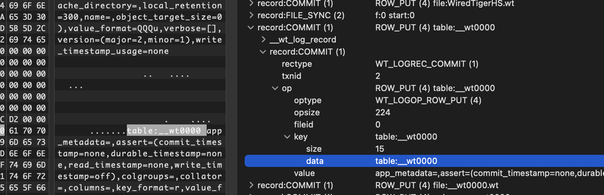
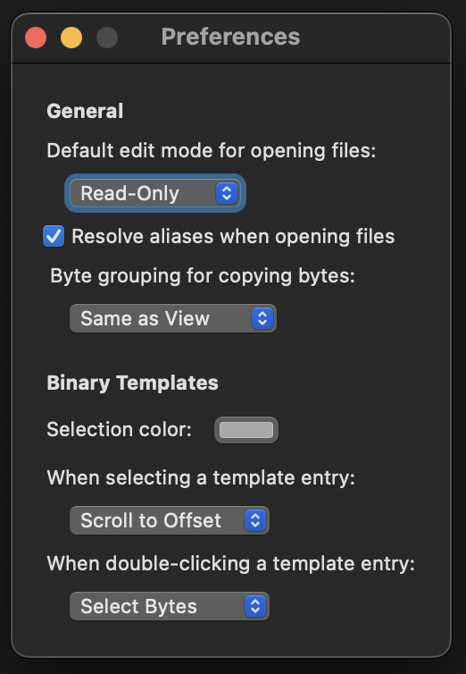
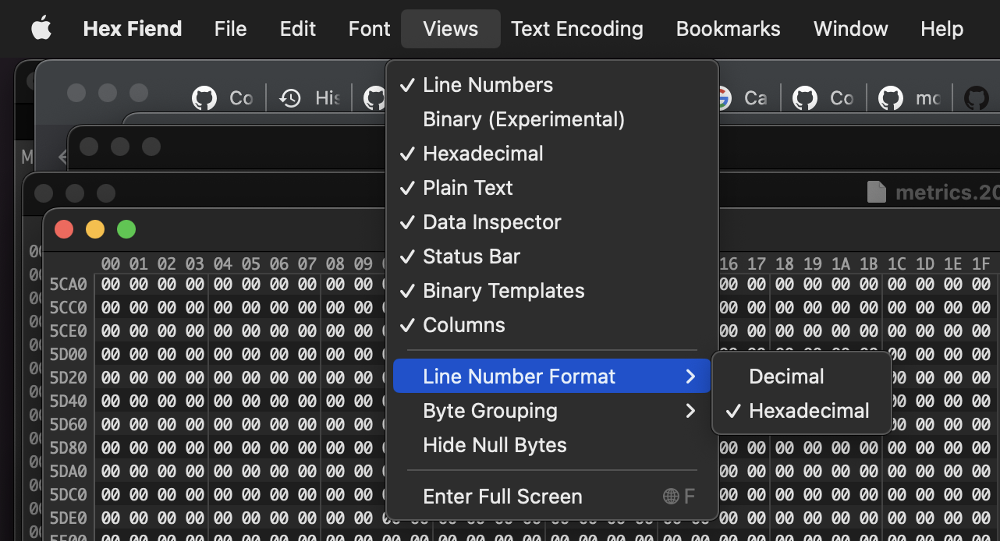
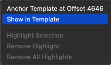
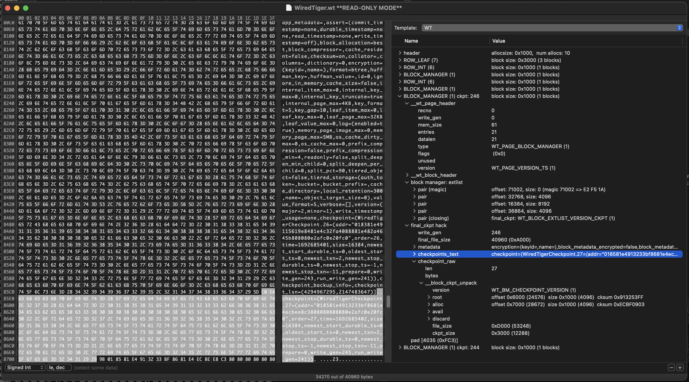
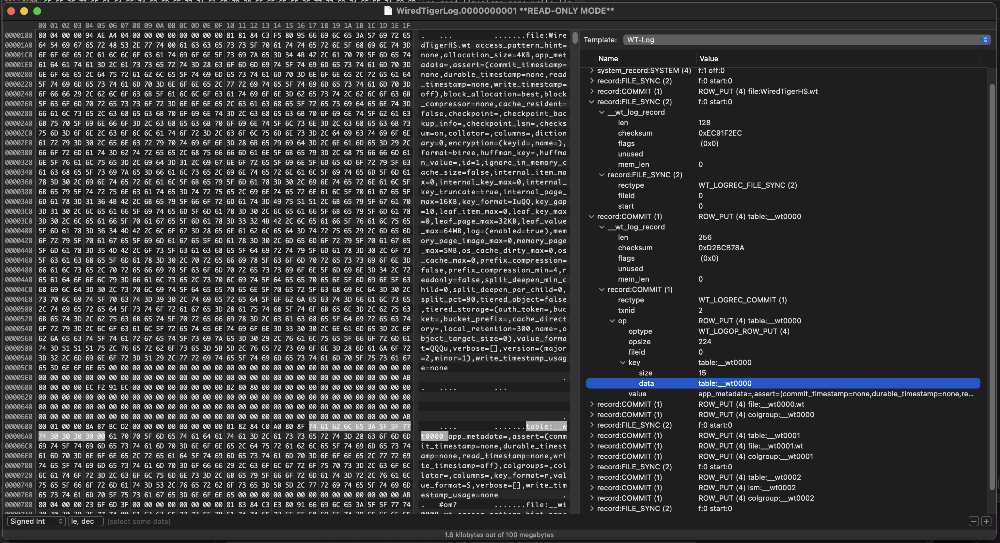
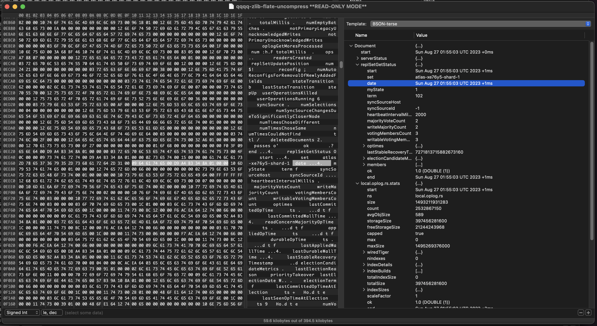

# Binary Explorer for WiredTiger files

This is an **experimental** support of WiredTiger-related files for the [HexFiend](https://hexfiend.com/)
viewer (MacOS only, sorry).



In addition to what's shipped with the HexFiend distribution,
this repo adds support for the following files:

* Whole `.wt` file.
* File containing a sequence of WT pages. They can be saved from gdb or a bigger file:
  * `dd bs=1 if=/proc/12345678/mem skip=$(printf %d 0x7ffff7f81010) count=2048 of=wtpages.bin`
* WT Log
* A sequence of BSON documents.

## Installing

Run `install.sh` or do manually the following:

1. Install the HexFiend viewer from [hexfiend.com](https://hexfiend.com/) or via `brew install hex-fiend`.
2. Copy the template files into `~/Library/Application Support/com.ridiculousfish.HexFiend/Templates/`.

### Configuring HexFiend

It's recommended to adjust the preferences (`Cmd+,`) like this:



* Default read-only mode preserves from accidental file changes.
* "Click" options are for easier navigation.

And the 'Views' menu:



## Using HexFiend

### GUI

Open a file and pick an appropriate template from the menu.
Browse the structure with keyboard or mouse.

Some non-obvious tips:

* Resizing the window changes the size of hex view, not the template view.
* To change the size of the template view, hold `Cmd`, then start resizing.
* Resize the window so that hex row size is divisible by 16 or 32 for easier navigation.
* `Opt+Click` on the fold expands/collapses deeper levels.
* Selecting an already selected template re-applies it.
* To navigate from a byte in hex view to a template value, right-click on it and choose
  "Show in template" from the context menu: \
  
* The app can be run from the command line with `hexf`.

#### Screenshots







### CLI

The command line tool is an early prototype. It has bugs and missing features.

Usage:

```bash
$ hexparse TEMPLATE [file ...]
```

Examples:

```bash
$ hexparse WT WiredTiger.wt | less -S
$ hexparse WT-log WT_TEST.test_checkpoint/WiredTigerLog.0000000001 | less -S
```

## Uninstalling

To uninstall HexFiend and remove all templates from the system, you can use the following commands:

```bash
$ brew remove --zap hex-fiend
```

Alternatively, you can remove the files manually:

```bash
$ rm -rf \
    "/Applications/Hex Fiend.app" \
    "~/Library/Application Support/com.apple.sharedfilelist/com.apple.LSSharedFileList.ApplicationRecentDocuments/com.ridiculousfish.hexfiend.sfl2" \
    "~/Library/Application Support/com.ridiculousfish.HexFiend" \
    "~/Library/Caches/com.ridiculousfish.HexFiend" \
    "~/Library/Cookies/com.ridiculousfish.HexFiend.binarycookies" \
    "~/Library/Preferences/com.ridiculousfish.HexFiend.plist" \
    "~/Library/Saved Application State/com.ridiculousfish.HexFiend.savedState"
```

## TODO

* Ability to explore huge files
* Support more cell types
* Support compression
* CLI variant: include hex dump in the output

