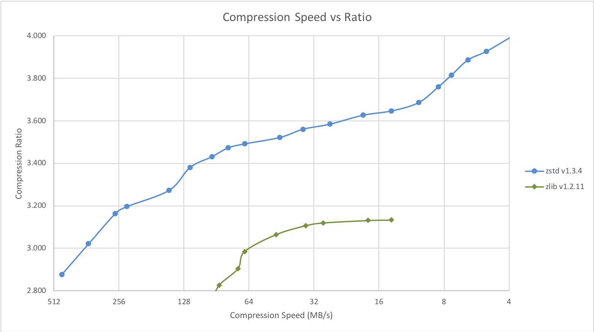

<p align="center"></p>

__Zstandard__, or `zstd` as short version, is a fast lossless compression algorithm,
targeting real-time compression scenarios at zlib-level and better compression ratios.
It's backed by a very fast entropy stage, provided by [Huff0 and FSE library](https://github.com/Cyan4973/FiniteStateEntropy).

Zstandard's format is stable and documented in [RFC8878](https://datatracker.ietf.org/doc/html/rfc8878). Multiple independent implementations are already available.
This repository represents the reference implementation, provided as an open-source dual [BSD](LICENSE) and [GPLv2](COPYING) licensed **C** library,
and a command line utility producing and decoding `.zst`, `.gz`, `.xz` and `.lz4` files.
Should your project require another programming language,
a list of known ports and bindings is provided on [Zstandard homepage](https://facebook.github.io/zstd/#other-languages).

**Development branch status:**

[![Build Status][travisDevBadge]][travisLink]
[![Build status][CircleDevBadge]][CircleLink]
[![Build status][CirrusDevBadge]][CirrusLink]
[![Fuzzing Status][OSSFuzzBadge]][OSSFuzzLink]

[travisDevBadge]: https://api.travis-ci.com/facebook/zstd.svg?branch=dev "Continuous Integration test suite"
[travisLink]: https://travis-ci.com/facebook/zstd
[CircleDevBadge]: https://circleci.com/gh/facebook/zstd/tree/dev.svg?style=shield "Short test suite"
[CircleLink]: https://circleci.com/gh/facebook/zstd
[CirrusDevBadge]: https://api.cirrus-ci.com/github/facebook/zstd.svg?branch=dev
[CirrusLink]: https://cirrus-ci.com/github/facebook/zstd
[OSSFuzzBadge]: https://oss-fuzz-build-logs.storage.googleapis.com/badges/zstd.svg
[OSSFuzzLink]: https://bugs.chromium.org/p/oss-fuzz/issues/list?sort=-opened&can=1&q=proj:zstd

## Benchmarks

For reference, several fast compression algorithms were tested and compared
on a desktop running Ubuntu 20.04 (`Linux 5.11.0-41-generic`),
with a Core i7-9700K CPU @ 4.9GHz,
using [lzbench], an open-source in-memory benchmark by @inikep
compiled with [gcc] 9.3.0,
on the [Silesia compression corpus].

[lzbench]: https://github.com/inikep/lzbench
[Silesia compression corpus]: https://sun.aei.polsl.pl//~sdeor/index.php?page=silesia
[gcc]: https://gcc.gnu.org/

| Compressor name         | Ratio | Compression| Decompress.|
| ---------------         | ------| -----------| ---------- |
| **zstd 1.5.1 -1**       | 2.887 |   530 MB/s |  1700 MB/s |
| [zlib] 1.2.11 -1        | 2.743 |    95 MB/s |   400 MB/s |
| brotli 1.0.9 -0         | 2.702 |   395 MB/s |   450 MB/s |
| **zstd 1.5.1 --fast=1** | 2.437 |   600 MB/s |  2150 MB/s |
| **zstd 1.5.1 --fast=3** | 2.239 |   670 MB/s |  2250 MB/s |
| quicklz 1.5.0 -1        | 2.238 |   540 MB/s |   760 MB/s |
| **zstd 1.5.1 --fast=4** | 2.148 |   710 MB/s |  2300 MB/s |
| lzo1x 2.10 -1           | 2.106 |   660 MB/s |   845 MB/s |
| [lz4] 1.9.3             | 2.101 |   740 MB/s |  4500 MB/s |
| lzf 3.6 -1              | 2.077 |   410 MB/s |   830 MB/s |
| snappy 1.1.9            | 2.073 |   550 MB/s |  1750 MB/s |

[zlib]: https://www.zlib.net/
[lz4]: https://lz4.github.io/lz4/

The negative compression levels, specified with `--fast=#`,
offer faster compression and decompression speed
at the cost of compression ratio (compared to level 1).

Zstd can also offer stronger compression ratios at the cost of compression speed.
Speed vs Compression trade-off is configurable by small increments.
Decompression speed is preserved and remains roughly the same at all settings,
a property shared by most LZ compression algorithms, such as [zlib] or lzma.

The following tests were run
on a server running Linux Debian (`Linux version 4.14.0-3-amd64`)
with a Core i7-6700K CPU @ 4.0GHz,
using [lzbench], an open-source in-memory benchmark by @inikep
compiled with [gcc] 7.3.0,
on the [Silesia compression corpus].

Compression Speed vs Ratio | Decompression Speed
---------------------------|--------------------
 | 

A few other algorithms can produce higher compression ratios at slower speeds, falling outside of the graph.
For a larger picture including slow modes, [click on this link](doc/images/DCspeed5.png).


## The case for Small Data compression

Previous charts provide results applicable to typical file and stream scenarios (several MB). Small data comes with different perspectives.

The smaller the amount of data to compress, the more difficult it is to compress. This problem is common to all compression algorithms, and reason is, compression algorithms learn from past data how to compress future data. But at the beginning of a new data set, there is no "past" to build upon.

To solve this situation, Zstd offers a __training mode__, which can be used to tune the algorithm for a selected type of data.
Training Zstandard is achieved by providing it with a few samples (one file per sample). The result of this training is stored in a file called "dictionary", which must be loaded before compression and decompression.
Using this dictionary, the compression ratio achievable on small data improves dramatically.

The following example uses the `github-users` [sample set](https://github.com/facebook/zstd/releases/tag/v1.1.3), created from [github public API](https://developer.github.com/v3/users/#get-all-users).
It consists of roughly 10K records weighing about 1KB each.

Compression Ratio | Compression Speed | Decompression Speed
------------------|-------------------|--------------------
 |  | 


These compression gains are achieved while simultaneously providing _faster_ compression and decompression speeds.

Training works if there is some correlation in a family of small data samples. The more data-specific a dictionary is, the more efficient it is (there is no _universal dictionary_).
Hence, deploying one dictionary per type of data will provide the greatest benefits.
Dictionary gains are mostly effective in the first few KB. Then, the compression algorithm will gradually use previously decoded content to better compress the rest of the file.

### Dictionary compression How To:

1. Create the dictionary

   `zstd --train FullPathToTrainingSet/* -o dictionaryName`

2. Compress with dictionary

   `zstd -D dictionaryName FILE`

3. Decompress with dictionary

   `zstd -D dictionaryName --decompress FILE.zst`


## Build instructions

`make` is the officially maintained build system of this project.
All other build systems are "compatible" and 3rd-party maintained,
they may feature small differences in advanced options.
When your system allows it, prefer using `make` to build `zstd` and `libzstd`.

### Makefile

If your system is compatible with standard `make` (or `gmake`),
invoking `make` in root directory will generate `zstd` cli in root directory.
It will also create `libzstd` into `lib/`.

Other available options include:
- `make install` : create and install zstd cli, library and man pages
- `make check` : create and run `zstd`, test its behavior on local platform

The `Makefile` follows the [GNU Standard Makefile conventions](https://www.gnu.org/prep/standards/html_node/Makefile-Conventions.html),
allowing staged install, standard flags, directory variables and command variables.

For advanced use cases, specialized compilation flags which control binary generation
are documented in [`lib/README.md`](lib/README.md#modular-build) for the `libzstd` library
and in [`programs/README.md`](programs/README.md#compilation-variables) for the `zstd` CLI.

### cmake

A `cmake` project generator is provided within `build/cmake`.
It can generate Makefiles or other build scripts
to create `zstd` binary, and `libzstd` dynamic and static libraries.

By default, `CMAKE_BUILD_TYPE` is set to `Release`.

#### Support for Fat (Universal2) Output

`zstd` can be built and installed with support for both Apple Silicon (M1/M2) as well as Intel by using CMake's Universal2 support.
To perform a Fat/Universal2 build and install use the following commands:

```bash
cmake -B build-cmake-debug -S build/cmake -G Ninja -DCMAKE_OSX_ARCHITECTURES="x86_64;x86_64h;arm64"
cd build-cmake-debug
ninja
sudo ninja install
```

### Meson

A Meson project is provided within [`build/meson`](build/meson). Follow
build instructions in that directory.

You can also take a look at [`.travis.yml`](.travis.yml) file for an
example about how Meson is used to build this project.

Note that default build type is **release**.

### VCPKG
You can build and install zstd [vcpkg](https://github.com/Microsoft/vcpkg/) dependency manager:

    git clone https://github.com/Microsoft/vcpkg.git
    cd vcpkg
    ./bootstrap-vcpkg.sh
    ./vcpkg integrate install
    ./vcpkg install zstd

The zstd port in vcpkg is kept up to date by Microsoft team members and community contributors.
If the version is out of date, please [create an issue or pull request](https://github.com/Microsoft/vcpkg) on the vcpkg repository.

### Visual Studio (Windows)

Going into `build` directory, you will find additional possibilities:
- Projects for Visual Studio 2005, 2008 and 2010.
  + VS2010 project is compatible with VS2012, VS2013, VS2015 and VS2017.
- Automated build scripts for Visual compiler by [@KrzysFR](https://github.com/KrzysFR), in `build/VS_scripts`,
  which will build `zstd` cli and `libzstd` library without any need to open Visual Studio solution.

### Buck

You can build the zstd binary via buck by executing: `buck build programs:zstd` from the root of the repo.
The output binary will be in `buck-out/gen/programs/`.

## Testing

You can run quick local smoke tests by running `make check`.
If you can't use `make`, execute the `playTest.sh` script from the `src/tests` directory.
Two env variables `$ZSTD_BIN` and `$DATAGEN_BIN` are needed for the test script to locate the `zstd` and `datagen` binary.
For information on CI testing, please refer to `TESTING.md`.

## Status

Zstandard is currently deployed within Facebook and many other large cloud infrastructures.
It is run continuously to compress large amounts of data in multiple formats and use cases.
Zstandard is considered safe for production environments.

## License

Zstandard is dual-licensed under [BSD](LICENSE) and [GPLv2](COPYING).

## Contributing

The `dev` branch is the one where all contributions are merged before reaching `release`.
If you plan to propose a patch, please commit into the `dev` branch, or its own feature branch.
Direct commit to `release` are not permitted.
For more information, please read [CONTRIBUTING](CONTRIBUTING.md).
